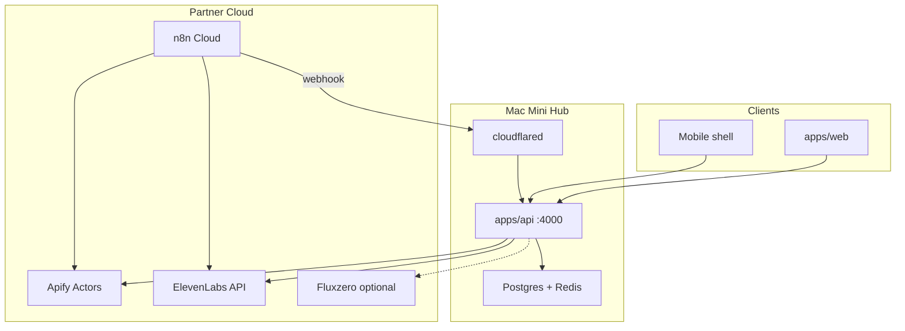

# Architecture (update at kickoff after idea is chosen)

## System overview

## Repositories & ownership

| Path | Owner | Responsibility |
|------|-------|----------------|
| `apps/web/` | Dev A | UI, demo polish |
| `apps/workflows/` | Dev B | n8n JSON exports, webhook docs |
| `apps/api/` | Dev C | REST API, Apify pipelines |
| `apps/voice/` | Dev D | TTS, voice assets, pitch |
| `mac-mini/` | Lead | Docker, tunnel, env sync |

## Data flow (template — fill at kickoff)

1. **Trigger:** User action in `apps/web` OR n8n schedule OR Apify actor complete
2. **Process:** `apps/api` validates → calls Apify / ElevenLabs / DB
3. **Orchestrate:** n8n workflow enriches and notifies
4. **Output:** Dashboard update + optional voice response

## Environment variables

See `.env.example`. Secrets live in `.env.local` (dev laptops) and `mac-mini/.env` (hub).

## Ports

| Service | Port |
|---------|------|
| API | 4000 |
| Web dev server | 3000 |
| Postgres | 5432 |
| Redis | 6379 |

## Deployment (hackathon day)

- **Dev:** Each laptop runs their app slice; Mac mini runs shared API + DB + tunnel
- **Demo:** Use tunnel URL for live n8n webhooks; fallback to recorded video

## Integration contracts

Canonical API/webhook shapes live in root `README.md` → Integration Contracts.
