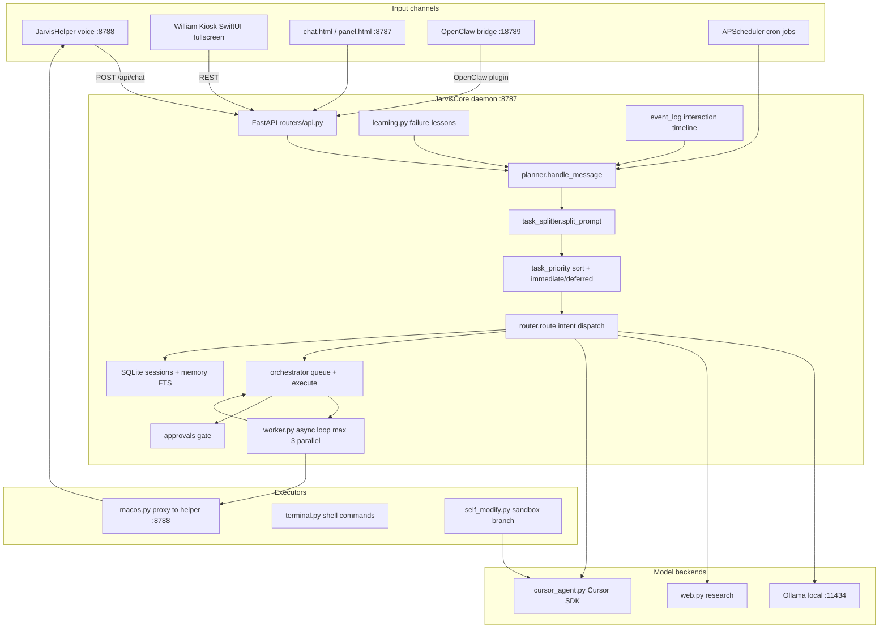
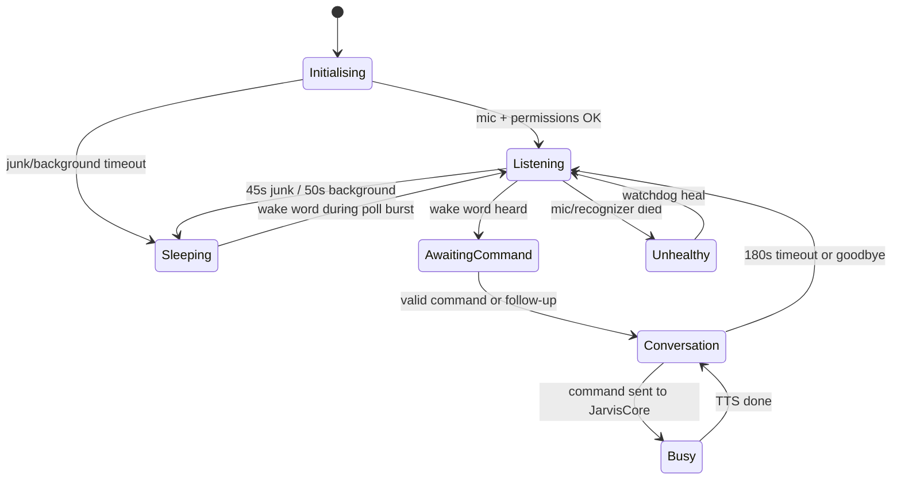
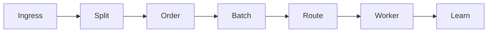
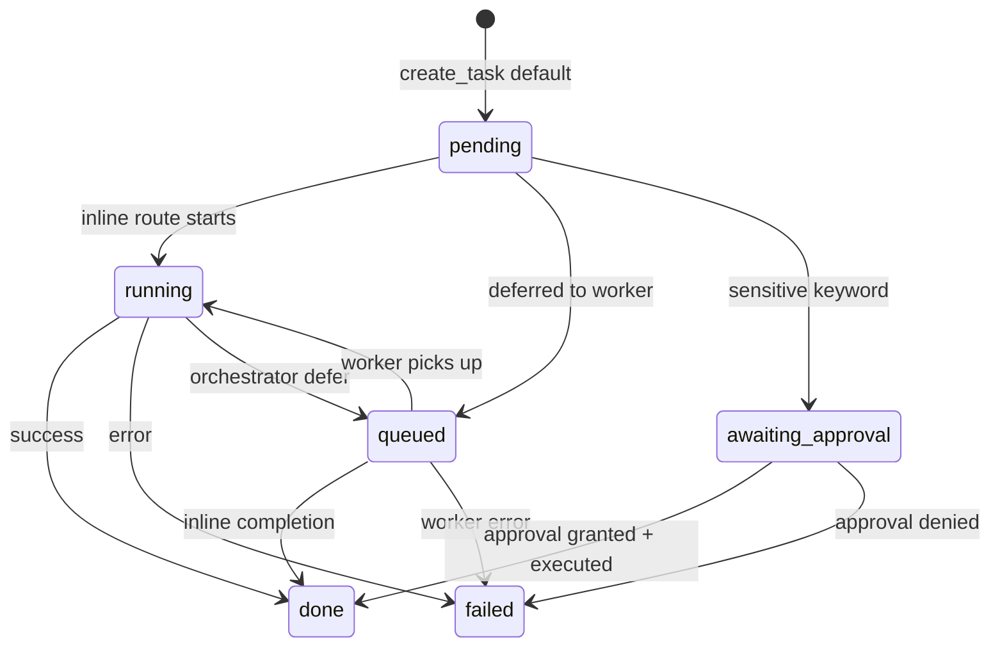
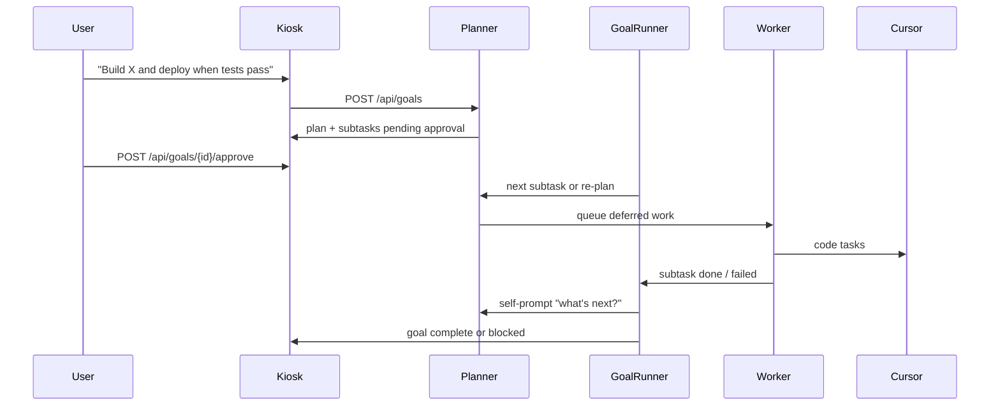
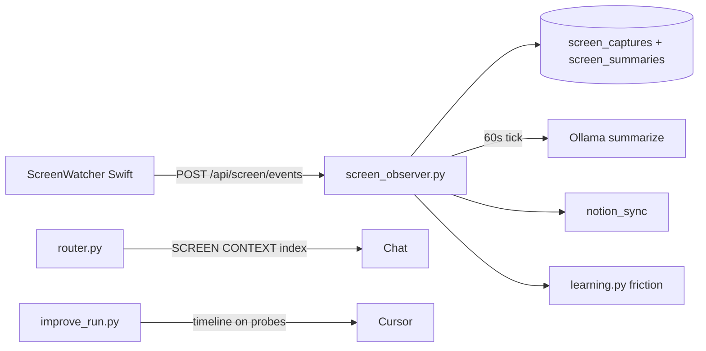

# William Agent — Systems Map

End-to-end reference for how JarvisCore, JarvisHelper, William Kiosk, model backends, and executors fit together on Willy's Mac mini.

---

## Architecture overview

William Agent is a local-first personal agent. All brains and data stay on the Mac; public access (if enabled) goes through Caddy + Cloudflare Tunnel — never by exposing core ports directly.



### Component responsibilities

| Layer | Location | Role |
|-------|----------|------|
| **JarvisCore** | `jarvis/` Python FastAPI | Planner, routing, task queue, memory, approvals, scheduler, worker |
| **JarvisHelper** | `macos-helper/` Swift menubar | Wake word, STT/TTS, sleep mode, desktop input, screenshots |
| **Web UIs** | `jarvis/static/panel.html`, `chat.html` | Control panel, chat, voice orb |
| **William Kiosk** | `macos-helper/Sources/WilliamKiosk/` | Fullscreen home screen: voice hero, transcript, task tree, goal approval |
| **Ollama** | External install | Local chat, intent assist, task splitting, vision (`moondream`) |
| **Cursor SDK** | `jarvis/services/cursor_agent.py` | Cloud reasoning and multi-file code work |
| **OpenClaw** | Gateway `:18789` | WhatsApp → JarvisCore bridge |

---

## Port reference

| Port | Service | Bind | Notes |
|------|---------|------|-------|
| **8787** | JarvisCore (FastAPI) | `127.0.0.1` | Main API, panel, chat, admin. `GET /api/health` |
| **8788** | JarvisHelper (Swift HTTP) | `127.0.0.1` | Voice pipeline, TTS, desktop actions. `GET /status` |
| **11434** | Ollama | `127.0.0.1` | Local LLM. Default model: `llama3.1:8b` |
| **18789** | OpenClaw gateway | `127.0.0.1` | WhatsApp bridge to `POST /api/chat` on 8787 |

Optional Docker stack (see `docs/MEMORY_AND_SERVER.md`):

| Port | Service |
|------|---------|
| 8080 | Caddy HTTP proxy (public tunnel backend) |
| 5432 | Postgres (optional profile) |
| 6379 | Redis (optional profile) |

**Security rule:** Keep 8787 and 8788 on localhost. Route public traffic through Caddy + Cloudflare Tunnel on 8080.

---

## Voice state machine (JarvisHelper)

JarvisHelper (`WakeWord.swift`) owns the voice lifecycle. JarvisCore proxies helper health via `macos.health()` on `GET /api/health`.



### State reference

| State | User sees | Mic | Key flags in `GET :8788/status` |
|-------|-----------|-----|----------------------------------|
| **Initialising** | Starting up | Requesting permissions | `wake_status`: `initialising`, `starting`, `requesting permissions` |
| **Sleeping** | Dim moon — "Say Hey Willy" | Off; 2.5s poll bursts for wake word | `sleeping: true`, `wake_listening: false` |
| **Standby** | Soft ear — "On guard" | Full STT for wake word | `wake_listening: true`, `sleeping: false`, not in conversation |
| **Awaiting** | Green pulse — "I'm listening" | Full STT, 14s command deadline | `awaiting_command: true`, `listening_for_response: true` |
| **Conversation** | Green + timer — "Go ahead" | Full STT, **180s** window | `conversation_mode: true`, `session_id` set |
| **Busy** | Blue pulse — "Thinking…" | Paused during TTS (40s command timeout) | `busy: true`, `voice_speaking` may be true |
| **Unhealthy** | Red/warning — fix permissions | Stopped or recognizer down | `healthy: false` |

### Sleep and wake behaviour

- **Enter sleep:** ~45s of junk partial transcripts, or ~50s of background TV/speech without valid commands (12 junk events also triggers sleep).
- **Sleep poll:** Mic opens in 2.8s bursts every **2.5s** to catch "hey willy"; full recognition stops to save CPU.
- **Wake:** Wake phrases include `hey willy`, `hey willie`, `hey william`, `yo willy`, etc. Inline command after wake skips Awaiting.
- **Watchdog:** `ensureAwake` runs every 12s from menubar timer; scheduler `voice_watchdog` job every 2 minutes from JarvisCore.
- **Conversation end:** Goodbye phrases (`thanks`, `goodbye`, `stop listening`) or 180s idle timeout.

### Unified voice contract

`GET /api/health` exposes `voice_ui` from `jarvis/services/voice_state.py`, mapping helper JSON to:

`offline | unhealthy | sleeping | standby | awaiting | conversation | busy | speaking`

All UIs (`panel.html`, `chat.html`, William Kiosk) consume this single contract via `jarvis/static/voice-ui.js`.

---

## Task execution pipeline

Compound prompts are split, ordered by speed, and executed inline or in the background worker.



### Steps

1. **Ingress** — `planner.handle_message()` normalizes input: voice noise filter (`_looks_like_voice_noise`), speaker verification, sensitive-keyword gate, session creation.
2. **Split** — `task_splitter.split_prompt()`: heuristics (`and then`, `also`, numbered lines, commas) then Ollama JSON array fallback. Max **6** subtasks; single-task prompts pass through unchanged.
3. **Order** — `task_priority.sort_by_speed()`: lower priority score runs first (`system` < `chat` < `terminal` < `code`). `first` / `last` keywords adjust order.
4. **Batch** — Parent task + children share a `batch_id` in SQLite. Parent status `running` until all children finish.
5. **Immediate vs deferred** — `task_priority.split_immediate_deferred()`: `system`, `time`, `remember`, `recall`, etc. run inline; heavy work (`code`, `action`, `fact`) goes to `queued`.
6. **Route** — `router.route()` by intent:

   | Intent | Engine | Path |
   |--------|--------|------|
   | `chat` | Ollama + memory | Inline reply |
   | `fact` / `reason` | Web research → Ollama / Cursor | Grounded answers |
   | `code` | Cursor SDK | Inline or worker |
   | `action` | Orchestrator | `queue_action` → worker |
   | `system` | `system_control` | macOS apps, Spotify, etc. |
   | `terminal` | `terminal.py` | Shell (full-access gate) |
   | `remember` / `recall` | Memory FTS | Inline |

7. **Worker** — `worker.py` polls every **1s**, runs up to **3** `queued` tasks in parallel via `orchestrator.execute_task()`. On success speaks "Done, boss" via helper TTS; on failure records lesson and speaks error.
8. **Batch completion** — When all children in a batch are `done` or `failed`, parent is marked accordingly and batch summary is spoken.
9. **Learn** — Failures → `learning.observe_task_failure()`; misaligned replies (score &lt; 0.4) → `learning.record_struggle()`. Lessons injected into future prompts.

---

## Task lifecycle states

Tasks live in SQLite (`data/jarvis.db`, `tasks` table).



| Status | Meaning |
|--------|---------|
| `pending` | Created, not yet routed (default on `create_task`) |
| `running` | Actively executing (inline or worker) |
| `queued` | Waiting for background worker |
| `done` | Completed successfully |
| `failed` | Error during execution |
| `awaiting_approval` | Blocked on human approval (sensitive action) |

Parent/child tasks use `parent_id` and `batch_id`. Worker orders queued tasks by `priority ASC, id ASC`.

---

## Goal-approved autonomous loop

Multi-step goals with **one upfront approval**; sub-tasks run without per-step prompts unless they hit existing approval gates.



### Flow (`goal_runner.py`)

1. **Create goal** — `POST /api/goals` runs `split_prompt()` → `goals` row + child `tasks` with `goal_id`, status `awaiting_approval`.
2. **Approve** — `POST /api/goals/{id}/approve` flips goal to `running`; enqueues first pending child.
3. **On child complete** — `goal_runner.on_task_done()` (wired from `worker.py`):
   - Batch incomplete → queue next child.
   - Batch complete → Ollama self-prompt: JSON `{done: bool, next_tasks: []}`.
   - `done: true` → mark goal complete, notify + TTS.
   - `next_tasks` → append children (sensitive keywords still hit `approvals`).
4. **Safety caps** — Max **10** self-prompt iterations; max **30 min** wall time; then pause and notify.

---

## Approval boundaries

William uses layered gates. Goal approval does **not** bypass irreversible-action checks.

### What requires approval

| Trigger | Action type | Behaviour |
|---------|-------------|-----------|
| `SENSITIVE_KEYWORDS` in message (`delete`, `deploy`, `purchase`, `api key`, `credential`) without full access | `sensitive_action` | Task → `awaiting_approval`; inbox entry created |
| Desktop click/type without full access | `desktop_action` | Vision analysis → approval before `macos.click` / `type_text` |
| Self-modify merge to main | `self_modify_merge` | Sandbox branch work; merge only after approval |
| Unknown Netatmo face | `store_person` | Person storage gated; notify to name in panel |
| Purchases / payments | capabilities block | Hard refusal even with approval |

### What full access unlocks

`POST /api/security/full-access` (with `{ "enabled": true }`) sets `agent_settings.full_access`. When enabled:

- Terminal maintenance commands run without block
- Sensitive-keyword messages execute without pre-approval
- Desktop actions may run immediately (still logged)

When **disabled** (default), terminal and sensitive paths are blocked or queued.

### Resolving approvals

- `GET /api/approvals` — list inbox (`status=pending` filter supported)
- `POST /api/approvals/{id}` — `{ "approved": true|false }`
- On approve: `_apply_side_effect()` runs the stored action (route sensitive text, merge sandbox, execute desktop action, etc.)

### Autonomy vs approval (goals)

| Level | Scope | Human step |
|-------|-------|------------|
| **Per-message** | Single chat turn | None (unless sensitive) |
| **Per-task** | Background worker item | None (unless sensitive) |
| **Per-goal** | Multi-step autonomous loop | **One** plan approval before runner starts |
| **Per-irreversible** | Delete, deploy, credentials | Always approval inbox — goal approval does not skip |

---

## launchd services and reboot survival

William Agent survives reboot via launchd. Install with `./scripts/install.sh` and `./scripts/install-helper.sh`.

| Label | Plist | Role |
|-------|-------|------|
| `com.willy.jarvis-core` | `launchd/com.willy.jarvis-core.plist` | JarvisCore uvicorn on **8787**, `KeepAlive` |
| `com.willy.jarvis-helper` | `macos-helper/launchd/com.willy.jarvis-helper.plist` | JarvisHelper menubar + voice on **8788**, `KeepAlive` |
| `com.willy.jarvis-docker` | `launchd/com.willy.jarvis-docker.plist` | Docker stack health every 5 min (Postgres, Redis, Caddy) |
| `com.willy.jarvis-backup` | `launchd/com.willy.jarvis-backup.plist` | Nightly SQLite backup at 03:15 |
| `ai.openclaw.gateway` | OpenClaw install | WhatsApp gateway on **18789** (external) |
| `com.willy.william-kiosk` | `launchd/com.willy.william-kiosk.plist` | Fullscreen kiosk at login, dark mode |

### Reboot checklist

1. **JarvisCore** — `launchctl print gui/$(id -u)/com.willy.jarvis-core` → state `running`
2. **JarvisHelper** — menubar SF Symbol (moon = sleeping, ear = standby, mic = listening); `curl -s http://127.0.0.1:8788/status`
3. **Ollama** — `curl -s http://127.0.0.1:11434/api/tags` or `./scripts/server-status.sh`
4. **Microphone** — external USB mic required (Mac mini has no built-in mic)
5. **Docker** (optional) — `./scripts/docker-stack.sh status`; Colima via `brew services`
6. **OpenClaw** (optional) — `launchctl kickstart -k gui/$(id -u)/ai.openclaw.gateway`
7. **Health** — `curl -s http://127.0.0.1:8787/api/health | python3 -m json.tool`

### Service control

```bash
# Restart core
launchctl kickstart -k gui/$(id -u)/com.willy.jarvis-core

# Stop core
launchctl bootout gui/$(id -u)/com.willy.jarvis-core

# Full restart script
./scripts/restart.sh
```

Logs: `logs/jarvis.log`, `logs/jarvis.err.log`, `logs/helper.log`, `logs/helper.err.log`.

---

## Scheduler jobs (JarvisCore)

APScheduler runs inside JarvisCore (`scheduler.py`), started from `jarvis/main.py` lifespan.

| Job ID | Schedule | Purpose |
|--------|----------|---------|
| `morning_briefing` | Daily cron (`briefing_hour`, default 08:00) | Pending approvals + recent tasks TTS |
| `learning_report` | Every 4h | Refresh learning report |
| `memory_compression` | Every 6h | Summarize idle sessions into long-term memory |
| `voice_watchdog` | Every 2 min | Heal Ollama + helper voice pipeline |
| `notion_export` | Every 12h | Export events to Notion (if configured) |

---

## Key API endpoints

| Endpoint | Purpose |
|----------|---------|
| `POST /api/chat` | Main brain (voice + web); supports `session_id`, `speaker_verified` |
| `GET /api/health` | Ollama, helper, worker, scheduler, security, **`voice_ui`** |
| `GET /api/goals/{id}` | Goal + child task tree |
| `POST /api/goals` | Create goal pending approval |
| `POST /api/goals/{id}/approve` | Start goal runner |
| `POST /api/voice/sleep` | Proxy to helper `POST /sleep` |
| `GET /api/tasks` | Task list |
| `GET /api/tasks/batch/{batch_id}` | Parent + children for kiosk task tree |
| `GET /api/approvals` | Approval inbox |
| `POST /api/approvals/{id}` | Approve or deny |
| `GET /api/sessions/active` | Active conversation state |
| `GET /api/learning/report` | Self-learning report |

Helper (`:8788`): `GET /status`, `POST /speak`, `POST /wake/start`, `POST /sleep`, `POST /notify`, `POST /screenshot`, `POST /click`, `POST /type`, `GET /screen/status`, `POST /screen/pause`, `POST /screen/resume`.

---

## Screen observer (always-on)

JarvisHelper `ScreenWatcher` captures the frontmost app every ~10s (pHash dedup + on-device OCR), POSTs events to JarvisCore, which summarizes every 60s via Ollama and relays to Notion + self-improvement.



| Component | Path |
|-----------|------|
| Capture | `macos-helper/Sources/JarvisHelper/ScreenWatcher.swift` |
| Store + summarize | `jarvis/services/screen_observer.py` |
| Lifecycle hooks | `jarvis/services/screen_hooks.py` |
| Notion relay | `jarvis/services/notion_sync.py` → `sync_screen_summary` |
| Specialist agent | `Notion Observer` (seed: `scripts/seed-notion-observer-agent.py`) |
| Setup | `scripts/setup-screen-observer.sh` |

Core endpoints: `GET /api/screen/status`, `GET /api/screen/context`, `POST /api/screen/summarize-now`.

Privacy: excluded apps (password managers, messaging, mail); screenshots auto-deleted after 30 min; Notion gets summaries only.

---

## Related docs

- [`README.md`](../README.md) — quick start and routing table
- [`docs/MEMORY_AND_SERVER.md`](MEMORY_AND_SERVER.md) — logging, sleep mode, Docker, Cloudflare tunnel
