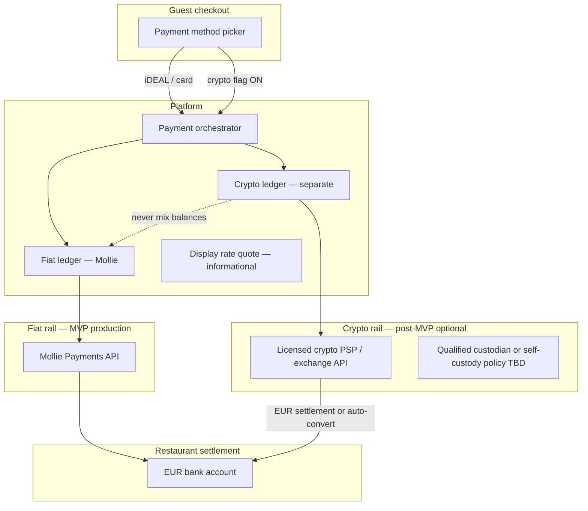
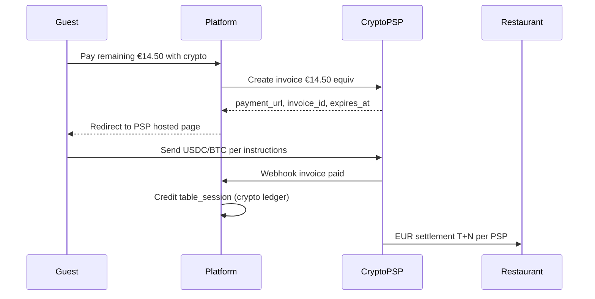

# Crypto Payment Rail — Post-MVP Design (Explicit MVP Exclusion)

**Status:** **NOT IN MVP.** This document exists so engineering, legal, and product do not accidentally ship crypto via Mollie or commingle crypto with fiat table-pay flows.

**MVP rule:** Guest checkout surfaces **Mollie fiat only**. Any crypto endpoint, UI toggle, or wallet address display is **feature-flagged off** and returns `501 NOT_MVP`.

---

## 1. Why crypto is excluded from MVP

| Reason | Detail |
|--------|--------|
| Regulatory | MiCA (EU) CASP licensing; AFM registration Netherlands; travel rule |
| Mollie gap | Mollie does **not** offer native crypto acceptance for merchant checkout |
| Ops complexity | Volatility, confirmation times, wrong-chain sends, manual reconciliation |
| UX mismatch | Dine-in guests expect <30s checkout; BTC/ETH confirmations do not |
| Fraud | Irreversible sends increase dispute asymmetry vs iDEAL |
| Scope discipline | Pilot validates split-pay core; crypto is separate product bet |

**Master prompt challenge:** "Mollie + crypto" is not a single integration. Crypto requires a **separate regulated rail** with optional **manual or API bridge** to restaurant fiat settlement — never a bolt-on checkbox in Mollie hosted checkout.

---

## 2. High-level post-MVP architecture



**Separation invariant:** `crypto_payment_intents` table is disjoint from `payment_intents` (Mollie). Table session `paid_total` may aggregate both **only via explicit settlement adapter** with conversion timestamp and EUR equivalent recorded.

---

## 3. Rail options (post-MVP evaluation)

### 3.1 Option A — Licensed crypto PSP with EUR settlement (recommended direction)

| Aspect | Detail |
|--------|--------|
| Examples (evaluate at build time) | BitPay, Coinbase Commerce, BVNK, Stripe Crypto (if NL), regional EU CASPs |
| Flow | Guest pays BTC/ETH/USDC → PSP converts → EUR payout to restaurant IBAN |
| Platform role | SaaS integration + display; not custodian |
| Pros | MiCA burden largely on PSP; restaurant receives EUR |
| Cons | PSP fees; conversion spread; method availability |

### 3.2 Option B — Platform CASP (not recommended early)

| Aspect | Detail |
|--------|--------|
| Platform obtains CASP / MiCA authorization | 12–24+ months, capital requirements |
| Custody | Platform holds crypto |
| Pros | Full control, margin on spread |
| Cons | Massive regulatory scope; conflicts with "SaaS not EMI" MVP posture |

### 3.3 Option C — Manual QR / static wallet (reject)

| Aspect | Detail |
|--------|--------|
| Display restaurant wallet address | No reconciliation; fraud; accounting nightmare |
| Verdict | **Do not build** |

### 3.4 Option D — Stablecoin only, sub-chain L2

| Aspect | Detail |
|--------|--------|
| USDC on Base/Polygon via PSP | Lower fees, faster confirm |
| NL regulatory | Still CASP / travel rule via PSP |
| Use case | Crypto-native tourist niche |

---

## 4. Comparison matrix

| Criterion | Mollie fiat (MVP) | Crypto PSP (post-MVP) | Platform CASP |
|-----------|-------------------|----------------------|---------------|
| Time to ship | Weeks | Months (vendor + legal) | Years |
| NL regulatory load | Low (restaurant MoR) | Medium (vendor-dependent) | Very high |
| Guest UX speed | Seconds (iDEAL) | Minutes | Minutes |
| Chargeback | iDEAL none; cards yes | Irreversible | Irreversible |
| Restaurant payout | EUR T+1 | EUR after conversion | Crypto or EUR |
| Split-bill fit | Native multi-payment | Hard — see §5 | Hard |

---

## 5. Split-bill implications for crypto

Table split-pay assumes **many small concurrent checkouts**. Crypto struggles here:

| Challenge | Mitigation (post-MVP) |
|-----------|----------------------|
| One invoice per on-chain tx | Each guest gets unique payment request / sub-invoice from PSP |
| Rate volatility during 15-min session | Lock quote 10 min; guest accepts EUR equivalent disclaimer |
| Under/over pay on chain | PSP tolerance bands; manual ops above threshold |
| Change / partial chain pay | Not supported — exact amount invoices |
| 4 guests = 4 txs | Accept higher chain fees or batch (advanced) |

**Recommendation:** If crypto ships post-MVP, default **single payer crypto** for full remaining balance; itemized multi-guest crypto split is **V2 crypto** only.

---

## 6. Proposed post-MVP flow (single payer settles remainder)



Metadata mirrors Mollie pattern: `table_session_id`, `allocation_id`, `bill_version`, `idempotency_key`.

---

## 7. Webhook / reconciliation (crypto)

Parallel to [webhook-reconciliation.md](./webhook-reconciliation.md):

| Element | Crypto equivalent |
|---------|-------------------|
| Idempotency | `invoice_id` + status fingerprint |
| Authoritative fetch | PSP API GET invoice — never trust POST body alone |
| Daily reconcile | PSP settlements vs `crypto_payment_intents` |
| Drift | On-chain amount ≠ expected → ops queue |

**Never** reuse Mollie webhook endpoint for crypto PSP.

---

## 8. Compliance checklist (before enabling flag)

| Gate | Owner |
|------|-------|
| MiCA / AFM applicability memo | Legal |
| CASP vendor DPA + sub-processor list | Legal |
| Travel rule for transfers > €1000 | Compliance |
| Guest terms: irreversibility, FX spread | Product |
| Restaurant opt-in (separate from Mollie) | Sales |
| Accounting: EUR booking time = conversion timestamp | Finance |
| No commingling with loyalty stored value | Product + Legal |
| Tax/VAT on crypto discount campaigns | Finance |

---

## 9. UX guardrails

| Rule | Rationale |
|------|-----------|
| Crypto never default method | iDEAL remains primary in NL |
| Explicit "experimental" label | Set expectations |
| Show EUR equivalent + expiry | MiCA fairness |
| No crypto tips to platform wallet | Avoid EMI confusion |
| Refund policy published | Chain refunds may be EUR manual |

---

## 10. Fallback design if crypto delayed indefinitely

| Stage | Capability |
|-------|------------|
| MVP | Mollie only |
| V1.1 | Mollie + optional Model B split |
| V2 | Evaluate crypto PSP pilot **one venue, full-table pay only** |
| V3 | Multi-guest crypto split if metrics justify ops |

Platform architecture already supports a third `payment_rail` enum:

```typescript
type PaymentRail = 'mollie_fiat' | 'crypto_psp' | 'manual_ops'; // manual_ops = never guest-facing
```

---

## 11. Explicit non-goals

- Native BTC/EETH in Mollie checkout wrapper
- Platform-issued dining token
- Cross-restaurant crypto loyalty
- DeFi yield on guest "overpay"
- NFT receipts

These intersect EMI/gambling/marketing law and are **out of scope** for hospitality split-pay.

---

## 12. Risk register (crypto-specific)

| Risk | Severity | Note |
|------|----------|------|
| Unlicensed CASP activity | Critical | Use licensed PSP only |
| Sanctions / AML | High | PSP KYC; wallet screening |
| Wrong chain deposit | High | PSP managed addresses |
| Accounting mismatch | Medium | Fixed EUR rate at PSP confirm |
| Guest blames platform for volatility | Medium | Clear disclosure |
| Restaurant refuses crypto settlement | Medium | Opt-in per venue |

---

## 13. MVP implementation stub (engineering)

To prevent scope creep, ship a disabled module:

```typescript
// payments/rails/crypto.ts
export async function createCryptoCheckout(): Promise<never> {
  throw new ApiError('NOT_MVP', 'Crypto payments are not available.', 501);
}
```

Feature flag: `crypto_payments_enabled = false` (env + per-restaurant).

Admin UI: hidden unless `INTERNAL_PREVIEW=true`.

---

## 14. Summary

| Question | Answer |
|----------|--------|
| MVP crypto? | **No** |
| Via Mollie? | **No** — not supported |
| Post-MVP path? | Licensed crypto PSP → EUR restaurant settlement |
| Split-bill crypto? | Defer; full-balance single payer first |
| Relation to fiat ledger? | Parallel ledger; aggregate only at table session with audit |

Crypto is a **separate regulated rail**, not an extension of Mollie. Revisit after MVP pilot proves fiat split-pay retention and restaurant NPS.
