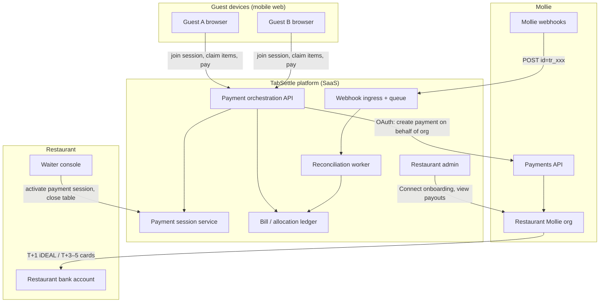
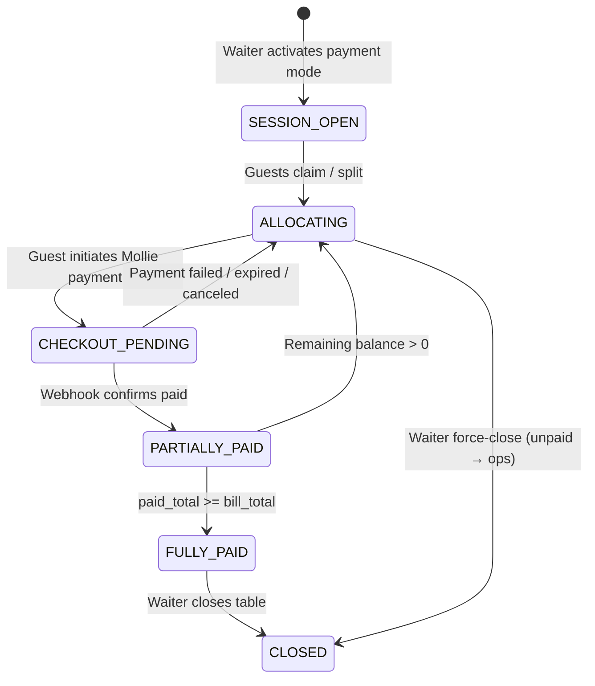
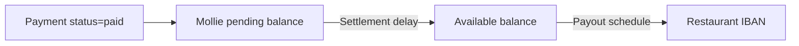
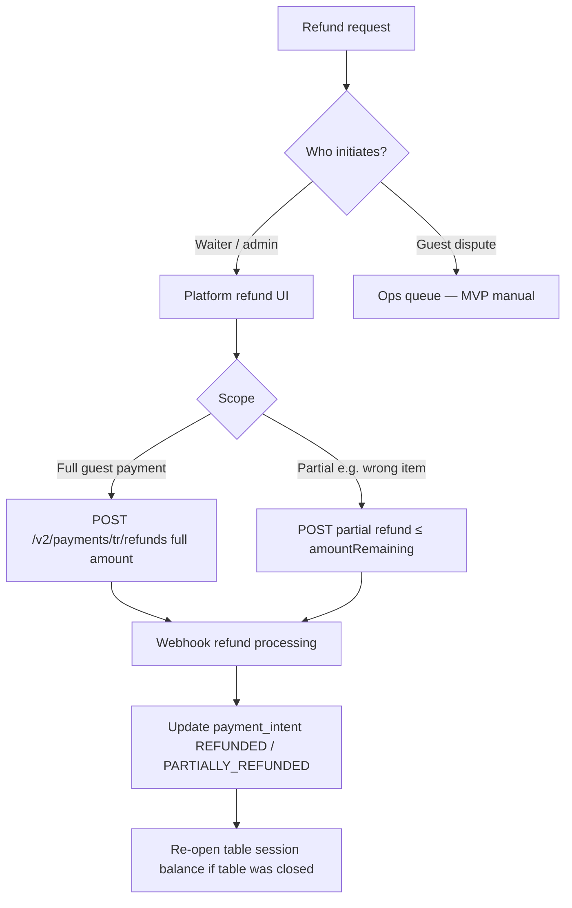

# PART 6 — Payment Architecture (Mollie Primary)

**Product context:** Netherlands-first table QR split-pay platform. Waiters control ordering; guests pay open bills collaboratively after waiter activates a payment session.

**MVP payment scope:** Mollie only (iDEAL, cards, wallets Mollie supports). No crypto, no stored-value wallet, no platform-held guest funds.

**Document status:** Blueprint slice — execution-ready for engineering and legal review.

---

## 1. Executive summary

| Decision | MVP recommendation | Fallback |
|----------|-------------------|----------|
| PSP | Mollie Payments API | — |
| Account model | **Restaurant-owned Mollie organization**; platform connects via OAuth (Connect for Platforms) | Mollie Connect for Marketplaces with split routing |
| Platform role | **Pure SaaS / technical agent** — not merchant of record, not EMI | Limited payment facilitator with marketplace agreement |
| Revenue model | Flat SaaS fee invoiced monthly (SEPA); optional future bps via split | Platform fee routed at payment time via `routing[]` |
| Guest checkout unit | **One Mollie Payment per guest checkout** | Same |
| Table partial pay | Application-layer aggregation of multiple paid guest payments | — |
| Crypto | **Excluded from MVP** | See [crypto-rail-design.md](./crypto-rail-design.md) |

**Primary recommendation:** Each restaurant onboarded as its own Mollie merchant. The platform creates payments **on behalf of** the restaurant using OAuth access tokens. Funds settle to the restaurant's Mollie balance and bank account. The platform never holds guest funds in MVP.

This minimizes PSD2/EMI scope creep, aligns chargeback liability with the merchant of record (restaurant), and matches Dutch hospitality expectations (restaurant receives revenue; platform sells software).

---

## 2. Architecture diagram

### 2.1 System context



### 2.2 Payment creation sequence (single guest)

```mermaid
sequenceDiagram
    participant Guest
    participant Platform
    participant DB as Allocation DB
    participant Mollie
    participant WH as Webhook worker

    Guest->>Platform: POST /checkout (session_token, allocation_id, tip)
    Platform->>DB: Lock allocation row (optimistic / SELECT FOR UPDATE)
    Platform->>DB: Insert payment_intent status=CREATING
    Platform->>Mollie: POST /v2/payments (amount, metadata, webhookUrl)
    Mollie-->>Platform: tr_xxx, checkout URL, status=open
    Platform->>DB: Update payment_intent MOLLIE_OPEN, store tr_xxx
    Platform-->>Guest: Redirect to Mollie hosted checkout
    Guest->>Mollie: Complete iDEAL / card
    Mollie->>WH: POST webhook id=tr_xxx
    WH->>Mollie: GET /v2/payments/tr_xxx
    Mollie-->>WH: status=paid, amount, metadata
    WH->>DB: Idempotent transition payment_intent → PAID
    WH->>DB: Credit table_session.paid_total; release allocation lock
    WH->>Platform: Emit TablePartiallyPaid / TableFullyPaid event
    Mollie-->>Guest: Redirect redirectUrl (may arrive before webhook)
```

### 2.3 Partial table payment (application layer)

Mollie does **not** natively split one open restaurant bill across multiple concurrent payers in a single Payment object. Partial pay is an **application concern**:



**Numeric example — table T12, bill €86.40 incl. 9% VAT display**

| Line | Amount | Notes |
|------|--------|-------|
| Food + drinks subtotal | €79.27 | excl. VAT shown separately in UI |
| Service charge (optional, venue-configured) | €7.13 | 9% on subtotal |
| **Bill total** | **€86.40** | Waiter-entered or imported |

Four guests; item claims:

| Guest | Claimed share | Tip | Mollie Payment |
|-------|---------------|-----|----------------|
| Anna | €24.00 | €3.00 | `tr_a1` €27.00 |
| Boris | €22.40 | €0 | `tr_b1` €22.40 |
| Carla | €20.00 | €2.50 | `tr_c1` €22.50 |
| Dan | €20.00 | €0 | `tr_d1` — *abandoned, expired* |

After Anna, Boris, Carla pay: `paid_total = €71.90`. Remaining €14.50 (+ Dan's unclaimed share rules per bill-splitting spec). Dan retries → `tr_d2` €14.50 → `FULLY_PAID`.

Each row is a **separate** Mollie Payment on the **restaurant's** organization.

---

## 3. Account models: recommended vs fallback

### 3.1 Model A (recommended MVP): Restaurant-owned org + OAuth agent

| Aspect | Detail |
|--------|--------|
| Legal posture | Restaurant is merchant of record; Mollie KYC on restaurant |
| Platform access | Connect for Platforms OAuth app with scopes: `payments.write`, `payments.read`, `profiles.read`, `organizations.read`, `onboarding.read` |
| Payment creation | Platform uses restaurant's OAuth access token: `POST /v2/payments` |
| Settlement | 100% of captured funds → restaurant Mollie balance → restaurant bank |
| Platform fee | Monthly SaaS invoice (€X/table/month pilot); **not** deducted from guest checkout in MVP |
| Refunds | Restaurant initiates via platform UI; platform calls Mollie Refunds API on restaurant token |
| Pros | Minimal EMI/PI scope; clear VAT invoice chain; chargebacks sit with merchant; simpler reconciliation |
| Cons | No automatic per-transaction platform take; each venue completes Mollie onboarding |

**Onboarding flow:**

1. Restaurant admin clicks "Connect payments" in dashboard.
2. Platform creates Client Link (prefilled KVK, trade name, IBAN).
3. Restaurant owner completes Mollie KYC + enables iDEAL/cards on profile.
4. Platform stores encrypted refresh token keyed by `restaurant_id`.
5. Platform verifies `onboarding.status = completed` and `payments.enabled = true` before go-live.

### 3.2 Model B (fallback): Platform org + Connect Marketplaces split

| Aspect | Detail |
|--------|--------|
| Legal posture | Platform closer to marketplace / payment facilitator — **legal review required** |
| Payment creation | Platform org creates payment with `routing[]` to connected restaurant `organizationId` |
| Split | e.g. guest pays €27.00 → €26.19 restaurant, €0.81 platform (3% bps) |
| Requirements | Split Payments enabled by Mollie partner manager; not default |
| Delayed routing | Optional: capture first, route within 90 days (overkill for dine-in) |
| Pros | Automatic platform revenue per txn; unified platform Mollie dashboard |
| Cons | Higher compliance burden; split refunds more complex; feature enablement lag; restaurant may distrust pass-through |

### 3.3 Model C (reject for MVP): Platform holds balance / stored-value

Guest "overpay-to-rewards" or platform wallet **must not** ship in MVP. Any spendable balance issued by the platform likely triggers **EMI / e-money** licensing (AFM/DNB Netherlands). Defer to post-MVP partner-voucher model without platform-held stored value.

### 3.4 Decision matrix

| Criterion | Model A (restaurant org) | Model B (marketplace split) |
|-----------|-------------------------|------------------------------|
| Time to pilot | Faster legal sign-off | Slower (Mollie partner enablement) |
| PSD2 / EMI risk | Low | Medium–high |
| Restaurant trust | High (they see their Mollie) | Medium |
| Platform unit economics | SaaS-only at launch | Per-txn fee possible |
| Refund complexity | Per-payment, clear owner | Route reversal coordination |
| **MVP pick** | **Yes** | Fallback if SaaS pricing fails |

### 3.5 Open question resolution options

**Q: Who legally acts as payment facilitator?**

| Option | Description | Recommendation |
|--------|-------------|----------------|
| O1 | Pure SaaS; restaurant is sole merchant | **MVP default** |
| O2 | Platform as marketplace with Mollie Connect split | V1.1 if bps pricing validated |
| O3 | Platform obtains PI/EMI | Reject unless executive mandate + 12–18 mo runway |

**Q: Single Mollie account per restaurant vs platform Connect?**

| Option | When to choose |
|--------|----------------|
| Per-restaurant org (O1) | Pilot, ≤50 venues, minimize compliance |
| Platform Connect split (O2) | >100 venues, unified ops, negotiated Mollie partner terms |
| Hybrid | Enterprise franchise: parent org + sub-profiles (post-MVP) |

---

## 4. Mollie integration design

### 4.1 Payment object mapping

Every guest checkout creates exactly one Mollie Payment:

```json
{
  "amount": { "currency": "EUR", "value": "27.00" },
  "description": "T12 — Anna — TabSettle session ps_8f3a",
  "redirectUrl": "https://pay.example.nl/return?intent=pi_abc",
  "webhookUrl": "https://api.example.nl/webhooks/mollie",
  "method": null,
  "metadata": {
    "platform": "tabsettle",
    "restaurant_id": "rest_01H...",
    "table_session_id": "ts_01H...",
    "payment_session_id": "ps_01H...",
    "allocation_id": "alloc_01H...",
    "guest_ref": "guest_7xk",
    "bill_version": 3,
    "subtotal_share": "24.00",
    "tip": "3.00",
    "service_charge_share": "0.00",
    "idempotency_key": "pi_abc_v1"
  }
}
```

**Rules:**

- Amount includes tip; tip is metadata for staff reporting (pass-through to restaurant).
- Never encode bill allocation logic in Mollie description alone — metadata is authoritative.
- `bill_version` detects stale checkout after waiter edits bill.
- Use platform-generated `idempotency_key` stored locally before API call to prevent duplicate payments on retry.

### 4.2 Supported methods (MVP)

| Method | MVP | Primary use NL | Settlement to available balance |
|--------|-----|----------------|----------------------------------|
| iDEAL | **Yes** | ~60%+ of Dutch online pay | Next business day |
| Cards (Visa/MC) | **Yes** | Tourists, corporate | ~4 business days (5 without Revenue Day) |
| Apple Pay / Google Pay | **Yes** (via card rails) | Mobile-native guests | Same as cards |
| PayPal | Optional | Lower NL dine-in priority | PayPal-direct payout |
| Bancontact | No (BE expansion) | — | — |
| Klarna | **No MVP** | Buy-now-pay-later mismatch for dine-in | T+6 |
| SEPA Direct Debit | **No** | Wrong UX for table pay | T+9 |

See [mollie-capabilities.md](./mollie-capabilities.md) for limits and API constraints.

### 4.3 Checkout UX constraints

| Constraint | Handling |
|------------|----------|
| iDEAL 15-minute session timeout | Show countdown; allow re-create payment intent |
| Redirect before webhook | Poll `GET /payments/{id}` on return page; webhook is source of truth |
| Guest closes browser mid-iDEAL | Payment stays `open` → `expired`; allocation lock TTL releases |
| Minimum €0.01 | Block zero-amount checkout server-side |

---

## 5. Settlement model (T+1 / T+2 implications)

### 5.1 Mollie balance lifecycle



### 5.2 Method-specific settlement (Mollie documented defaults)

| Method | Funds reach **available balance** | Effective restaurant bank payout |
|--------|-----------------------------------|----------------------------------|
| iDEAL | Next business day after paid | +1 business day per payout frequency |
| Bancontact | Next business day | Similar |
| Credit cards | ~4–5 business days | + payout batch |
| With **Revenue Day Payouts** (T+1) | Harmonized T+1 all methods | Daily business-day payouts |
| With **Revenue Day Payouts** (T+3) | Harmonized T+3 (cards/Klarna reduced from T+4/5) | e.g. Monday revenue → Friday bank |

**Ops implication for restaurants:** A Friday night iDEAL-heavy service with default settings may hit restaurant bank **Monday–Tuesday**. Cards from same service may arrive **following Wednesday–Thursday**. Staff must not be trained that "money is in account next morning" unless venue enables Revenue Day Payouts and understands harmonization lag.

### 5.3 Platform reconciliation vs Mollie settlement

| Layer | What it tracks | Update trigger |
|-------|----------------|----------------|
| **Table session ledger** (platform) | Guest-facing "remaining €14.50" | Webhook `paid` (real-time ops) |
| **Payment intent store** | `tr_xxx` ↔ allocation | Webhook + return poll |
| **Mollie settlement report** | Payout batch ↔ bank | Mollie Dashboard / Settlements API (T+1+) |
| **Restaurant payout view** | Informational only in MVP | Read-only Mollie link or CSV import |

**Critical distinction:** Table can show **FULLY_PAID** while funds are still in Mollie's **pending** balance. Waiter close-table flow must not depend on bank settlement — only on payment confirmation webhooks.

### 5.4 Numeric settlement example

Restaurant "De Rekentafel" — Saturday 22:00, three iDEAL payments:

| tr_id | Paid at (CET) | Amount | Mollie pending → available | Bank payout (daily T+1) |
|-------|---------------|--------|---------------------------|-------------------------|
| tr_101 | Sat 22:04 | €27.00 | Sun → Mon | Mon EOD |
| tr_102 | Sat 22:11 | €22.40 | Sun → Mon | Mon EOD |
| tr_103 | Sat 22:18 | €22.50 | Sun → Mon | Mon EOD |

Same table, one card payment:

| tr_104 | Sat 22:25 | €14.50 (card) | Sat → Thu available | Fri EOD bank (T+3 Revenue Day) |

Restaurant cash-flow planning must treat card mix as **slower** than iDEAL even after table is closed.

---

## 6. Refund and chargeback architecture (split bills)

### 6.1 Design principle

One Mollie Payment maps to one guest checkout (share + tip). Refunds operate on **`tr_xxx`**, not on abstract "table bill line items." Platform maintains **refund allocation overlay** linking Mollie refunds to bill lines for reporting.

### 6.2 Refund flows



**Mollie facts:**

- iDEAL: **no chargebacks** (bank-transfer semantics).
- Cards: chargeback possible; payment status stays `paid`; use `hasChargebacks()` via API.
- Multiple partial refunds allowed until `amountRemaining` exhausted.
- Refund validity: **365 days** from payment (iDEAL).

### 6.3 Split-bill refund scenarios

| Scenario | Action |
|----------|--------|
| Anna paid €27; item returned to kitchen | Partial refund €8.00 on `tr_a1`; decrement `paid_total`; item returns to unclaimed pool |
| Entire table wrongly closed | Reopen session; full refunds per `tr_xxx` if no dispute window issue |
| Boris + Carla shared bottle; Carla overpaid | Adjust future claims; refund Carla partial on `tr_c1` — **never** refund from Boris's `tr_b1` without admin |
| Mollie refund failed (insufficient balance) | Alert restaurant admin; Mollie balance top-up or manual bank transfer — ops playbook |

### 6.4 Chargeback handling (MVP)

| Step | Owner |
|------|-------|
| Webhook signals chargeback | Platform ops queue |
| Notify restaurant admin | Platform email + dashboard |
| Gather evidence (session log, IP, table token audit) | Ops manual |
| Respond via Mollie / acquirer | Restaurant (merchant of record) |
| Internal ledger adjustment | Platform marks allocation `CHARGEBACK`; may re-open balance |

**MVP:** No automated chargeback dispute automation. iDEAL-heavy pilots minimize volume.

### 6.5 Fraud / abuse vectors

| Vector | Mitigation |
|--------|------------|
| Guest pays, disputes card charge after leaving | Session audit trail; short session TTL; table token required |
| Malicious partial pay then chargeback remainder | Waiter cannot close until `FULLY_PAID`; card chargeback ops |
| Refund to different guest | Refunds only to original `tr_xxx` payer rail — no manual IBAN in MVP |

---

## 7. Compliance split: SaaS vs payment facilitator

### 7.1 Recommended MVP legal-technical boundary

| Function | Platform | Restaurant | Mollie |
|----------|----------|------------|--------|
| Merchant of record | No | **Yes** | PSP/acquirer |
| KYC / AML | Facilitate onboarding UI only | **Subject** | Performs |
| Guest T&C / privacy | Platform processor role | Hospitality merchant | PSP |
| VAT on food/drink | Display only | **Merchant responsibility** | — |
| VAT on platform fee | — | — | Platform SaaS invoice |
| PCI scope | No card data (hosted checkout) | No | Hosted fields |
| PSD2 payment initiation | Via Mollie as PISP/AISP partner | — | **Licensed** |
| Stored value / wallet | **Prohibited MVP** | — | — |

### 7.2 What pushes platform into facilitator / EMI territory

| Feature | Risk | MVP |
|---------|------|-----|
| Platform balance guests can spend later | EMI / e-money | **Exclude** |
| Platform pools tips then pays staff | Money transmission / wage compliance | Pass-through metadata only; restaurant pays staff |
| Platform holds funds > settlement before restaurant payout | Possible safeguarding rules | **Never hold** — direct to restaurant org |
| Cross-restaurant loyalty credit | Stored value + complex VAT | Post-MVP partner vouchers |

### 7.3 GDPR (payment slice)

| Data | Retention MVP | Basis |
|------|---------------|-------|
| `tr_xxx`, amount, status | 7 years (financial audit) | Legal obligation |
| Guest IP / device fingerprint | 90 days | Fraud legitimate interest |
| Mollie payment method details | Minimal — store method type only | — |
| Guest account link | User consent | — |

### 7.4 DNB / AFM flags

- Consult Dutch fintech counsel before Model B (marketplace split with platform bps).
- Do not market "wallet," "balance," or "store credit" in MVP UI.
- Tips: label as **voluntary gratuity to restaurant**, not platform income.

---

## 8. Internal state machines

### 8.1 Payment intent (per guest checkout)

| State | Meaning | Transitions |
|-------|---------|-------------|
| `CREATING` | DB row inserted, API not yet called | → `MOLLIE_OPEN`, `FAILED_CREATE` |
| `MOLLIE_OPEN` | Checkout URL issued | → `PAID`, `FAILED`, `CANCELED`, `EXPIRED` |
| `PAID` | Webhook-confirmed | → `PARTIALLY_REFUNDED`, `REFUNDED`, `CHARGEBACK` |
| `PARTIALLY_REFUNDED` | Sum refunds < paid | → `REFUNDED` |
| Terminal | `FAILED`, `CANCELED`, `EXPIRED`, `REFUNDED`, `CHARGEBACK` | — |

### 8.2 Table session payment aggregate

| Field | Type | Rule |
|-------|------|------|
| `bill_total_cents` | int | Waiter authoritative version |
| `paid_total_cents` | int | Sum of `PAID` intents minus refunds |
| `remaining_cents` | computed | `bill_total - paid_total` |
| `status` | enum | `OPEN`, `PARTIALLY_PAID`, `FULLY_PAID`, `CLOSED`, `DISPUTED` |

**Close rule:** Waiter may close when `remaining_cents <= 0` OR admin override with reason code.

---

## 9. Failure handling

| Failure | User experience | System action |
|---------|-----------------|---------------|
| Mollie API 5xx on create | "Try again" | Retry with same idempotency key |
| Duplicate webhook | None | Idempotent skip — see webhook doc |
| Bill edited during checkout | Block at pay click if `bill_version` stale | Force refresh |
| Allocation race (two guests, one item) | Second guest sees "already claimed" | Optimistic lock on line item qty |
| Payment expired | Guest sees retry | Release intent; new `tr_xxx` |
| Restaurant Mollie account blocked | Guest error at checkout | Disable pay; alert admin |

---

## 10. MVP vs post-MVP

| Capability | MVP | Post-MVP |
|------------|-----|----------|
| Mollie per-restaurant OAuth | Yes | — |
| Marketplace split / platform bps | No | V1.1 option |
| Crypto rail | **No** | Separate regulated module |
| Mollie Connect delayed routing | No | Multi-vendor marketplace only |
| Auto payout reconciliation API | Manual CSV / dashboard | Settlements API automation |
| Chargeback automation | Manual ops | Integrated dispute workflow |
| POS-triggered capture | No | POS integration slice |
| Multi-currency | EUR only | Tourist corridors |

---

## 11. Risks specific to this slice

| Risk | Severity | Mitigation |
|------|----------|------------|
| PSD2 scope creep via wallet/loyalty | High | Hard MVP exclusion; legal review gate |
| Restaurant expects T+0 bank settlement | Medium | Enable Revenue Day Payouts docs in onboarding |
| Card chargebacks on group pay | Medium | iDEAL default nudge; clear merchant liability |
| Webhook delay vs redirect | Medium | Return-page poll + idempotent webhook |
| OAuth token expiry / revocation | Medium | Refresh token job; admin reconnect banner |
| VAT display wrong on split | High | Fixed rounding rules per bill-splitting spec; audit log |
| Model B enabled without legal sign-off | High | Feature flag + contract gate |

---

## 12. Cross-references

- [mollie-capabilities.md](./mollie-capabilities.md) — method limits, API capabilities
- [webhook-reconciliation.md](./webhook-reconciliation.md) — idempotent ingestion, daily reconcile
- [crypto-rail-design.md](./crypto-rail-design.md) — post-MVP rail (explicit MVP exclusion)
- Part 5 (bill-splitting logic) — allocation rules, race conditions, tip math
- Part 4 (MVP scope) — feature gates

---

## 13. Implementation checklist (engineering)

- [ ] OAuth Connect app registered; scopes minimized
- [ ] Encrypted refresh token storage per restaurant
- [ ] Payment intent table with unique `(idempotency_key)` and `(mollie_payment_id)`
- [ ] Webhook ingress returns 200 < 500ms; async worker processes
- [ ] Return URL handler polls Mollie once; does not double-fulfill
- [ ] Refund admin UI scoped to restaurant staff roles
- [ ] Feature flag `payments.model` = `restaurant_org` | `marketplace_split`
- [ ] Crypto endpoints return `501 NOT_MVP` with no UI surface
