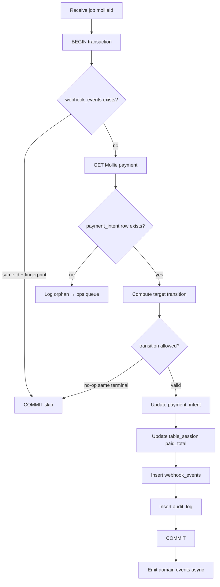
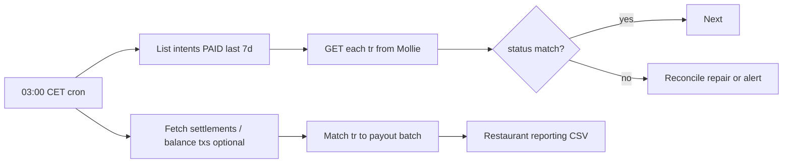

# Webhook Ingestion and Reconciliation — Mollie

**Purpose:** Idempotent, auditable processing of Mollie payment notifications for multi-guest table split-pay.

**Principle:** Webhook POST contains **only** `id=tr_xxx`. Never trust POST body for status. Always `GET /v2/payments/{id}` with correct live/test API key.

---

## 1. Architecture overview

```mermaid
flowchart TB
    subgraph Ingress["Webhook ingress (stateless)"]
        LB[Load balancer]
        WH[POST /webhooks/mollie]
    end

    subgraph Queue["Async processing"]
        Q[(Webhook queue)]
        W1[Worker pool]
        DLQ[Dead letter queue]
    end

    subgraph Core["Platform core"]
        PI[(payment_intents)]
        TS[(table_sessions)]
        AL[(allocations)]
        WE[(webhook_events)]
        AUD[(audit_log)]
    end

    subgraph External["Mollie"]
        API[GET /v2/payments/{id}]
        REF[GET refunds / chargebacks]
    end

    subgraph Recon["Reconciliation"]
        CRON[Daily reconcile job]
        SET[Mollie settlements / balance tx]
    end

    Mollie[Mollie POST] --> LB --> WH
    WH -->|200 OK immediately| Mollie
    WH -->|enqueue| Q
    Q --> W1
    W1 --> API
    W1 --> PI
    W1 --> TS
    W1 --> AL
    W1 --> WE
    W1 --> AUD
    W1 -->|max retries| DLQ
    CRON --> API
    CRON --> SET
    CRON --> PI
```

---

## 2. Ingress contract

### 2.1 Endpoint

```
POST /webhooks/mollie
Content-Type: application/x-www-form-urlencoded

id=tr_d0b0E3EA3v
```

### 2.2 Ingress handler rules (strict)

| Rule | Rationale |
|------|-----------|
| Return **200 OK** within **500ms** | Mollie retries non-2xx |
| Body response `OK` or empty | Mollie ignores body content |
| **No** business logic in ingress | Avoid timeout retries |
| Enqueue `{ mollie_id, received_at, mode }` | Async fulfillment |
| Dedupe enqueue by `(mollie_id, received_at_bucket)` optional | Burst protection |

```typescript
// Ingress pseudocode — minimal
app.post('/webhooks/mollie', (req, res) => {
  const id = req.body?.id;
  if (!id || !/^tr_/.test(id)) {
    res.status(200).send('OK'); // still 200 — avoid retry storm on junk
    return;
  }
  queue.publish({ type: 'mollie.payment.webhook', mollieId: id, mode: detectMode(req) });
  res.status(200).send('OK');
});
```

### 2.3 Mode detection (live vs test)

| Approach | Implementation |
|----------|----------------|
| Separate URLs | `/webhooks/mollie/live` and `/webhooks/mollie/test` |
| Metadata lookup | Enqueue only; worker resolves mode from `payment_intents` row |
| **Recommended** | Separate URLs + separate API keys in worker config |

Never fetch live payment with test key (404 → stuck unpaid).

---

## 3. Idempotent processing algorithm

### 3.1 Core algorithm



### 3.2 Idempotency keys

| Key | Scope | Purpose |
|-----|-------|---------|
| `mollie_payment_id` (`tr_xxx`) | Global unique | Primary correlation |
| `webhook_fingerprint` | `sha256(tr_xxx + status + amount.value + updatedAt)` | Dedupe identical replays |
| `idempotency_key` | Payment create | Prevent duplicate `tr_xxx` creation |
| `allocation_id` | One active checkout | Prevent double pay same share |

### 3.3 webhook_events table (required)

```sql
CREATE TABLE webhook_events (
  id              UUID PRIMARY KEY,
  mollie_id       TEXT NOT NULL,
  event_type      TEXT NOT NULL,  -- payment.status, refund.status, chargeback
  fingerprint     TEXT NOT NULL,
  payload_hash    TEXT NOT NULL,  -- hash of Mollie GET response
  processed_at    TIMESTAMPTZ NOT NULL DEFAULT now(),
  payment_intent_id UUID REFERENCES payment_intents(id),
  result          TEXT NOT NULL,  -- applied | skipped | orphan | error
  UNIQUE (mollie_id, fingerprint)
);
```

**Replay safety:** Same webhook delivered 5 times → 1 `applied`, 4 `skipped`.

### 3.4 State transition matrix (payment_intent)

Allowed transitions (simplified):

| From \ To | MOLLIE_OPEN | PAID | FAILED | CANCELED | EXPIRED | PARTIALLY_REFUNDED | REFUNDED |
|-----------|-------------|------|--------|----------|---------|-------------------|----------|
| CREATING | ✓ | — | ✓ | — | — | — | — |
| MOLLIE_OPEN | ✓ | ✓ | ✓ | ✓ | ✓ | — | — |
| PAID | — | ✓ (idempotent) | — | — | — | ✓ | ✓ |
| PARTIALLY_REFUNDED | — | — | — | — | — | ✓ | ✓ |
| Terminal | — | idempotent only | — | — | — | — | — |

Illegal transitions → log `error`, alert if unexpected (possible fraud or manual Mollie dashboard edit).

---

## 4. Worker implementation detail

### 4.1 Fetch authoritative payment

```typescript
async function processMollieWebhook(mollieId: string, mode: 'live' | 'test') {
  const client = mollieClients[mode];
  const payment = await client.payments.get(mollieId);
  const intent = await db.paymentIntents.findByMollieId(mollieId);
  if (!intent) {
    await recordWebhookEvent({ mollieId, result: 'orphan', ... });
    return;
  }

  const fingerprint = sha256(
    `${payment.id}|${payment.status}|${payment.amount.value}|${payment.paidAt ?? ''}`
  );

  const existing = await db.webhookEvents.findByFingerprint(mollieId, fingerprint);
  if (existing) return;

  await db.transaction(async (tx) => {
    const locked = await tx.paymentIntents.lock(intent.id);
    const previousStatus = locked.status;

    if (payment.status !== mapToLocal(previousStatus)) {
      await applyPaymentStatusChange(tx, locked, payment);
    }

    if (payment.hasRefunds?.() || payment._embedded?.refunds) {
      await syncRefunds(tx, locked, payment);
    }

    if (payment.hasChargebacks?.()) {
      await syncChargebacks(tx, locked, payment);
    }

    await tx.webhookEvents.insert({ mollieId, fingerprint, result: 'applied' });
  });
}
```

### 4.2 paid handler (critical path)

On first transition to `PAID`:

1. Verify `payment.amount.value` == `intent.expected_amount` (±0 tolerance — reject mismatch).
2. Verify `payment.metadata.allocation_id` == `intent.allocation_id`.
3. Verify `payment.metadata.bill_version` >= `table_session.min_checkout_version`.
4. Set `intent.status = PAID`, `paid_at = payment.paidAt`.
5. Increment `table_session.paid_total_cents` by `intent.amount_cents` (excl. tip accounting per product rules).
6. Mark allocation `SETTLED`.
7. If `paid_total >= bill_total` → `table_session.status = FULLY_PAID`.
8. Notify waiter UI (SSE / websocket).

**Duplicate `paid` webhook:** Step 4 no-op; step 5 must not double-count (guard with `if (previousStatus !== PAID)`).

### 4.3 Refund webhook path

Mollie: payment status remains `paid` when refunded. Worker must:

1. `GET /v2/payments/{id}/refunds` or read embedded refunds.
2. Sum `refunded` amounts per refund id.
3. Update `intent.refunded_cents`.
4. Decrement `table_session.paid_total_cents`.
5. Possibly revert `FULLY_PAID` → `PARTIALLY_PAID`.
6. Re-open allocations if business rules require.

| Refund status | Action |
|---------------|--------|
| `processing` | Log; optional guest UI "refund pending" |
| `refunded` | Ledger adjustment |
| `failed` | Alert admin; no ledger change |

### 4.4 Chargeback path

1. Detect via `payment.hasChargebacks()` on any webhook for that `tr_xxx`.
2. Fetch chargeback objects.
3. Set `intent.status = CHARGEBACK` (or parallel flag).
4. Decrement `paid_total` by chargeback amount.
5. Create ops ticket with session audit bundle.

---

## 5. Redirect URL vs webhook ordering

| Scenario | Behavior |
|----------|----------|
| Webhook before redirect | Return page shows paid immediately |
| Redirect before webhook | Return page polls `GET /payments/{id}` every 1s × 30; show "confirming" |
| Webhook lost (rare) | Reconcile job catches within 24h |
| Both lost | Guest sees unpaid; support uses Mollie dashboard + manual reconcile |

**Return URL handler:** May call same `applyPaymentStatusChange` but must share idempotent code path with webhook worker (single module).

---

## 6. Retry and dead-letter policy

| Condition | Action |
|-----------|--------|
| Mollie GET 5xx | Retry exponential backoff: 1s, 2s, 4s, 8s, 16s, max 6 |
| Mollie GET 404 | Orphan queue; alert if intent exists |
| DB deadlock | Retry transaction |
| Amount mismatch | **Do not** mark paid; ops alert HIGH |
| Max retries exceeded | DLQ + PagerDuty |

Mollie-side retry: non-2xx ingress → Mollie retries (schedule not publicly fixed — assume minutes to hours).

---

## 7. Daily reconciliation job

### 7.1 Purpose

Catch missed webhooks, drift, and settlement alignment.



### 7.2 Reconciliation checks

| Check | Source A | Source B | Failure action |
|-------|----------|----------|----------------|
| Payment status | `payment_intents.status` | Mollie GET | Repair or alert |
| Paid amount | `intent.amount_cents` | Mollie `amount` | **Critical alert** |
| Table paid total | `sum(PAID intents) - refunds` | `table_session.paid_total` | Recalculate |
| Orphan Mollie payments | Mollie list by profile/date | Platform intents | Ops review |
| Unpaid stale intents | `MOLLIE_OPEN > 24h` | Mollie `expired` | Auto-expire local |

### 7.3 Reconciliation report (per restaurant, daily)

| Column | Example |
|--------|---------|
| date | 2026-06-25 |
| tr_id | tr_abc123 |
| table_session_id | ts_01H |
| guest_ref | guest_7xk |
| amount | 27.00 |
| method | ideal |
| platform_status | PAID |
| mollie_status | paid |
| delta | 0 |
| in_payout | pending / yes |

### 7.4 Numeric drift example

**Bug scenario:** Double webhook without idempotency.

| Source | paid_total |
|--------|------------|
| Table session (buggy) | €108.00 |
| Sum payment_intents PAID | €81.00 |
| Mollie API sum | €81.00 |

Reconcile job flags `TABLE_PAID_TOTAL_DRIFT`, auto-corrects from intents, logs incident.

---

## 8. Security

| Threat | Mitigation |
|--------|------------|
| Fake webhook POST | No status in body; GET requires API key; unknown `tr` → no fulfillment |
| Replay attack | Fingerprint dedupe |
| Wrong-mode key | Separate endpoints |
| SSRF via webhook | Only call fixed `api.mollie.com` |
| Next-gen webhooks (future) | Verify `X-Mollie-Signature` when migrating |

Classic Mollie webhooks have **no HMAC** — security is entirely "fetch authoritative state with secret key."

---

## 9. Observability

| Metric | Alert threshold |
|--------|-----------------|
| Webhook ingress rate | Anomaly ±3σ |
| Queue lag p99 | > 30s |
| Orphan webhooks / hour | > 0 sustained |
| PAID transition latency | p99 > 60s |
| Reconcile drift count | > 0 critical |
| DLQ depth | > 10 |

Structured log fields: `mollie_id`, `payment_intent_id`, `table_session_id`, `restaurant_id`, `transition`, `fingerprint`, `duration_ms`.

---

## 10. End-to-end example with timestamps

**Table ts_99, allocation alloc_a, expected €27.00**

| Time | Event | DB state after |
|------|-------|----------------|
| T+0s | Guest clicks Pay | `intent CREATING` |
| T+0.2s | Mollie create | `MOLLIE_OPEN`, tr_77 |
| T+45s | Guest completes iDEAL | Mollie `paid` |
| T+45.1s | Webhook POST | Enqueued |
| T+45.3s | Worker GET | — |
| T+45.4s | Apply PAID | `paid_total += 2700`, allocation SETTLED |
| T+46s | Guest redirect | Poll confirms PAID — consistent |
| T+45.5s | **Duplicate webhook** | Skipped (fingerprint) |
| T+24h | Reconcile job | Match OK |

---

## 11. Manual ops playbook

| Symptom | Steps |
|---------|-------|
| Guest charged, table unpaid | Find `tr_xxx` in Mollie → run manual reconcile for id |
| Webhook DLQ backlog | Scale workers; check Mollie status page |
| Refund not reflected | Force refund sync job for `tr_xxx` |
| Test payment in prod | Delete intent; refund in Mollie; postmortem |

---

## 12. MVP vs post-MVP

| Feature | MVP | Post-MVP |
|---------|-----|----------|
| Classic payment webhooks | Yes | — |
| Async queue + idempotency | Yes | — |
| Daily reconcile | Yes | — |
| Settlements API auto-match | Manual | Automated |
| Next-gen signed webhooks | No | Evaluate migration |
| Real-time accounting export | CSV | Exact / Xero |

---

## 13. Acceptance criteria mapping

- [x] Idempotent webhook handling defined (`webhook_events` + fingerprint)
- [x] Always GET before mutate
- [x] 200 OK immediate response
- [x] Refund/chargeback paths without relying on payment status change
- [x] Daily reconciliation with drift detection
- [x] Partial table pay via sum of intents, not single webhook semantics
