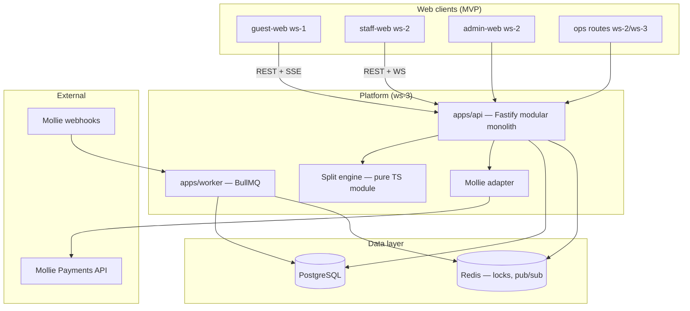

# PART 19 — System Architecture Overview

**Product:** Rekentafel  
**Last updated:** 2026-06-26  
**Purpose:** Single index linking all architecture, payment, split, and API documentation. Does not duplicate specs.

---

## 1. Architecture at a glance

Rekentafel is a **modular monolith**: TypeScript API (Fastify) + BullMQ workers + PostgreSQL + Redis, serving **four MVP web surfaces** (guest, staff, admin, ops). Real-time: **SSE** (guest bill sync), **WebSocket** (staff floor). Payments: **Mollie-only MVP** on **restaurant-owned merchant orgs**.



**Stack detail:** [tech-stack.md](../architecture/tech-stack.md)  
**Infrastructure:** [infra-diagram.mmd](../architecture/infra-diagram.mmd)  
**Observability & testing:** [observability-testing.md](../architecture/observability-testing.md)

---

## 2. Domain architecture map

| Domain | Responsibility | Primary docs |
|--------|----------------|--------------|
| **Table & session lifecycle** | QR resolve, dining session, payment activation, close | [state-machines.md](../domain/split-engine/state-machines.md) · [flows-a-o.md](../flows/flows-a-o.md) |
| **Bill & split engine** | Claims, allocations, VAT, service charge, remaining balance | [rules-spec.md](../domain/split-engine/rules-spec.md) · [worked-examples.md](../domain/split-engine/worked-examples.md) · [concurrency.md](../domain/split-engine/concurrency.md) |
| **Payments (Mollie)** | Checkout intents, webhooks, reconciliation, partial pay aggregation | [payment-architecture.md](../architecture/payments/payment-architecture.md) · [webhook-reconciliation.md](../architecture/payments/webhook-reconciliation.md) · [mollie-capabilities.md](../architecture/payments/mollie-capabilities.md) |
| **Crypto (post-MVP)** | Separate regulated rail — **not in MVP** | [crypto-rail-design.md](../architecture/payments/crypto-rail-design.md) |
| **Loyalty (post-MVP)** | Points, overpay reframe — **not in MVP** | [regulatory-framing.md](../domain/loyalty/regulatory-framing.md) · [rewards-ledger-model.md](../domain/loyalty/rewards-ledger-model.md) |
| **Integrations** | QR lifecycle, manual ops, POS tiers | [qr-lifecycle.md](../integrations/qr-lifecycle.md) · [manual-ops-playbook.md](../integrations/manual-ops-playbook.md) · [integration-tiers.md](../integrations/integration-tiers.md) · [pos-adapter-interface.md](../integrations/pos-adapter-interface.md) |

---

## 3. Payment architecture summary

### 3.1 MVP — Mollie fiat only

| Decision | Value |
|----------|-------|
| PSP | Mollie Payments API |
| Merchant of record | **Restaurant** (restaurant Mollie org) |
| Platform role | Pure SaaS / technical agent — no guest fund holding |
| Checkout unit | One Mollie Payment per guest checkout |
| Table settlement | Application-layer sum of guest payments vs bill total |
| Platform revenue (pilot) | Off-rail SaaS invoice — not `routing[]` in MVP |

**Sequence (single guest):**

```
Guest → POST /checkout-intents → API locks allocation
     → Mollie POST /v2/payments → redirect hosted checkout
     → Guest pays iDEAL/card
     → Mollie webhook → worker GET payment → idempotent PAID
     → Update table remaining → SSE to guests
```

**Full spec:** [payment-architecture.md](../architecture/payments/payment-architecture.md)

### 3.2 Webhook and reconciliation

| Component | Location (planned repo) | Doc |
|-----------|-------------------------|-----|
| Webhook ingress | `apps/api/src/modules/webhooks/` | [webhook-reconciliation.md](../architecture/payments/webhook-reconciliation.md) |
| Reconcile worker | `apps/worker/src/queues/webhook-reconcile.ts` | [background-jobs.md](../architecture/api/background-jobs.md) |
| Ops manual heal | [manual-ops-playbook.md](../integrations/manual-ops-playbook.md) | |

**Idempotency:** All `tr_*` transitions keyed by Mollie payment ID + event ID — [idempotency-concurrency.md](../architecture/api/idempotency-concurrency.md)

### 3.3 Crypto — explicit MVP exclusion

Crypto is **not** a Mollie extension. Post-MVP architecture uses a **disjoint ledger** and licensed crypto PSP with EUR settlement:

```
Guest checkout
    ├─ Fiat (MVP) ──► Mollie ──► Restaurant IBAN
    └─ Crypto (V2+) ──► Licensed PSP ──► EUR payout (preferred)
```

**Never mix** `payment_intents` (Mollie) with `crypto_payment_intents` without explicit settlement adapter.

**Full spec:** [crypto-rail-design.md](../architecture/payments/crypto-rail-design.md)

### 3.4 Mollie account models (pilot vs scale)

| Model | Phase | Description |
|-------|-------|-------------|
| **A — Restaurant org + OAuth** | MVP pilot | Platform creates payments on behalf of restaurant token |
| **B — Mollie Connect + routing[]** | V2 | Platform bps fee at payment time |

Detail: [payment-architecture.md](../architecture/payments/payment-architecture.md) §1 · [open-questions.md](./open-questions.md) Q8

---

## 4. Split engine architecture

Three coordinated state machines:

| Machine | States (summary) | Doc |
|---------|------------------|-----|
| **A — TableSession** | `EMPTY → SEATED → PAYMENT_ACTIVE → CLOSED` | [state-machines.md](../domain/split-engine/state-machines.md) §2 |
| **B — TableBillSettlement** | `BILL_DRAFT → ALLOCATION_OPEN → … → CLOSED` | [state-machines.md](../domain/split-engine/state-machines.md) §3 |
| **C — Claimant** | `JOINED → CLAIMING → CHECKOUT_PENDING → PAID` | [state-machines.md](../domain/split-engine/state-machines.md) §4 |

**Rules engine:** Item claim, equal/custom/shared modes, service charge spread, VAT line visibility, unclaimed remainder, waiter override — [rules-spec.md](../domain/split-engine/rules-spec.md)

**Concurrency:** Redis/DB optimistic lock on `allocatable_unit_id`; 409 conflict — [concurrency.md](../domain/split-engine/concurrency.md)

**Numeric fixtures:** 6 worked examples including Table 12 €105,60 — [worked-examples.md](../domain/split-engine/worked-examples.md)

---

## 5. API architecture

### 5.1 Style and conventions

| Aspect | MVP choice |
|--------|------------|
| Style | REST + OpenAPI 3.1 |
| Base URL | `https://api.rekentafel.nl/v1` |
| Money | Integer `*_cents` — never floats |
| Errors | RFC 7807 problem+json |
| Real-time | SSE (guest), WebSocket (staff) |
| Versioning | URL prefix `/v1` |

**Full service map:** [service-map.md](../architecture/api/service-map.md)

### 5.2 Service modules (API monolith)

```
Session Service ──┬── Token Service
Bill Service ─────┼── Split Engine
Claim Service ────┤
Payment Service ──┼── Mollie Adapter
Auth Service ─────┤
Webhook Ingress ──┴── Reconciliation (worker)
```

Module boundaries and route ownership: [service-map.md](../architecture/api/service-map.md) §3

### 5.3 Auth realms

| Surface | Mechanism | Doc |
|---------|-----------|-----|
| Guest | Ephemeral `gst_*` token after join | [auth-and-sessions.md](../architecture/api/auth-and-sessions.md) |
| Staff | JWT venue-scoped | [auth-and-sessions.md](../architecture/api/auth-and-sessions.md) |
| Admin | JWT + admin RBAC | [rbac-matrix.md](../surfaces/rbac-matrix.md) |
| Ops | Platform SSO + MFA | [auth-and-sessions.md](../architecture/api/auth-and-sessions.md) |
| Mollie webhooks | Signature verify + async GET | [webhook-reconciliation.md](../architecture/payments/webhook-reconciliation.md) |

### 5.4 Contract-first parallel development

| Artifact | Path (planned) | Consumer |
|----------|----------------|----------|
| OpenAPI v1 | `packages/contracts/openapi/rekentafel.v1.yaml` | ws-1, ws-2 codegen |
| Zod schemas | `packages/contracts/src/` | ws-3 validation |
| MSW fixtures | `packages/test-fixtures/` | ws-1, ws-2 local dev |
| Event catalog | [event-catalog.md](../flows/event-catalog.md) | SSE/WS payloads |

Skeleton: [openapi-skeleton.yaml](../architecture/api/openapi-skeleton.yaml)

### 5.5 Background jobs

| Job | Trigger | Doc |
|-----|---------|-----|
| `webhook-reconcile` | Mollie POST | [background-jobs.md](../architecture/api/background-jobs.md) |
| `session-expiry` | TTL cron | [background-jobs.md](../architecture/api/background-jobs.md) |
| `audit-export` | Ops request | [background-jobs.md](../architecture/api/background-jobs.md) |

---

## 6. Data architecture

| Artifact | Purpose |
|----------|---------|
| [entity-dictionary.md](../architecture/data-model/entity-dictionary.md) | Canonical entities: `Table`, `DiningSession`, `PaymentSession`, `Bill`, `Claim`, `PaymentIntent` |
| [erd.mmd](../architecture/data-model/erd.mmd) | ERD diagram |
| [data-classification.md](../architecture/data-model/data-classification.md) | PII tiers, retention (guest 90d, payments 7y pseudonymized) |
| [index-strategy.md](../architecture/data-model/index-strategy.md) | Query patterns for floor, claims, webhooks |

**Registry rule:** New canonical field names require `NEW_REGISTRY_ENTRIES` in PR — [workstream-plan.md](../engineering/workstream-plan.md)

---

## 7. Security architecture

| Layer | Doc |
|-------|-----|
| Threat register | [threat-register.md](../security/threat-register.md) |
| Control matrix | [control-matrix.md](../security/control-matrix.md) |
| MVP security checklist | [mvp-security-checklist.md](../security/mvp-security-checklist.md) |
| Compliance risk tiers | [risk-tiering.md](../compliance/risk-tiering.md) |
| Counsel questions | [counsel-question-list.md](../compliance/counsel-question-list.md) |

**Key invariants:**

1. No live bill without waiter-activated payment session token  
2. No PAN storage — Mollie hosted checkout only  
3. No stored-value wallet / platform guest balances (MVP)  
4. Idempotent webhook processing for all `tr_*`

---

## 8. UX / trust architecture

| Topic | Doc |
|-------|-----|
| Payment trust patterns | [payment-trust-patterns.md](../ux/payment-trust-patterns.md) |
| UX principles | [ux-principles.md](../ux/ux-principles.md) |
| Heuristic checklist | [heuristic-checklist.md](../ux/heuristic-checklist.md) |
| Error states | [error-state-matrix.md](../flows/error-state-matrix.md) |

**Rule:** All money display via `@rekentafel/ui-core` `MoneyDisplay` — amounts from API only.

---

## 9. Engineering delivery architecture

| Topic | Doc |
|-------|-----|
| Monorepo layout | [repo-structure.md](../engineering/repo-structure.md) |
| Workstreams ws-1–ws-4 | [workstream-plan.md](../engineering/workstream-plan.md) |
| 6-week roadmap | [implementation-roadmap.md](../engineering/implementation-roadmap.md) |
| Branching & merge order | [branching-and-merge.md](../engineering/branching-and-merge.md) |

**Merge order (daily):** ws-4 → ws-3 → ws-2 → ws-1

---

## 10. Flow ↔ architecture traceability

| Flow | Session API | Split engine | Payment | Real-time |
|------|-------------|--------------|---------|-----------|
| A — Empty QR | Table resolve | — | — | — |
| B — Call server | Service signal | — | — | WS staff |
| C — Start session | Dining session SM | BILL_DRAFT | — | WS floor |
| D — Join pay | Payment session + token | — | — | SSE lobby |
| E–H — Claim/split | — | Claim service + rules | — | SSE bill |
| I — Tip | — | Tip allocation | Checkout intent | — |
| J — Pay result | Remaining balance | Claimant PAID | Mollie + webhook | SSE |
| N — Onboarding | Admin CRUD | — | Mollie OAuth | — |
| O — Staff ops | Floor + close | Override | Reconcile view | WS + SSE |

**Flow specs:** [flows-a-o.md](../flows/flows-a-o.md)  
**Diagrams:** [docs/flows/diagrams/](../flows/diagrams/)

---

## 11. Document index (complete)

### Architecture / platform

- [tech-stack.md](../architecture/tech-stack.md)
- [infra-diagram.mmd](../architecture/infra-diagram.mmd)
- [observability-testing.md](../architecture/observability-testing.md)

### API

- [service-map.md](../architecture/api/service-map.md)
- [auth-and-sessions.md](../architecture/api/auth-and-sessions.md)
- [idempotency-concurrency.md](../architecture/api/idempotency-concurrency.md)
- [background-jobs.md](../architecture/api/background-jobs.md)
- [openapi-skeleton.yaml](../architecture/api/openapi-skeleton.yaml)

### Data model

- [entity-dictionary.md](../architecture/data-model/entity-dictionary.md)
- [erd.mmd](../architecture/data-model/erd.mmd)
- [data-classification.md](../architecture/data-model/data-classification.md)
- [index-strategy.md](../architecture/data-model/index-strategy.md)

### Payments

- [payment-architecture.md](../architecture/payments/payment-architecture.md)
- [mollie-capabilities.md](../architecture/payments/mollie-capabilities.md)
- [webhook-reconciliation.md](../architecture/payments/webhook-reconciliation.md)
- [crypto-rail-design.md](../architecture/payments/crypto-rail-design.md)

### Split engine

- [rules-spec.md](../domain/split-engine/rules-spec.md)
- [state-machines.md](../domain/split-engine/state-machines.md)
- [concurrency.md](../domain/split-engine/concurrency.md)
- [worked-examples.md](../domain/split-engine/worked-examples.md)

### Flows & events

- [flows-a-o.md](../flows/flows-a-o.md)
- [event-catalog.md](../flows/event-catalog.md)
- [error-state-matrix.md](../flows/error-state-matrix.md)

### Blueprint compilation (this slice)

- [executive-summary.md](./executive-summary.md)
- [prd.md](./prd.md)
- [user-stories.md](./user-stories.md)
- [open-questions.md](./open-questions.md)

---

*Slice ownership: PART 19 — System Architecture Overview. Links all architecture docs; does not replace them.*
