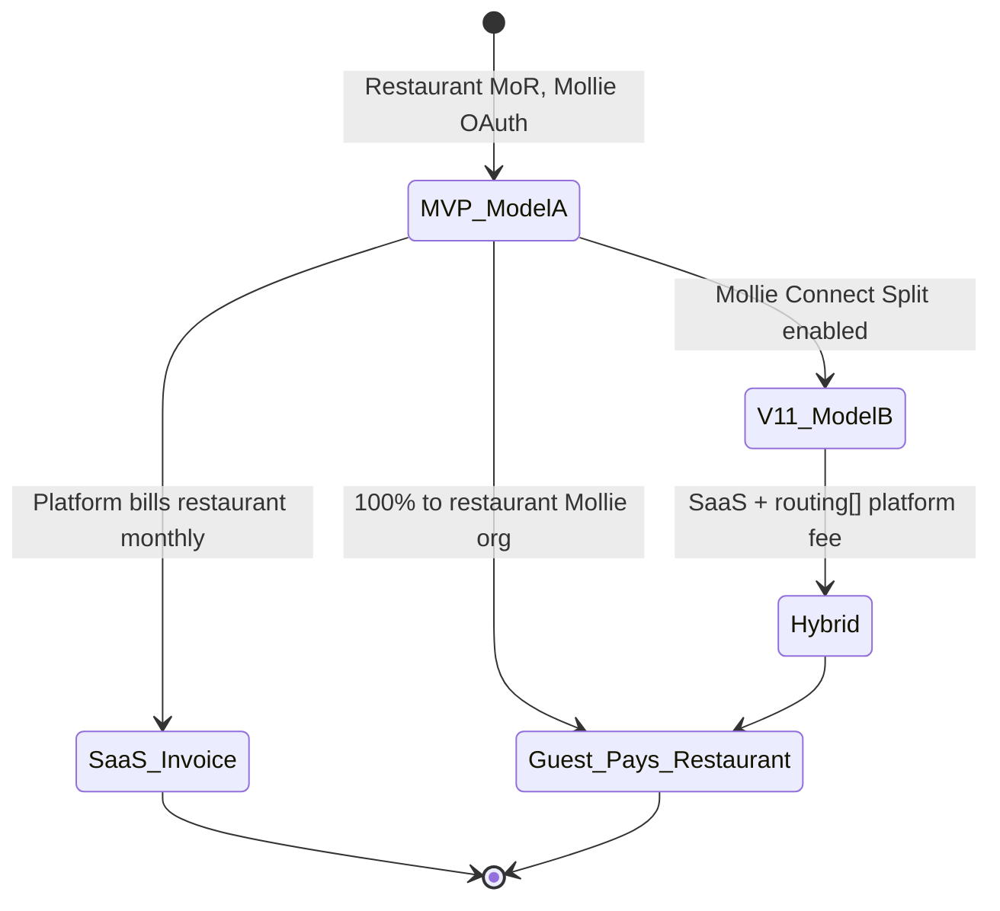

# PART 13A — Monetization Options Analysis

**Product:** Rekentafel (internal codename: TabSettle)  
**Market:** Netherlands-first hospitality split-pay  
**Slice:** Monetization and unit economics — pricing options  
**Last updated:** 2026-06-26  
**Status:** Blueprint — resolves open question *flat SaaS vs bps vs hybrid*

**Cross-references:** [payment-architecture.md](../architecture/payments/payment-architecture.md) (Model A/B), [mollie-capabilities.md](../architecture/payments/mollie-capabilities.md), [risk-tiering.md](../compliance/risk-tiering.md)

---

## 1. Executive summary

Rekentafel monetizes **restaurants (B2B)**, not guests at MVP. Guest checkout runs on the restaurant's Mollie organization; platform revenue is **software + optional payment-adjacent fees**, never stored-value spread or guest surcharges.

| Model | MVP | V1.1 | V2+ | Primary risk |
|-------|-----|------|-----|--------------|
| Flat SaaS per venue | **Recommended** | Core tier | Core tier | Low ARPU on small venues |
| Per-transaction bps on GMV | Defer | Pilot optional | Scale lever | Model B / facilitator posture |
| Hybrid (SaaS + bps) | Pilot wording only | **Recommended long-term** | Default | Sales complexity |
| Tip uplift share | **No** | No | Maybe (legal review) | Wage / PSD2 optics |
| Premium analytics | No | Add-on | Add-on | Low attach without POS |
| Partner / coalition fees | **No** | No | Yes | EMI if mis-framed as wallet |

**Weak assumption challenged:** "We can take 1–2% of GMV for free because we add value." Restaurants already pay Mollie per **guest payment**; split-pay **multiplies** Mollie txn count vs one terminal swipe. Any bps fee must be sold against **table-turn and staff-time ROI**, not against "same cost as today."

---

## 2. Revenue boundary rules (non-negotiable)



| Revenue type | MVP | Legal / ops note |
|--------------|-----|------------------|
| Monthly SaaS to restaurant | Yes | BTW 21% on B2B invoice (see ME-07 risk-tiering) |
| Per-guest-checkout platform fee (off-rail invoice) | Optional pilot | No PSD2 if not touching guest funds |
| Per-guest-checkout via Mollie `routing[]` | **No** | Requires Connect for Marketplaces + counsel |
| % of tip | **No** | Tips pass-through to merchant; platform cut looks like tip skimming |
| Guest convenience fee | **No** | Kills adoption; NL diners expect free iDEAL |
| Overpay-to-wallet spread | **Do not build** | EMI / stored-value (see loyalty regulatory docs) |
| Partner redemption commission | Post-MVP | Separate commercial agreement |
| Crypto spread | Post-MVP | Separate regulated rail — not bundled pricing |

---

## 3. Monetization models (detailed comparison)

### 3.1 Model A — Flat SaaS per venue (location/month)

**Mechanism:** Restaurant pays fixed monthly fee for table QR, staff console, payment sessions, admin, audit logs. Guest GMV flows 100% to restaurant Mollie account (Model A OAuth).

| Tier (illustrative) | Monthly (excl. BTW) | Includes | MVP applicability |
|---------------------|---------------------|----------|-----------------|
| **Pilot** | €0 (90 days) | 1 location, ≤30 tables, email support | **MVP — required for first venue** |
| **Starter** | €59 | 1 location, ≤25 tables, 2 staff seats | **MVP list price after pilot** |
| **Pro** | €129 | 1 location, unlimited tables, 10 seats, exports | MVP optional upsell |
| **Multi-site** | €99/location (min 3) | Central admin, shared menu | Post-MVP |

**Example — Utrecht bistro, 28 tables, post-pilot Starter @ €59/mo**

| Line | Amount |
|------|--------|
| Platform SaaS | €59.00/mo |
| Mollie fees (restaurant bears) | See §6 — not platform revenue |
| Effective platform take on GMV | €59 ÷ €48,600/mo GMV ≈ **0.12%** at full utilization (often lower) |

**Pros**

- Simple sale: "software subscription," no % of sales objection
- Aligns with **Model A** payment architecture — no marketplace licensing review
- Predictable revenue for platform; predictable cost for restaurant
- Easy to grant pilot €0 without complex metering

**Cons**

- **Negative unit economics** on low-activity venues (support cost > €59)
- ARPU decoupled from value delivered on busy nights
- Franchise groups may demand volume discount early

**Risks:** Churn after pilot if ROI story weak; need usage-based minimum commitment in contract for V1.1.

**MVP tag:** **Primary MVP monetization.**

---

### 3.2 Model B — Pure per-transaction basis points (bps on GMV)

**Mechanism:** Platform charges `fee_bps × guest_payment_amount` on each successful Mollie payment. Collection paths:

| Collection path | Architecture | MVP |
|-----------------|--------------|-----|
| **B1 — Off-rail invoice** | Meter guest `paid` webhooks; monthly invoice restaurant | Possible but disputed bills |
| **B2 — Mollie Split `routing[]`** | Deduct platform fee at capture | **Post-MVP** (Model B) |

**Example — €86.40 table, 4 guest payments averaging €21.60**

| Assumption | Value |
|------------|-------|
| Platform fee | 25 bps (0.25%) on guest payment amount |
| Guest payments | 4 × €21.60 = €86.40 GMV |
| Platform revenue | €86.40 × 0.0025 = **€0.22/table** |
| At 60 paid tables/day | €0.22 × 60 × 30 ≈ **€396/mo** |

**Pros**

- Revenue scales with usage — aligns price with value
- Low barrier for micro venues (€0 fixed)
- Natural upsell path for high-volume sites

**Cons**

- Restaurant sees **higher Mollie txn count** (4× €0.32 iDEAL vs 1× terminal) **plus** platform bps — double pain if not framed correctly
- B2 requires Mollie marketplace enablement, split refund complexity, facilitator narrative
- B1 off-rail metering disputes ("we didn't use split pay that night")
- **0.25% on €86.40 = €0.22** — may not cover infra + support per active table without volume

**Weak assumption challenged:** Master prompt implied platform takes bps "like Stripe Connect." Dutch indie restaurants are **not** accustomed to software taking % of in-store dine-in GMV; Toast/Square analogies land poorly. Lead with operational ROI.

**MVP tag:** **Defer as primary;** document in contracts as V1.1 option only.

---

### 3.3 Model C — Hybrid (SaaS base + usage fee)

**Mechanism:** Lower fixed SaaS + per-successful-guest-payment fee (flat € or bps). Best long-term balance.

**Illustrative V1.1 price card**

| Component | Rate | Notes |
|-----------|------|-------|
| Base SaaS | €49/mo per location | Covers fixed platform cost |
| Guest payment fee | **€0.10** per successful guest checkout OR **15 bps** (min €0.05, cap €0.35) | Billed off-rail MVP; split-rail V1.1+ |
| Included volume | First 200 guest checkouts/mo included in Pro tier | Reduces sticker shock |

**Example — busy Friday, 45 tables closed, avg 3.4 guest payments/table**

| Metric | Calculation |
|--------|-------------|
| Guest checkouts | 45 × 3.4 = 153 |
| Usage fee @ €0.10 | €15.30/day |
| Base SaaS (daily prorate) | €49 ÷ 30 = €1.63/day |
| **Platform revenue that day** | **€16.93** |
| Restaurant GMV (avg bill €92) | 45 × €92 = €4,140 |
| Platform take rate | €16.93 ÷ €4,140 ≈ **0.41%** |

**Pros**

- Matches cost structure: support correlates with payment session volume
- Base SaaS filters non-serious signups
- Usage fee justifiable vs incremental Mollie cost (see §6.3)

**Cons**

- Two-line pricing complicates pilot pitch
- Requires metering accuracy (webhook-idempotent ledger)
- Hybrid + Model B split = refund routing QA

**MVP tag:** **Pilot = SaaS only;** communicate hybrid as "standard pricing after pilot" in LOI.

---

### 3.4 Model D — Tip uplift share ("we grow tips, we share")

**Mechanism:** Platform optimizes tip UX (individual tip prompts, suggested %). Platform takes 5–10% of **incremental** tip vs venue baseline.

**Example (hypothetical, unverified uplift)**

| Metric | Without Rekentafel | With Rekentafel |
|--------|------------------|-----------------|
| Avg tip % on eligible | 8% | 11% (+3pp) |
| Avg bill | €86.40 | €86.40 |
| Tip pool/night (40 tables) | €276 | €380 |
| Incremental tips | — | €104 |
| Platform share @ 10% | — | **€10.40/night** |

**Pros**

- Aligns incentives with staff/guest satisfaction
- Restaurant may accept if net tip pool still up

**Cons**

- **High legal/UX risk** — reads as skimming tips; Dutch hospitality norms sensitive
- Hard to prove counterfactual baseline
- Tips pass-through on Mollie to merchant — separate invoicing awkward
- Staff may sabotage product if they believe platform takes tips

**MVP tag:** **Do not build.** Revisit only with employment-law counsel and transparent staff disclosure.

---

### 3.5 Model E — Premium analytics & ops add-ons

**Mechanism:** Upsell dashboards beyond MVP audit logs.

| Add-on | Price (illustrative) | MVP | Dependencies |
|--------|----------------------|-----|--------------|
| **Insights** — turn time, split patterns, tip distribution | €39/mo | No | Reliable session data |
| **Export API** — accounting CSV, webhook stream | €29/mo | No | Stable API versioning |
| **Multi-venue roll-up** | €79/mo + €49/location | No | Org hierarchy |
| **POS read-only sync** | €99/mo | No | POS integration slice |
| **Chargeback ops desk** | €199/mo or per-case | No | Card volume |

**Pros**

- High margin; no payment-regulatory touch
- Natural expansion revenue post-PMF

**Cons**

- **Low attach at MVP** — manual bill entry limits data richness
- Restaurants won't pay for analytics until base split-pay is daily habit

**MVP tag:** **Post-MVP roadmap**, not pilot revenue.

---

### 3.6 Model F — Partner / coalition fees

**Mechanism:** When post-MVP partner redemption exists, charge partners for placement, CPA on redemptions, or SaaS for partner dashboard.

| Fee type | Illustrative | MVP |
|----------|--------------|-----|
| Partner listing fee | €500/mo regional exclusivity | No |
| Redemption CPA | €0.50–2.00 per issued voucher | No |
| Co-branded campaign | CPM / fixed | No |

**Pros**

- Diversifies revenue away from restaurant SaaS cap
- Funds loyalty infrastructure

**Cons**

- Requires guest accounts + redemption rail — explicitly deferred
- Mis-framed "overpay rewards" → EMI risk
- Chicken-and-egg without discovery traffic

**MVP tag:** **Do not build yet** (master prompt scope boundary).

---

### 3.7 Model G — Crypto rail spread (post-MVP only)

**Mechanism:** Separate regulated crypto checkout; platform fee as spread or flat per crypto settlement.

| Component | Notes |
|-----------|-------|
| MVP | **Excluded** |
| Architecture | See [crypto-rail-design.md](../architecture/payments/crypto-rail-design.md) |
| Pricing | Do not bundle into restaurant SaaS quote |

**MVP tag:** **Out of scope** — document separately when rail exists.

---

## 4. Comparative matrix (≥4 models — acceptance criteria)

| Criterion | A: Flat SaaS | B: Pure bps | C: Hybrid | D: Tip share | E: Analytics | F: Partner |
|-----------|--------------|-------------|-----------|--------------|--------------|------------|
| **MVP primary?** | **Yes** | No | Pilot LOI only | No | No | No |
| Annual contract simplicity | High | Medium | Medium | Low | High | Low |
| ARPU at busy venue | Low–Med | High | **High** | Med | Med | N/A |
| ARPU at slow venue | Negative possible | Low | Low | Low | Negative | N/A |
| Payment regulatory touch | Minimal | Med–High | Med | Low | None | Med (loyalty) |
| Mollie Model A compatible | **Yes** | Off-rail yes | **Yes** | Yes | Yes | N/A |
| Mollie Model B required | No | For in-rail | Optional | No | No | N/A |
| Sales cycle friction | Low | **High** | Medium | **Very high** | Low | N/A |
| Aligns w/ waiter-controlled UX | Yes | Yes | Yes | Risky optics | Yes | N/A |
| Scales to franchise | Needs tiering | **Yes** | **Yes** | No | Yes | Yes |

---

## 5. Competitive pricing anchors (Netherlands — directional)

| Alternative | Typical restaurant cost | Rekentafel positioning |
|-------------|-------------------------|----------------------|
| Tikkie / manual | Free (guest-side friction) | Sell time saved, not "another fee" |
| Full QR ordering SaaS | €150–400/mo + sometimes bps | Cheaper wedge — we don't replace ordering |
| Pay-at-table terminal | Hardware + rental | No hardware; web QR |
| Mollie alone | €0.32/iDEAL txn | We **add** txns vs terminal — must offset |

*Competitor price ranges are market estimates for positioning only — verify in sales calls.*

---

## 6. Mollie fee impact (explicit margin model)

**Source:** [Mollie NL pricing](https://www.mollie.com/nl/pricing?country=nl&currency=EUR) — **€0.32 per successful iDEAL | Wero transaction** (domestic NL, June 2026). Cards: **2.99% + €0** (EEA consumer cards). Confirm volume discounts with Mollie account manager before pilot contract.

### 6.1 Who pays Mollie fees?

| Party | MVP Model A | Notes |
|-------|-------------|-------|
| Restaurant | **100% of Mollie txn fees** | Merchant of record |
| Platform | **€0 Mollie txn fee on guest payments** | Platform not payee |
| Platform | Mollie optional for **SaaS billing** (Subscriptions API) or SEPA invoice | Separate B2B stack |

### 6.2 Per-table Mollie cost — terminal vs Rekentafel

**Bill €86.40 incl. service charge; 4 guests pay individually**

| Settlement path | Mollie payments | iDEAL fee @ €0.32 | Card mix example |
|-----------------|-----------------|-------------------|------------------|
| **Traditional** — one card at terminal | 1 | **€0.32** | 2.99% × €86.40 = €2.58 if card |
| **Rekentafel** — 4× iDEAL guest checkouts | 4 | **€1.28** | — |
| **Incremental Mollie cost (iDEAL)** | +3 txns | **+€0.96/table** | — |

**Break-even narrative for restaurant:** If Rekentafel saves **≥6 minutes** table occupancy at €15/hr opportunity cost (€1.50) + **≥1 fewer** payment dispute per week, incremental €0.96 is net positive. Platform sales must quantify turn time — generic "split pay" pitch fails.

### 6.3 Payment-method mix sensitivity (per guest checkout avg €24.00)

| Method mix | Mollie fee per €24 checkout | Blended fee per €24 |
|------------|----------------------------|---------------------|
| 100% iDEAL | €0.32 flat | **€0.32 (1.33%)** |
| 75% iDEAL / 25% card | €0.32 / €0.72 | **€0.42 (1.75%)** |
| 50% iDEAL / 50% card | €0.32 / €0.72 | **€0.52 (2.17%)** |
| 100% card | €0.72 | **€0.72 (3.00%)** |

*Card fee: 2.99% × €24 = €0.7176 ≈ €0.72.*

### 6.4 Platform margin after Mollie (hybrid scenario)

**Assumptions:** €0.10 platform fee per guest checkout; restaurant pays Mollie separately.

| Guest checkout | Platform fee | Platform COGS (infra alloc) | Gross margin |
|----------------|--------------|----------------------------|--------------|
| €24 iDEAL | €0.10 | ~€0.03 (estimate) | **€0.07 (70%)** |
| €24 blended | €0.10 | ~€0.03 | **€0.07** |

Platform **does not** pay Mollie guest txn fees in Model A — margin is not compressed by iDEAL €0.32. Restaurant objection handling is commercial, not platform COGS.

### 6.5 Model B split — platform fee in-rail (V1.1+)

Guest pays €27.00 (€24 share + €3 tip):

```json
{
  "amount": { "currency": "EUR", "value": "27.00" },
  "routing": [
    { "amount": { "value": "26.73" }, "destination": { "organizationId": "org_restaurant" } },
    { "amount": { "value": "0.27" }, "destination": { "organizationId": "org_platform" } }
  ]
}
```

| Line | Amount |
|------|--------|
| Guest pays | €27.00 |
| Restaurant receives (before Mollie fee) | €26.73 |
| Platform receives | €0.27 (1% example) |
| Mollie fee (typically deducted from restaurant portion) | ~€0.32 iDEAL |

**Risk:** Restaurant net may feel worse than off-rail SaaS — transparency required on checkout receipts and admin dashboard.

---

## 7. Pricing packaging mechanics

### 7.1 Billable events (metering definitions)

| Event | Billable? | Definition |
|-------|-----------|------------|
| `guest_payment.paid` | Yes (hybrid) | Mollie webhook confirmed `paid` |
| `payment_session.opened` | No | Waiter action — too gameable |
| `menu.scan` (empty table) | No | Marketing funnel |
| Failed/expired checkout | No | — |
| Refund | Credit 1:1 usage fee? | **Policy:** no fee on refund; claw back if full refund same day |

### 7.2 Contract terms (pilot → paid)

| Term | Pilot LOI | Paid MVP |
|------|-----------|----------|
| Duration | 90 days | 12 mo auto-renew |
| Price | €0 | €59/mo Starter |
| Minimum | 1 location | 1 location |
| Success metric | ≥70% of eligible tables use split-pay weekly | — |
| Post-pilot default | Hybrid €49 + €0.10/checkout OR €59 flat | Founder choice at signing |

---

## 8. Slice-specific risks

| Risk | Severity | Mitigation |
|------|----------|------------|
| Restaurant rejects "pay twice" (Mollie + platform) | High | ROI one-pager; pilot €0; show turn-time math |
| Pure bps triggers facilitator review | Med | MVP Model A SaaS only |
| Tip share backlash | High | Do not implement |
| Metering disputes off-rail | Med | Immutable audit log; restaurant admin export |
| Wero pricing change post-iDEAL | Low–Med | Contract pass-through clause; revisit unit economics annually |
| SaaS BTW invoicing errors | Med | Dutch BTW 21% on B2B software; accountant review |
| Crypto bundled into quotes | Med | Separate addendum when live |

---

## 9. Open question resolution

**Flat SaaS vs bps vs hybrid?**

| Phase | Recommendation |
|-------|----------------|
| **MVP pilot** | **Flat SaaS** — €0 pilot, then **€59/mo Starter** (single location). No GMV bps. |
| **V1.1 (10+ venues)** | **Hybrid** — **€49/mo base + €0.10 per successful guest checkout** (off-rail invoicing). |
| **V2 (Model B enabled)** | Hybrid with optional **in-rail 10–15 bps** for enterprise franchises wanting single invoice. |

**Tradeoff summary:** SaaS wins pilot simplicity and regulatory cleanliness; hybrid wins long-term unit economics and fairness across low/high volume venues; pure bps loses NL hospitality sales culture unless enterprise-only.

---

## 10. Related documents

- [pricing-recommendation.md](./pricing-recommendation.md) — selected price card
- [unit-economics.md](./unit-economics.md) — scenario tables
- [restaurant-value-onepager.md](./restaurant-value-onepager.md) — ROI narrative for owners
