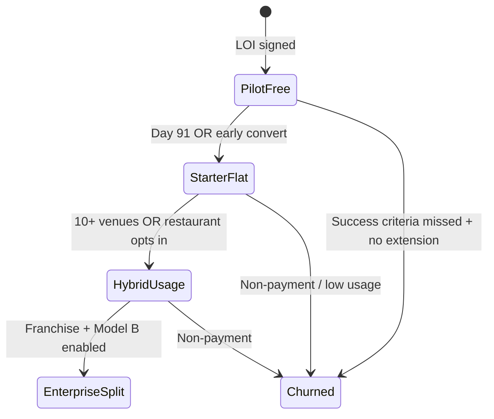

# PART 13B — Pricing Recommendation (MVP Pilot + Long-Term)

**Product:** Rekentafel / TabSettle  
**Slice:** Monetization — selected pricing with rationale  
**Last updated:** 2026-06-26  
**Resolves:** Open question — *MVP pricing: flat SaaS per venue vs per-transaction bps vs hybrid*

---

## 1. Decision summary

| Horizon | Model | Price (excl. 21% BTW) | Collection |
|---------|-------|------------------------|------------|
| **MVP pilot (venue 1–3)** | Flat SaaS | **€0 for 90 days** | No invoice |
| **MVP paid (venue 1–10)** | Flat SaaS | **€59/mo Starter** | SEPA / Mollie Subscriptions |
| **V1.1 (10–50 venues)** | **Hybrid** | **€49/mo + €0.10 per paid guest checkout** | Monthly invoice + usage CSV |
| **V2 enterprise (50+ / groups)** | Hybrid + optional in-rail | €99/location/mo min 3 + **10 bps** (cap €0.35/checkout) OR off-rail equivalent | Model B `routing[]` when enabled |

**One-line rationale:** Pilot with **pure SaaS** to avoid payment-facilitator complexity and restaurant "% of my sales" objection; migrate to **hybrid** once webhook metering is proven and ROI data exists — not before **10 paying venues**.

---

## 2. Why not pure bps at MVP

| Factor | Assessment |
|--------|------------|
| Payment architecture | MVP is **Model A** — restaurant MoR; platform fee off-rail. Pure bps **without** SaaS floor yields **€0.22/table at 25 bps** on €86.40 — insufficient for support. |
| Sales psychology | NL independents compare to free Tikkie workaround; leading with bps kills pilot conversations. |
| Mollie txn multiplication | Split-pay adds ~€0.96/iDEAL/table vs single terminal (see [pricing-options.md §6.2](./pricing-options.md)). Stacking platform bps on top **before** ROI proof is toxic. |
| Regulatory | In-rail bps needs Connect for Marketplaces review ([risk-tiering HI-01](../compliance/risk-tiering.md)). |
| Metering maturity | Usage billing requires idempotent webhook ledger — MVP engineering focus is split-pay correctness, not billing disputes. |

**Verdict:** Document bps in LOI as **future standard**; do not enforce at pilot.

---

## 3. Why not pure SaaS forever

| Factor | Assessment |
|--------|------------|
| Unit economics | Slow venue at €59/mo may still be **LTV-negative** after €40/mo support (see [unit-economics.md](./unit-economics.md)). |
| Value alignment | Busy Friday delivers 10× sessions vs Tuesday lunch; flat fee under-monetizes high performers who derive most ROI. |
| Competitive moat | Pure SaaS caps ARPU ~€150/mo/location without POS/analytics attach — weak vs ordering platforms. |
| Franchise expansion | Multi-site groups expect **volume-linked** pricing. |

**Verdict:** Introduce hybrid at V1.1 with **included checkout bundles** to soften transition.

---

## 4. Recommended price card

### 4.1 MVP pilot LOI (copy-ready)

> **Rekentafel Pilot Agreement — [Venue Name]**
>
> - **Fee:** €0 platform subscription for **90 days** from go-live.
> - **Scope:** 1 location, up to **30 tables**, unlimited guest payment sessions.
> - **Restaurant pays:** Mollie transaction fees on guest payments (typically **€0.32 per iDEAL | Wero payment**); no platform guest surcharge.
> - **Success criteria (joint):** ≥**70%** of table closes with ≥2 guest payments OR ≥**8 min** median reduction in pay-phase duration (measured from waiter "payment mode" to table close).
> - **Post-pilot:** Converts to **Starter €59/mo** unless written hybrid election before day 85.
> - **Merchant of record:** Restaurant Mollie account; Rekentafel is software processor only.

### 4.2 MVP paid — Starter (single location)

| Item | Price |
|------|-------|
| Monthly platform fee | **€59** |
| Included tables | 25 (€2/table/mo overage optional — defer enforcement pilot) |
| Staff seats | 3 waiters + 1 admin |
| Guest checkout fee | **€0** |
| Support | Email, 48h SLA business days |
| Data retention | 13 months audit logs |

**Target customer:** Independent bistro/brasserie, 20–35 covers, Amsterdam/Utrecht/Rotterdam ring.

### 4.3 V1.1 — Growth hybrid

| Item | Price |
|------|-------|
| Base platform fee | **€49/mo** |
| Included guest checkouts | **150/mo** |
| Overage | **€0.10** per additional paid guest checkout |
| Pro bundle (optional) | **€129/mo** — 500 checkouts included, 10 seats, CSV export |

**Example invoice — medium venue, 420 guest checkouts/mo**

| Line | Amount |
|------|--------|
| Base | €49.00 |
| Included | −150 |
| Billable overage | 270 × €0.10 = €27.00 |
| **Total excl. BTW** | **€76.00** |
| Effective take rate @ €38k GMV | 0.20% |

### 4.4 V2 — Enterprise (optional in-rail)

| Item | Price |
|------|-------|
| Minimum | 3 locations |
| Per location | **€99/mo** OR **€49/mo + 10 bps** on guest payments (restaurant elects) |
| In-rail collection | Requires Mollie Connect Split + legal sign-off |
| SLA | 24h support, dedicated onboarding |

---

## 5. MVP vs post-MVP pricing feature gates

| Capability | Starter €59 | Hybrid €49+usage | Enterprise |
|------------|-------------|------------------|------------|
| Table QR + menu | MVP | V1.1 | V2 |
| Waiter payment sessions | MVP | V1.1 | V2 |
| Split / claim / tip | MVP | V1.1 | V2 |
| Mollie iDEAL/cards | MVP | V1.1 | V2 |
| Usage-metered billing | No | **V1.1** | V2 |
| Insights add-on €39 | No | V1.1 | V2 |
| Model B split fees | No | Optional | V2 |
| Partner marketplace fees | No | No | Post-V2 |
| Crypto checkout fee | No | No | Separate rail |

---

## 6. Transition state machine (pilot → paid → hybrid)

| Transition | Trigger | Customer communication |
|------------|---------|------------------------|
| Pilot → Starter | Day 85 notice | "€59/mo; saved X minutes/table" report |
| Starter → Hybrid | Platform V1.1 billing launch | 60-day notice; **grandfather €59** for first 10 logos optional |
| Hybrid → Enterprise | ≥3 locations | Account manager |

---

## 7. Grandfathering policy (founder discretion)

| Cohort | Policy |
|--------|--------|
| Pilot venue #1 | **Lifetime €59 flat** if case study rights granted (marketing value > ARPU delta) |
| Venues 2–10 | 12 mo price lock at signed rate |
| Hybrid migration | First **200 checkouts/mo free** for 3 months after switch |

Document exceptions in CRM — avoid public price chaos.

---

## 8. What we explicitly do not charge (MVP–V1.1)

| No-charge item | Reason |
|----------------|--------|
| Guest convenience fee | Adoption killer |
| % of tips | Legal/staff optics |
| % of service charge | Merchant compliance sensitivity |
| Empty-table menu scans | Funnel, not value moment |
| Failed payments | Fairness |
| Crypto | Not built |

---

## 9. Billing stack recommendation

| Phase | Restaurant billing | Guest payments |
|-------|-------------------|----------------|
| MVP | **Manual SEPA invoice** or Stripe Billing NL entity | Mollie OAuth Model A |
| V1.1 | Metered invoice from `billing.usage_daily` rollup | Same |
| V2 | Mollie Subscriptions API for SaaS + usage line item | Optional Model B split |

Platform SaaS BTW: **21%** standard rate on B2B software to NL VAT-registered restaurants (reverse charge if EU B2B — N/A for NL pilot).

---

## 10. Objection handling (sales scripts — factual)

| Objection | Response |
|-----------|----------|
| "Mollie already costs me more txns" | "One terminal = €0.32; four iDEAL = €1.28 — **+€0.96**. Pilot measures if you reclaim **≥8 min** turn time worth **>€2** to you." |
| "Why SaaS if you take bps later?" | "Pilot proves ROI with **fixed predictable cost**; usage fee only after you see weekly split-pay habit." |
| "Can you take fee from tips?" | "**No.** Tips pass to your Mollie account in full." |
| "Guests won't pay fees" | "**Correct — guests pay €0** platform fee always." |

---

## 11. KPIs to validate pricing (before hybrid rollout)

| KPI | Target | Action if miss |
|-----|--------|----------------|
| Pilot → paid conversion | ≥80% of pilots | Extend pilot or cut Starter to €49 |
| Median pay-phase minutes saved | ≥6 min | Fix UX before hybrid upsell |
| Restaurant NPS | ≥40 | Delay usage fee |
| Platform gross margin / venue | ≥60% at Starter | Raise price or cut support scope |
| Guest checkout fee dispute rate | <2% of invoices | Fix metering bugs |

---

## 12. Final recommendation table

| Question | Answer |
|----------|--------|
| MVP pilot price | **€0 / 90 days** |
| MVP list price | **€59/mo flat SaaS** |
| Long-term (12–36 mo) | **€49/mo + €0.10/checkout** with 150 included |
| Pure bps only? | **Reject** for NL indie segment |
| Pure SaaS forever? | **Reject** — caps growth; use as entry tier only |
| Tip share? | **Reject** |
| When to enable Model B split? | **≥50 venues** + legal + Mollie marketplace agreement |

---

## 13. Related documents

- [pricing-options.md](./pricing-options.md) — full model comparison
- [unit-economics.md](./unit-economics.md) — margin scenarios
- [restaurant-value-onepager.md](./restaurant-value-onepager.md) — owner ROI
