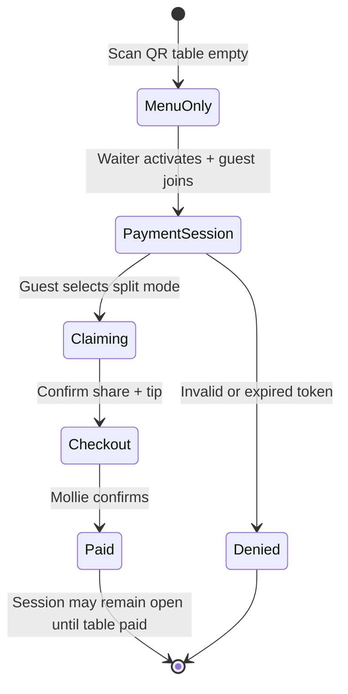
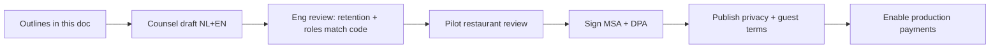

# Policy Drafts Needed Before Pilot

**Slice:** Part 12 — Legal / Compliance  
**Status:** Section outlines for counsel drafting — **not final legal text**  
**Pilot gate:** Do not process live guest payments until counsel-approved versions of §1–§3 are published and version-controlled.

**Alignment references:**

- Retention: [data-classification.md](../architecture/data-model/data-classification.md) §4, §8, §12
- Payment roles: [payment-architecture.md](../architecture/payments/payment-architecture.md) §7
- Loyalty exclusion MVP: [regulatory-framing.md](../domain/loyalty/regulatory-framing.md) §1
- MVP scope: [scope-boundary.md](../product/scope-boundary.md)

---

## 1. Document inventory and ownership

| Document | Counterparties | MVP required | Owner (draft) | Counsel review |
|----------|----------------|--------------|---------------|----------------|
| **Guest Terms of Use** | Guest ↔ Restaurant (platform role TBD per Q43) | **Yes** | Product + counsel | Required |
| **Privacy Policy** | Public | **Yes** | DPO/counsel | Required |
| **Restaurant MSA + DPA** | Platform BV ↔ Restaurant | **Yes** | Ops + counsel | Required |
| **Cookie / tracking notice** | Guest web | **Yes** if non-essential cookies | Product | Required if analytics |
| **Staff Acceptable Use** | Restaurant ↔ staff (template) | Recommended | Ops | Optional pilot |
| **Refund & Chargeback Policy** | Guest-facing summary | **Yes** | Ops + counsel | Required |
| **Sub-processor list** | Privacy policy annex | **Yes** | Eng | Required |
| **Loyalty Terms** | Guest | **No MVP** | — | V2 gate |
| **Crypto payment terms** | Guest | **No MVP** | — | Post-MVP gate |

**Version control:** Each document carries `version`, `effective_date`, `locale` (NL + EN minimum for Amsterdam pilot).

---

## 2. Guest Terms of Use — outline

### 2.1 Purpose and acceptance

- Scope: mobile web experience for viewing menu, joining **waiter-activated** payment sessions, claiming bill shares, and paying via Mollie.
- Acceptance mechanism: checkbox or conspicuous link before first payment; store `terms_version_accepted`.
- **MVP exclusion notice:** No accounts required; no loyalty points; no stored balance; no crypto.

### 2.2 Roles and merchant of record

| Party | Role (draft language intent) |
|-------|------------------------------|
| Restaurant | Seller of food and beverages; **merchant of record** for payments |
| Platform | Software provider; payment orchestration on restaurant's behalf |
| Mollie | Payment service provider; hosted checkout |

**Required disclosure (counsel to refine):** "You are paying **[Restaurant Legal Name]** for your meal. **[Platform]** provides the split-payment software. Card/iDEAL processing is provided by Mollie."

**Weak assumption challenged:** Terms must not imply platform is restaurant or holds guest funds.

### 2.3 Payment session rules

- Bill visibility only after waiter activates payment mode and guest obtains valid session access (token/PIN).
- Guest obligations: accurate nickname; claim only items consumed; no obstructive partial payments intended to block others.
- **Numeric example clause:** If bill total is €86.40 and you claim €24.00 share plus €3.00 tip, you authorize a Mollie payment of **€27.00** to the restaurant.

### 2.4 Split modes and allocation disputes

- Item claim, equal split, custom amount, shared-item rules per product spec.
- Platform displays allocations; **waiter/manager override is authoritative** for disputes at table.
- Concurrent claims: second claimant may be rejected if item already allocated (reference concurrency spec).

### 2.5 Tips and service charges

- Voluntary **tip** is guest-elected; passes to restaurant via same Mollie payment unless venue configures otherwise.
- **Service charge** (if shown) is part of restaurant pricing; not platform fee.
- Counsel to refine NL distinction between mandatory service charge and fooi.

### 2.6 VAT / receipt

- Platform shows informational VAT breakdown on splits; **fiscal invoice/receipt is restaurant responsibility**.
- Guest directed to restaurant for official BTW receipt if required.

### 2.7 Refunds and cancellations

- Refunds processed on original payment rail (`tr_xxx`) per restaurant decision.
- Platform facilitates refund API where authorized; timeline subject to Mollie and restaurant policy.
- **Partial table scenario:** If Anna's €8 item is comped after she paid €27, partial refund may be issued on Anna's payment only — not from other guests' payments without admin action.
- iDEAL: no chargebacks; cards: chargebacks handled by merchant of record.

### 2.8 Prohibited use

- Joining session without intent to pay claimed share.
- Automated scraping of live bills.
- Circumventing session token requirements.

### 2.9 Limitation of liability (counsel review)

- Platform not liable for restaurant food quality, pricing errors, or incorrect waiter-entered bills beyond software SLA.
- Cap direct damages to fees paid to platform (likely €0 for guest in MVP) — **counsel must align with ACM unfair terms rules**.

### 2.10 Governing law and disputes

- Propose NL law and competent court; **counsel to confirm** B2C mandatory consumer jurisdiction rules.

### 2.11 MVP vs post-MVP sections (mark "not yet active")

| Section | MVP | V1.1 | V2+ |
|---------|-----|------|-----|
| Guest accounts | Off | Add account terms | Same |
| Loyalty points | Off | Off | Add loyalty addendum |
| Stored wallet | **Never** | **Never** | N/A |
| Crypto | Off | Off | Separate addendum |
| Discovery/recommendations | Off | Off | Consent addendum |

---

## 3. Privacy Policy — outline

### 3.1 Controller / processor map (indicative — counsel confirms)

| Processing | Controller | Processor |
|------------|------------|-----------|
| Meal payment session data | Restaurant (indicative) | Platform |
| Platform SaaS account (restaurant admin) | Platform | Sub-processors |
| Optional guest account (V1.1) | TBD joint/platform | Platform |

### 3.2 Categories of personal data

| Category | Examples | Tier ([data-classification](../architecture/data-model/data-classification.md)) | MVP |
|----------|----------|--------|-----|
| Session identity | Nickname, participant ID | L2 | Yes |
| Device data | Pseudonymous device ID, fingerprint hash | L2 | Yes |
| Payment data | Amount, method type, Mollie payment ID | L2 + payment flag | Yes |
| Staff actions | Waiter override audit | L2 | Yes |
| Account (V1.1) | Email, display name | L2 | No |
| Location (V1.1+) | Coarse geo for join gate | L2 | No |

**Not collected MVP:** PAN/CVV (Mollie hosted checkout); precise GPS unless feature added.

### 3.3 Purposes and lawful bases

| Purpose | Data | Basis (indicative) | MVP |
|---------|------|-------------------|-----|
| Enable split payment | Nickname, allocations, payments | Contract / restaurant hospitality relationship | Yes |
| Fraud prevention | Device hash, IP hash | Legitimate interest (LIA required) | Yes |
| Financial records | Payment IDs, amounts | Legal obligation | Yes |
| Optional marketing | Email | Consent | V1.1+ |
| Recommendations | Order history | Consent + DPIA | **Not MVP** |

### 3.4 Retention schedule (must match engineering)

| Data | Retention | Trigger |
|------|-----------|---------|
| Participant nickname | 90 days after table session reset | `table.reset` job |
| Guest device records | 90 days inactivity | Scheduled purge |
| Service signals (call server) | 30 days | Archive delete |
| Webhook raw payload | 90 days | Delete payload; keep metadata |
| Payment records | 7 years | Pseudonymize on erasure where applicable |
| Audit logs (financial) | 7 years | Immutable |

**Guest-facing summary sentence (draft intent):** "We keep payment records for up to seven years where required by law; session nicknames and device data are deleted or anonymized within ninety days after your table session ends unless you create an account."

### 3.5 Recipients and sub-processors

| Recipient | Purpose | Location |
|-----------|---------|----------|
| Mollie B.V. | Payment processing | NL/EU |
| Hosting provider | Application hosting | EU preferred |
| Email provider | Transactional email | Confirm region + SCCs |

Maintain public **sub-processor list** with update notification mechanism for restaurants.

### 3.6 International transfers

- State if any US/other non-EEA sub-processors used; reference SCCs and transfer impact assessment.

### 3.7 Data subject rights

- Access, rectification, erasure, restriction, portability, objection — contact path and SLA (e.g. 30 days).
- **Erasure caveat:** Payment records may be retained pseudonymized per legal obligation (align [data-classification](../architecture/data-model/data-classification.md) §12).

### 3.8 Security measures (high level)

- TLS, encryption at rest, L3 token hashing, RBAC, audit logging — no excessive technical detail.

### 3.9 Profiling and automated decisions

- **MVP:** "We do not use profiling or automated decision-making for guest payments."
- Post-MVP: update before discovery/recommendations launch.

### 3.10 Children

- Service not directed at children under 16 for account creation; menu viewing incidental; parental guidance for payments.

### 3.11 Contact and DPO

- Platform contact email; DPO appointment if required by Art. 37.

### 3.12 Changes

- Material change notification via web banner + version ID.

---

## 4. Restaurant Master Services Agreement (MSA) — outline

### 4.1 Parties and definitions

- Platform BV (supplier)
- Restaurant legal entity (KVK, BTW number on file — L2 data)
- Definitions: Venue, Table, Payment Session, Mollie Connection, SaaS Fee

### 4.2 Services scope (MVP)

| Included | Excluded |
|----------|----------|
| Table QR, menu hosting | POS bi-directional sync |
| Waiter bill entry / import | Crypto acceptance |
| Split-pay orchestration | Loyalty / coalition |
| Mollie OAuth integration helper | Stored-value wallet |
| Staff console, audit logs | Discovery marketplace |

Attach **Scope Boundary** excerpt or schedule mirroring [scope-boundary.md](../product/scope-boundary.md).

### 4.3 Merchant of record and payments

- Restaurant maintains **own Mollie organization**; completes KYC; enables iDEAL/cards.
- Platform creates payments via OAuth as **technical agent** only.
- Funds settle to restaurant Mollie balance — **not** platform BV account (MVP).
- Restaurant authorizes platform API actions within connected scopes.

**Settlement expectation clause (numeric example):** iDEAL payments from Saturday service may reach restaurant bank Monday; card payments may take additional business days per Mollie schedule — platform does not guarantee T+0 bank credit.

### 4.4 Fees and invoicing

- MVP: flat SaaS fee (€X/table/month — TBD commercial) invoiced monthly with BTW.
- Future per-transaction fee requires amendment + counsel review if Model B enabled.

### 4.5 Restaurant obligations

- Accurate menu and bill entry; staff training on payment mode activation.
- Compliance with hospitality, food safety, alcohol service laws (on-premise).
- Guest BTW receipts and fiscal records — **restaurant responsibility**.
- Prompt handling of refunds/chargebacks as merchant of record.
- No use of platform to circumvent EMI/PSD2 rules (no wallet marketing).

### 4.6 Platform obligations

- Reasonable availability SLA (pilot: best-effort with support window).
- Security measures per DPA.
- Process personal data only on documented instructions.
- Incident notification within X hours of confirmed breach affecting restaurant data.

### 4.7 Data protection (DPA schedule)

- Roles: restaurant controller / platform processor for guest session data (subject to counsel Q26).
- Sub-processor approval mechanism.
- Assistance with DSRs, DPIAs, breach notifications.
- Return/delete data on termination except legal retention.
- **Retention schedule incorporation by reference** to data-classification doc version.

### 4.8 VAT and pricing accuracy

- Restaurant warrants bill lines and VAT rates correct.
- Platform displays splits based on restaurant-entered data; disclaimer of fiscal liability for merchant-entered errors.
- Joint QA commitment for pilot (test bills).

### 4.9 Tips and service charges

- Restaurant configures whether tips collected via platform; distribution to staff is **restaurant-only** obligation — platform not employer.

### 4.10 Refunds, chargebacks, and disputes

- Restaurant bears Mollie chargebacks on card payments.
- Platform provides audit trail (session ID, allocation snapshot, payment IDs).
- Manual ops escalation path during pilot.

### 4.11 Acceptable use and fraud

- Prohibited: falsifying bills, money laundering, off-platform payment circumvention for licensed activity.
- Suspension rights for fraud or regulatory risk.

### 4.12 Intellectual property

- Platform owns software; restaurant owns menu content and trademarks.
- License to display restaurant menu on QR surfaces.

### 4.13 Confidentiality

- Non-public business data; security incident coordination.

### 4.14 Term, pilot period, termination

- Pilot term (e.g. 8 weeks); either party terminate on X days notice.
- On termination: export restaurant data; revoke Mollie OAuth; retention of payment logs per law.

### 4.15 Liability and indemnity (counsel review)

- Mutual indemnity for regulatory breaches in control of each party.
- Restaurant indemnifies platform for merchant VAT/chargeback failures arising from restaurant data.
- Cap and carve-outs per NL law.

### 4.16 Governing law

- Netherlands; courts of [city].

### 4.17 Schedules

| Schedule | Content |
|----------|---------|
| A | DPA (Art. 28 GDPR standard clauses) |
| B | Sub-processors |
| C | SLA / support |
| D | MVP feature list & exclusions |
| E | Security measures |
| F | Pilot success criteria (optional) |

---

## 5. Ancillary policies (pilot recommended)

### 5.1 Refund & chargeback policy (guest summary page)

- Who requests refund (guest → restaurant staff → platform UI).
- Timelines; partial refunds on split bills.
- iDEAL vs card differences.
- No refund to third-party IBAN in MVP.

### 5.2 Cookie policy

- Strictly necessary cookies for session token.
- If analytics (PostHog, etc.): consent banner; no payment page tracking without counsel approval.

### 5.3 Internal records

| Record | GDPR Art. 30 |
|--------|--------------|
| ROPA | Platform processing activities |
| LIA | Fraud device fingerprinting |
| Breach register | Incidents |
| DPIA | Deferred until profiling |

---

## 6. Policy drafting workflow

| Step | Gate |
|------|------|
| Counsel draft complete | P0 questions 4, 26, 42 answered |
| Eng alignment | Retention jobs = privacy policy |
| Pilot signature | MSA + DPA executed |
| Go-live | Guest terms version ID in checkout |

---

## 7. Copy constraints tied to policies (MVP)

Enforce in product and marketing to match signed terms:

| Forbidden (MVP) | Allowed |
|-----------------|---------|
| "Wallet balance" | "Pay your share" |
| "Store credit for next visit" | "Add a tip" |
| "Pay with Bitcoin" | "Pay with iDEAL or card" |
| "Earn points" | "Split the bill" |
| "Platform holds your payment" | "Pay [Restaurant] securely via Mollie" |

Source: [regulatory-framing.md](../domain/loyalty/regulatory-framing.md) §12.

---

## 8. Post-MVP policy modules (do not draft until gated)

| Module | Trigger | Dependencies |
|--------|---------|--------------|
| Loyalty Terms | V2 points launch | Counsel memo REG-004 |
| Guest Account Addendum | V1.1 accounts | Erasure workflow live |
| Geo Join Consent | V1.1 geo gate | Q33 answered |
| Crypto Payment Terms | Crypto rail eval | CASP partner + Q38–41 |
| Partner Marketplace Terms | Coalition launch | EMI/voucher memo |
| Profiling Consent | Discovery/ML | DPIA complete |

---

## 9. Acceptance criteria mapping

| Criterion | Section |
|-----------|---------|
| Guest terms outline | §2 |
| Privacy policy outline | §3 |
| Restaurant MSA outline | §4 |
| PSD2/e-money boundaries referenced, not overclaimed | §2.2, §4.3, §7 |
| GDPR retention aligns with data classification | §3.4 |
| MVP vs post-MVP separated | §2.11, §8 |

---

*Slice ownership: Part 12 — Legal / Compliance. Counsel must validate all outlines before publication.*
