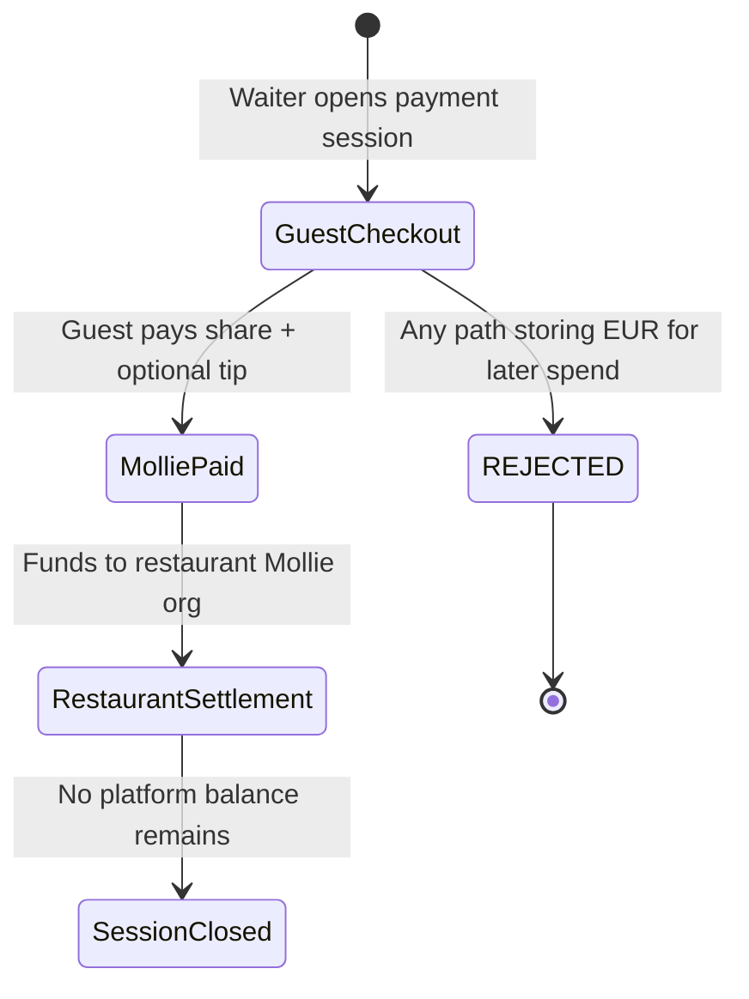

# Legal & Compliance Risk Tiering — Netherlands / EU

**Slice:** Part 12 — Legal / Compliance  
**Product:** Table QR split-pay platform (working names: TabSettle, SplitTable, Rekentafel, BillQR)  
**Jurisdiction:** Netherlands primary; EU GDPR and payment acquis apply  
**Status:** Founder guidance for counsel validation — **not legal advice**

**Cross-references (do not treat as legal conclusions):**

- [payment-architecture.md](../architecture/payments/payment-architecture.md) — Model A restaurant-owned Mollie org (MVP target)
- [regulatory-framing.md](../domain/loyalty/regulatory-framing.md) — e-money / overpay rejection
- [data-classification.md](../architecture/data-model/data-classification.md) — retention tiers L0–L3
- [scope-boundary.md](../product/scope-boundary.md) — MVP Never list

---

## 1. How to use this document

| Tier | Meaning | Founder action |
|------|---------|----------------|
| **Critical** | Pilot-blocking or existential regulatory exposure if mishandled | Stop feature work; obtain written counsel memo before pilot or launch |
| **High** | Material liability, fines, or merchant harm; mitigatable with design + contracts | Ship only with documented controls + counsel-reviewed terms |
| **Medium** | Operational/compliance debt; manageable at pilot scale | Implement MVP controls; schedule counsel before scale |

**Weak assumption challenged:** "We are just software on the restaurant's Mollie account, so we have no payment regulation." That posture is **defensible for MVP Model A** only if the platform **never holds funds**, **never issues spendable balances**, and **does not pool tips or refunds** on a platform account. Any deviation moves tier upward immediately.

---

## 2. Critical risks (pilot gate)

### CR-01 — E-money / stored-value from overpay or wallet mechanics

| Attribute | Detail |
|-----------|--------|
| **Regulatory hook** | Wft (NL) / EU E-Money Directive — Electronic Money Institution (EMI) authorization via AFM/DNB |
| **Trigger features** | Overpay → EUR balance; "dining wallet"; cross-venue redeemable credit; platform-held surplus after checkout |
| **MVP posture** | **Excluded** per [scope-boundary.md](../product/scope-boundary.md) and [regulatory-framing.md](../domain/loyalty/regulatory-framing.md) |
| **Example failure** | Guest pays €55 for €50 share; UI shows "€5.00 credit for next visit at any partner" → treated as stored value regardless of marketing label |
| **Founder actions** | (1) Hard-code exclusion: no `wallet_balance_cents` column. (2) Ban consumer copy containing "wallet," "balance," "credit to spend." (3) Counsel memo before **any** V2 loyalty/overpay UI. (4) If product insists on overpay narrative, use **same-visit same-venue discount** or **non-monetary points** only after counsel signs specific design. |

**State machine — allowed vs prohibited value storage (MVP):**

---

### CR-02 — Platform as payment institution / unauthorized payment services

| Attribute | Detail |
|-----------|--------|
| **Regulatory hook** | PSD2 — payment institution / money remittance if platform receives guest funds and pays merchants |
| **Trigger features** | Platform balance receives payments then batch-pays restaurants; platform as merchant of record for food; delayed routing without Mollie licensed infrastructure |
| **MVP target** | Model A: restaurant is merchant of record; platform OAuth agent only ([payment-architecture.md](../architecture/payments/payment-architecture.md) §3.1) |
| **Example failure** | Guest iDEAL lands in platform BV IBAN; platform weekly SEPA to venues → likely PI/remittance, not SaaS |
| **Founder actions** | (1) Confirm settlement path: **100% to restaurant Mollie org** in MVP. (2) Do not enable Model B (marketplace split) without counsel + Mollie partner agreement. (3) Document in restaurant MSA: merchant of record = restaurant. (4) Audit code paths: no platform bank account in payment webhook flow. |

---

### CR-03 — Public bill exposure without waiter-activated session token

| Attribute | Detail |
|-----------|--------|
| **Regulatory / legal hook** | GDPR (data minimization, unauthorized disclosure of dining companions' order data); fraud (bill hijacking) |
| **Trigger features** | Persistent QR alone reveals live bill, amounts, or other guests' claims |
| **MVP posture** | Payment session requires waiter activation + short-lived token ([scope-boundary.md](../product/scope-boundary.md)) |
| **Example failure** | Tourist scans empty-table QR, sees Table 7's €312 open tab and item list → GDPR complaint + chargeback abuse |
| **Founder actions** | (1) Enforce API gate: bill endpoints require valid `payment_session_token`. (2) Log access denials for fraud review. (3) Privacy policy: bill data visible only to session participants. (4) Train pilot staff: never share join PIN in public. |

---

### CR-04 — VAT / BTW misrepresentation on split checks

| Attribute | Detail |
|-----------|--------|
| **Regulatory hook** | Dutch VAT Act (Omzetbelasting); restaurant remains liable for correct invoice |
| **Trigger features** | Wrong VAT rate on line; split rounding that omits VAT; service charge classified incorrectly; tip shown as VAT-inclusive food |
| **Example (numeric)** | Bill €86.40 incl. 9% hospitality VAT on food; four-way equal split shows €21.60 each but sum of VAT lines ≠ original €7.13 VAT → Belastingdienst audit risk for merchant |
| **Founder actions** | (1) Fixed rounding rules per bill-splitting spec; property tests on totals. (2) MSA clause: platform displays **informational** breakdown; **restaurant** responsible for fiscal invoice. (3) Counsel question on service charge vs mandatory tip under NL hospitality norms. (4) No platform-issued fiscal invoice to guest in MVP unless counsel approves model. |

---

### CR-05 — Processing personal data without lawful basis / missing DPA chain

| Attribute | Detail |
|-----------|--------|
| **Regulatory hook** | GDPR Arts. 6, 28, 30; AP (Autoriteit Persoonsgegevens) enforcement |
| **Trigger features** | Guest nicknames, device fingerprints, payment metadata, staff audit logs; Mollie as sub-processor |
| **MVP posture** | Align retention with [data-classification.md](../architecture/data-model/data-classification.md) §4 |
| **Example failure** | Launch pilot with no privacy policy, no restaurant DPA, 7-year payment logs with no documented legal obligation mapping |
| **Founder actions** | (1) Publish privacy policy before first guest session. (2) Execute restaurant DPA (processor/controller roles). (3) Maintain ROPA (record of processing activities). (4) Sign Mollie DPA / confirm subprocessors list. (5) Implement `table.reset` retention jobs per data-classification §4. |

---

## 3. High risks (controls required before / during pilot)

### HI-01 — Mollie Connect marketplace model (Model B) without licensing review

| Attribute | Detail |
|-----------|--------|
| **Risk** | Platform fee via `routing[]` may shift posture toward marketplace / facilitator |
| **MVP** | **Deferred** — SaaS invoice only ([payment-architecture.md](../architecture/payments/payment-architecture.md) §3.4) |
| **Founder actions** | Feature-flag `payments.model = restaurant_org` only at pilot; counsel review before Model B |

---

### HI-02 — Tip pass-through and wage / tax treatment

| Attribute | Detail |
|-----------|--------|
| **Risk** | Tips via Mollie to restaurant may still require correct labeling for loonbelasting / sector rules; platform must not pool and redistribute tips as employer |
| **MVP** | Tip metadata on payment; pass-through to merchant Mollie payment |
| **Example** | €24 share + €3 tip = €27 Mollie payment; tip not platform revenue |
| **Founder actions** | (1) Guest terms: tip is voluntary gratuity to restaurant/staff per venue policy. (2) MSA: restaurant configures tip visibility and distribution. (3) Counsel: mandatory service charge vs tip in NL UI copy. |

---

### HI-03 — Split-bill refunds and chargebacks (card rail)

| Attribute | Detail |
|-----------|--------|
| **Risk** | Partial group refunds; chargeback after table closed; merchant of record bears card disputes |
| **MVP** | Manual ops queue; per-`tr_xxx` refunds ([payment-architecture.md](../architecture/payments/payment-architecture.md) §6) |
| **Founder actions** | (1) Snapshot allocations at payment time. (2) Refund policy in guest terms + MSA. (3) iDEAL-first UX nudge (no chargebacks on iDEAL). (4) Train restaurant: liability sits with merchant Mollie account. |

---

### HI-04 — Bill hijacking / malicious session join

| Attribute | Detail |
|-----------|--------|
| **Risk** | Remote actor joins payment session, claims items, pays minimal amount, blocks table closure |
| **MVP mitigations** | Waiter-activated token; optional join PIN; waiter override |
| **Post-MVP** | Geo/proximity gate (legal review for location data) |
| **Founder actions** | (1) Rate-limit join attempts. (2) Audit log for overrides. (3) Counsel question: is join PIN alone sufficient "authentication" for payment authorization? |

---

### HI-05 — Loyalty points (V2) misclassified as e-money

| Attribute | Detail |
|-----------|--------|
| **Risk** | Venue points with EUR equivalence, cross-venue redemption, or cash-out |
| **MVP** | **No loyalty ledger** |
| **Founder actions** | Follow guardrails in [regulatory-framing.md](../domain/loyalty/regulatory-framing.md) §5; counsel memo before V2 launch |

---

### HI-06 — Gift / multi-purpose vouchers (post-MVP partner redemption)

| Attribute | Detail |
|-----------|--------|
| **Risk** | EU Gift Vouchers Directive implementation in NL; VAT reporting; EMI overlap for multi-merchant vouchers |
| **MVP** | **Excluded** |
| **Founder actions** | Separate legal program if partner marketplace ever ships; do not conflate with split-pay pilot |

---

### HI-07 — GDPR erasure vs 7-year financial retention conflict

| Attribute | Detail |
|-----------|--------|
| **Risk** | Guest requests deletion; payment records must persist pseudonymized |
| **Alignment** | [data-classification.md](../architecture/data-model/data-classification.md) §4, §12 |
| **Retention table (MVP)** | |

| Data class | Retention | Legal basis (indicative) |
|------------|-----------|---------------------------|
| `payments`, closed `bills` | 7 years | Legal obligation / tax audit |
| `participants.display_name` | 90d after `table.reset` | Minimization |
| `guest_devices` | 90d inactive | Fraud LI / minimization |
| `webhook_events.payload_json` | 90d raw; 7y summary in payments | Operational + financial |
| Optional `users.email` (V1.1) | Until deletion + 30d | Consent |

| **Founder actions** | (1) Implement erasure workflow that pseudonymizes payment refs. (2) Document in privacy policy. (3) Do not promise "full delete of all payment history" if law requires retention. |

---

### HI-08 — Profiling / recommendations (post-MVP)

| Attribute | Detail |
|-----------|--------|
| **Risk** | GDPR Art. 22 / consent; DPIA required for order-behavior profiling |
| **MVP** | **No profiling** ([data-classification.md](../architecture/data-model/data-classification.md) §8) |
| **Founder actions** | No recommendation engine in MVP; consent + DPIA before V2 discovery/ML |

---

### HI-09 — Crypto rail (post-MVP)

| Attribute | Detail |
|-----------|--------|
| **Risk** | MiCA CASP licensing; AML/KYC; travel rule; irreversible fraud |
| **MVP** | **Excluded** ([crypto-rail-design.md](../architecture/payments/crypto-rail-design.md)) |
| **Founder actions** | No crypto UI/API in pilot; separate legal memo + licensed PSP contract before V2 eval |

---

### HI-10 — Consumer terms imbalance (ACM / unfair terms)

| Attribute | Detail |
|-----------|--------|
| **Risk** | One-sided refund rules; mandatory arbitration hidden; waiver of statutory rights |
| **Founder actions** | Counsel review guest terms; comply with EU consumer rights for B2C where platform is contracting party for **software account** (V1.1+); clarify restaurant is seller of meal |

---

## 4. Medium risks (pilot OK with documented controls)

### ME-01 — Settlement timing expectations (T+1 / T+3)

| Attribute | Detail |
|-----------|--------|
| **Risk** | Restaurant expects instant bank credit; Mollie pending balance lags for cards |
| **Example** | Saturday card payments available Thursday ([payment-architecture.md](../architecture/payments/payment-architecture.md) §5) |
| **Founder actions** | Onboarding doc; MSA disclaimer; no UI implying "instant payout" |

---

### ME-02 — Staff device / PIN security

| Attribute | Detail |
|-----------|--------|
| **Risk** | Shared waiter PIN; session hijack from staff panel |
| **Founder actions** | Argon2id PIN hash (L3); RBAC; session timeout; audit log |

---

### ME-03 — OAuth token compromise (Mollie restaurant connection)

| Attribute | Detail |
|-----------|--------|
| **Risk** | L3 breach → unauthorized payments on merchant account |
| **Founder actions** | Encrypt refresh tokens; revoke-all playbook; breach notification assessment per GDPR 72h |

---

### ME-04 — Cross-border guests (non-EU data transfer)

| Attribute | Detail |
|-----------|--------|
| **Risk** | Tourist payments; analytics on US CDN |
| **Founder actions** | EU hosting preference; SCCs for sub-processors; document in privacy policy |

---

### ME-05 — Age / alcohol menu display

| Attribute | Detail |
|-----------|--------|
| **Risk** | Menu shows alcohol; no age gate on QR menu view |
| **MVP** | Informational menu only (no sale via platform) |
| **Founder actions** | Restaurant responsible for on-premise age verification; platform not seller of alcohol |

---

### ME-06 — Partner settlement (post-MVP coalition)

| Attribute | Detail |
|-----------|--------|
| **Risk** | Inter-merchant settlement for coalition rewards |
| **Founder actions** | Defer; separate entity and counsel program ([regulatory-framing.md](../domain/loyalty/regulatory-framing.md) §9) |

---

### ME-07 — SaaS pricing / platform fee invoicing VAT

| Attribute | Detail |
|-----------|--------|
| **Risk** | Incorrect BTW on platform SaaS fees to restaurants |
| **Founder actions** | Dutch BV invoices restaurants with correct VAT; separate from guest meal VAT |

---

## 5. Risk tier summary matrix

| ID | Topic | Tier | MVP | Post-MVP |
|----|-------|------|-----|----------|
| CR-01 | Stored value / overpay wallet | Critical | Exclude | Counsel-gated reframe only |
| CR-02 | Platform holds guest funds | Critical | Model A only | Model B needs review |
| CR-03 | Public bill on QR | Critical | Token gate | Same |
| CR-04 | VAT on splits | Critical | Controls + MSA | POS sync adds complexity |
| CR-05 | GDPR basis / DPA | Critical | Required at pilot | Scale ROPA |
| HI-01 | Marketplace split | High | Off | V1.1+ option |
| HI-02 | Tips / service charge | High | Pass-through | Same |
| HI-03 | Refunds / chargebacks | High | Manual ops | Automation later |
| HI-04 | Session hijacking | High | PIN + waiter | Geo optional |
| HI-05 | Loyalty as e-money | High | No loyalty | V2 counsel |
| HI-06 | Gift vouchers | High | Exclude | Partner program |
| HI-07 | Erasure vs retention | High | Pseudonymize | DSR process |
| HI-08 | Profiling | High | None | Consent + DPIA |
| HI-09 | Crypto | High | Exclude | Licensed PSP |
| HI-10 | Unfair terms | High | Counsel review | Same |
| ME-01 | Settlement lag | Medium | Docs | Revenue Day option |
| ME-02 | Staff PIN | Medium | RBAC | SSO later |
| ME-03 | OAuth breach | Medium | Encrypt | SOC2 later |
| ME-04 | Data transfer | Medium | EU-first | SCCs |
| ME-05 | Alcohol menu | Medium | Venue duty | Same |
| ME-06 | Partner settlement | Medium | N/A | V2+ |
| ME-07 | SaaS VAT | Medium | Accountant | Same |

---

## 6. Pilot go / no-go checklist (founder)

| # | Gate | Owner | Evidence |
|---|------|-------|----------|
| 1 | Counsel engaged for NL fintech + GDPR | CEO | Engagement letter |
| 2 | Written memo: Model A does not require PI/EMI for MVP | Counsel | Memo on file |
| 3 | Privacy policy published | Ops | URL live |
| 4 | Restaurant MSA + DPA template signed with pilot venue | Ops | Executed contract |
| 5 | Guest terms linked at checkout | Product | UI + version ID |
| 6 | No wallet/overpay/crypto/loyalty code paths in production | Eng | Feature flag audit |
| 7 | Retention jobs match data-classification §4 | Eng | Job config |
| 8 | Mollie: restaurant merchant of record confirmed | Ops | Mollie dashboard |
| 9 | VAT display QA on 10 synthetic bills | Eng/Finance | Test report |
| 10 | Incident + breach playbook draft | Ops | Internal doc |

**No-go if any Critical tier item is knowingly violated for pilot convenience.**

---

## 7. MVP vs post-MVP compliance posture

| Domain | MVP (pilot) | V1.1 | V2+ |
|--------|-------------|------|-----|
| Payments | Mollie Model A; restaurant MoR | Optional accounts | Model B; read-only POS |
| Stored value | **Never** | **Never** | Points/vouchers only with counsel |
| Loyalty | None | Visit history | Venue points |
| Crypto | **Never** | **Never** | Separate rail + CASP partner |
| Profiling | None | Aggregated analytics | Recommendations + DPIA |
| Discovery | None | None | Cross-venue = GDPR program |
| Refunds | Manual per `tr_xxx` | Same | Partial automation |
| Geo join gate | Waiter token + PIN | Optional geo | Counsel if biometric |

---

## 8. Fraud, UX, and ops risks specific to compliance slice

| Risk | Type | Mitigation |
|------|------|------------|
| Guest believes platform is merchant | UX / legal | Clear copy: paying **restaurant** via Mollie |
| Waiter activates payment before bill final | Ops | Manager edit + version lock |
| Equal split hides VAT line errors | UX / VAT | Show VAT sub-lines; reconcile to bill total |
| Refund to wrong guest in group | Ops | Refund only on original `tr_xxx` |
| Counsel memo delayed; team ships wallet "temporarily" | Legal | Engineering block on balance columns |
| Privacy policy copied from US template | GDPR | NL/EU counsel draft |
| Restaurant uses platform without Mollie KYC complete | Ops | Block `payments.enabled` gate |

---

*Slice ownership: Part 12 — Legal / Compliance. Files: `docs/compliance/` only.*
