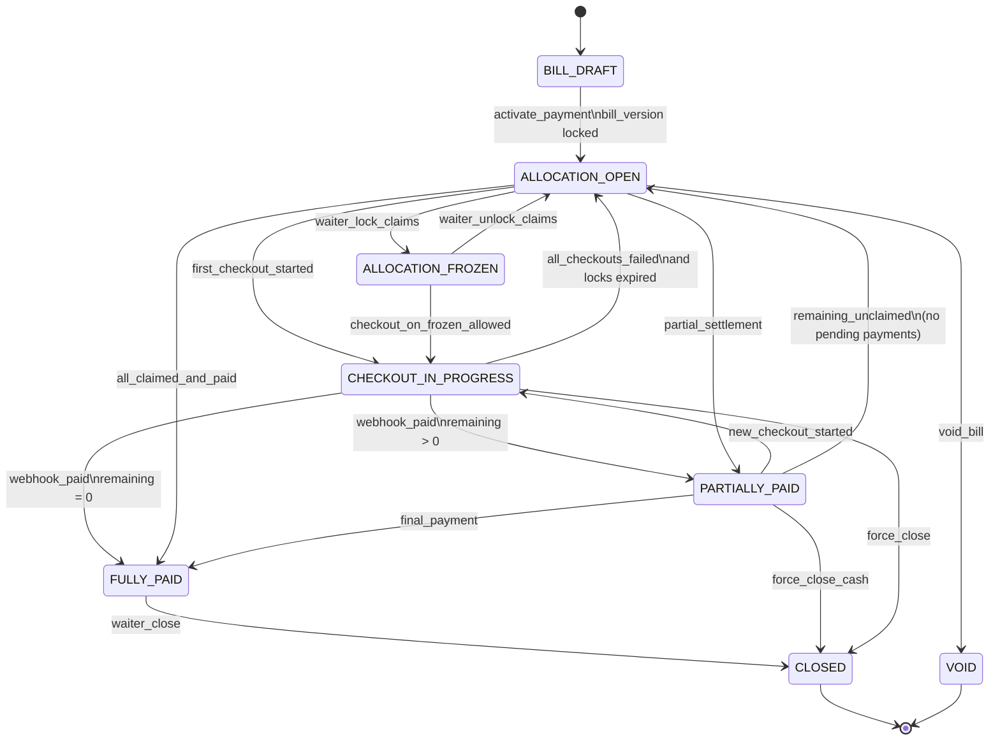
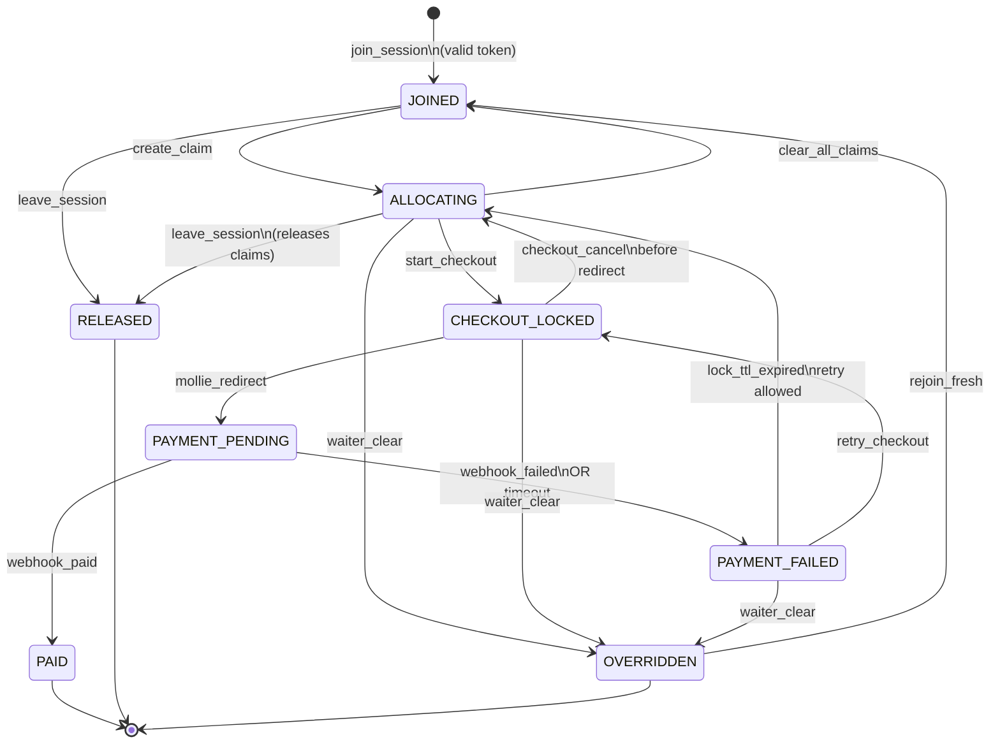
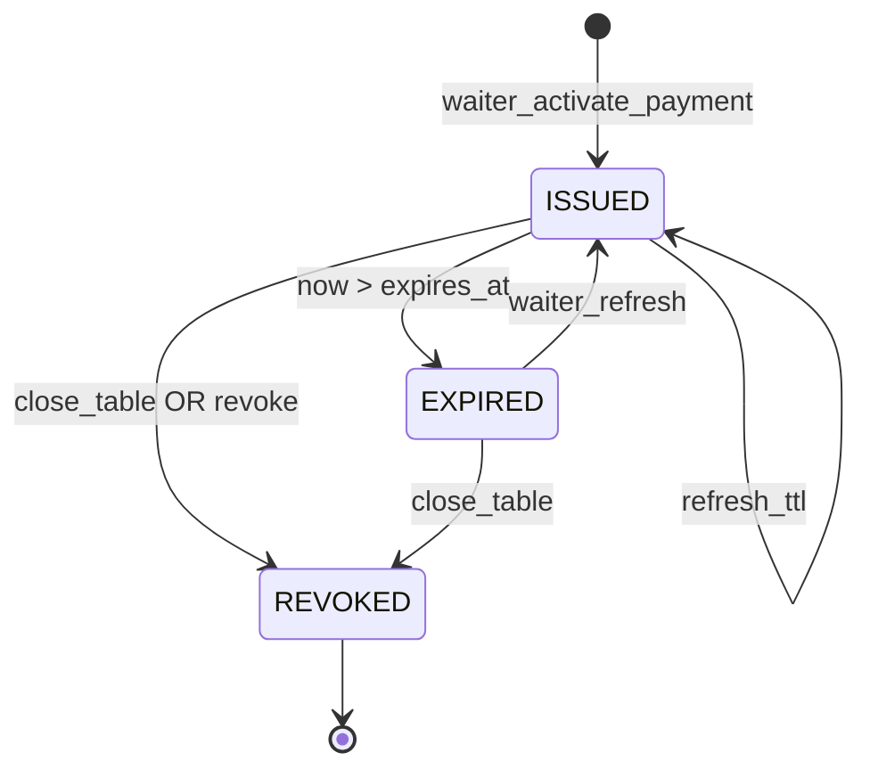

# Bill-Splitting State Machines

**Slice:** Part 5 — Bill-Splitting Logic  
**Upstream:** `TableSessionState`, `PaymentSessionToken`  
**Related:** [rules-spec.md](./rules-spec.md), [concurrency.md](./concurrency.md)

---

## 1. Overview

Three related state machines govern split-pay:

| Machine | Scope | Primary states |
|---------|-------|----------------|
| **A. Table session** | Venue table lifecycle | `EMPTY → SEATED → PAYMENT_ACTIVE → CLOSED` |
| **B. Table bill settlement** | Bill + allocation + payment progress | `BILL_DRAFT → … → CLOSED` |
| **C. Claimant** | Individual guest in payment session | `JOINED → … → PAID` |

Machines A and B run concurrently during service. B activates only when A enters `PAYMENT_ACTIVE`.

---

## 2. Machine A — TableSessionState (upstream summary)

Full definition lives in [mvp-roadmap.md](../../product/mvp-roadmap.md). Split-engine **entry point**:

```
TableSessionState = PAYMENT_ACTIVE
AND PaymentSessionToken.valid = true
AND TableBillSettlement.state NOT IN (CLOSED, VOID)
```

### 2.1 Diagram

```mermaid
stateDiagram-v2
    [*] --> EMPTY
    EMPTY --> SEATED : waiter_start_session
    SEATED --> PAYMENT_ACTIVE : waiter_activate_payment\n+ issue PaymentSessionToken\n+ lock bill v1
    PAYMENT_ACTIVE --> CLOSED : close_table\n(remaining=0 OR force_close)
    SEATED --> EMPTY : waiter_cancel_session
    PAYMENT_ACTIVE --> SEATED : revoke_payment\n(MVP: rare; clears token)
    CLOSED --> [*]
```



### 2.2 Events (split-engine relevant)

| Event | Trigger | Split-engine side effect |
|-------|---------|--------------------------|
| `waiter_activate_payment` | Staff UI | Create bill snapshot; `TableBillSettlement → ALLOCATION_OPEN`; issue token |
| `payment_session_refresh` | Staff UI | Extend `expires_at`; no allocation reset |
| `close_table` | Staff UI | `TableBillSettlement → CLOSED`; freeze audit |
| `revoke_payment` | Staff UI | `ALLOCATION_FROZEN`; revoke token |

---

## 3. Machine B — TableBillSettlement

Tracks bill allocation, checkout progress, and remaining balance **within** `PAYMENT_ACTIVE`.

### 3.1 States

| State | Description | Guest actions | Staff actions |
|-------|-------------|---------------|---------------|
| `BILL_DRAFT` | Lines editable; not visible to guests | — | Add/edit lines |
| `ALLOCATION_OPEN` | Claims allowed | Join, claim, checkout | Override, freeze |
| `ALLOCATION_FROZEN` | Claims paused | View only | Unlock, override |
| `CHECKOUT_IN_PROGRESS` | ≥1 Mollie payment pending | Complete payment | Mark cash, override |
| `PARTIALLY_PAID` | `0 < remaining < total` | Pay remainder | Force equal, close |
| `FULLY_PAID` | `remaining = 0` | View receipt | Close table |
| `CLOSED` | Terminal; audit immutable | Receipt only | Reopen N/A MVP |
| `VOID` | Bill cancelled pre-payment | — | Manager only |

**Note:** `BILL_DRAFT` overlaps `TableSessionState = SEATED`. Transition to `ALLOCATION_OPEN` is atomic with payment activation.

### 3.2 Diagram



### 3.3 State variables (persisted)

| Variable | Type | Updated when |
|----------|------|--------------|
| `bill_grand_total_cents` | int | Bill lock / version bump |
| `allocated_cents` | int | Allocation commit |
| `confirmed_paid_cents` | int | Mollie webhook `paid` |
| `remaining_cents` | int | `grand_total - confirmed_paid` |
| `unclaimed_cents` | int | Grand total minus sum allocated |
| `bill_version` | int | Bill edit override |
| `active_checkout_count` | int | Checkout start/complete |

### 3.4 Transition guards

| Transition | Guard |
|------------|-------|
| → `CHECKOUT_IN_PROGRESS` | ∃ claimant with `CheckoutIntent` and Mollie status `open/pending` |
| → `PARTIALLY_PAID` | `confirmed_paid_cents > 0` AND `remaining_cents > 0` |
| → `FULLY_PAID` | `remaining_cents = 0` |
| → `CLOSED` | `remaining_cents = 0` OR `force_close authorized` |
| → `ALLOCATION_OPEN` from `CHECKOUT_IN_PROGRESS` | All pending checkouts failed/expired AND no webhook in-flight |

### 3.5 Invariants

1. `confirmed_paid_cents ≤ bill_grand_total_cents` always.
2. `sum(allocations) ≤ bill_grand_total_cents` while not `CLOSED`.
3. `remaining_cents = bill_grand_total_cents - confirmed_paid_cents`.
4. Bill line edits after activation require `BUMP_BILL_VERSION`; unpaid allocations invalidated.

---

## 4. Machine C — ClaimantSession

One instance per guest device/session in the payment session.

### 4.1 States

| State | Description |
|-------|-------------|
| `JOINED` | In roster; no allocations |
| `ALLOCATING` | Has ≥1 draft or confirmed allocation; not in checkout |
| `CHECKOUT_LOCKED` | Allocations frozen for Mollie attempt |
| `PAYMENT_PENDING` | Mollie redirect in progress |
| `PAID` | Webhook confirmed payment |
| `PAYMENT_FAILED` | Failed/canceled; allocations releasable after TTL |
| `RELEASED` | Left session voluntarily or waiter removed |
| `OVERRIDDEN` | Allocations cleared by staff |

### 4.2 Diagram



### 4.3 Sub-state: allocation draft vs confirmed

Within `ALLOCATING`:

| Sub-state | Meaning |
|-----------|---------|
| `DRAFT` | Client editing; no lock |
| `COMMITTED` | Persisted; participates in remaining calc |
| `LOCKED_FOR_CHECKOUT` | Bound to `CheckoutIntent` |

Only `COMMITTED` and `LOCKED_FOR_CHECKOUT` count toward `allocated_cents`.

### 4.4 Claimant transition table

| From | Event | To | Side effects |
|------|-------|-----|--------------|
| `JOINED` | `create_claim` (success) | `ALLOCATING` | Write allocation |
| `ALLOCATING` | `start_checkout` | `CHECKOUT_LOCKED` | Create CheckoutIntent; 15m TTL |
| `CHECKOUT_LOCKED` | `mollie_open` | `PAYMENT_PENDING` | Store payment_id |
| `PAYMENT_PENDING` | `webhook_paid` | `PAID` | Increment `confirmed_paid_cents` |
| `PAYMENT_PENDING` | `webhook_failed` | `PAYMENT_FAILED` | Schedule lock release |
| `PAYMENT_FAILED` | `lock_expired` | `ALLOCATING` | Release checkout lock |
| `*` | `waiter_override_clear` | `OVERRIDDEN` | Audit staff_id |
| `ALLOCATING` | `leave_session` | `RELEASED` | Release units to pool |

### 4.5 Claimant invariants

1. `PAID` is terminal for the payment session (no new claims MVP).
2. One active `CheckoutIntent` per claimant at a time.
3. Tip is fixed at checkout lock; changing tip requires cancel checkout (before redirect).

---

## 5. Combined interaction (sequence)

Typical 4-guest happy path:

```
1. TableSession: SEATED → PAYMENT_ACTIVE
2. TableBillSettlement: BILL_DRAFT → ALLOCATION_OPEN
3. Guests A,B,C,D: JOINED → ALLOCATING (claims)
4. A: ALLOCATING → CHECKOUT_LOCKED → PAYMENT_PENDING → PAID
5. TableBillSettlement: → CHECKOUT_IN_PROGRESS → PARTIALLY_PAID
6. B,C,D pay similarly
7. TableBillSettlement: → FULLY_PAID
8. Waiter: TableSession → CLOSED, TableBillSettlement → CLOSED
```

---

## 6. PaymentSessionToken lifecycle (cross-cutting)



| Token state | Join allowed? | New claims? | In-flight Mollie? |
|-------------|---------------|-------------|-------------------|
| `ISSUED` | Yes | Yes | Yes |
| `EXPIRED` | Yes (view stale) | No | Yes (honor webhook) |
| `REVOKED` | No | No | Yes (honor webhook) |

---

## 7. Waiter override state effects

| Override | TableBillSettlement | Claimant(s) |
|----------|---------------------|-------------|
| `LOCK_CLAIMS` | → `ALLOCATION_FROZEN` | — |
| `REASSIGN_UNIT` | Stay current | Source → `OVERRIDDEN` or `ALLOCATING`; target → `ALLOCATING` |
| `BUMP_BILL_VERSION` | → `ALLOCATION_OPEN` | Unpaid → `OVERRIDDEN` |
| `FORCE_EQUAL_REMAINING` | Stay / → `ALLOCATION_OPEN` | Selected → `ALLOCATING` |
| `MARK_CASH_PAID` | May → `PARTIALLY_PAID` / `FULLY_PAID` | Target → `PAID` (method CASH) |

---

## 8. MVP vs post-MVP states

| Feature | MVP | Post-MVP |
|---------|-----|----------|
| `VOID` bill | Manager only, pre-payment | Automated POS void sync V2 |
| `REFUND_PENDING` bill state | Not implemented | V1.1 in-app refunds |
| `REOPEN` closed table | No | V1.1 ops tool |
| Claimant `PAID` → reclaim | Blocked | After refund V1.1 |

---

## 9. Implementation notes

- Persist state transitions in `bill_state_events` (append-only).
- UI derives display state from `(TableSessionState, TableBillSettlement, ClaimantSession)`.
- Webhook handler must be idempotent — duplicate `paid` must not double-count (see [concurrency.md](./concurrency.md)).

---

*Slice ownership: Part 5 — Bill-Splitting Logic.*
