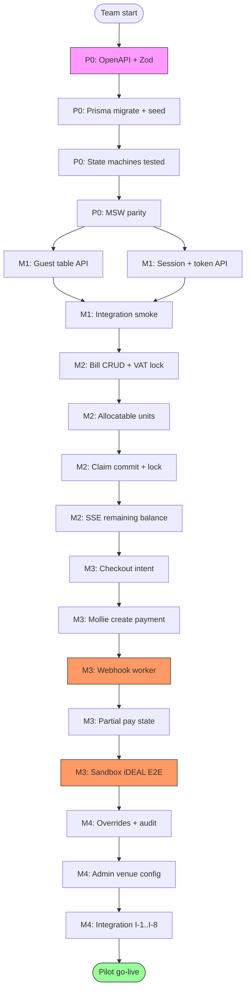
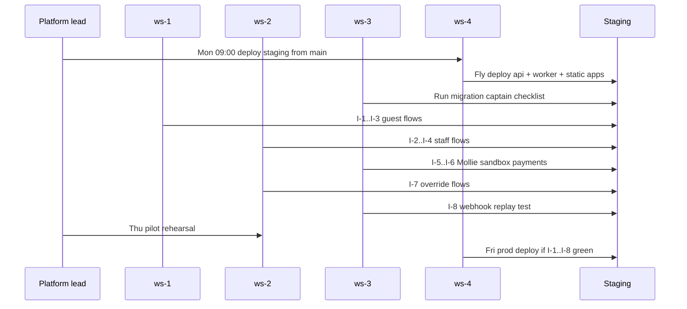

# Critical Path and Dependency Analysis

**Product:** Rekentafel  
**Slice:** Part 18 — Implementation Roadmap  
**Parent:** [implementation-roadmap.md](./implementation-roadmap.md)  
**Audience:** Platform lead, ws-3 backend lead, integration week coordinators

---

## 1. Executive summary

The **critical path** runs through ws-3 backend capabilities:

```
contracts → db migrate → session API → payment token → bill lock
  → allocatable units → claim commit → checkout intent → Mollie payment
  → webhook reconcile → remaining balance → table close
```

**Total critical path duration:** ~18 working days (Phase 0 Days 3–10 + M1–M3 core).  
**Float:** ws-1 and ws-2 each carry **3–5 days float** if MSW parity holds through M2.  
**Single biggest slip risk:** M3 webhook idempotency + Mollie sandbox E2E (2-day buffer allocated in M3 Thu–Fri).

Frontends are **off critical path** until integration windows, but **on gating path** for M4 pilot demo.

---

## 2. Critical path diagram



**Red-highlight nodes (M3C, M3E):** If either slips >1 day, pilot date slips — escalate daily.

---

## 3. Workstream dependency matrix

Legend: **P** = produces, **C** = consumes, **·** = no direct dependency

| Producer ↓ / Consumer → | ws-4 | ws-3 | ws-2 | ws-1 |
|-------------------------|------|------|------|------|
| **ws-4** ui-core, CI, infra | · | C | C | C |
| **ws-3** contracts, API, worker | · | · | C | C |
| **ws-2** staff-hooks | · | C | · | · |
| **ws-1** guest-hooks | · | C | · | · |

### 3.1 Package-level dependencies

| Package | Upstream | Downstream | Critical? |
|---------|----------|------------|-----------|
| `packages/config` | — | all apps | Yes (Day 1) |
| `packages/contracts` | — | api, hooks, fixtures | **Yes** |
| `packages/db` | contracts | api, worker | **Yes** |
| `packages/test-fixtures` | contracts | guest-web, staff-web | Yes (float for FE) |
| `packages/ui-core` | config | guest-web, staff-web, admin-web | Yes (Day 2–5) |
| `packages/guest-hooks` | contracts | guest-web | Medium |
| `packages/staff-hooks` | contracts | staff-web, admin-web | Medium |
| `apps/api` | db, contracts | all frontends | **Yes** |
| `apps/worker` | db, api modules | payment reconcile | **Yes (M3)** |

---

## 4. Blocker register

| ID | Blocker | First impacts | Owner | Resolution by | Status trigger |
|----|---------|---------------|-------|---------------|----------------|
| **B-01** | OpenAPI not frozen | M1 ws-1/ws-2 | ws-3 | P0 Day 5 | Any FE hand-written fetch URL |
| **B-02** | DB migration fails on staging | M1 | ws-3 | P0 Day 3 | CI migrate step red |
| **B-03** | ui-core <6 primitives | M1 ws-1/ws-2 | ws-4 | P0 Day 4 | FE blocked >4h |
| **B-04** | Payment token not issued on activate | M2 guest join | ws-3 | M1 Wed | Join flow 403 |
| **B-05** | Bill version not locked on payment open | M2 claims | ws-3 | M2 Mon | Claims against draft bill |
| **B-06** | Claim double-allocation | M2 demo | ws-3 | M2 Thu | Concurrency test fail |
| **B-07** | Mollie test org not provisioned | M3 | Ops + ws-3 | P0 Week 1 | No API key |
| **B-08** | Webhook not reaching staging | M3 E2E | ws-4 + ws-3 | M3 Mon | Zero webhook_events rows |
| **B-09** | Idempotency gap on webhook replay | M3 reconcile | ws-3 | M3 Tue | Duplicate payment credit |
| **B-10** | SSE disconnect on guest mobile | M2–M3 UX | ws-1 + ws-3 | M3 Wed | Stale remaining balance |
| **B-11** | Pilot Mollie **live** KYC incomplete | Pilot | Ops | M4 Wed | Cannot take real iDEAL |
| **B-12** | Contract breaking change mid-M4 | Integration | ws-3 | M4 Mon | CI diff-breaking fail |

### 4.1 Blocker escalation protocol

| Severity | Condition | Action |
|----------|-----------|--------|
| **S1** | Critical path slip >4h | Platform lead + ws-3 pair until resolved |
| **S2** | FE float exhausted (MSW ≠ API) | Pause FE features; ws-3 fixes contract same day |
| **S3** | Non-critical polish | Defer to post-pilot backlog |

---

## 5. Integration sequence (ordered)

Integration is **sequential by dependency**, even when sprints parallelize development.

### 5.1 Phase 0 integration sequence

| Step | Action | Gate |
|------|--------|------|
| I-P0-1 | ws-4: monorepo boots | `pnpm install` |
| I-P0-2 | ws-3: DB migrate + seed | Seed venue queryable |
| I-P0-3 | ws-3: API health + guest table route | curl 200 |
| I-P0-4 | ws-3: MSW fixtures match API contract tests | Snapshot pass |
| I-P0-5 | ws-1/ws-2: apps load with mock | Manual click-through |
| I-P0-6 | ws-1/ws-2: apps load against API | `VITE_API_MOCK=false` |
| I-P0-7 | Mollie webhook once | Row in `webhook_events` |

### 5.2 MVP integration sequence (cumulative)

| Step | Sprint | Flows | Surfaces |
|------|--------|-------|----------|
| I-1 | M1 Fri | Empty QR, call server | guest + staff |
| I-2 | M1 Fri | Start session, activate payment | staff + api |
| I-3 | M2 Wed | Enter bill, guest join, claim | all |
| I-4 | M2 Fri | 4-guest split scenario €126.40 | all |
| I-5 | M3 Tue | Checkout + sandbox iDEAL | guest + worker |
| I-6 | M3 Fri | Partial pay 2/4 guests | all |
| I-7 | M4 Tue | Override + force close | staff + audit |
| I-8 | M4 Wed | Admin QR + menu + webhook replay | admin + worker |
| I-9 | M4 Thu | Pilot rehearsal script | venue |
| I-10 | M4 Fri | Production deploy + smoke | ops |

**Rule:** Step *n* must pass before step *n+1* begins — no skipping ahead to "demo payments" without I-4.

### 5.3 M4 integration week flow diagram



---

## 6. Critical path timeline (working days)

| Day | Phase | Critical task | WS | Float consumers |
|-----|-------|---------------|-----|-----------------|
| 1–2 | P0 | Monorepo + OpenAPI scaffold | ws-4, ws-3 | — |
| 3 | P0 | Prisma migrate | ws-3 | ws-1/2 shells |
| 4 | P0 | State machines + split-engine | ws-3 | ui-core batch 2 |
| 6–7 | P0 | MSW + API stub parity | ws-3 | guest/staff UI polish |
| 8 | P0 | Auth + SSE/WS stubs | ws-3 | admin shell |
| 11 | M1 | Session + token API complete | ws-3 | guest/staff features |
| 12 | M1 | WebSocket signals | ws-3 | e2e setup |
| 16 | M2 | Bill lock + allocatable units | ws-3 | admin deferred |
| 17 | M2 | Claim commit + concurrency | ws-3 | tip UI prep |
| 18 | M2 | SSE remaining | ws-3 | trust banner copy |
| 21 | M3 | Mollie adapter | ws-3 | — |
| 22 | M3 | Webhook worker **(risk)** | ws-3 | — |
| 23 | M3 | Sandbox E2E **(risk)** | ws-3, ws-1 | — |
| 26 | M4 | Audit + overrides | ws-3, ws-2 | — |
| 28 | M4 | Integration I-1..I-8 | all | — |
| 30 | M4 | Pilot deploy | ws-4 | — |

**Total critical path:** 30 working days (6 weeks).  
**Available float on non-critical work:** ~8 person-days across ws-1/ws-2 (admin polish, PWA manifest, copy tweaks).

---

## 7. Merge order and collision avoidance

Daily merge window **16:00–18:00 CET** during M1–M4:

| Order | WS | Rationale |
|-------|-----|-----------|
| 1 | ws-4 | infra, CI fixes unblock others |
| 2 | ws-3 | contracts, db, api — consumers rebase after |
| 3 | ws-2 | staff-hooks regen if contracts changed |
| 4 | ws-1 | guest-hooks last |

**Serial queue (always ws-3 only):**

- `packages/db/prisma/migrations/*`
- `packages/contracts/openapi/*` (after P0 freeze: hotfix only)

**Forbidden parallel edits:**

| Path A | Path B | Why |
|--------|--------|-----|
| `packages/contracts` | `packages/guest-hooks` same PR | codegen race |
| `schema.prisma` | `modules/bill` logic same day without migration captain | broken local DB |
| `ui-core/Button` | `staff-web` duplicate Button | design drift |

---

## 8. External dependencies (non-code)

| Dependency | Lead time | Blocks | Mitigation |
|------------|-----------|--------|------------|
| Mollie test account | 1–3 days | M3 | Start P0 Day 1 |
| Mollie live KYC | 5–15 days | Pilot live money | Use sandbox for M4 demo; live by Week 7 |
| Pilot venue agreement | 1–2 weeks | M4 rehearsal | Parallel legal |
| Fly.io org + domains | 1 day | M4 deploy | ws-4 P0 Day 1 |
| GDPR DPA template | 1 week | Pilot | Manual ops Week 5 |

---

## 9. Payment rail critical path (Mollie vs crypto)

### 9.1 MVP — Mollie only (on critical path)

| Step | Component | Sprint |
|------|-----------|--------|
| 1 | Encrypt store Mollie API key per restaurant | M4 |
| 2 | OAuth optional — MVP uses API key paste | M4 |
| 3 | `POST /v2/payments` with metadata `{payment_intent_id, participant_id}` | M3 |
| 4 | Webhook verify + fetch payment | M3 |
| 5 | Idempotent `payments` insert | M3 |
| 6 | Update `confirmed_paid_cents`, emit SSE | M3 |
| 7 | Reconciliation admin view | M4 |

### 9.2 Post-MVP — Crypto (off critical path)

| Step | Component | Earliest |
|------|-----------|----------|
| 1 | Legal memo + licensed PSP selection | V2 |
| 2 | `crypto_checkout_intents` table | V2 |
| 3 | Partner webhook namespace | V2 |
| 4 | EUR settlement confirmation worker | V2 |

**MVP stub:** `POST /v1/guest/checkout/crypto` → `501 NOT_MVP`. No worker queue, no UI toggle.

---

## 10. Failure modes and recovery

| Failure | Detection | Recovery | Path impact |
|---------|-----------|----------|-------------|
| Contract breaking merge | CI `diff-breaking` | Revert; forward-fix with version bump | +0.5 day |
| Migration conflict | CI + local errors | Migration captain serializes | +1 day |
| Mollie webhook 500 | Alert + empty reconcile | Fix worker; replay from Mollie dashboard | +0.5 day |
| Double payment credit | Reconciliation audit | Manual adjustment script; fix idempotency | +1 day **critical** |
| Staging deploy fail | CI deploy job | Rollback Fly release | +0.25 day |
| Guest SSE storm | Redis CPU | Rate limit; backoff client | off critical path |

---

## 11. Go / no-go criteria (M4 Fri)

**GO** if all true:

- [ ] I-1 through I-8 pass on staging (recorded)
- [ ] Playwright pilot-happy-path green
- [ ] No open S1 blockers
- [ ] Audit export for sample session verified
- [ ] Pilot venue staff trained (≥2 waiters)
- [ ] Mollie sandbox **or** live keys confirmed for Week 7
- [ ] Rollback runbook tested once

**NO-GO** if any:

- Double-allocation reproduced in staging
- Webhook idempotency test fails
- Bill visible without payment token (security regression)
- Remaining balance incorrect after partial pay

**NO-GO action:** Delay pilot 1 week; narrow scope to staff-only rehearsal; no marketing.

---

## 12. Cross-reference index

| Topic | Document |
|-------|----------|
| Sprint tasks | [sprint-plan-mvp.md](./sprint-plan-mvp.md) |
| Phase 0 tasks | [sprint-plan-phase0.md](./sprint-plan-phase0.md) |
| Milestones | [implementation-roadmap.md](./implementation-roadmap.md) §5 |
| State machines | [state-machines.md](../domain/split-engine/state-machines.md) |
| Payment flow | [payment-architecture.md](../architecture/payments/payment-architecture.md) |
| MVP scope | [scope-boundary.md](../product/scope-boundary.md) |

---

*Slice: Part 18 — Critical path. Owner: engineering roadmap slice.*
