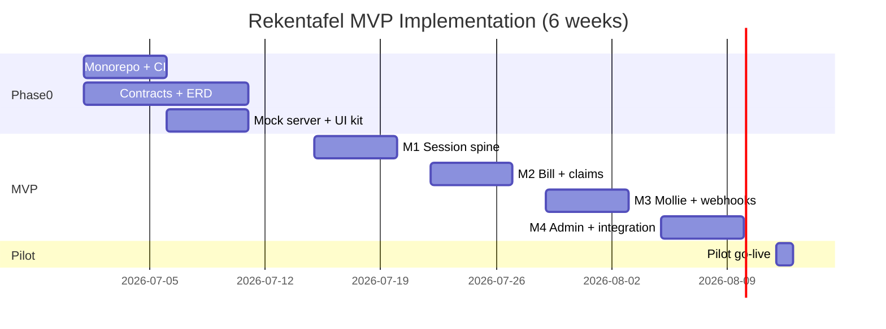
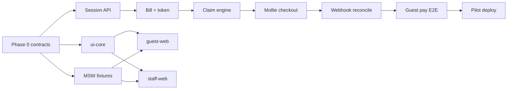

# PART 18 — Implementation Roadmap

**Product (working name):** Rekentafel  
**Slice:** Architecture Sprint and MVP Roadmap  
**Status:** Blueprint — execution-ready  
**Last updated:** 2026-06-26  
**Team:** 4 developers × 4 Cursor workstreams (`ws-1` … `ws-4`)  
**Cross-references:** [sprint-plan-phase0.md](./sprint-plan-phase0.md), [sprint-plan-mvp.md](./sprint-plan-mvp.md), [critical-path.md](./critical-path.md), [repo-structure.md](./repo-structure.md), [mvp-roadmap.md](../product/mvp-roadmap.md), [scope-boundary.md](../product/scope-boundary.md)

---

## 1. Executive summary

Rekentafel reaches **pilot-deployable** in **6 calendar weeks**: **2 weeks Phase 0** (contracts, ERD, state machines, mock server) + **4 weeks MVP sprints** (parallel workstreams with disjoint file ownership) + **3-day integration window** embedded in MVP Week 4. No crypto, loyalty wallet, discovery, POS sync, or native apps ship in this window.

| Phase | Duration | Outcome |
|-------|----------|---------|
| **Phase 0** | Weeks 1–2 | Frozen contracts, ERD migrations v0, state machines in code, MSW mock server, monorepo bootstrapped |
| **MVP M1** | Week 3 | Empty-table QR + staff session spine end-to-end against mock, then real API |
| **MVP M2** | Week 4 | Bill entry + claim engine + guest split UI |
| **MVP M3** | Week 5 | Mollie checkout + webhooks + partial pay |
| **MVP M4 + Integration** | Week 6 | Admin, audit, overrides, full pilot E2E, Fly deploy |
| **Pilot start** | Week 7 | Single NL venue live; 8-week PMF measurement window begins |

**Weak assumption challenged:** A 4-week MVP is only viable if Phase 0 produces **mergeable contracts and a working mock server** — not slide decks. Frontends that build against hand-written fetch URLs will miss the 6-week date. Contract-first + MSW-from-Zod is non-negotiable.

---

## 2. Workstream map (ws-1–ws-4)

| WS | Owner role | Primary packages | Merge priority | MVP responsibility |
|----|------------|------------------|----------------|-------------------|
| **ws-4** | Design / DevOps | `packages/ui-core`, `packages/config`, `infra/`, `.github/` | 0 (foundation) | Monorepo scaffold, CI, design tokens, deploy |
| **ws-3** | Backend / Payments | `apps/api`, `apps/worker`, `packages/contracts`, `packages/db`, `packages/test-fixtures` | 1–2 | Sessions, bill, claims, Mollie, webhooks, split-engine |
| **ws-2** | Staff / Admin | `apps/staff-web`, `apps/admin-web`, `packages/staff-hooks` | 3 | Floor console, bill entry, overrides, venue admin |
| **ws-1** | Guest | `apps/guest-web`, `packages/guest-hooks` | 4 (last) | QR landing, payment session join, claim/split/pay UX |

**Parallel rule:** No two workstreams edit the same path in the same sprint slice. See [repo-structure.md](./repo-structure.md) §6.

---

## 3. Phase 0 — Architecture sprint (Weeks 1–2)

**Goal:** Eliminate integration ambiguity before feature sprints. Every frontend dev runs against **MSW handlers generated from the same Zod schemas** the API will validate.

### 3.1 Phase 0 deliverables

| # | Deliverable | Owner | Verifiable artifact |
|---|-------------|-------|---------------------|
| P0-1 | Monorepo scaffold (pnpm + Turborepo + Docker Compose) | ws-4 | `pnpm install && docker compose up` succeeds; CI green on empty apps |
| P0-2 | OpenAPI v1 draft (`packages/contracts/openapi/rekentafel.v1.yaml`) | ws-3 | Spectral lint pass; guest + staff + admin route stubs documented |
| P0-3 | ERD → Prisma schema v0 (`packages/db`) | ws-3 | Migration applies; seed creates pilot venue (20 tables, sample menu) |
| P0-4 | State machines frozen in TS + tests | ws-3 | Unit tests pass for `TableSessionState`, `TableBillSettlement`, `Claimant` transitions per [state-machines.md](../domain/split-engine/state-machines.md) |
| P0-5 | Split-engine pure module + numeric fixtures | ws-3 | All 6 worked examples from [worked-examples.md](../domain/split-engine/worked-examples.md) pass |
| P0-6 | MSW mock server (`packages/test-fixtures`) | ws-3 | ws-1/ws-2 apps load with `VITE_API_MOCK=true`; happy-path flows A–D navigable |
| P0-7 | UI primitives v0 (12 components + `MoneyDisplay`) | ws-4 | Storybook published locally; ws-1/ws-2 import `@rekentafel/ui-core` |
| P0-8 | Guest + staff app shells (routers, providers, MSW gate) | ws-1, ws-2 | Apps boot; routes match [screen-inventory.md](../surfaces/screen-inventory.md) |
| P0-9 | Auth/session contract doc alignment | ws-3 | Guest ephemeral token + staff JWT flows match [auth-and-sessions.md](../architecture/api/auth-and-sessions.md) |
| P0-10 | Mollie sandbox wiring plan + webhook tunnel | ws-3 + ws-4 | Test payment `tr_test_*` created manually; webhook received at local API |

**Detail:** [sprint-plan-phase0.md](./sprint-plan-phase0.md)

### 3.2 Phase 0 exit gate (all required)

- [ ] OpenAPI diff CI job blocks breaking changes without version bump
- [ ] `pnpm generate:hooks` produces typed clients for ws-1 and ws-2
- [ ] Split-engine concurrency test: 50 parallel claim attempts → zero double-allocation
- [ ] Mock server covers: empty-table scan, call-server, start session, activate payment (bill hidden until token)
- [ ] Platform lead signs state machine doc ↔ code parity checklist

---

## 4. MVP sprints (Weeks 3–6)

Four one-week sprints with **disjoint slice ownership**. Each slice ends with a **demo artifact** (recorded walkthrough or Playwright trace), not merely merged PRs.

| Sprint | Theme | Demo checkpoint (Friday) |
|--------|-------|------------------------|
| **M1** | Identity spine: QR → session → staff floor | Pilot QR resolves; waiter opens seated session; call-server signal appears on staff grid |
| **M2** | Bill + claims: manual entry → guest allocation | Waiter enters €126.40 bill; 2 guests claim items concurrently; remaining balance correct |
| **M3** | Payments: Mollie + webhooks + partial pay | Guest A pays €21.50 iDEAL (sandbox); Guest B pays later; table shows partial then full |
| **M4** | Admin + overrides + audit + pilot deploy | Manager overrides disputed claim; audit JSON export; production preview URL for pilot venue |

**Detail:** [sprint-plan-mvp.md](./sprint-plan-mvp.md)

### 4.1 MVP scope boundary (in vs out)

| In MVP (Weeks 3–6) | Explicitly out |
|--------------------|----------------|
| Persistent table QR → menu + table context | Crypto checkout UI or API |
| Waiter session + payment mode + session token | Stored-value wallet / overpay credit |
| Manual bill entry + CSV import | POS bi-directional sync |
| Item / equal / custom / shared splits | Full QR phone ordering |
| Per-guest tip + Mollie hosted checkout | Guest accounts required |
| Partial payments + remaining balance | Discovery feed, ML recommendations |
| Waiter override + table close | Native iOS/Android apps |
| Restaurant admin (tables, menu, staff, Mollie key) | Coalition partner marketplace |
| Webhook reconciliation + audit log | Automated chargeback automation |

Source: [scope-boundary.md](../product/scope-boundary.md), [mvp-roadmap.md](../product/mvp-roadmap.md).

---

## 5. Milestone plan

### 5.1 Milestone timeline

*Dates illustrative — anchor to team start date.*

### 5.2 Milestone definitions

| ID | Name | Target | Success criteria | Demo artifact |
|----|------|--------|------------------|---------------|
| **M0** | Architecture complete | End Week 2 | Phase 0 exit gate green | 5-min Loom: mock E2E empty-table → payment token issued (mock Mollie) |
| **M1** | Session spine live | End Week 3 | Real API; QR → seated session; signal on staff WS | Playwright: `empty-table.spec.ts` + `call-server.spec.ts` green |
| **M2** | Split without pay | End Week 4 | Bill locked; 4-guest claim scenario; VAT lines visible | Screen recording: Table 12 €126.40 example from mvp-roadmap |
| **M3** | Money moves | End Week 5 | Sandbox iDEAL paid; webhook idempotent; partial balance | Ops dashboard: payment ID → claim snapshot link |
| **M4** | Pilot ready | End Week 6 | Fly deploy; pilot venue seeded; override + audit | Pilot checklist signed; `pilot-go-live-runbook.md` executed |
| **M5** | PMF signal | Week 14 (pilot +8w) | ≥70% eligible tables use split-pay; ≤8% overrides | [pilot-scorecard.md](../gtm/pilot-scorecard.md) |

### 5.3 Quantitative pilot targets (post-M4)

Carried from [mvp-roadmap.md](../product/mvp-roadmap.md) — measured during 8-week pilot, not in build phase:

| Metric | Target |
|--------|--------|
| Tables using payment mode (bill >€30) | ≥40% |
| Split-pay completion rate | ≥85% |
| Median payment-mode → close | ≤12 min |
| Claim dispute (waiter override) rate | ≤8% |
| Payment failure retry success | ≥90% |

---

## 6. Dependency graph and critical path

**Critical path:** `contracts → db schema → session API → payment token → bill lock → claim engine → Mollie adapter → webhook worker → guest checkout E2E`

Frontends are off critical path until M1 integration if MSW parity holds. **Mollie webhook idempotency** is the highest-risk single item on path.

Full analysis: [critical-path.md](./critical-path.md)

---

## 7. Integration week protocol

Integration is **not** a single surprise week — it is a **rhythm**:

| When | Activity | Owner |
|------|----------|-------|
| **Every sprint Friday** | 2-hour cross-ws demo + contract changelog review | Platform lead |
| **M2 Wednesday** | First `VITE_API_MOCK=false` smoke on shared staging | ws-1 + ws-3 pair |
| **M3 Monday–Wednesday** | Mollie sandbox E2E mandatory; webhook replay tests | ws-3 |
| **M4 Monday–Wednesday** | **Full integration window** — all apps on real API + worker | All |
| **M4 Thursday** | Pilot rehearsal at venue (or staging with waiter script) | ws-2 + platform lead |
| **M4 Friday** | Go/no-go against M4 checklist | Platform lead |

### 7.1 Integration week checklist (M4 Mon–Wed)

**Environment**

- [ ] Staging on Fly.io `ams` region; Postgres + Redis provisioned
- [ ] Mollie **test** API keys for pilot restaurant org
- [ ] Webhook URL `https://api-staging.rekentafel.nl/v1/webhooks/mollie` verified
- [ ] All apps point to staging; `VITE_API_MOCK=false`

**Cross-surface flows (must pass in order)**

| # | Flow | Surfaces | Artifact |
|---|------|----------|----------|
| I-1 | Empty QR → menu → call server | guest + staff WS | Playwright trace |
| I-2 | Waiter start session → enter bill → activate payment | staff + api | Session token in response |
| I-3 | Guest join → claim → tip → Mollie sandbox pay | guest + api + worker | `tr_*` paid; remaining updated |
| I-4 | Partial pay (2 of 4 guests) | guest × 2 | Remaining bar = €X.XX |
| I-5 | Waiter override conflicting claim | staff + api | Audit entry `claim_override` |
| I-6 | Force close with cash remainder | staff | Table `CLOSED`; audit frozen |
| I-7 | Admin: table QR PDF + menu edit | admin | New QR resolves within 60s |
| I-8 | Webhook replay (same `tr_*` twice) | worker | Single `payments` row; no double credit |

**Merge protocol during integration**

1. **Freeze** `packages/contracts` except P0 bugfix — ws-3 only, platform lead approval
2. **Migration captain** (ws-3 designated engineer) serializes all DB migrations
3. Merge order daily: ws-4 → ws-3 → ws-2 → ws-1
4. **No cross-ws file edits** — violations revert same day
5. Nightly staging deploy from `main`; failed deploy blocks next-day merges

**Rollback**

- API/worker: Fly release rollback to previous image
- DB: forward-only migrations; feature flags disable broken routes
- Guest/staff: static assets versioned; instant rollback via CDN

---

## 8. Payment architecture in MVP roadmap

### 8.1 Mollie (MVP — in scope)

| Component | Sprint | Owner |
|-----------|--------|-------|
| Restaurant Mollie API key storage (encrypted) | M4 | ws-3 |
| `POST /checkout` → Mollie Payment create | M3 | ws-3 |
| Hosted checkout redirect + return URL | M3 | ws-1 + ws-3 |
| Webhook ingress + BullMQ reconcile job | M3 | ws-3 |
| Idempotency on `tr_*` | M3 | ws-3 |
| Partial pay aggregation (app layer) | M3 | ws-3 |
| Ops reconciliation view (payment → claim) | M4 | ws-2 admin routes |

**MVP legal posture:** Platform is SaaS; funds settle to **restaurant Mollie org**. No platform-held guest balances. See [payment-architecture.md](../architecture/payments/payment-architecture.md).

### 8.2 Crypto (post-MVP — explicit stub only)

| Component | MVP behavior | V2+ |
|-----------|--------------|-----|
| `POST /checkout/crypto` | **404 or 501 `NOT_MVP`** | Licensed PSP integration |
| UI crypto toggle | **Not rendered** | Opt-in per venue after legal memo |
| Webhook namespace | Not registered | Separate `crypto_*` tables |

See [crypto-rail-design.md](../architecture/payments/crypto-rail-design.md). **Do not scaffold** `contracts/crypto/` folders in Phase 0.

---

## 9. State machines — implementation ownership

State machines from [state-machines.md](../domain/split-engine/state-machines.md) land in Phase 0 as **tested pure functions**; HTTP transitions ship across M1–M3.

| Machine | Phase 0 | MVP implementation |
|---------|---------|-------------------|
| **A. TableSessionState** | Unit tests + enum | M1: `session` module |
| **B. TableBillSettlement** | Unit tests + guards | M2: `bill` + `claim` modules |
| **C. Claimant** | Unit tests | M2: `claim` module |
| **CheckoutIntent / payment_intent** | Schema + tests | M3: `payment` + `worker` |

**Security invariant (all sprints):** QR scan in `EMPTY` or `SEATED` never returns bill lines. Enforced by API integration test in every CI run.

---

## 10. Risk register (roadmap-specific)

| Risk | Phase | Likelihood | Impact | Mitigation |
|------|-------|------------|--------|------------|
| Contract drift (MSW ≠ API) | P0–M2 | High | Integration slip | Zod-shared fixtures; contract snapshot CI |
| Mollie webhook delay > guest redirect | M3 | Medium | Double checkout attempts | Return URL polls once; SSE pushes paid state; 15-min claim lock |
| Concurrent claim double-allocation | M2 | Medium | Financial dispute | `SELECT FOR UPDATE` + optimistic version; load test in M2 |
| VAT rounding on splits | M2 | Medium | Merchant compliance | Per-guest rounding rule in split-engine; explicit in UI |
| Waiter skips payment activation training | M4 | High | Guest confusion | Single primary CTA; 60s in-app tutorial; pilot rehearsal |
| PSD2/EMI scope creep | All | Low | Regulatory block | No stored value; tips pass-through only |
| Bill hijacking (remote QR join) | M2 | Medium | Fraud | Waiter unlock only MVP; audit join IP; V1.1 geo |
| ws-4 ui-core bottleneck | M1 | Medium | Frontend slip | 48h app-local wrapper allowance |
| 4-week MVP too aggressive without P0 | P0 | High | Pilot miss | **Hard gate:** no M1 start until M0 checklist green |
| Pilot venue Mollie KYC delay | M4 | Medium | No live pay | Start Mollie onboarding Week 1 parallel track (ops) |

---

## 11. Post-MVP roadmap pointer (not in 6-week build)

| Phase | Theme | Earliest start |
|-------|-------|----------------|
| **V1.1** | CSV/POS read-only import, guest accounts, payout reporting, geo gate | After M5 PMF gate |
| **V2** | Mollie Connect platform fees, venue loyalty, optional crypto eval | 25+ venues or explicit legal go |
| **Never** | Coalition marketplace, discovery, gamified overpay, bi-directional POS | See [scope-boundary.md](../product/scope-boundary.md) |

---

## 12. Document index

| File | Contents |
|------|----------|
| [sprint-plan-phase0.md](./sprint-plan-phase0.md) | Week 1–2 day-by-day tasks, owners |
| [sprint-plan-mvp.md](./sprint-plan-mvp.md) | M1–M4 slices, exit criteria, demo artifacts |
| [critical-path.md](./critical-path.md) | Blockers, dependency matrix, integration sequence |
| [repo-structure.md](./repo-structure.md) | Folder ownership, CODEOWNERS |
| [../product/mvp-roadmap.md](../product/mvp-roadmap.md) | Feature tags MVP/V1.1/V2/Never |
| [../architecture/payments/payment-architecture.md](../architecture/payments/payment-architecture.md) | Mollie orchestration |
| [../domain/split-engine/state-machines.md](../domain/split-engine/state-machines.md) | Bill/split state machines |

---

*Slice ownership: Part 18 — Implementation Roadmap. Files owned exclusively by this slice: `docs/engineering/implementation-roadmap.md`, `docs/engineering/sprint-plan-phase0.md`, `docs/engineering/sprint-plan-mvp.md`, `docs/engineering/critical-path.md`.*
