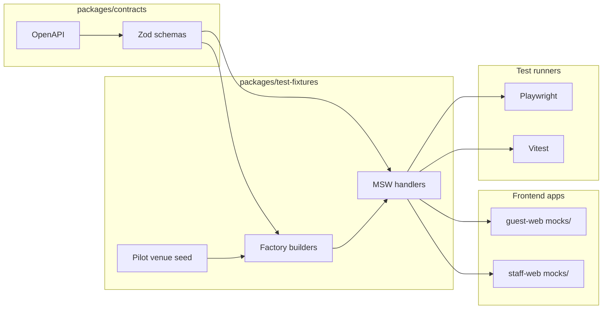

# PART 17D — API Mocking Strategy (MSW)

**Product (working name):** Rekentafel  
**Goal:** Enable ws-1 and ws-2 to ship UI in parallel with ws-3 API before integration week  
**Stack:** MSW 2.x (browser `setupWorker` + Node `setupServer` for tests)  
**Last updated:** 2026-06-26

---

## 1. Executive summary

Until **integration week** (week 7), guest and staff apps run against **MSW handlers** backed by **Zod schemas from `packages/contracts`** and **fixture factories from `packages/test-fixtures`**. This prevents mock drift — the primary failure mode of parallel monorepo development.

| Phase | Guest app | Staff app | API |
|-------|-----------|-----------|-----|
| Weeks 1–6 | MSW ON (default) | MSW ON (default) | ws-3 local + integration tests |
| Integration week | MSW OFF | MSW OFF | Staging API required |
| Pilot | MSW OFF | MSW OFF | Production API |

**Challenge to weak assumption:** "Frontend can mock ad-hoc with fetch stubs per component." **Rejected.** Ad-hoc mocks diverge from OpenAPI within days; MSW handlers are **owned artifacts** versioned with contracts.

---

## 2. Architecture



---

## 3. Package layout: `packages/test-fixtures/`

```
packages/test-fixtures/
├── package.json
├── src/
│   ├── index.ts
│   ├── seed/
│   │   ├── pilot-venue.ts              # de-rekentafel-ams, 20 tables
│   │   ├── menu.ts
│   │   └── bill-table-12.ts            # €126.40 worked example
│   ├── factories/
│   │   ├── restaurant.factory.ts
│   │   ├── table.factory.ts
│   │   ├── dining-session.factory.ts
│   │   ├── payment-session.factory.ts
│   │   ├── bill.factory.ts
│   │   ├── allocation.factory.ts
│   │   └── payment.factory.ts
│   ├── handlers/
│   │   ├── index.ts                    # export allHandlers
│   │   ├── guest/
│   │   │   ├── resolve-qr.ts           # GET /t/{slug}/{code}
│   │   │   ├── service-signals.ts
│   │   │   ├── payment-join.ts
│   │   │   ├── claims.ts
│   │   │   ├── checkout.ts
│   │   │   └── sse-bill-events.ts
│   │   ├── staff/
│   │   │   ├── auth.ts
│   │   │   ├── floor.ts
│   │   │   ├── dining-sessions.ts
│   │   │   ├── bills.ts
│   │   │   ├── payment-sessions.ts
│   │   │   └── overrides.ts
│   │   ├── admin/
│   │   │   ├── tables.ts
│   │   │   ├── menu.ts
│   │   │   └── mollie-connect.ts
│   │   └── shared/
│   │       └── problem-json.ts         # 404, 409, 422 templates
│   ├── state/
│   │   ├── in-memory-db.ts             # mutable session for multi-step flows
│   │   └── claim-lock.ts               # simulates 409 conflict
│   └── websocket/
│       └── staff-floor.mock.ts         # WS message replay
└── tests/
    └── handlers-contract.test.ts       # responses parse via Zod
```

**Owner:** ws-3 writes handlers when contracts change. ws-1/ws-2 may open PRs against `test-fixtures` only with ws-3 review.

---

## 4. MSW bootstrap per app

### 4.1 Guest web (`apps/guest-web/src/mocks/browser.ts`)

```typescript
import { setupWorker } from "msw/browser";
import { guestHandlers } from "@rekentafel/test-fixtures/handlers/guest";

export const worker = setupWorker(...guestHandlers);

export async function enableMocks() {
  if (import.meta.env.VITE_API_MOCK !== "true") return;
  await worker.start({ onUnhandledRequest: "error" });
}
```

```typescript
// apps/guest-web/src/main.tsx
import { enableMocks } from "./mocks/browser";

await enableMocks();
// ... render app
```

### 4.2 Staff web — same pattern with `staffHandlers` + WebSocket mock

### 4.3 Environment variables

| Variable | Default (weeks 1–6) | Integration week |
|----------|---------------------|------------------|
| `VITE_API_MOCK` | `true` | `false` |
| `VITE_API_BASE_URL` | ignored when mock | `https://staging-api.rekentafel.nl/v1` |
| `VITE_MSW_DELAY_MS` | `0` (CI), `150` (local optional) | — |

**ws-4 owns `.env.example` keys; ws-3 documents API URL semantics.**

---

## 5. Handler authoring rules

### 5.1 Schema-first responses

Every handler **must** validate response body against Zod before return:

```typescript
import { TableLandingResponseSchema } from "@rekentafel/contracts/schemas/guest";
import { http, HttpResponse } from "msw";

export const resolveQrHandler = http.get(
  "/v1/t/:slug/:tableCode",
  ({ params }) => {
    const body = buildTableLanding(params.slug, params.tableCode);
    return HttpResponse.json(TableLandingResponseSchema.parse(body));
  }
);
```

**CI test:** `handlers-contract.test.ts` calls each handler; parse failures fail build.

### 5.2 Stateful flows (in-memory-db)

Multi-step guest split-pay uses mutable store:

| Step | Handler | State mutation |
|------|---------|----------------|
| Join session | `POST .../join` | Add `participant` |
| Claim item | `POST .../claims` | Create `allocation`; bump `bill_version` |
| Concurrent claim | same | Second request → 409 if unit taken |
| Checkout | `POST .../checkout-intents` | Create intent; return Mollie URL stub |
| Pay success | test helper `simulateWebhook()` | Mark payment; reduce `remaining_cents` |

**Reset:** Each Playwright test calls `resetInMemoryDb()` in `beforeEach`.

### 5.3 Error scenarios (required handlers)

| Scenario | Status | Guest/staff test |
|----------|--------|------------------|
| Table not found | 404 | Landing error state |
| Payment session expired | 410 | Join gate message |
| Claim conflict | 409 | Conflict modal + refresh |
| Bill version stale | 409 | Optimistic UI rollback |
| Mollie create failure | 502 | Retry CTA |
| Invalid join PIN | 401 | Shake animation on PIN |
| Staff unauthorized | 403 | Redirect login |

---

## 6. Mock fidelity tiers

Not every endpoint needs full business logic in MSW — tiered fidelity keeps ws-3 velocity:

| Tier | Name | Behavior | Example |
|------|------|----------|---------|
| **T0** | Static | Fixed JSON file | Health check |
| **T1** | Schema-valid random | Factory output | Menu list |
| **T2** | Stateful CRUD | in-memory-db | Bill line add/remove |
| **T3** | Rules-engine subset | VAT + allocation math | Claim + split preview |
| **T4** | Parity | Same code path as API | **Integration week only — real API** |

### 6.1 MVP endpoint fidelity map

| Endpoint | Tier | Owner ships by week |
|----------|------|---------------------|
| `GET /t/{slug}/{code}` | T2 | 2 |
| `POST /service-signals` | T1 | 2 |
| `POST /payment-sessions/join` | T2 | 3 |
| `GET /payment-sessions/{id}` | T2 | 3 |
| `POST /claims` | T3 | 4 |
| `POST /checkout-intents` | T2 | 5 |
| `GET /payment-sessions/{id}/events` (SSE) | T2 | 5 |
| Staff `POST /bills` | T2 | 4 |
| Staff `POST /payment-sessions/activate` | T2 | 5 |
| Staff WebSocket floor | T1 | 3 |
| Admin menu CRUD | T1 | 4 |
| Mollie webhook | N/A — ws-3 integration tests only | 6 |

**T3 claim math:** Import **pure functions** from `@rekentafel/api/domain/split-engine` exported via subpath in `package.json` — OR duplicate minimal calc in test-fixtures with **shared numeric tests** from [worked-examples.md](../domain/split-engine/worked-examples.md). Preferred: export split-engine pure module as `@rekentafel/split-engine` internal package (ws-3 week 4).

---

## 7. Worked example: Table 12 mock session

**Seed:** [mvp-roadmap.md](../product/mvp-roadmap.md) — €126.40 bill, 4 guests.

### 7.1 Factory setup

```typescript
// packages/test-fixtures/src/seed/bill-table-12.ts
export const TABLE_12_BILL = {
  bill_id: "bill_t12_001",
  dining_session_id: "ds_t12_001",
  lines: [
    { sku: "burger", qty: 2, unit_cents: 1450, vat_rate_bps: 900 },
    { sku: "steak", qty: 1, unit_cents: 2800, vat_rate_bps: 900 },
    { sku: "wine", qty: 1, unit_cents: 3200, vat_rate_bps: 2100 },
    { sku: "cola", qty: 2, unit_cents: 350, vat_rate_bps: 900 },
  ],
  service_charge_bps: 1000,
  total_cents: 10560,
};
```

### 7.2 Scenario handlers

| Guest action | Mock response | Remaining |
|--------------|---------------|-----------|
| Guest A claims 1 burger + 1 cola | `amount_cents: 1800` + VAT | €87.60 |
| Guest B claims steak + half wine | shared split | €45.60 |
| Guest C+D equal split remainder | auto-calc | €0.00 |

Playwright test `guest-split-table-12.spec.ts` asserts MoneyDisplay shows **€0,00** remaining.

---

## 8. SSE and WebSocket mocking

### 8.1 Guest SSE (`sse-bill-events.ts`)

MSW 2 supports SSE via `HttpResponse` stream:

```typescript
// Simplified — emit claim.created then payment.succeeded
export const billEventsSse = http.get(
  "/v1/payment-sessions/:id/events",
  async ({ params }) => {
    const stream = new ReadableStream({
      start(controller) {
        controller.enqueue(formatSse("claim.created", { ... }));
        // on simulatePayment(): enqueue payment.succeeded
      },
    });
    return new HttpResponse(stream, {
      headers: { "Content-Type": "text/event-stream" },
    });
  }
);
```

**Test utility:** `emitBillEvent(paymentSessionId, event)` for Playwright.

### 8.2 Staff WebSocket

Use `@mswjs/interceptors` WebSocket or **mock socket client** injected in staff app:

```typescript
// staff-web/src/features/websocket-desk/mock-socket.ts
if (import.meta.env.VITE_API_MOCK === "true") {
  export const floorSocket = new MockFloorSocket(staffFloorFixtures);
}
```

ws-2 owns mock socket; message shapes from `contracts/src/events/*`.

---

## 9. Mollie mocking

**Never call real Mollie from frontend mocks.**

| Step | Mock behavior |
|------|---------------|
| `POST /checkout-intents` | Return `{ checkout_url: "https://mock.mollie.test/pay/tr_xxx" }` |
| Guest redirect page | `apps/guest-web/src/routes/pay/result` reads `?checkout_intent_id=` |
| Simulate success | Test button in dev toolbar OR Playwright calls `simulateMollieWebhook(tr_xxx)` |

**ws-3 integration tests** (Node `msw/node` or wiremock) hit real Mollie test API — separate from frontend MSW.

### 9.1 Mollie webhook fixture

```typescript
// packages/test-fixtures/src/handlers/webhooks/mollie-paid.ts
export const molliePaidPayload = {
  id: "tr_mock_001",
  status: "paid",
  amount: { value: "21.50", currency: "EUR" },
  metadata: { checkout_intent_id: "ci_001", participant_id: "part_001" },
};
```

---

## 10. Codegen integration

When ws-3 merges contract changes:

```bash
# Root script — ws-4 maintains in turbo.json
pnpm generate:hooks    # openapi-typescript → guest-hooks, staff-hooks
pnpm generate:handlers # optional: stub handler from OpenAPI operation (future)
pnpm --filter test-fixtures test  # contract parse tests
```

**Handler stub generator (V1.1):** OperationId → empty MSW handler returning 501 — reminds ws-3 to implement mock.

---

## 11. Testing pyramid with MSW

| Layer | Tool | MSW mode |
|-------|------|----------|
| ui-core unit | Vitest + Testing Library | No MSW |
| Guest component | Vitest | `setupServer` subset |
| Guest E2E | Playwright | Browser worker |
| API unit | Vitest | No MSW — direct service calls |
| API contract | Vitest + supertest | Optional recorded fixtures |
| Split engine | Vitest | No MSW — pure functions |

---

## 12. Integration week cutover checklist

| # | Task | Owner |
|---|------|-------|
| 1 | All handlers pass `handlers-contract.test.ts` on `main` | ws-3 |
| 2 | Document every T3 endpoint vs staging diff | ws-3 |
| 3 | Set `VITE_API_MOCK=false` in preview/staging env | ws-4 |
| 4 | Run Playwright against staging — tag `@integration` | ws-1 |
| 5 | Staff WS against staging | ws-2 |
| 6 | Keep MSW handlers for CI E2E (staging fallback) | ws-4 |
| 7 | Archive mock drift issues | All |

**Dual-mode CI (post-integration):**

- PR checks: MSW E2E (fast, deterministic)
- Nightly: staging E2E (real API)

---

## 13. MVP vs post-MVP mock scope

| Area | MVP mocks | Post-MVP |
|------|-----------|----------|
| Guest pay flow | Full T3 | Real API only in prod |
| Loyalty accrual | **None** — no handler | V1.1 fixtures |
| Crypto checkout | **None** | V2 separate handler pack |
| POS import | **None** | V1.1 admin upload mock |
| Partner redemption | **None** | V2 |

**Do not scaffold empty handler files for post-MVP routes.**

---

## 14. Risks and mitigations

| Risk | Impact | Mitigation |
|------|--------|------------|
| Mock drift from OpenAPI | Integration week surprises | Zod parse in every handler; CI contract tests |
| T3 split math wrong | Guest UI shows incorrect € | Shared worked-example tests |
| MSW masks CORS/auth issues | Staging deploy fails | Integration week gate; SameSite cookie test on staging |
| Over-mocking delays API | ws-3 less pressure | Milestone: staff bill entry uses T2 by week 4 with real API optional locally |
| Dev toolbar left enabled in prod | Security | `import.meta.env.DEV` guard; build strip |
| Fraud scenarios untested | Pilot abuse | Add T3 scenarios: claim race, expired token — see [concurrency.md](../domain/split-engine/concurrency.md) |

---

## 15. Definition of done (mock-specific)

- [ ] Handler added for every OpenAPI operation the consuming app calls
- [ ] Response validated with Zod schema from contracts
- [ ] Happy path + primary error path (404, 409) implemented
- [ ] Factory data matches entity-dictionary field names
- [ ] Playwright or Vitest proves multi-step flow
- [ ] README snippet in test-fixtures for scenario activation
- [ ] Listed in fidelity map (§6.1) with tier

---

## 16. Daily mock sync (ws-1, ws-2, ws-3)

| Check | Action |
|-------|--------|
| Contract merged yesterday? | ws-3 updates handlers before 11:00 |
| Guest PR needs new endpoint? | ws-1 opens ws-3 ticket; uses Draft PR |
| Handler 409 behavior unclear? | ws-3 links rules-spec section in PR |
| Flaky SSE test? | ws-1 switches to `emitBillEvent` helper |

---

## 17. Related documents

| Document | Relevance |
|----------|-----------|
| [repo-structure.md](./repo-structure.md) | Package ownership |
| [branching-and-merge.md](./branching-and-merge.md) | contracts before apps merge order |
| [../architecture/api/openapi-skeleton.yaml](../architecture/api/openapi-skeleton.yaml) | Operation list |
| [../domain/split-engine/worked-examples.md](../domain/split-engine/worked-examples.md) | T3 numeric truth |
