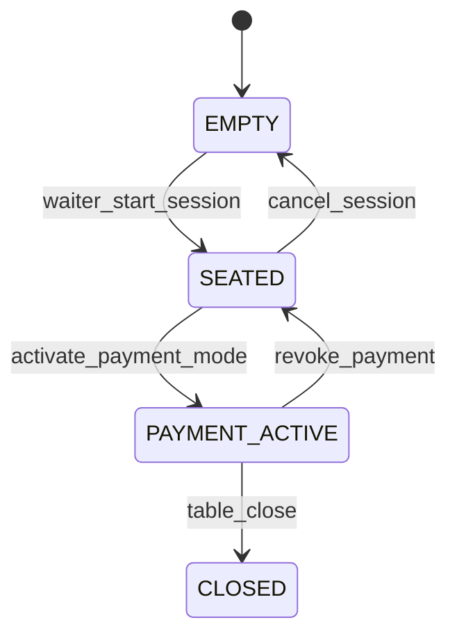
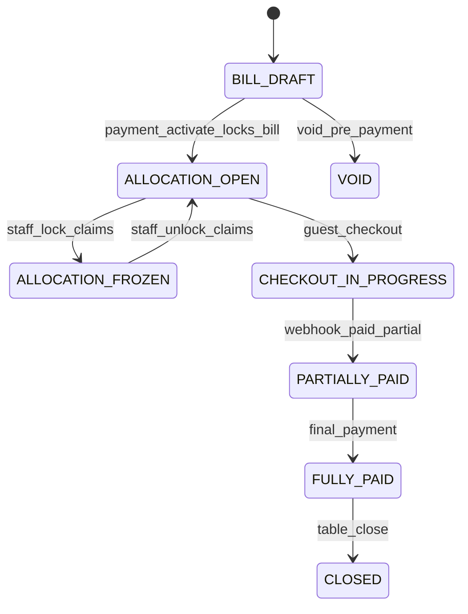

# Phase 0 — Contracts Package and Repo Scaffold

**Product:** Rekentafel (NL table QR split-pay)  
**Slice:** ws-3 + ws-4 foundation (Contracts Package and Phase 0 Repo Scaffold)  
**Status:** Implemented — `pnpm install`, `pnpm typecheck`, OpenAPI validate green  
**Sources:** part-9 (entity dictionary), part-10 (OpenAPI), part-16 (repo structure)  
**Last updated:** 2026-06-26

---

## 1. Executive summary

Phase 0 establishes the **contract-first monorepo spine** so four Cursor workstreams can merge without collision. This slice delivers:

| Artifact | Path | Owner |
|----------|------|-------|
| pnpm + Turborepo root | `pnpm-workspace.yaml`, `package.json`, `turbo.json` | ws-4 |
| OpenAPI v1 (MVP routes) | `packages/contracts/openapi.yaml` | ws-3 |
| Typed client stub | `packages/contracts/src/client.ts` | ws-3 |
| Registry enums | `packages/shared-types/src/index.ts` | ws-3 |
| Prisma schema draft (no migrations) | `packages/db/prisma/schema.prisma` | ws-3 |
| Shared TS/ESLint config | `packages/config/` | ws-4 |
| MSW mock server stub | `tools/msw/mock-server.ts` | ws-3 |
| CI skeleton | `.github/workflows/ci.yml` | ws-4 |

**Verifiable commands:**

```bash
pnpm install
pnpm typecheck          # all 5 workspace packages
pnpm lint
pnpm --filter @rekentafel/contracts validate:openapi
pnpm --filter @rekentafel/db db:validate
pnpm mock:server        # http://localhost:3100/v1
```

**Challenge to weak assumption:** Scaffolding apps (`guest-web`, `api`) before frozen contracts forces ws-1/ws-2 to invent fetch shapes. Phase 0 ships **OpenAPI + Zod-ready types + MSW stub** first; app shells are ws-1/ws-2 Week 1 tasks per [sprint-plan-phase0.md](./sprint-plan-phase0.md).

---

## 2. Monorepo layout (Phase 0 scope only)

```
jarvis-core/                         # shared repo (Rekentafel TS packages + Jarvis Python)
├── pnpm-workspace.yaml
├── package.json                     # name: rekentafel
├── turbo.json
├── tsconfig.base.json
├── packages/
│   ├── config/                      # [ws-4] ESLint + TS presets
│   ├── contracts/                   # [ws-3] OpenAPI + client stub
│   ├── shared-types/                # [ws-3] registry enums
│   └── db/                          # [ws-3] Prisma draft, no migrations/
├── tools/
│   └── msw/                         # [ws-3] mock-server.ts
├── .github/workflows/ci.yml         # [ws-4]
└── docs/                            # blueprint (read-only for feature ws)
```

**Explicitly not in this slice:** `apps/*`, `packages/ui-core`, `packages/test-fixtures`, `infra/docker` — owned by downstream Phase 0 days (ws-1, ws-2, ws-4).

---

## 3. Registry names (canonical — do not rename per slice)

Cross-slice contracts **must** use these identifiers exactly ([entity-dictionary.md](../architecture/data-model/entity-dictionary.md) §16):

| Registry name | Type | Prisma / OpenAPI |
|---------------|------|------------------|
| `dining_session_id` | UUID | `DiningSession.id` — canonical FK (not `table_session_id`) |
| `payment_session_id` | UUID | `PaymentSession.id` |
| `participant_id` | UUID | `Participant.id` (`Claimant` in split-engine docs) |
| `bill_version` | int | `Bill.billVersion` — optimistic concurrency |
| `allocatable_unit_id` | UUID | `AllocatableUnit.id` |
| `allocation_id` | UUID | `Allocation.id` (event alias: `claim_id`) |
| `checkout_intent_id` | UUID | `CheckoutIntent.id` |
| `payment_intent_id` | UUID | `PaymentIntent.id` |
| `guest_device_id` | UUID | `GuestDevice.id` |
| `public_slug` | string | `TableQrCode.publicSlug` — QR lookup key |

**Naming debt:** Split-engine docs use `table_session_id`; API may alias until v2. **DB canonical FK is `dining_session_id`.**

---

## 4. `packages/shared-types` — exported enums

All enums mirror OpenAPI `components.schemas` and Prisma enums:

| Enum | Values (MVP) | Used by |
|------|--------------|---------|
| `TableSessionState` | EMPTY, SEATED, PAYMENT_ACTIVE, CLOSED | QR landing, staff floor |
| `TableBillSettlementState` | BILL_DRAFT → … → VOID | Bill header, SSE |
| `SplitMode` | ITEM, EQUAL, CUSTOM, SHARED | Claims API |
| `ParticipantState` | JOINED → … → OVERRIDDEN | Guest lobby |
| `PaymentStatus` | CREATING → … → CHARGEBACK | Checkout poll |
| `PaymentSessionState` | OPEN, PARTIALLY_PAID, FULLY_PAID, CLOSED, DISPUTED | Staff monitor |
| `BillLineKind` | MENU_ITEM, SERVICE_CHARGE, … | Bill entry |
| `StaffRole` | WAITER, MANAGER, ADMIN, PLATFORM_OPS | RBAC |

Post-MVP enums present in Prisma draft only (`WebhookSource.CRYPTO`, `RewardsEntryType`) — **no API routes in Phase 0 OpenAPI.**

---

## 5. `packages/contracts/openapi.yaml`

**Source:** `docs/architecture/api/openapi-skeleton.yaml` (copied verbatim).

| Metric | Value |
|--------|-------|
| OpenAPI version | 3.1.0 |
| Base path | `/v1` |
| Path count | 28 operations |
| Money convention | integer EUR cents |
| Error format | RFC 7807 `Problem` + `code` enum |

**MVP route groups:**

| Tag | Key operations | Phase 0 MSW |
|-----|----------------|-------------|
| Guest — Payment Session | `POST /payment-sessions/join` | ✅ stub |
| Staff — Tables & Sessions | `POST /staff/tables/{id}/payment-sessions` | ✅ stub |
| Guest — QR & Menu | `GET /t/{slug}/{table_code}` | Week 2 MSW |
| Guest — Claims & Splits | claims, equal, custom, calculate | M2 API |
| Guest — Checkout | tip, checkout, status | M3 Mollie |
| Webhooks | `POST /webhooks/mollie` | M3 worker |

**Typed client stub** (`RekentafelClient`):

- `joinPaymentSession(body, idempotencyKey?)`
- `activatePaymentMode(tableId, accessToken, body?, idempotencyKey?)`

Regenerate full types: `pnpm --filter @rekentafel/contracts generate:types`

---

## 6. `packages/db/prisma/schema.prisma`

**Draft status:** `prisma validate` passes; **no `migrations/` applied** (per slice scope).

### 6.1 Entity coverage vs MVP

| Entity group | Models | MVP writes |
|--------------|--------|------------|
| Tenancy | Restaurant, Venue, Table, TableQrCode | Yes |
| Identity | User, GuestDevice, StaffMember, StaffDevice | Yes (User optional for guests) |
| Sessions | DiningSession, PaymentSession, PaymentSessionToken, Participant | Yes |
| Menu | MenuCategory, MenuItem | Yes (empty-table view) |
| Bill / split | Bill, BillLine, AllocatableUnit, Allocation, CustomPledge | Yes |
| Payments | CheckoutIntent, PaymentIntent, Payment, Tip, PaymentRefund, MollieConnection | Yes |
| Ops | ServiceSignal, AuditLogEntry, WebhookEvent, Dispute, Incident | Yes |
| Rewards | RewardsAccount, RewardsLedgerEntry | Accrual preview only — **no spend** |
| Partners | PartnerMerchant, Redemption | Schema only — post-MVP |
| POS | Order, OrderItem | Schema only — no MVP writes |
| Events | BillStateEvent | Yes |

### 6.2 Prisma relation note (Bill ↔ PaymentSession)

Entity dictionary defines FKs on both `bills.payment_session_id` and `payment_sessions.bill_id`. Prisma models **one** relation side:

- `PaymentSession.billId` → `Bill.id` (owner)
- `Bill.paymentSession` inverse optional

SQL migration slice (ws-3 Week 1 Wed) may add denormalized `payment_session_id` on `bills` with trigger sync — document in migration PR.

### 6.3 State machines (reference — implementation in M1+)

**TableSessionState** (`dining_sessions.state`):



**TableBillSettlementState** (`bills.settlement_state`):



**ParticipantState** (`participants.state`):

| From | To | Trigger |
|------|-----|---------|
| JOINED | ALLOCATING | first claim |
| ALLOCATING | CHECKOUT_LOCKED | checkout POST |
| CHECKOUT_LOCKED | PAYMENT_PENDING | Mollie redirect |
| PAYMENT_PENDING | PAID | webhook paid |
| PAYMENT_PENDING | PAYMENT_FAILED | webhook failed |
| * | OVERRIDDEN | staff override |

---

## 7. MSW mock server (`tools/msw/mock-server.ts`)

Node HTTP server (Phase 0 stub — not browser MSW yet). Serves `/v1` on port **3100**.

### 7.1 Stubbed endpoints

| Method | Path | Behavior |
|--------|------|----------|
| GET | `/v1/health` | `{ status: "ok" }` |
| POST | `/v1/payment-sessions/join` | 401 without token/PIN; 200 with fixture bill |
| POST | `/v1/staff/tables/{table_id}/payment-sessions` | 201 ActivatePaymentResponse |

### 7.2 Fixture constants (deterministic for UI dev)

| Constant | UUID / value |
|----------|----------------|
| `mockPaymentSessionId` | `11111111-1111-4111-8111-111111111111` |
| `mockTableId` | `22222222-2222-4222-8222-222222222222` |
| `mockBillId` | `33333333-3333-4333-8333-333333333333` |
| Join token | `mock-secret-token-482917` |
| Join PIN | `482917` |
| Bill total | €86.40 (`8640` cents) |

### 7.3 Example: guest join (happy path)

**Request:**

```http
POST /v1/payment-sessions/join
Content-Type: application/json

{
  "payment_session_id": "11111111-1111-4111-8111-111111111111",
  "token": "482917",
  "token_type": "pin",
  "display_name": "Anna"
}
```

**Response:** `200` — `participant_token`, bill with `bill_version: 1`, `settlement.remaining_cents: 8640`.

**Failure:** wrong PIN → `401` Problem `code: PIN_LOCKED`.

Week 2 replaces this stub with `packages/test-fixtures` handlers importing Zod from `@rekentafel/contracts`.

---

## 8. CI pipeline (`.github/workflows/ci.yml`)

| Step | Gate |
|------|------|
| `pnpm install --frozen-lockfile` | Reproducible deps |
| `validate:openapi` | Spectral/swagger-cli |
| `db:validate` | Prisma schema syntax |
| `pnpm lint` | ESLint all packages |
| `pnpm typecheck` | TSC all packages |

**Not yet in CI (M0 exit gate):** OpenAPI breaking diff, hook codegen, contract snapshot tests.

---

## 9. MVP vs post-MVP (this slice)

| In Phase 0 scaffold | Deferred |
|---------------------|----------|
| OpenAPI guest/staff/admin MVP paths | Crypto webhook namespace |
| Prisma MVP + preview tables | `crypto_*` tables |
| Registry enums | Gamification / discovery types |
| Join + activate-payment mock | Full MSW handler matrix |
| CI lint + typecheck | Deploy workflows, Playwright |

---

## 10. Payment architecture hooks (Mollie + crypto)

**MVP (Mollie only):** OpenAPI defines `POST /webhooks/mollie`, `CheckoutResponse.mollie_checkout_url`, `PaymentIntent` / `Payment` models. Prisma includes `MollieConnection`, `WebhookEvent.source = MOLLIE`.

**Post-MVP crypto rail:** `WebhookSource.CRYPTO` enum reserved in Prisma; **no routes scaffolded**. Separate regulated rail per [crypto-rail-design.md](../architecture/payments/crypto-rail-design.md) — not bundled with Mollie checkout.

| Rail | MVP | V2 |
|------|-----|-----|
| Mollie iDEAL/cards | ✅ schema + API | Production Connect |
| Platform EMI / stored EUR | ❌ explicitly excluded | Never as overpay wallet |
| Crypto checkout | ❌ | Separate adapter + KYC |

---

## 11. Risks specific to this slice

| Risk | Impact | Mitigation |
|------|--------|------------|
| **Contract drift** | ws-1 mocks diverge from API | MSW must import `@rekentafel/contracts` types; CI contract tests in W2-D8-05 |
| **Registry rename** | Parallel slice breakage | `NEW_REGISTRY_ENTRIES` PR block; shared-types single export |
| **Prisma 1:1 Bill/PaymentSession** | Migration surprise | Document FK owner; migration captain resolves denormalized column |
| **OpenAPI scope creep** | Loyalty/crypto routes slip in | Platform lead rejects paths outside MVP checklist |
| **Bill hijacking** | QR alone exposes bill | OpenAPI: bill only after join token; mock returns 401 without PIN |
| **PSD2 / EMI** | `rewards_accounts` as EUR wallet | Points only in schema; no spendable EUR column |
| **pnpm lock in CI** | `--frozen-lockfile` fails | Commit `pnpm-lock.yaml` with scaffold PR |
| **Co-located Jarvis + Rekentafel** | Python/TS tooling clash | pnpm workspace isolated to `packages/*`, `tools/*` |

---

## 12. Workstream ownership (Phase 0 onward)

| Path | Owner | This slice |
|------|-------|------------|
| `packages/contracts/**` | ws-3 | ✅ |
| `packages/db/**` | ws-3 | ✅ schema draft |
| `packages/shared-types/**` | ws-3 | ✅ |
| `packages/config/**` | ws-4 | ✅ |
| `tools/msw/**` | ws-3 | ✅ stub |
| `.github/workflows/**` | ws-4 | ✅ ci.yml |
| `packages/ui-core/**` | ws-4 | Next slice |
| `apps/**` | ws-1/ws-2/ws-3 | Not started |

---

## 13. NEW_REGISTRY_ENTRIES

No new names beyond entity-dictionary §16. This slice **consumes** the registry; it does not add aliases.

---

## 14. Next slices (dependency order)

1. **ws-4:** `packages/ui-core` + Docker Compose + CODEOWNERS  
2. **ws-3:** Prisma migration `0001_init` + seed pilot venue  
3. **ws-3:** `packages/test-fixtures` MSW handlers from Zod  
4. **ws-1/ws-2:** App shells with `VITE_API_MOCK=true`  
5. **ws-3:** Split-engine pure module + state machine unit tests  

---

*Slice artifact: Phase 0 Contracts Package and Repo Scaffold. Verification: `pnpm install && pnpm typecheck` green on 2026-06-26.*
