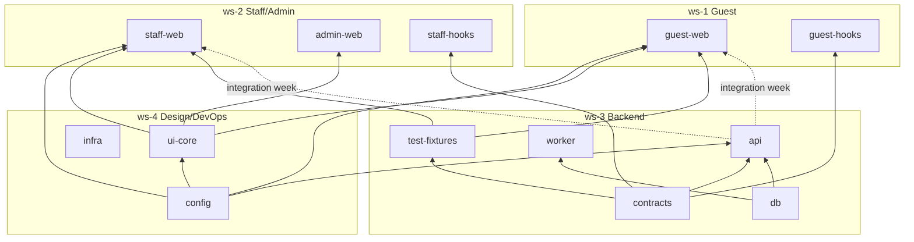

# PART 17A — Monorepo Structure for 4 Cursor Instances

**Product (working name):** Rekentafel  
**Slice:** Monorepo Structure and Four Workstream Plan  
**Status:** Blueprint — execution-ready  
**Last updated:** 2026-06-26  
**Companion artifacts:** [workstream-plan.md](./workstream-plan.md), [branching-and-merge.md](./branching-and-merge.md), [mock-strategy.md](./mock-strategy.md)

---

## 1. Executive summary

Rekentafel ships from **one GitHub repository** with **pnpm workspaces + Turborepo**. Four developers run **four Cursor instances** in parallel, each bound to exactly one workstream (`ws-1` … `ws-4`). **No workstream edits files outside its ownership map.**

| Workstream | Cursor instance | Primary packages | Merge priority |
|------------|-----------------|------------------|----------------|
| **ws-1** | Guest | `apps/guest-web`, `packages/guest-hooks` | 4 (last) |
| **ws-2** | Staff/Admin | `apps/staff-web`, `apps/admin-web` | 3 |
| **ws-3** | Backend/Payments | `apps/api`, `apps/worker`, `packages/contracts`, `packages/db` | 1–2 |
| **ws-4** | Design System/DevOps | `packages/ui-core`, `packages/config`, `infra/`, `.github/` | 0 (foundation) |

**Stack lock (slice 1, immutable for MVP):** TypeScript 5.x, Node 22 LTS, pnpm 9, Turborepo, Fastify 5, Prisma 6, PostgreSQL 16, Redis 7, BullMQ, React 19 + Vite 6, Tailwind 4, MSW 2, Vitest, Playwright.

**Challenge to weak assumption:** A single `apps/web` with route folders would collapse parallel ownership. Guest payment UX and staff override flows have **opposite real-time requirements** (SSE vs WebSocket) and **different release cadences**. Split apps are mandatory for collision-free Cursor work.

---

## 2. Repository root layout

```
rekentafel/                              # GitHub repo root
├── .github/                             # [ws-4] CI, CODEOWNERS, PR templates
│   ├── workflows/
│   │   ├── ci.yml                       # lint, typecheck, test, contract diff
│   │   ├── deploy-preview.yml           # per-PR preview URLs
│   │   └── deploy-production.yml
│   ├── CODEOWNERS
│   └── pull_request_template.md
├── .cursor/                             # [ws-4] shared Cursor rules only
│   └── rules/
│       ├── global.mdc
│       ├── ws-1-guest.mdc
│       ├── ws-2-staff.mdc
│       ├── ws-3-backend.mdc
│       └── ws-4-design-devops.mdc
├── apps/
│   ├── guest-web/                       # [ws-1] Guest PWA
│   ├── staff-web/                       # [ws-2] Waiter floor panel
│   ├── admin-web/                       # [ws-2] Restaurant admin
│   ├── api/                             # [ws-3] Fastify REST API
│   └── worker/                          # [ws-3] BullMQ background jobs
├── packages/
│   ├── contracts/                       # [ws-3] OpenAPI, Zod, event schemas
│   ├── db/                              # [ws-3] Prisma schema + migrations
│   ├── ui-core/                         # [ws-4] Design system + tokens
│   ├── config/                          # [ws-4] ESLint, TS, Tailwind presets
│   ├── guest-hooks/                     # [ws-1] React Query hooks (generated)
│   ├── staff-hooks/                     # [ws-2] Staff/admin API hooks
│   └── test-fixtures/                   # [ws-3] Shared MSW handlers + seed data
├── infra/                               # [ws-4] Docker, Terraform, deploy
│   ├── docker/
│   │   ├── docker-compose.dev.yml
│   │   └── Dockerfile.api
│   ├── terraform/                       # post-MVP staging/prod
│   └── scripts/
│       ├── seed-pilot-venue.ts          # [ws-3] invokes, [ws-4] owns script shell
│       └── generate-clients.ts          # [ws-3] OpenAPI → hooks
├── docs/                                # [shared read-only] product + architecture
│   └── engineering/                     # THIS SLICE — all ws read, ws-4 merges
├── turbo.json                           # [ws-4]
├── pnpm-workspace.yaml                  # [ws-4]
├── package.json                         # [ws-4] root scripts
├── tsconfig.base.json                   # [ws-4]
└── .env.example                         # [ws-4]
```

### 2.1 Ownership tag legend

| Tag | Meaning |
|-----|---------|
| `[ws-N]` | Exclusive write owner — only that workstream opens PRs touching these paths |
| `[shared read-only]` | All workstreams may read; changes require platform lead + ws-4 PR |
| `[ws-3] … [ws-4]` | Primary logic owner + infra shell owner (see §6.3) |

---

## 3. Application packages (detailed trees)

### 3.1 `apps/guest-web/` — ws-1

```
apps/guest-web/
├── package.json
├── vite.config.ts
├── index.html
├── public/
│   ├── manifest.webmanifest             # PWA shell (MVP)
│   └── icons/
├── src/
│   ├── main.tsx
│   ├── app/
│   │   ├── router.tsx                   # /t/:slug/:tableCode/*
│   │   └── providers.tsx                # QueryClient, MSW dev gate
│   ├── routes/
│   │   ├── landing/                     # Flow A — empty table
│   │   ├── menu/
│   │   ├── signal/                      # Flow B — call server
│   │   ├── pay/
│   │   │   ├── join/                    # Flow D
│   │   │   ├── lobby/
│   │   │   ├── claim/                   # Flow E
│   │   │   ├── split-equal/             # Flow F
│   │   │   ├── split-custom/            # Flow G
│   │   │   ├── split-shared/            # Flow H
│   │   │   ├── tip/                     # Flow I
│   │   │   └── result/                  # Flow J
│   │   └── account/                     # V1.1 — optional link post-pay
│   ├── features/
│   │   ├── bill-sync/                   # SSE subscription hook
│   │   ├── claim-state/                 # optimistic UI + version conflict
│   │   └── mollie-redirect/             # return URL handler
│   ├── components/                      # guest-only composites (not in ui-core)
│   │   ├── BillLineRow/
│   │   ├── ClaimSheet/
│   │   ├── SplitPreview/
│   │   └── PaymentTrustBanner/          # ref: docs/ux/payment-trust-patterns.md
│   ├── lib/
│   │   ├── api-client.ts                # thin fetch wrapper → guest-hooks
│   │   └── session-storage.ts           # guest token persistence
│   └── mocks/
│       ├── browser.ts                   # MSW worker bootstrap
│       └── handlers.ts                  # imports from test-fixtures
└── tests/
    ├── unit/
    └── e2e/                             # Playwright — payment happy path
```

**MVP routes (locked):** See [screen-inventory.md](../surfaces/screen-inventory.md).  
**Post-MVP additions:** `routes/discover/`, `routes/rewards/` — **do not scaffold in MVP.**

---

### 3.2 `apps/staff-web/` — ws-2

```
apps/staff-web/
├── src/
│   ├── routes/
│   │   ├── login/
│   │   ├── floor/                       # table grid + signals queue
│   │   ├── table/[tableId]/
│   │   │   ├── session/                 # start dining session (Flow C)
│   │   │   ├── bill/                    # manual bill entry MVP
│   │   │   └── payment/                 # activate payment mode
│   │   ├── signals/                     # call-server inbox
│   │   └── overrides/                   # claim dispute resolution
│   ├── features/
│   │   ├── websocket-desk/              # real-time floor updates
│   │   ├── bill-entry/                  # line item form + CSV import
│   │   └── payment-monitor/             # remaining balance live view
│   └── components/
│       ├── TableTile/
│       ├── SignalCard/
│       └── BillEditor/
└── tests/
```

---

### 3.3 `apps/admin-web/` — ws-2

```
apps/admin-web/
├── src/
│   ├── routes/
│   │   ├── login/
│   │   ├── dashboard/
│   │   ├── tables/                      # QR print, table codes
│   │   ├── menu/                        # categories + items
│   │   ├── staff/                       # roles, invites
│   │   ├── settings/
│   │   │   ├── venue/
│   │   │   ├── service-charge/
│   │   │   └── payment-session/         # TTL, join PIN policy
│   │   ├── mollie/                      # Connect onboarding
│   │   └── audit/                       # read-only session replay
│   └── features/
│       ├── qr-generator/                # persistent table QR PDF
│       └── mollie-connect/              # OAuth redirect flow
└── tests/
```

**MVP note:** Admin and staff share `packages/staff-hooks` but **separate deploy targets** (`staff.rekentafel.nl`, `admin.rekentafel.nl`) for RBAC isolation per [rbac-matrix.md](../surfaces/rbac-matrix.md).

---

### 3.4 `apps/api/` — ws-3

```
apps/api/
├── src/
│   ├── server.ts                        # Fastify bootstrap
│   ├── plugins/
│   │   ├── auth.ts
│   │   ├── idempotency.ts
│   │   └── rate-limit.ts
│   ├── modules/
│   │   ├── guest/                       # /t/*, guest payment routes
│   │   ├── staff/
│   │   ├── admin/
│   │   ├── webhooks/                    # Mollie ingress
│   │   ├── session/                     # dining + payment sessions
│   │   ├── bill/
│   │   ├── claim/                       # split engine HTTP surface
│   │   ├── payment/                     # checkout + Mollie adapter
│   │   └── health/
│   ├── domain/                          # pure TS — no HTTP imports
│   │   ├── split-engine/                # ref: docs/domain/split-engine/
│   │   ├── token/
│   │   └── vat/                         # NL 9%/21% line allocation
│   ├── adapters/
│   │   └── mollie/
│   └── sse/
│       └── bill-events.ts               # guest bill sync stream
├── prisma/                              # symlink → packages/db/prisma (optional)
└── tests/
    ├── contract/                        # OpenAPI response snapshots
    ├── integration/
    └── split-engine/                    # numeric examples from rules-spec
```

---

### 3.5 `apps/worker/` — ws-3

```
apps/worker/
├── src/
│   ├── index.ts
│   ├── queues/
│   │   ├── webhook-reconcile.ts         # Mollie webhook → payment state
│   │   ├── session-expiry.ts            # payment session TTL sweep
│   │   ├── outbox-dispatch.ts
│   │   └── gdpr-purge.ts                # post-close participant PII (MVP minimal)
│   └── jobs/
└── tests/
```

**MVP queues only.** Post-MVP: `pos-import`, `loyalty-accrual`, `crypto-settlement` — **no empty scaffold folders**.

---

## 4. Shared packages (detailed)

### 4.1 `packages/contracts/` — ws-3 OWNS

**Single source of truth for all cross-workstream interfaces.**

```
packages/contracts/
├── package.json
├── openapi/
│   ├── rekentafel.v1.yaml               # canonical — generated from or merged to apps
│   └── README.md
├── src/
│   ├── schemas/                         # Zod — generated + hand-refined
│   │   ├── guest/
│   │   ├── staff/
│   │   ├── admin/
│   │   ├── webhooks/
│   │   └── common/
│   │       ├── money.ts                 # amount_cents: z.number().int()
│   │       ├── problem.ts               # RFC 7807
│   │       └── pagination.ts
│   ├── events/                          # domain event payloads
│   │   ├── dining-session.ts
│   │   ├── payment-session.ts
│   │   ├── claim.ts
│   │   └── payment.ts
│   └── index.ts
├── scripts/
│   ├── lint-openapi.ts
│   └── diff-breaking.ts                 # CI breaking-change gate
└── tests/
    └── schema-snapshots/
```

**Registry rule:** New canonical names (`Participant`, `AllocatableUnit`, etc.) must match [entity-dictionary.md](../architecture/data-model/entity-dictionary.md). ws-3 publishes `NEW_REGISTRY_ENTRIES` block in PR description when adding fields.

**Consumers (read-only):**

| Package | Consumes |
|---------|----------|
| `apps/api` | Zod validators, OpenAPI route registration |
| `packages/guest-hooks` | Generated React Query types |
| `packages/staff-hooks` | Generated React Query types |
| `packages/test-fixtures` | MSW handler response shapes |
| `apps/guest-web`, `apps/staff-web`, `apps/admin-web` | Types only via hooks packages |

---

### 4.2 `packages/db/` — ws-3 OWNS

```
packages/db/
├── package.json
├── prisma/
│   ├── schema.prisma                    # all MVP entities
│   ├── migrations/                      # ONLY ws-3 commits here
│   └── seed/
│       └── pilot-venue.ts               # Table 1–20, sample menu
├── src/
│   └── client.ts                        # exported PrismaClient singleton
└── tests/
```

**Migration protocol:**

1. ws-3 opens PR with migration + updated `entity-dictionary.md` cross-ref if needed.
2. ws-1/ws-2/ws-4 **never** run `prisma migrate dev` — they run `prisma generate` only.
3. Integration week: one ws-3 engineer is **migration captain** (see [workstream-plan.md](./workstream-plan.md)).

**Post-MVP tables** (`rewards_*`, `partner_*`, `crypto_*`) — add columns via feature flags, not separate DBs.

---

### 4.3 `packages/ui-core/` — ws-4 OWNS

```
packages/ui-core/
├── package.json
├── src/
│   ├── tokens/
│   │   ├── colors.css                   # semantic: --color-trust, --color-danger
│   │   ├── typography.css
│   │   └── spacing.css
│   ├── primitives/
│   │   ├── Button/
│   │   ├── Input/
│   │   ├── Modal/
│   │   ├── Toast/
│   │   ├── Badge/
│   │   ├── Skeleton/
│   │   └── MoneyDisplay/                # €12,40 formatting — cents internally
│   ├── patterns/
│   │   ├── PageShell/
│   │   ├── FormField/
│   │   └── EmptyState/
│   └── index.ts
├── .storybook/                          # Storybook 8 — visual contract
└── tests/
```

**UI library strategy:**

| Layer | Owner | Rule |
|-------|-------|------|
| Design tokens + primitives | ws-4 `ui-core` | No business logic, no API imports |
| Domain composites | ws-1 / ws-2 in app `components/` | May use ui-core only |
| Payment-specific trust UI | ws-1 owns `PaymentTrustBanner` | ws-4 reviews for token compliance |

**Consumption:** ws-1 and ws-2 import `@rekentafel/ui-core`. **ws-3 never imports ui-core.** API returns JSON; no shared React.

**Versioning:** `ui-core` uses semver within monorepo (`workspace:*`). Breaking prop changes require ws-4 PR + simultaneous consumer PRs (stacked or sequential same day).

---

### 4.4 `packages/config/` — ws-4 OWNS

Shared ESLint, Prettier, TypeScript, Tailwind configs. All apps extend — no local overrides without ws-4 approval.

---

### 4.5 `packages/guest-hooks/` — ws-1 OWNS (generated from contracts)

```
packages/guest-hooks/
├── src/
│   ├── generated/                       # DO NOT HAND-EDIT — openapi-typescript + custom codegen
│   └── index.ts
└── package.json
```

**Generation trigger:** ws-3 merges `packages/contracts` change → CI runs `pnpm generate:hooks` → ws-1 commits generated diff **or** CI bot commit (preferred).

---

### 4.6 `packages/staff-hooks/` — ws-2 OWNS (generated)

Same pattern as guest-hooks for staff + admin routes.

---

### 4.7 `packages/test-fixtures/` — ws-3 OWNS

Shared MSW handlers, factory builders, pilot venue seed JSON. See [mock-strategy.md](./mock-strategy.md).

---

## 5. Cross-workstream dependency graph



**Solid line = daily dependency. Dotted = integration week only for local dev against real API.**

---

## 6. File ownership enforcement

### 6.1 CODEOWNERS (`.github/CODEOWNERS`)

```
# ws-4
/packages/ui-core/          @rekentafel/ws-4
/packages/config/           @rekentafel/ws-4
/infra/                     @rekentafel/ws-4
/.github/                   @rekentafel/ws-4
/turbo.json                 @rekentafel/ws-4
/pnpm-workspace.yaml        @rekentafel/ws-4

# ws-3
/packages/contracts/        @rekentafel/ws-3
/packages/db/               @rekentafel/ws-3
/packages/test-fixtures/    @rekentafel/ws-3
/apps/api/                  @rekentafel/ws-3
/apps/worker/               @rekentafel/ws-3

# ws-2
/apps/staff-web/            @rekentafel/ws-2
/apps/admin-web/            @rekentafel/ws-2
/packages/staff-hooks/      @rekentafel/ws-2

# ws-1
/apps/guest-web/            @rekentafel/ws-1
/packages/guest-hooks/      @rekentafel/ws-1

# shared docs — platform lead required
/docs/                      @rekentafel/platform-lead
```

### 6.2 No cross-workstream file edits rule

| Violation | Example | Resolution |
|-----------|---------|------------|
| ws-1 edits `packages/contracts` | Guest dev adds field to OpenAPI | Open ticket for ws-3; ws-3 ships contract PR first |
| ws-2 edits `packages/ui-core` | Staff adds Button variant | Request ws-4 PR; or use app-local wrapper temporarily |
| ws-3 edits `apps/guest-web` | Backend dev fixes guest bug | ws-1 owns fix; ws-3 provides API if root cause |
| Any ws edits `packages/db/migrations` except ws-3 | Accidental migration | Revert; ws-3 migration captain re-applies |

**CI guard:** Path-filter workflow fails PR if author team touches foreign CODEOWNERS paths without `cross-ws-approved` label (platform lead only).

### 6.3 Split ownership exception

| Path | Logic owner | Shell owner |
|------|-------------|-------------|
| `infra/scripts/seed-pilot-venue.ts` | ws-3 (seed data) | ws-4 (script wiring in compose) |
| `docs/engineering/*` | All contribute content | ws-4 merges structural changes |
| `.env.example` | ws-3 (API keys vars) | ws-4 (format + CI secrets mapping) |

---

## 7. MVP vs post-MVP repo boundaries

| Area | MVP (pilot week 0–8) | V1.1 | V2 | Do not scaffold empty |
|------|---------------------|------|-----|----------------------|
| Apps | guest, staff, admin, api, worker | + ops dashboard routes in admin | Partner portal app | `apps/partner-web`, `apps/mobile` |
| Contracts | Guest/staff/admin/webhook v1 | POS read-only import routes | Crypto webhook namespace | `contracts/crypto/` folder |
| DB | Full MVP entity set | `rewards_*` write path | POS sync tables active | `crypto_wallets` |
| ui-core | 12 primitives + MoneyDisplay | Data tables for admin | Marketing components | Gamification widgets |
| infra | docker-compose dev + single prod | Staging TF | Multi-region | K8s helm (overkill MVP) |

---

## 8. Risks specific to this slice

| Risk | Impact | Mitigation |
|------|--------|------------|
| **Contract drift** — ws-1 mocks diverge from ws-3 API | Integration week rewrite | MSW handlers import Zod schemas from `contracts`; CI contract tests |
| **Migration conflicts** — two ws-3 PRs touch schema | Broken local DBs | Migration captain; serial merge queue for `packages/db` |
| **ui-core bottleneck** — ws-4 blocks ws-1/ws-2 | Sprint slip | App-local wrappers allowed for 48h max; debt ticket required |
| **Generated hooks lag** — ws-3 merges Friday, ws-1 unaware | Type errors Monday | Slack `#contracts-changelog` bot on `packages/contracts` merge |
| **Turborepo cache poisoning** — wrong task outputs shared | Flaky CI | `turbo.json` strict `outputs`; disable remote cache for `contracts#generate` |
| **Guest/staff auth token leakage in shared test-fixtures** | Security finding | Separate fixture namespaces; no prod-like secrets in repo |

---

## 9. Local development bootstrap

```bash
# Once per machine (ws-4 maintains)
pnpm install
docker compose -f infra/docker/docker-compose.dev.yml up -d   # postgres, redis
pnpm --filter @rekentafel/db prisma migrate dev
pnpm --filter @rekentafel/db seed

# Per workstream dev (parallel, no collisions)
pnpm --filter @rekentafel/guest-web dev    # ws-1 — MSW on, port 5173
pnpm --filter @rekentafel/staff-web dev    # ws-2 — MSW on, port 5174
pnpm --filter @rekentafel/admin-web dev    # ws-2 — MSW on, port 5175
pnpm --filter @rekentafel/api dev          # ws-3 — port 3000
pnpm --filter @rekentafel/worker dev       # ws-3 — consumes redis
pnpm --filter @rekentafel/ui-core storybook # ws-4 — port 6006
```

**Integration week toggle:** `VITE_API_MOCK=false` in app `.env.local` points frontends at `localhost:3000`.

---

## 10. Registry: package names

| npm name | Path |
|----------|------|
| `@rekentafel/guest-web` | `apps/guest-web` |
| `@rekentafel/staff-web` | `apps/staff-web` |
| `@rekentafel/admin-web` | `apps/admin-web` |
| `@rekentafel/api` | `apps/api` |
| `@rekentafel/worker` | `apps/worker` |
| `@rekentafel/contracts` | `packages/contracts` |
| `@rekentafel/db` | `packages/db` |
| `@rekentafel/ui-core` | `packages/ui-core` |
| `@rekentafel/config` | `packages/config` |
| `@rekentafel/guest-hooks` | `packages/guest-hooks` |
| `@rekentafel/staff-hooks` | `packages/staff-hooks` |
| `@rekentafel/test-fixtures` | `packages/test-fixtures` |

---

## 11. Related documents

| Document | Purpose |
|----------|---------|
| [workstream-plan.md](./workstream-plan.md) | Sprint scope, interfaces, daily sync |
| [branching-and-merge.md](./branching-and-merge.md) | Branch naming, PR rules, merge order |
| [mock-strategy.md](./mock-strategy.md) | MSW layers until integration |
| [../architecture/api/service-map.md](../architecture/api/service-map.md) | API module boundaries |
| [../surfaces/surface-map.md](../surfaces/surface-map.md) | Route ownership by surface |
