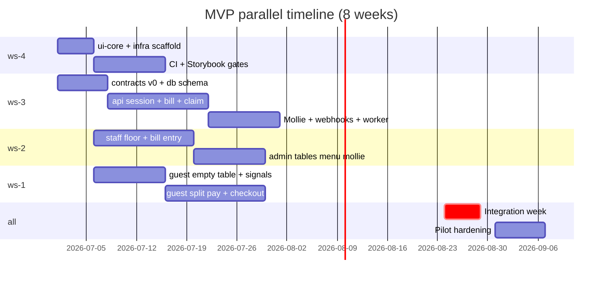

# PART 17B — Four Workstream Plan

**Product (working name):** Rekentafel  
**Team:** 4 developers × 4 Cursor instances × 1 monorepo  
**Pilot target:** 8 weeks to first venue split-pay proof  
**Last updated:** 2026-06-26

---

## 1. Workstream overview



---

## 2. Workstream charters

### ws-1 — Guest Web

| Field | Value |
|-------|-------|
| **Developer role** | Frontend — guest payment UX |
| **Mission** | Frictionless mobile web split-pay; bill sync; Mollie redirect return handling |
| **Owns** | `apps/guest-web`, `packages/guest-hooks` |
| **Never touches** | `packages/contracts`, `packages/db`, `apps/api`, `packages/ui-core` (consume only) |

#### MVP deliverables

| # | Deliverable | Exit artifact | Week |
|---|-------------|---------------|------|
| G1 | Table landing + menu (Flows A) | Playwright: scan QR → menu renders | 2 |
| G2 | Call server signal (Flow B) | Signal POST mocked → toast confirm | 2 |
| G3 | Payment join gate + lobby (Flow D) | PIN entry + participant list | 4 |
| G4 | Item claim UI (Flow E) | Optimistic claim + version conflict modal | 5 |
| G5 | Equal/custom/shared split (F–H) | 3 split modes with € preview | 6 |
| G6 | Tip + Mollie checkout (I) | Redirect to Mollie test mode | 7 |
| G7 | Payment result + partial balance (J) | Remaining €42.00 updates via SSE mock | 7 |

#### Post-MVP (explicitly out of scope)

- Account registration wall before pay
- Loyalty balance display (Flow K UI beyond link)
- Discovery/recommendations routes
- Crypto checkout option

#### Upstream dependencies

| Dependency | Provider | Interface |
|------------|----------|-----------|
| OpenAPI guest routes | ws-3 | `packages/contracts/openapi/rekentafel.v1.yaml` tags `Guest — *` |
| UI primitives | ws-4 | `@rekentafel/ui-core` ≥0.3 |
| MSW fixtures | ws-3 | `@rekentafel/test-fixtures/handlers/guest` |
| SSE event shapes | ws-3 | `contracts/src/events/payment-session.ts` |

#### Downstream consumers

None — guest is terminal surface. ws-3 reads guest analytics events only post-MVP.

---

### ws-2 — Staff & Admin

| Field | Value |
|-------|-------|
| **Developer role** | Frontend — operational dashboards |
| **Mission** | Waiter floor control, manual bill entry, payment mode activation, restaurant config |
| **Owns** | `apps/staff-web`, `apps/admin-web`, `packages/staff-hooks` |
| **Never touches** | `packages/contracts`, `packages/db`, `apps/api`, split-engine domain code |

#### MVP deliverables

| # | Deliverable | Exit artifact | Week |
|---|-------------|---------------|------|
| S1 | Staff auth + floor grid | Login → 12 table tiles with status colors | 2 |
| S2 | Service signal inbox | WebSocket mock pushes signal in <2s | 3 |
| S3 | Start dining session (Flow C) | Table `SEATED` state visible on floor | 3 |
| S4 | Manual bill entry | Add 5 lines; totals match VAT rules | 5 |
| S5 | Activate payment mode | Issues session; guest MSW can join | 5 |
| S6 | Payment monitor + close table | Remaining balance; force close with audit reason | 6 |
| S7 | Admin: tables + QR PDF | Print sheet for 20 tables | 4 |
| S8 | Admin: menu CRUD | Categories + items sync to guest menu | 4 |
| S9 | Admin: staff roles + Mollie Connect | OAuth redirect stub → connected state | 6 |
| S10 | Claim override flow | Waiter reassigns disputed claim | 7 |

#### Post-MVP

- Platform ops dashboard (`/ops`) — merge into admin or separate app V1.1
- POS import UI
- Franchise multi-venue switcher

#### Upstream dependencies

| Dependency | Provider | Interface |
|------------|----------|-----------|
| Staff/admin OpenAPI | ws-3 | tags `Staff — *`, `Admin — *` |
| WebSocket protocol | ws-3 | `WS /staff/v1/floor` message schema in contracts |
| RBAC roles enum | ws-3 | `StaffRole`, `AdminPermission` in contracts |
| ui-core data tables | ws-4 | Admin list pages |

---

### ws-3 — Backend & Payments

| Field | Value |
|-------|-------|
| **Developer role** | Backend + payments + data |
| **Mission** | Contract-first API, split engine, Mollie integration, webhooks, migrations |
| **Owns** | `apps/api`, `apps/worker`, `packages/contracts`, `packages/db`, `packages/test-fixtures` |
| **Never touches** | Any `apps/*-web` except local E2E helpers |

#### MVP deliverables

| # | Deliverable | Exit artifact | Week |
|---|-------------|---------------|------|
| B1 | OpenAPI v0.1 + Zod schemas | Spectral lint pass; published to packages/contracts | 1 |
| B2 | Prisma schema + migration 001 | All MVP entities from entity-dictionary | 1 |
| B3 | Session service | State machine: `EMPTY→SEATED→PAYMENT_ACTIVE→CLOSED` | 2 |
| B4 | Bill service + manual entry API | POST lines; VAT 9%/21% validation | 3 |
| B5 | Split engine (claim/allocation) | Pass rules-spec worked examples #1–#5 | 4 |
| B6 | Concurrency locks | Redis claim lock; double-allocate test fails | 4 |
| B7 | Checkout + Mollie adapter | Test mode payment create + redirect URL | 5 |
| B8 | Webhook ingress + reconciliation worker | Idempotent `tr_*` processing | 6 |
| B9 | SSE bill events | Guest receives allocation patch stream | 6 |
| B10 | MSW test-fixtures v1 | All guest+staff happy paths mockable | 3 |
| B11 | Audit log writes | Every override + payment logged | 7 |

#### Post-MVP ownership (planned modules, no MVP code)

| Module | Version | Notes |
|--------|---------|-------|
| `modules/pos-import/` | V1.1 | Read-only adapter |
| `modules/rewards/` | V1.1 | Accrual only, no spend |
| `modules/crypto/` | V2 | Separate webhook namespace per crypto-rail-design |
| `modules/partner/` | V2 | Redemption API |

#### Contract publication SLA

| Change type | Notice | Merge priority |
|-------------|--------|----------------|
| Additive (optional field) | Same-day Slack | Normal |
| New endpoint | 24h + changelog entry | Before consumer PR |
| Breaking (rename, required field) | 48h + migration guide | ws-3 merges first; consumers rebase |
| DB migration | Migration captain window | Serial — one migration PR at a time |

#### Migration captain rotation

| Weeks | Captain |
|-------|---------|
| 1–4 | ws-3 primary dev |
| 5–8 | ws-3 secondary dev |
| Integration | Captain on-call daily |

---

### ws-4 — Design System & DevOps

| Field | Value |
|-------|-------|
| **Developer role** | Design system + platform engineering |
| **Mission** | ui-core, CI/CD, local dev ergonomics, preview deploys |
| **Owns** | `packages/ui-core`, `packages/config`, `infra/`, `.github/`, root workspace config |
| **Never touches** | Business logic in api modules, guest/staff feature code |

#### MVP deliverables

| # | Deliverable | Exit artifact | Week |
|---|-------------|---------------|------|
| D1 | pnpm + turbo monorepo scaffold | `pnpm build` succeeds empty apps | 1 |
| D2 | ui-core primitives (12) | Storybook published; ws-1/ws-2 consume | 2 |
| D3 | MoneyDisplay + trust tokens | Matches payment-trust-patterns.md | 2 |
| D4 | CI pipeline | lint + typecheck + test on PR | 1 |
| D5 | Contract diff CI job | Fails on breaking OpenAPI without label | 3 |
| D6 | docker-compose dev stack | Postgres + Redis one command | 1 |
| D7 | Preview deploys | guest/staff/admin preview URLs per PR | 4 |
| D8 | Playwright smoke in CI | Guest QR → menu path | 5 |

#### ui-core component MVP inventory

| Component | Guest | Staff | Admin | Priority |
|-----------|-------|-------|-------|----------|
| Button | ✓ | ✓ | ✓ | P0 |
| Input / PIN | ✓ | ✓ | ✓ | P0 |
| MoneyDisplay | ✓ | ✓ | ✓ | P0 |
| Modal | ✓ | ✓ | ✓ | P0 |
| Toast | ✓ | ✓ | ✓ | P0 |
| Badge (status) | ✓ | ✓ | ✓ | P0 |
| Skeleton | ✓ | ✓ | ✓ | P1 |
| PageShell | ✓ | ✓ | ✓ | P0 |
| FormField | — | ✓ | ✓ | P1 |
| EmptyState | ✓ | ✓ | ✓ | P1 |
| Tabs | — | ✓ | ✓ | P2 |
| DataTable | — | — | ✓ | P2 |

---

## 3. Interface contracts between workstreams

### 3.1 ws-3 → ws-1 (Guest API)

| Endpoint group | MVP | Transport | Auth |
|----------------|-----|-----------|------|
| `GET /t/{slug}/{code}` | Yes | REST | None |
| `POST /tables/{id}/service-signals` | Yes | REST | Device fingerprint header |
| `POST /payment-sessions/join` | Yes | REST | Join PIN + payment token |
| `GET/POST /payment-sessions/{id}/claims` | Yes | REST | Guest session token |
| `POST /checkout-intents` | Yes | REST | Guest session token |
| `GET /payment-sessions/{id}/events` | Yes | SSE | Guest session token |

**Example request/response (claim item):**

```json
// POST /v1/payment-sessions/ps_abc/claims
// Headers: Authorization: Bearer gst_xxx, Idempotency-Key: uuid
{
  "allocatable_unit_id": "au_burger_1",
  "participant_id": "part_001"
}

// 200 OK
{
  "allocation_id": "alloc_789",
  "bill_version": 14,
  "amount_cents": 1450,
  "vat_cents": 131,
  "remaining_unclaimed_cents": 8640
}

// 409 Conflict — concurrent claim
{
  "type": "https://rekentafel.nl/errors/claim-conflict",
  "title": "Allocatable unit already claimed",
  "status": 409,
  "bill_version": 15
}
```

### 3.2 ws-3 → ws-2 (Staff API)

| Endpoint group | MVP | Transport | Auth |
|----------------|-----|-----------|------|
| `POST /staff/auth/login` | Yes | REST | — |
| `GET /staff/floor` | Yes | REST + WS | Staff JWT |
| `POST /dining-sessions` | Yes | REST | Staff JWT |
| `POST /bills`, `PUT /bills/{id}/lines` | Yes | REST | Staff JWT |
| `POST /payment-sessions/activate` | Yes | REST | Staff JWT |
| `POST /claims/{id}/override` | Yes | REST | Staff JWT + reason |
| `POST /admin/mollie/connect` | Yes | REST | Admin JWT |

### 3.3 ws-4 → ws-1/ws-2 (UI)

| Export | Contract |
|--------|----------|
| `MoneyDisplay` | Props: `amountCents: number`, `locale?: 'nl-NL'` — always shows €X,XX |
| `Button` | Variants: `primary`, `secondary`, `ghost`, `danger` — no custom hex in apps |
| Theme CSS | Import `@rekentafel/ui-core/tokens.css` once in app entry |

### 3.4 ws-3 → all (Events via test-fixtures)

Domain events for MSW + future outbox:

| Event | Payload owner | Consumers |
|-------|---------------|-----------|
| `payment_session.activated` | ws-3 | ws-1 SSE mock, ws-2 WS mock |
| `claim.created` | ws-3 | ws-1 bill sync |
| `payment.succeeded` | ws-3 | ws-1 result screen, ws-2 monitor |
| `table.closed` | ws-3 | ws-1 session end, ws-2 floor tile |

---

## 4. Integration week protocol (week 7)

**Dates:** Fixed calendar slot before pilot — all feature freeze except P0 bugs.

| Day | Activity | Owner |
|-----|----------|-------|
| Mon | Disable MSW in all apps; point to staging API | ws-4 |
| Mon | ws-3 deploys API + worker to staging | ws-3 |
| Tue | Guest E2E: full split-pay with Mollie test | ws-1 + ws-3 |
| Wed | Staff E2E: bill entry → activate → monitor → close | ws-2 + ws-3 |
| Thu | Concurrency torture test (4 guests claim same item) | ws-3 |
| Fri | Pilot venue dry run on staging | All |

**Go/no-go gate:** Table 12 worked example from [mvp-roadmap.md](../product/mvp-roadmap.md) completes with €0.00 remaining in staging.

---

## 5. Definition of done

### 5.1 Universal (every PR)

- [ ] Branch name matches `feature/ws-{n}/{ticket}` or `fix/ws-{n}/{ticket}`
- [ ] Only owned paths modified (or `cross-ws-approved` label present)
- [ ] `pnpm lint && pnpm typecheck && pnpm test --filter=<package>` pass locally
- [ ] No secrets committed; `.env.example` updated if new env var
- [ ] PR description links Linear/GitHub issue

### 5.2 When `packages/contracts` changes (mandatory)

- [ ] OpenAPI diff reviewed by **at least one non-ws-3 developer**
- [ ] CI `contract-diff` job green OR labeled `breaking-change-approved`
- [ ] Zod schemas updated in same PR
- [ ] `packages/test-fixtures` handlers updated in same PR or immediate follow-up (<4h)
- [ ] `#contracts-changelog` Slack post with migration notes
- [ ] If new canonical field: `NEW_REGISTRY_ENTRIES` block in PR body referencing entity-dictionary
- [ ] Generated hooks PR opened or CI bot commit scheduled

**Contract diff review checklist:**

| Check | Reviewer asks |
|-------|---------------|
| Money fields | All amounts `*_cents` integers? |
| Breaking | Any required field added or renamed? |
| Auth | Correct security scheme on route? |
| Idempotency | Mutating routes document `Idempotency-Key`? |
| Error shapes | 409/422 use problem+json with stable `type` URI? |
| Event payloads | Match event-catalog.md names? |

### 5.3 When `packages/db` migration ships

- [ ] Migration captain approved merge slot
- [ ] Rollback SQL documented in PR if non-trivial
- [ ] ws-1/ws-2 notified before merge (local `migrate dev` instruction)
- [ ] Seed data updated if schema affects fixtures

### 5.4 Feature slice done (per deliverable G/S/B/D table)

- [ ] Unit tests for business logic
- [ ] MSW handler OR integration test proving API contract
- [ ] Storybook story (if ui-core) or Playwright smoke (if app route)
- [ ] Accessibility: focus trap on modals, 44px touch targets on guest
- [ ] Dutch copy reviewed for guest-facing strings (informal "je" form)

### 5.5 MVP release done

- [ ] All G1–G7, S1–S10, B1–B11, D1–D8 complete
- [ ] Integration week go/no-go passed
- [ ] [mvp-security-checklist.md](../security/mvp-security-checklist.md) P0 items checked
- [ ] Pilot venue seeded; 20 table QRs printed
- [ ] Mollie live mode credentials in venue admin (not platform test org)
- [ ] Runbook: [manual-ops-playbook.md](../integrations/manual-ops-playbook.md) walkthrough completed

---

## 6. Daily sync checklist (per workstream)

**Standup time:** 09:30 CET · **Slack:** `#rekentafel-build` · **Duration:** 15 min total (round-robin)

### ws-1 daily checklist

| # | Check | If failing |
|---|-------|------------|
| 1 | Pull `main`; run `pnpm --filter guest-web dev` | Escalate ws-4 if workspace broken |
| 2 | Read `#contracts-changelog` since yesterday | Rebase mocks before new UI work |
| 3 | Verify MSW handlers match local `contracts` version | `pnpm --filter test-fixtures test` |
| 4 | Any blocked on ui-core component? | Tag ws-4 with Storybook link |
| 5 | Open PRs only touch `apps/guest-web`, `packages/guest-hooks` | Split PR if scope creep |
| 6 | Demo screenshot/video of yesterday's slice | Post in standup thread |

### ws-2 daily checklist

| # | Check | If failing |
|---|-------|------------|
| 1 | Pull `main`; staff + admin dev servers start | Check shared config with ws-4 |
| 2 | Staff WS mock matches latest floor schema | Compare to contracts WebSocket types |
| 3 | Bill entry totals match split-engine examples | Cross-check with ws-3 `#split-engine` |
| 4 | RBAC: confirm role gating matches rbac-matrix | Flag product if mismatch |
| 5 | Admin QR PDF renders scannable code | Test with guest app scan |
| 6 | No direct API URL in staff code (MSW until integration) | Enforce env gate |

### ws-3 daily checklist

| # | Check | If failing |
|---|-------|------------|
| 1 | Migration captain: any open `packages/db` PRs? | Serialize merges |
| 2 | OpenAPI spectral lint clean | Fix before any consumer notify |
| 3 | Split-engine unit tests pass with rules-spec examples | Block claim API changes |
| 4 | test-fixtures version bumped if response shape changed | ws-1/ws-2 depend on this |
| 5 | Mollie test webhook received in last 24h (staging) | Check worker logs |
| 6 | No UI files in PR | Revert and file ws-1/ws-2 ticket |
| 7 | Publish "API delta" note if endpoints merged yesterday | `#contracts-changelog` |

### ws-4 daily checklist

| # | Check | If failing |
|---|-------|------------|
| 1 | CI green on `main` | Priority fix before other work |
| 2 | Review open ui-core PR requests from ws-1/ws-2 | SLA: 4 business hours |
| 3 | Contract-diff CI job healthy | ws-3 cannot merge without this |
| 4 | Preview deploy URLs working for open frontend PRs | Check Vercel/CF logs |
| 5 | docker-compose dev stack smoke test | Blocks all teams if down |
| 6 | Dependabot/security patches triaged | P0 within 24h |

### Cross-team (Fridays only, +15 min)

| # | Agenda item |
|---|-------------|
| 1 | Contract freeze for next week — ws-3 announces |
| 2 | ui-core release notes — ws-4 announces |
| 3 | Integration week countdown — open blocker list |
| 4 | Pilot venue ops check — product + ws-2 |

---

## 7. Weak assumptions challenged

| Assumption in master prompt | Challenge | Decision |
|-----------------------------|-----------|----------|
| "4 devs can share one repo easily" | True only with hard ownership + contract-first | Enforced via CODEOWNERS + MSW |
| "Staff and admin can be one app" | Different RBAC, deploy cadence, device profiles | Separate apps, shared hooks |
| "Backend dev can unblocks guest quickly" | Cross-edits violate ownership | ws-3 ships fixture; ws-1 implements |
| "OpenAPI can wait until API is built" | Parallel Cursor instances collide without it | ws-3 week-1 deliverable is contracts v0 |
| "Design system is optional for MVP" | Payment trust UX requires consistent money display | ws-4 week-1–2 is P0 not polish |

---

## 8. Legal, fraud, UX, ops risks (workstream-specific)

| Risk | Workstream | Mitigation in plan |
|------|------------|-------------------|
| Guest sees wrong VAT split | ws-1 display + ws-3 calc | MoneyDisplay from ui-core; single `vat_cents` from API only |
| Waiter activates payment before bill ready | ws-2 UX | Confirm dialog; bill total > €0 gate |
| Bill hijack via leaked join token | ws-3 | Short TTL; optional PIN; no bill on naked QR |
| MSW mocks hide auth bugs until integration | ws-1/ws-2 | Integration week mandatory; JWT shape same in mocks |
| Mollie webhook mishandled | ws-3 | Reconciliation worker + ops runbook |
| GDPR: guest PII in logs | ws-3 | No participant names in API logs; audit separate |
| PSD2: platform holds funds | ws-3 | Restaurant Mollie org; no wallet module in repo MVP |
| Ops: waiter can't find payment mode | ws-2 | S5 usability test with non-dev waiter before pilot |

---

## 9. Mollie + crypto architecture reference (repo placement)

**MVP (ws-3 only):**

```
apps/api/src/adapters/mollie/          # Payment create, refund
apps/api/src/modules/webhooks/         # Mollie POST ingress
apps/worker/src/queues/webhook-reconcile.ts
packages/contracts/openapi/            # Webhooks tag, CheckoutIntent schemas
apps/admin-web (ws-2)                    # Mollie Connect OAuth UI only
```

**V2 crypto (do not create until legal sign-off):**

```
packages/contracts/openapi/crypto.v1.yaml    # separate namespace
apps/api/src/adapters/crypto-psp/            # e.g. BVNK, MoonPay B2B
apps/worker/src/queues/crypto-settlement.ts
apps/guest-web/routes/pay/crypto/            # ws-1, post-MVP
```

See [payment-architecture.md](../architecture/payments/payment-architecture.md) and [crypto-rail-design.md](../architecture/payments/crypto-rail-design.md).

---

## 10. Ticket sizing guide

| Size | Days | Example |
|------|------|---------|
| XS | 0.5 | Add optional field to OpenAPI + fixture |
| S | 1–2 | Single ui-core primitive |
| M | 3–5 | Guest claim flow UI |
| L | 5–8 | Split engine + claim API |
| XL | Split | "Payment flow" — must decompose to M slices |

**Rule:** No XL tickets — ws-3 splits engine work into B5 (logic) and B6 (concurrency) separately.
