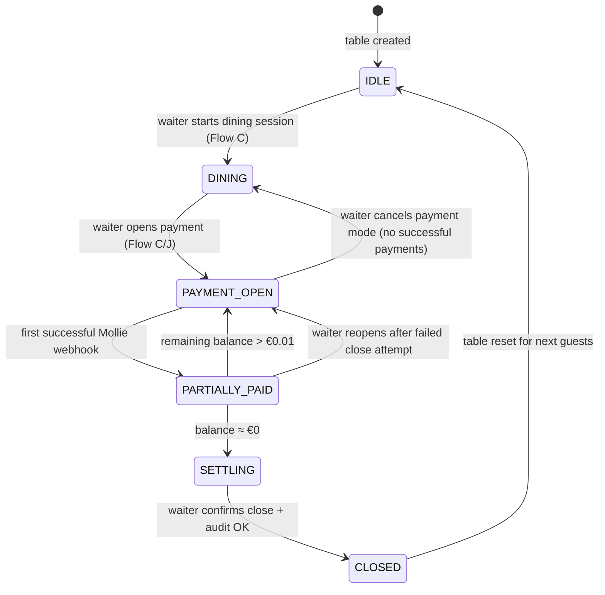
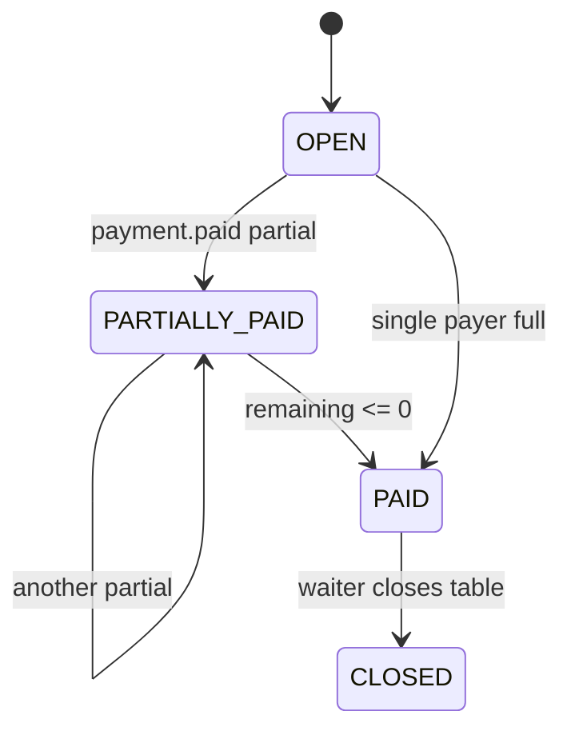

# PART 2 — Core User Flows (A–O)

**Product (working name):** Rekentafel  
**Market:** Netherlands-first hospitality fintech  
**Slice:** Core User Flows A–O  
**Status:** Blueprint — execution-ready  
**Last updated:** 2026-06-26

---

## Scope Legend

| Tag | Meaning |
|-----|---------|
| **MVP** | Required for single-venue pilot |
| **POST-MVP** | Designed but not built in pilot |
| **DEFERRED** | Explicitly out of pilot; do not implement |

### Cross-cutting security invariant (MVP)

> **Live bill access requires a waiter-activated payment session plus a short-lived join token.**  
> Scanning the persistent table QR alone never exposes line items, totals, or payment controls.

| State | QR resolves to | Bill visible? | Pay enabled? |
|-------|----------------|---------------|--------------|
| Table idle (no session) | Menu + table context + call server | No | No |
| Dining session (orders open, payment not activated) | Menu + “Bill not open for payment yet” | No (summary only if waiter toggles preview — optional MVP) | No |
| Payment session active | Join gate → bill + split UI | Yes (after token validation) | Yes |
| Payment session closed / table reset | Menu + idle | No | No |

**Session token properties (MVP):**

- Issued when waiter taps **Open payment** on staff console
- TTL: 15 minutes, refreshed on waiter action or successful partial payment
- Join methods: QR deep link with `?ps=<token>` **or** 6-digit table PIN displayed on staff device (waiter reads aloud)
- Token binds to: `restaurant_id`, `table_id`, `payment_session_id`, optional `max_joins` (default 12)
- No geo-fence in MVP (waiter unlock only); document fraud risk in Flow D

---

## Table & Session State Machine (reference)



---

## Flow A — Guest Scans Empty-Table QR

**Scope:** MVP

### Trigger

Guest at an unoccupied or freshly reset table scans the persistent table QR (printed sticker / tent card).

### Preconditions

| Check | Expected |
|-------|----------|
| `table.status` | `IDLE` or `DINING` without payment session |
| QR payload | `https://app.rekentafel.nl/t/{restaurant_slug}/{table_code}` |
| Restaurant | Active, within service hours (soft gate — show menu anyway with banner) |

### Screens

1. **Landing / table context** — restaurant name, table number, service status banner
2. **Menu browser** — categories, items, allergens (read-only), VAT-inclusive display note
3. **Call server CTA** — primary action, not ordering cart

### User actions

| Action | Result |
|--------|--------|
| Browse menu | Client-side navigation; optional analytics event only |
| Tap “Call server / Ready to order” | Opens Flow B |
| Change language | Persist in localStorage; no account required |
| Scan again later | Same idle experience until payment session opens |

### Backend events

| Event | Payload highlights | Consumers |
|-------|-------------------|-----------|
| `qr.scan.resolved` | `table_id`, `scan_source=empty_table`, `user_agent` | Analytics, rate-limit service |
| `menu.viewed` | `table_id`, `category_id` | Analytics (aggregated) |

No bill, payment session, or PII created at this stage.

### Edge cases

| Case | Behavior |
|------|----------|
| Table physically occupied but status still `IDLE` | Show menu; call-server still works; waiter must start dining session (ops training) |
| QR for deactivated restaurant | 404-style friendly page + support contact |
| Guest scans from home (QR photo) | Same idle menu; no bill; call-server throttled per IP |
| Multiple guests scan independently | Each gets own anonymous `guest_device_id` cookie |

### Failure states

| Failure | User message | Recovery |
|---------|--------------|----------|
| Invalid QR / unknown table | “This table link isn’t valid.” | Staff reprint QR |
| CDN / API down | “Can’t reach the restaurant right now.” | Retry button |
| Menu not configured | “Menu coming soon.” + call server still available | Admin uploads menu (Flow N) |

### UX safeguards

- No cart, no “Add to order,” no checkout affordances
- Footer: “Orders are taken by your server”
- Do not show previous party’s data (hard table reset on close — Flow J/O)

### Risks

| Risk | Mitigation |
|------|------------|
| Guest expects phone ordering | Copy + staff script at seating |
| QR sticker swapped between tables | Table code on screen matches physical number prominently |

---

## Flow B — Guest Requests Waiter / “Ready to Order”

**Scope:** MVP

### Trigger

Guest taps **Call server** or **Ready to order** from Flow A menu screen.

### Screens

1. **Intent picker (optional MVP simplification)** — “Ready to order” / “Need assistance” / “Request bill later” (last option disabled until payment mode — greyed)
2. **Confirmation** — “Server notified” + estimated response copy (non-binding)
3. **Cooldown state** — button disabled 60s with countdown

### User actions

| Action | Backend call |
|--------|--------------|
| Submit signal | `POST /tables/{id}/service-signals` |
| Cancel (before submit) | None |

### Backend events

| Event | Details |
|-------|---------|
| `service_signal.created` | `type`: `ready_to_order` \| `assistance`, `table_id`, `guest_device_id` |
| `service_signal.delivered` | Push to staff queue WebSocket |
| `service_signal.acknowledged` | Waiter taps ack on staff console (Flow O) |

### Edge cases

| Case | Behavior |
|------|----------|
| Spam taps | Rate limit: 1 signal / 60s per device; 5 / 15min per table |
| No staff logged in | Signal queued; guest sees “Team notified” anyway; ops alert if unacked > 3min |
| Duplicate devices at table | Multiple signals collapse in staff UI with count badge |
| Guest selects “Request bill” before payment open | Inline: “Ask your server to open the bill when ready.” |

### Failure states

| Failure | Message | Recovery |
|---------|---------|----------|
| Rate limited | “Please wait a moment before calling again.” | Auto-enable after cooldown |
| Network error | “Couldn’t send — check connection.” | Retry |

### UX safeguards

- No phone number or SMS required
- Signal does not expose guest identity beyond “Guest at Table 7”
- Audio/haptic optional on staff device, not guest

### Risks

| Risk | Note |
|------|------|
| Notification fatigue | Staff can mute table during large parties (audit logged) |
| False “ready to order” | Waiter ack clears; no order created in system (MVP manual) |

---

## Flow C — Waiter Starts Table Session

**Scope:** MVP

### Trigger

Waiter selects table on staff console and taps **Start table** (begin dining session) or transitions from idle when seating guests.

### Preconditions

- Waiter authenticated with `role >= server`
- Table not in `PAYMENT_OPEN` or `PARTIALLY_PAID`

### Screens (staff console)

1. **Floor plan / table list**
2. **Table detail** — status, guest count (manual entry), assigned waiter
3. **Actions** — Start dining / Open payment / Close table (contextual)

### User actions (waiter)

| Step | Action | System effect |
|------|--------|---------------|
| 1 | Tap table → **Start session** | `table.status → DINING`, create `dining_session_id` |
| 2 | Enter party size (optional MVP) | Capacity hint for split UI |
| 3 | Later: **Open payment** | Creates `payment_session`, issues token (Flow D/J) |
| 4 | Enter or import bill (MVP manual) | `bill.draft → bill.open` (see Flow O) |

### Backend events

| Event | When |
|-------|------|
| `dining_session.started` | Start table |
| `bill.created` | First line item saved |
| `bill.updated` | Line add/remove/modify |
| `payment_session.opened` | Waiter opens payment |
| `payment_session.token_issued` | Short-lived join token generated |

### Edge cases

| Case | Behavior |
|------|----------|
| Waiter opens payment with empty bill | Block with “Add items before opening payment” |
| Two waiters same table | Optimistic lock; second sees “Updated by colleague” |
| Guest already scanning QR | Still menu-only until payment opened; then push-less refresh on next poll |
| Session left open overnight | Admin alert; auto-close policy at 04:00 local (configurable) — **MVP: manual only** |

### Failure states

| Failure | Staff message |
|---------|---------------|
| Bill total mismatch VAT | “Line totals don’t match bill total — fix before opening payment.” |
| Mollie restaurant not connected | “Payments not configured — contact manager.” |

### UX safeguards

- **Open payment** requires explicit confirmation: “Guests will be able to pay from their phones.”
- Display rotating 6-digit join PIN on waiter screen for verbal sharing
- Audit: who opened payment, when, from which device

### Risks

| Risk | Mitigation |
|------|------------|
| Waiter forgets to start session | Staff training; empty-table QR still usable for call-server |
| Bill entered incorrectly | Manager edit permission; version history MVP minimal (audit log only) |

---

## Flow D — Guests Scan Active-Table QR After Meal (Payment Join)

**Scope:** MVP

### Trigger

Food served; waiter has opened payment session; guest scans same table QR **or** opens SMS/link with session token.

### Preconditions

| Check | Required |
|-------|----------|
| `payment_session.status` | `OPEN` or `PARTIALLY_PAID` |
| Token | Valid, not expired |
| Bill | `status = OPEN`, total > €0 |

### Screens

1. **Join gate** — if QR lacks token param, show: “Ask your server to open the bill” + PIN entry field
2. **Payment lobby** — table name, remaining balance, list of participants (first names or “Guest 3”)
3. **Bill summary header** — subtotal, service charge, VAT breakdown (read-only footer expand)

### User actions

| Action | Effect |
|--------|--------|
| Enter PIN / auto-token from QR link | `POST /payment-sessions/join` → `participant_id` |
| Set display name | Optional 12-char name |
| Link account (optional) | OAuth/light signup — not required MVP |

### Backend events

| Event | Details |
|-------|---------|
| `payment_session.joined` | `participant_id`, `device_fingerprint` |
| `participant.presence` | Heartbeat every 30s for lobby avatars |
| `payment_session.token_rotated` | Waiter refresh invalidates old links |

### Edge cases

| Case | Behavior |
|------|----------|
| QR scanned without token (raw table URL) | **No bill shown** — PIN entry or waiter instruction |
| Token expired | “This payment link expired — ask server for new code.” |
| 13th guest joins | Soft cap warning to waiter; allow override |
| Remote scanner (not at table) | MVP: no geo block — **fraud flag** if payment method IP geo mismatch + chargeback risk |
| Participant idle 30min | Removed from lobby UI but claims persist |

### Failure states

| Failure | Guest message |
|---------|---------------|
| Payment session closed | “This bill is closed. Thank you!” |
| Bill locked by waiter | “Server is updating the bill — try again in a moment.” |
| Join token brute force | Lock after 5 failures / 15min |

### UX safeguards

- Show **Remaining: €XX.XX** prominently
- “Not your table?” exit link
- First screen after join: brief explainer carousel (claim items → pay share)

### Risks

| Risk | Severity |
|------|----------|
| Bill hijacking via leaked token | Short TTL + PIN + waiter line-of-sight; post-MVP optional BLE proximity |
| GDPR | Minimize device fingerprint; retention 90 days for dispute |

---

## Flow E — Multi-User Bill Claiming Flow

**Scope:** MVP

### Trigger

Participant joined payment session (Flow D) and selects **Claim items** or equivalent tab.

### Core rules (MVP)

| Rule | Detail |
|------|--------|
| Allocation unit | Line item quantity divisible; shared items use Flow H |
| Locking | Optimistic concurrency via `claim_version` on bill |
| Unclaimed | Remain assignable until payment session closes or waiter assigns |
| Partial quantity | e.g. 3 beers → guest claims 2, another claims 1 |

### Screens

1. **Item list** — each line: name, qty, unit price, assigned avatars
2. **Claim sheet** — stepper for qty, “Assign to me”
3. **My share summary** — running subtotal for this participant

### User actions

| Action | API | Event |
|--------|-----|-------|
| Claim qty | `POST /claims` | `claim.created` |
| Release claim | `DELETE /claims/{id}` | `claim.released` |
| Edit own claim | `PATCH /claims/{id}` | `claim.updated` |

### Example (numeric)

Bill lines:

| Item | Qty | Unit | Line total |
|------|-----|------|------------|
| Burger | 2 | €14.00 | €28.00 |
| House wine | 1 | €6.50 | €6.50 |
| Bitterballen | 1 | €8.00 | €8.00 |

**Subtotal:** €42.50  
**Service charge (5%):** €2.13  
**VAT (9% on food portion — simplified display):** shown in footer breakdown  
**Bill total:** €44.63 (example)

- Guest A claims 1× Burger → €14.00 + proportional service/VAT share
- Guest B claims 1× Burger + wine → €20.50 + share
- Bitterballen unclaimed → available for Guest C or equal-split pool

### Edge cases

| Case | Resolution |
|------|------------|
| Concurrent claim last unit | First commit wins; second sees “Already claimed” with refresh |
| Over-claim qty | Server rejects: `CLAIM_EXCEEDS_AVAILABLE` |
| Guest claims all items | Allowed; others can use equal/custom split on remainder only |
| Waiter reopens bill adding item | New item unclaimed; notifications to participants |
| Item voided after claim | Claims recalc; participant notified “Item removed by staff” |

### Failure states

| Code | Message |
|------|---------|
| `BILL_LOCKED` | “Bill is being updated — wait a moment.” |
| `CLAIM_CONFLICT` | “Someone else just claimed that — review updated bill.” |

### UX safeguards

- Real-time refresh (WebSocket or 3s poll MVP)
- Avatar chips on each line showing who claimed
- Undo within 10s toast for accidental taps

### Risks

| Risk | Mitigation |
|------|------------|
| Race double allocation | DB transaction: `SELECT FOR UPDATE` on line qty remaining |
| Social pressure / wrong claims | Waiter override reassign (Flow O) |

---

## Flow F — Equal Split Flow

**Scope:** MVP

### Trigger

Participant chooses **Split equally** for some or all of the **remaining unclaimed balance** and/or **shared pool**.

### Modes

| Mode | Applies to |
|------|------------|
| Split whole bill | Ignores individual claims — **requires waiter confirm MVP** (dangerous default off) |
| Split remainder | Default — only unclaimed amount + shared items pool |
| Split among subset | User selects N participants (checkboxes) including self |

### Screens

1. **Equal split setup** — participant picker, preview per person
2. **Confirm share** — € amount inc. service charge allocation
3. **Pay button** — routes to Flow J

### Example

Remaining unclaimed after claims: **€18.00** (bitterballen + service alloc)  
4 participants choose equal split among 4 → **€4.50** each (before tip)

Rounding rule (MVP):

- Allocate in cents; remainder cents assigned to lowest `participant_id` (deterministic)
- Display: “€4.50 × 4 = €18.00 ✓”

### Backend events

| Event | Payload |
|-------|---------|
| `split.equal.created` | `participant_ids[]`, `amount_total`, `per_head[]` |
| `split.equal.updated` | Recalc on participant join/leave |

### Edge cases

| Case | Behavior |
|------|----------|
| Participant count changes after split confirmed | Re-open split confirmation |
| €10 remainder / 3 people | €3.34 + €3.33 + €3.33 |
| One participant already paid custom | Exclude from new equal split on remaining only |

### Failure states

| Failure | Message |
|---------|---------|
| No participants selected | “Select at least one person.” |
| Split exceeds remaining | Recalculate automatically |

### UX safeguards

- Show formula line: “€18.00 ÷ 4 = €4.50 each”
- Warn if equal split ignores existing claims

### Risks

| Risk | Note |
|------|------|
| Uneven consumption | Product expectation — equal split is opt-in |
| Rounding disputes | Show rounding note in UI |

---

## Flow G — Custom Amount Flow

**Scope:** MVP

### Trigger

Participant chooses **Pay custom amount** toward remaining balance (partial pay allowed).

### Screens

1. **Amount entry** — numeric keypad, min €0.50 (Mollie floor), max = remaining
2. **Allocation preview** — “This pays toward shared balance, not specific items” (unless waiter item-target mode)
3. **Confirm & pay** — Flow I tip → Flow J

### Example

Remaining balance: **€32.10**  
Guest pays custom **€20.00** → new remaining **€12.10**

### Backend events

| Event | Details |
|-------|---------|
| `payment.intent.created` | `type=custom`, `amount=20.00` |
| `ledger.balance.updated` | Remaining €12.10 |

### Edge cases

| Case | Behavior |
|------|----------|
| Custom > remaining | Cap with message “Amount adjusted to remaining balance.” |
| Multiple simultaneous custom pays | Both allowed if sum ≤ remaining; else second fails at intent |
| Custom + claims same guest | Merge into one checkout total for that participant |

### Failure states

| Failure | Message |
|---------|---------|
| Below Mollie minimum | “Minimum payment is €0.50.” |
| Session closed mid-entry | “Payment session ended.” |

### UX safeguards

- Slider optional for quick 25/50/100% of personal claimed share
- Clear label: custom amount ≠ tip (tip separate screen)

### Risks

| Risk | Mitigation |
|------|------------|
| Intentional underpay loop | Remaining balance banner for all; waiter close blocked until €0 |
| Accounting mismatch | Custom payments apply to general pool ledger entry |

---

## Flow H — Shared-Item Split Flow

**Scope:** MVP

### Trigger

Line item marked **shared** (by waiter at entry or guest proposal + waiter approve — MVP waiter-only flag on line).

### Rules

| Rule | Detail |
|------|--------|
| Shared line | Cannot be fully claimed by one guest without waiter override |
| Default split | Equal among all active participants at time of first shared split confirm |
| Adjustment | Participants can opt out (waiter confirm MVP) reducing denominator |

### Screens

1. **Shared badge** on line in bill view
2. **Shared split panel** — “Split 1× Platter among 5” → €X each
3. **Included in my total** — rolls into participant checkout

### Example

Platter **€25.00**, 5 participants → **€5.00** each added to each participant’s subtotal.

### Backend events

| Event | Details |
|-------|---------|
| `item.shared_flagged` | Waiter action |
| `split.shared.calculated` | `line_id`, `denominator`, `per_person` |

### Edge cases

| Case | Behavior |
|------|----------|
| Guest joins after shared split calculated | Recalc prompt: “New guest — recalculate shared items?” |
| Only 2 of 5 eating platter | Waiter sets denominator to 2 |
| Shared + partial claim conflict | Shared takes precedence — item removed from individual claim pool |

### Failure states

| Failure | Message |
|---------|---------|
| Denominator = 0 | “Select at least one participant for shared item.” |

### UX safeguards

- Icon legend on bill: 🍽 shared
- Explain: “Shared items split equally unless server adjusts”

### Risks

| Risk | Note |
|------|------|
| Argument over who ate what | Waiter is final arbiter MVP |

---

## Flow I — Tip Flow

**Scope:** MVP

### Trigger

Participant proceeds to checkout from claim, equal, or custom path.

### Dutch hospitality context

- Service charge may already appear on bill (5–8% common)
- UI must distinguish **mandatory service charge** vs **optional tip**
- Copy: “Service charge is included” when applicable

### Screens

1. **Tip selection** — presets 0% / 5% / 10% / 15% / custom (on **their** pay amount, not whole bill)
2. **Summary** — subtotal share + tip + total to pay
3. **Payment method** — redirect to Mollie (iDEAL default NL)

### Example

Guest share: **€18.40**  
Tip 10%: **€1.84**  
**Total checkout: €20.24**

### Backend events

| Event | Details |
|-------|---------|
| `tip.selected` | `participant_id`, `basis_amount`, `tip_amount` |
| `checkout.created` | Mollie payment create |

### Tip distribution (MVP open question — implement config flag)

| Mode | Behavior |
|------|----------|
| `pass_through_pool` | Reported to restaurant for staff payout export |
| `restaurant_retained` | Tip in merchant settlement |

Default MVP: **pass_through_pool** with daily staff report CSV.

### Edge cases

| Case | Behavior |
|------|----------|
| Tip on €0 share (pure custom payer) | Tip allowed on custom amount |
| Participant skips tip screen | Tip = €0 |
| Service charge already 10% | Show “Optional extra tip” label |

### Failure states

| Failure | Message |
|---------|---------|
| Mollie create failed | “Payment couldn’t start — try again.” |

### UX safeguards

- No dark patterns; 0% tip equally prominent
- Show what tip is based on

### Risks

| Risk | Regulatory |
|------|------------|
| Tip vs service charge confusion | VAT invoice must reflect merchant rules — finance review |
| Tip chargeback | Tip bundled in same Mollie payment as food share |

---

## Flow J — Payment Success / Partial Payment / Remaining Balance

**Scope:** MVP

### Trigger

Guest completes Mollie checkout; webhook returns status.

### Payment session substates



### Screens

| Screen | When |
|--------|------|
| **Mollie redirect return** | Pending confirmation spinner |
| **Success** | Paid amount, receipt email optional |
| **Partial success (table view)** | “€12.10 still remaining” banner all participants |
| **Failure** | Retry + alternate method |

### Example timeline

| Time | Event | Remaining |
|------|-------|-----------|
| T0 | Bill opened €44.63 | €44.63 |
| T1 | Guest A pays claimed share €20.24 | €24.39 |
| T2 | Guest B equal split €12.20 | €12.19 |
| T3 | Guest C custom €12.19 | €0.00 → `PAID` |

### Backend events

| Event | Consumers |
|-------|-----------|
| `payment.mollie.created` | Audit |
| `payment.mollie.webhook.paid` | Ledger, notifications |
| `payment.mollie.webhook.failed` | Guest retry UI |
| `payment.mollie.webhook.expired` | Release reserved allocation |
| `bill.remaining.updated` | All participant clients |
| `payment_session.completed` | Waiter close prompt |

### Edge cases

| Case | Behavior |
|------|----------|
| Double webhook | Idempotent on `mollie_payment_id` |
| Paid but webhook delayed | Poll Mollie status 30s; show “Processing…” |
| Overpayment (accidental) | Credit €0.01–€2 manual refund queue; **not** auto wallet MVP |
| Guest leaves after paying share | Allowed; remaining others continue |
| Currency | EUR only MVP |

### Failure states

| State | Guest | Waiter |
|-------|-------|--------|
| Failed | “Payment failed — try again or different method.” | Sees failed attempt in timeline |
| Expired session | “Session expired.” | Reopen payment |
| Chargeback later | Email receipt + ops queue | Manual dispute (Flow O) |

### UX safeguards

- Real-time remaining balance on all devices
- Waiter **Close table** disabled until remaining ≈ €0 (override requires manager PIN)
- Email receipt opt-in — GDPR minimal fields

### Mollie architecture (MVP)

| Component | Choice |
|-----------|--------|
| Integration | Mollie Payments API |
| Methods | iDEAL, cards, Apple Pay (via Mollie) |
| Model | Restaurant Mollie Connect sub-merchant **or** single merchant per venue (open question) |
| Webhooks | `POST /webhooks/mollie` verify signature |
| Settlement | T+1/T+2 per Mollie — restaurant reporting must not promise instant payout |

**Crypto:** DEFERRED post-MVP — separate regulated rail, not in guest checkout MVP.

### Risks

| Risk | Mitigation |
|------|------------|
| Partial pay deadlock | Prominent remaining + waiter nudge push |
| Webhook replay attack | Idempotency + IP allowlist |
| VAT receipt split | Aggregate receipt per participant payment record |

---

## Flow K — Loyalty Accrual Flow

**Scope:** MVP (minimal) + POST-MVP (full coalition)

### MVP scope

- Optional guest account (email + magic link)
- Accrue **visit stamp + points on linked payments only**
- Points = floor(`paid_food_eur`) — 1 point per €1, exclude tip from points base (configurable)
- View history in lightweight account page

### POST-MVP

- Cross-restaurant coalition
- Tiered rewards, campaigns

### Trigger

Payment webhook `paid` AND participant opted to link account before or after pay.

### Screens

1. **Post-payment prompt** — “Save points? Enter email”
2. **Account home** — visits, points balance, receipts

### Backend events

| Event | Details |
|-------|---------|
| `account.linked` | `participant_id → user_id` |
| `loyalty.accrued` | `points`, `payment_id`, `restaurant_id` |
| `loyalty.reversed` | Refund/chargeback |

### Example

Paid €20.24 (€18.40 food + €1.84 tip) → **18 points** if tip excluded.

### Edge cases

| Case | Behavior |
|------|----------|
| Pay anonymous then link | Allow retroactive link within 24h same device |
| Refund | Claw back points; can go negative → block redemption |
| Multiple accounts same email | Merge on verify |

### Failure states

| Failure | Message |
|---------|---------|
| Email bounce | “Couldn’t send link — try again.” |

### UX safeguards

- Loyalty opt-in separate from marketing consent (GDPR)
- Show points estimate pre-pay if logged in

### Risks

| Risk | Note |
|------|------|
| GDPR profiling | MVP: no behavioral recommendations |
| Points liability | Treat as marketing expense not e-money |

---

## Flow L — Overpay-to-Rewards Flow

**Scope:** **DEFERRED (POST-MVP)** — regulatory review required

### Intended behavior (design only)

Guest opts to pay +X% above share; surplus becomes platform **promotional credit** (not withdrawable stored value).

### Why deferred

| Concern | Detail |
|---------|--------|
| E-money / EMI | Spendable balance at multiple merchants → Dutch AFM scope |
| Accounting | Deferred revenue vs discount liability |
| UX controversy | Feels like hidden donation |

### MVP substitute

None — do not show overpay UI in pilot.

### If built later (sketch)

- Trigger: checkout toggle “Support rewards program +10%”
- Events: `overpay.intent.created`, `promo_credit.issued`
- Hard caps: max €5 overpay per transaction
- Reframe as **instant matched discount voucher** at same restaurant only (narrower regulatory path)

### Risks

- PSD2 / AML if credit becomes transferable
- Chargeback on overpay portion

**All implementation tickets for Flow L: DEFERRED.**

---

## Flow M — Partner Redemption Flow

**Scope:** **DEFERRED (POST-MVP)**

### Intended behavior (design only)

User redeems points/credits for partner venue vouchers.

### Why deferred

- Requires marketplace ops, partner onboarding, fraud controls
- MVP loyalty is single-restaurant stamps only

### MVP substitute

Restaurant-specific reward rules in admin (e.g. 100 points = free coffee) **without** third-party marketplace.

### Future events (catalog only)

`redemption.requested`, `voucher.issued`, `voucher.redeemed`

### Risks

- Third-party VAT on vouchers
- Breakage accounting

**All implementation tickets for Flow M: DEFERRED.**

---

## Flow N — Restaurant Onboarding Flow

**Scope:** MVP (single pilot venue)

### Trigger

Platform ops or self-serve signup (MVP: ops-assisted white-glove).

### Phases

| Phase | Owner | Output |
|-------|-------|--------|
| 1. KYC / contract | Ops | Signed SaaS agreement |
| 2. Mollie Connect | Restaurant finance | `mollie_organization_id` linked |
| 3. Venue setup | Manager | Tables, QR PDFs, menu |
| 4. Staff provisioning | Manager | Waiter accounts, roles |
| 5. Pilot training | Ops | 30-min staff session checklist |
| 6. Go-live | Ops | Feature flag `restaurant.live=true` |

### Screens (restaurant admin)

1. **Wizard: Basics** — name, address, KvK, VAT number
2. **Wizard: Tables** — count, codes, QR batch export
3. **Wizard: Menu** — CSV import or manual
4. **Wizard: Staff** — invite emails
5. **Wizard: Payments** — Mollie OAuth handoff
6. **Review & publish**

### Backend events

| Event | When |
|-------|------|
| `restaurant.created` | Phase 1 |
| `restaurant.mollie.connected` | Phase 2 |
| `tables.batch_created` | Phase 3 |
| `menu.imported` | Phase 3 |
| `staff.invited` | Phase 4 |
| `restaurant.activated` | Phase 6 |

### Edge cases

| Case | Behavior |
|------|----------|
| Mollie KYC pending | Payments disabled flag; menu QR still works |
| Wrong VAT rate on menu | Validation warnings on import |
| Table count change mid-service | Admin can add; QR reprint for new only |

### Failure states

| Failure | Recovery |
|---------|----------|
| Mollie OAuth fail | Retry link |
| Duplicate slug | Auto-suggest alternate |

### UX safeguards

- Test mode toggle: simulate bill + fake Mollie until go-live
- Checklist gate before live payments

### Risks

| Risk | Mitigation |
|------|------------|
| Merchant of record confusion | Contract clarifies restaurant is seller |
| GDPR DPA | Standard DPA signed Phase 1 |

---

## Flow O — Staff Daily Operating Flow

**Scope:** MVP

### Trigger

Waiter/manager starts shift on staff web app (tablet or phone).

### Daily loop

```text
Login → Floor overview → Seat (Flow C) → Enter bill → Service signals (Flow B)
→ Open payment (Flow C/D) → Monitor payments (Flow J) → Close table → Reset
```

### Screens

1. **Shift dashboard** — open tables, signals queue, payment progress bars
2. **Table timeline** — events audit (claims, payments, overrides)
3. **Bill editor** — add/remove lines, mark shared, service charge toggle
4. **Payment monitor** — remaining balance, who paid, failed attempts
5. **Manager overrides** — reassign claim, cancel payment mode, force close, refund initiate (manual Mollie)

### Key waiter actions

| Action | Flow ref | Audit event |
|--------|----------|-------------|
| Ack service signal | B | `service_signal.acknowledged` |
| Open / refresh payment token | C, D | `payment_session.token_issued` |
| Reassign claim | E | `claim.admin_override` |
| Lock bill for edit | E | `bill.locked` / `bill.unlocked` |
| Close table | J | `table.closed` |
| Export shift summary | — | `shift.summary.generated` |

### Example shift snippet

| Table | Status | Remaining | Notes |
|-------|--------|-----------|-------|
| T3 | PAYMENT_OPEN | €24.39 | 2/4 paid |
| T7 | DINING | — | Signal: ready to order |
| T12 | CLOSED | €0 | Reset for next |

### Edge cases

| Case | Procedure |
|------|-----------|
| Walkout without pay | Manager force close → loss recorded; not guest app scope |
| Split dispute | Waiter pause payment mode → edit claims → reopen |
| Mollie outage | Switch to manual terminal; mark table `external_payment` in MVP audit |
| End of night open tables | Manager bulk alert |

### Failure states

| Failure | Staff message |
|---------|---------------|
| WebSocket disconnect | Banner “Reconnecting…” + poll fallback |
| Override without permission | “Manager PIN required.” |

### UX safeguards

- Large touch targets for floor use
- Color codes: grey idle, blue dining, amber payment, green paid
- One-tap “Refresh guest PIN”

### Risks

| Risk | Mitigation |
|------|------------|
| Training burden | Printable one-page flow chart at POS |
| Fat-finger bill edits | Confirm delete line; soft delete only |

---

## Flow Diagram Index

| File | Covers |
|------|--------|
| [diagrams/flow-a-b-empty-table.mmd](./diagrams/flow-a-b-empty-table.mmd) | A, B |
| [diagrams/flow-c-waiter-session.mmd](./diagrams/flow-c-waiter-session.mmd) | C |
| [diagrams/flow-d-e-payment-join-claim.mmd](./diagrams/flow-d-e-payment-join-claim.mmd) | D, E |
| [diagrams/flow-f-g-split-modes.mmd](./diagrams/flow-f-g-split-modes.mmd) | F, G |
| [diagrams/flow-h-shared-items.mmd](./diagrams/flow-h-shared-items.mmd) | H |
| [diagrams/flow-i-j-tip-payment.mmd](./diagrams/flow-i-j-tip-payment.mmd) | I, J |
| [diagrams/flow-k-loyalty.mmd](./diagrams/flow-k-loyalty.mmd) | K |
| [diagrams/flow-l-m-deferred.mmd](./diagrams/flow-l-m-deferred.mmd) | L, M (deferred) |
| [diagrams/flow-n-o-ops.mmd](./diagrams/flow-n-o-ops.mmd) | N, O |

---

## Cross-Flow Risk Register (Slice-specific)

| ID | Flows | Risk | Severity | MVP mitigation |
|----|-------|------|----------|----------------|
| R1 | D, E | Remote token hijack | High | Short TTL, PIN, waiter activation |
| R2 | E, H | Claim race double alloc | High | Transactional qty locks |
| R3 | I, J | Service charge vs tip VAT | Med | Config + copy review with accountant |
| R4 | J | Partial pay deadlock | Med | Remaining balance UX + waiter alerts |
| R5 | K | Loyalty → e-money creep | Med | Points non-transferable, no cash out |
| R6 | L | Overpay stored value | **Critical** | **DEFERRED** |
| R7 | N | Mollie KYC delay | Med | Test mode until live |
| R8 | O | Operator error on bill | Med | Audit + manager override |

---

## Open Assumptions Challenged

| Assumption | Challenge | Decision |
|------------|-----------|----------|
| Raw QR shows live bill | Enables hijacking | **Rejected** — token + waiter activation |
| Geo-fence required day 1 | Friction + false negatives | **Waiter unlock MVP**; geo post-MVP optional |
| Equal split default | Ignores consumption | **Opt-in only**; claims first |
| Overpay builds wallet | EMI risk | **Deferred** Flow L |
| Phone ordering later | Scope creep vs waiters | **Out of scope** all phases until explicit PRD |

---

## Related Artifacts

- [event-catalog.md](./event-catalog.md)
- [error-state-matrix.md](./error-state-matrix.md)
