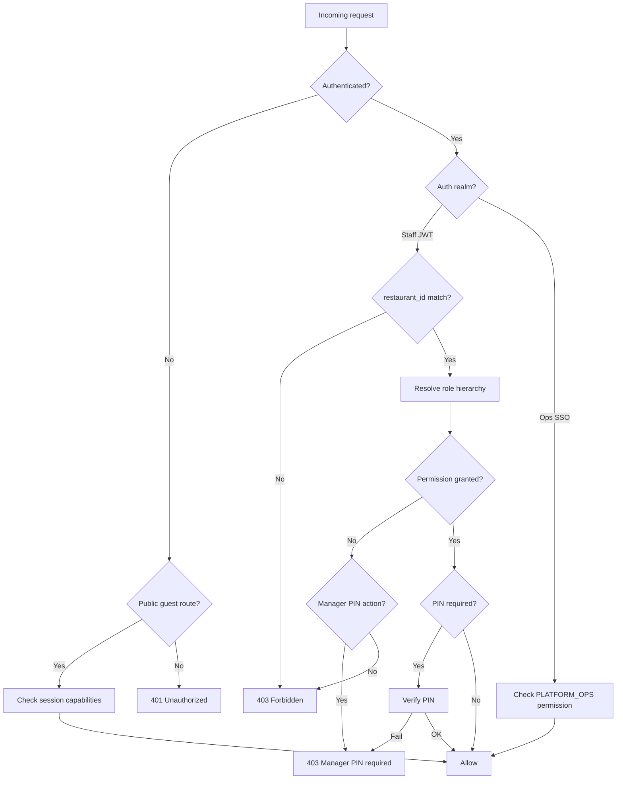

# RBAC Matrix — Rekentafel Product Surfaces

**Product (working name):** Rekentafel  
**Slice:** Role-Based Surfaces and RBAC Matrix  
**Status:** Blueprint — execution-ready  
**Last updated:** 2026-06-26  
**Companion:** [surface-map.md](./surface-map.md), [screen-inventory.md](./screen-inventory.md)

---

## Role Model Overview

Six **logical roles** map to four **auth realms**. Guest is capability-based (session state), not a staff RBAC role.

| Role | Auth realm | Scope | Maps to `staff_role` enum |
|------|------------|-------|---------------------------|
| **Guest** | Guest session cookie | Single table / payment session | — |
| **Waiter** | Staff JWT | Single restaurant (venue) | `WAITER` |
| **Shift lead** | Staff JWT | Single restaurant | `MANAGER` |
| **Restaurant admin** | Admin JWT | Single restaurant | `ADMIN` |
| **Platform ops** | Ops SSO JWT | Global (all tenants) | `PLATFORM_OPS` |
| **Partner admin** | Partner SSO JWT | Single partner org | `PARTNER_ADMIN` (post-MVP) |

**Hierarchy (restaurant-scoped):** `ADMIN` ⊃ `MANAGER` ⊃ `WAITER` — higher roles inherit lower permissions unless explicitly restricted.

**Platform ops** and **partner admin** are **orthogonal** — no inheritance from restaurant roles.

---

## Permission Naming Convention

Permissions use `resource:action` strings. API middleware checks `(role, permission, restaurant_id scope)`.

Examples: `bill:edit`, `payment_session:open`, `audit:read_global`.

---

## Master Permission Catalog

### Guest capabilities (session-scoped)

| Permission ID | Description | MVP |
|---------------|-------------|-----|
| `menu:read` | Browse menu for table's restaurant | Yes |
| `signal:create` | Send call-server / ready-to-order | Yes |
| `payment_session:join` | Join with valid token/PIN | Yes |
| `bill:read_session` | View bill in joined payment session | Yes |
| `claim:create_own` | Claim/release/edit own claims | Yes |
| `split:equal_create` | Create equal split among subset | Yes |
| `split:custom_create` | Pay custom amount toward balance | Yes |
| `tip:set_own` | Set tip on own checkout | Yes |
| `checkout:create_own` | Start Mollie payment for self | Yes |
| `account:link_optional` | Link email post-payment (Flow K) | Yes |
| `loyalty:view_own` | View own points (minimal MVP) | Yes |
| `bill:read_public` | View bill without token | **Never** |
| `order:create` | Submit kitchen order | **Never** |

### Staff / admin permissions (restaurant-scoped)

| Permission ID | Description | MVP |
|---------------|-------------|-----|
| `floor:read` | View floor plan and table states | Yes |
| `dining_session:start` | Start table / dining session | Yes |
| `dining_session:close` | Close table after payment | Yes |
| `service_signal:read` | View signal queue | Yes |
| `service_signal:ack` | Acknowledge signal | Yes |
| `bill:read` | View bill for any table | Yes |
| `bill:edit` | Add/remove/modify lines | Yes |
| `bill:lock` | Lock bill during edit | Yes |
| `bill:mark_shared` | Flag line as shared | Yes |
| `payment_session:open` | Activate payment mode + token | Yes |
| `payment_session:refresh_token` | Rotate join token/PIN | Yes |
| `payment_session:cancel` | Cancel payment mode (no successful pays) | Yes |
| `payment_session:monitor` | View participant payment status | Yes |
| `claim:override` | Reassign/release any claim | Yes |
| `claim:freeze` | Freeze guest claiming | Yes |
| `table:force_close` | Close with unpaid remainder + reason | Yes |
| `refund:initiate` | Start Mollie refund | Yes |
| `external_payment:record` | Mark cash/terminal payment | Yes |
| `shift:summary_export` | Export shift CSV | Yes |
| `staff:read` | View staff list | Yes |
| `staff:invite` | Invite staff | Yes |
| `staff:role_assign` | Change staff roles | Yes |
| `staff:deactivate` | Deactivate staff account | Yes |
| `menu:manage` | CRUD menu | Yes |
| `tables:manage` | CRUD tables + QR export | Yes |
| `settings:venue` | Service charge, tip policy, hours | Yes |
| `payments:mollie_connect` | OAuth Mollie | Yes |
| `audit:read_venue` | Venue-filtered audit log | Yes |
| `onboarding:complete` | Go-live checklist | Yes |
| `pos:import` | POS read-only import | V1.1 |
| `loyalty:configure` | Venue loyalty rules | V2 |
| `franchise:rollup_read` | Multi-venue analytics | Never early |

### Platform ops permissions (global)

| Permission ID | Description | MVP |
|---------------|-------------|-----|
| `tenant:create` | Create restaurant record | Yes |
| `tenant:suspend` | Suspend restaurant | Yes |
| `tenant:feature_flags` | Toggle flags e.g. `live` | Yes |
| `audit:read_global` | Cross-tenant audit log | Yes |
| `webhook:read` | View webhook events | Yes |
| `webhook:replay` | Replay failed webhook job | Yes |
| `webhook:dlq_manage` | DLQ retry/discard | Yes |
| `reconciliation:run` | Trigger/manual reconcile | Yes |
| `payment:trace` | Payment intent debugger | Yes |
| `chargeback:manage` | Chargeback queue | Yes |
| `impersonate:read_only` | View-as support | Yes |
| `impersonate:write` | Break-glass override | Never MVP |
| `partner:manage` | Partner tenant CRUD | V2 |

### Partner admin permissions (post-MVP)

| Permission ID | Description | Phase |
|---------------|-------------|-------|
| `voucher:crud` | Manage own voucher SKUs | V2 |
| `redemption:read` | View redemptions | V2 |
| `settlement:read` | Settlement reports | V2 |
| `partner_api:manage` | API keys | V2+ |
| `stored_value:issue` | Issue spendable balance | **Never** |

---

## Role × Permission Matrix — Guest Web App

| Permission | Guest (not joined) | Guest (joined session) | Guest (account linked) |
|------------|:------------------:|:------------------------:|:----------------------:|
| `menu:read` | ✓ | ✓ | ✓ |
| `signal:create` | ✓ | ✓ | ✓ |
| `payment_session:join` | ✓ (gate) | — | ✓ |
| `bill:read_session` | ✗ | ✓ | ✓ |
| `claim:create_own` | ✗ | ✓ | ✓ |
| `split:equal_create` | ✗ | ✓ | ✓ |
| `split:custom_create` | ✗ | ✓ | ✓ |
| `tip:set_own` | ✗ | ✓ | ✓ |
| `checkout:create_own` | ✗ | ✓ | ✓ |
| `account:link_optional` | ✗ | ✓ | ✓ |
| `loyalty:view_own` | ✗ | ✗ | ✓ |
| `bill:read_public` | ✗ | ✗ | ✗ |

**Guest session constraints (not permissions but enforced):**

| Constraint | Rule |
|------------|------|
| Join token TTL | 15 min; refreshed on waiter action |
| PIN brute force | Lock 15 min after 5 failures |
| Signal rate limit | 5 signals / hour / IP / table |
| Checkout minimum | €0.50 (Mollie floor) |
| Max participants | 12 default; waiter override |

---

## Role × Permission Matrix — Staff Panel

| Permission | Waiter | Shift lead | Restaurant admin |
|------------|:------:|:----------:|:----------------:|
| `floor:read` | ✓ | ✓ | ✓ |
| `dining_session:start` | ✓ | ✓ | ✓ |
| `dining_session:close` | ✓* | ✓ | ✓ |
| `service_signal:read` | ✓ | ✓ | ✓ |
| `service_signal:ack` | ✓ | ✓ | ✓ |
| `bill:read` | ✓ | ✓ | ✓ |
| `bill:edit` | ✓ | ✓ | ✓ |
| `bill:lock` | ✓ | ✓ | ✓ |
| `bill:mark_shared` | ✓ | ✓ | ✓ |
| `payment_session:open` | ✓ | ✓ | ✓ |
| `payment_session:refresh_token` | ✓ | ✓ | ✓ |
| `payment_session:cancel` | ✗ | ✓ | ✓ |
| `payment_session:monitor` | ✓ | ✓ | ✓ |
| `claim:override` | ✗ | ✓ | ✓ |
| `claim:freeze` | ✗ | ✓ | ✓ |
| `table:force_close` | ✗ | ✓† | ✓ |
| `refund:initiate` | ✗ | ✓ | ✓ |
| `external_payment:record` | ✗ | ✓ | ✓ |
| `shift:summary_export` | ✗ | ✓ | ✓ |

\* Waiter may close only when `remaining_cents ≤ 0`.  
† Shift lead force-close requires manager PIN + reason code.

**Restaurant admin on staff panel:** Admin role **inherits all staff permissions** — admins may operate floor without separate account if permitted by venue policy (config flag `admin_can_use_staff_panel`, default true).

---

## Role × Permission Matrix — Restaurant Admin Dashboard

| Permission | Waiter | Shift lead | Restaurant admin |
|------------|:------:|:----------:|:----------------:|
| `staff:read` | ✗ | ✗ | ✓ |
| `staff:invite` | ✗ | ✗ | ✓ |
| `staff:role_assign` | ✗ | ✗ | ✓ |
| `staff:deactivate` | ✗ | ✗ | ✓ |
| `menu:manage` | ✗ | ✗ | ✓ |
| `tables:manage` | ✗ | ✗ | ✓ |
| `settings:venue` | ✗ | ✗ | ✓ |
| `payments:mollie_connect` | ✗ | ✗ | ✓ |
| `audit:read_venue` | ✗ | ✓ | ✓ |
| `onboarding:complete` | ✗ | ✗ | ✓ |
| `refund:initiate` | ✗ | ✓ | ✓ |
| `pos:import` | ✗ | ✗ | V1.1 |
| `loyalty:configure` | ✗ | ✗ | V2 |

**Note:** Shift lead may access **venue audit log** read-only for dispute resolution; cannot invite staff or change Mollie.

---

## Role × Permission Matrix — Platform Ops Dashboard

| Permission | Platform ops | Restaurant admin | Partner admin |
|------------|:------------:|:----------------:|:-------------:|
| `tenant:create` | ✓ | ✗ | ✗ |
| `tenant:suspend` | ✓ | ✗ | ✗ |
| `tenant:feature_flags` | ✓ | ✗ | ✗ |
| `audit:read_global` | ✓ | ✗ | ✗ |
| `audit:read_venue` | ✓ (any tenant) | ✓ (own) | ✗ |
| `webhook:read` | ✓ | ✗ | ✗ |
| `webhook:replay` | ✓ | ✗ | ✗ |
| `webhook:dlq_manage` | ✓ | ✗ | ✗ |
| `reconciliation:run` | ✓ | ✗ | ✗ |
| `payment:trace` | ✓ | ✗ | ✗ |
| `chargeback:manage` | ✓ | ✗ | ✗ |
| `impersonate:read_only` | ✓ | ✗ | ✗ |
| `partner:manage` | V2 | ✗ | ✗ |
| `voucher:crud` | ✗ | ✗ | V2 (own org) |

---

## Role × Permission Matrix — Partner Dashboard (POST-MVP)

| Permission | Partner admin | Platform ops | Restaurant admin |
|------------|:-------------:|:------------:|:----------------:|
| `voucher:crud` | ✓ | ✗ | ✗ |
| `redemption:read` | ✓ (own SKUs) | ✓ (support) | ✗ |
| `settlement:read` | ✓ | ✓ | ✗ |
| `stored_value:issue` | **Never** | **Never** | **Never** |

---

## Surface Access Matrix (Login Required)

| Surface / Route prefix | Guest | Waiter | Shift lead | Rest. admin | Platform ops | Partner admin |
|------------------------|:-----:|:------:|:----------:|:-----------:|:------------:|:-------------:|
| `/t/*` guest web | ✓ | ✓‡ | ✓‡ | ✓‡ | ✓‡ | ✓‡ |
| `/staff/*` | ✗ | ✓ | ✓ | ✓ | ✗§ | ✗ |
| `/admin/*` | ✗ | ✗ | ✗ | ✓ | ✗§ | ✗ |
| `/ops/*` | ✗ | ✗ | ✗ | ✗ | ✓ | ✗ |
| `/partners/*` | ✗ | ✗ | ✗ | ✗ | ✗ | V2 |

‡ Anyone may scan guest QR; staff use guest app as diner when off-duty — same guest rules.  
§ Platform ops uses impersonation, not staff/admin login.

---

## Manager PIN Override (Shift Lead)

Sensitive actions require **re-authentication** via 4–6 digit manager PIN (stored as `pin_hash` on `staff_members` with `role >= MANAGER`).

| Action | Requires PIN | Roles allowed |
|--------|:------------:|---------------|
| `claim:override` | Yes | Shift lead, admin |
| `claim:freeze` | Yes | Shift lead, admin |
| `table:force_close` | Yes | Shift lead, admin |
| `payment_session:cancel` | Yes | Shift lead, admin |
| `refund:initiate` | Yes | Shift lead, admin |
| `external_payment:record` | Yes | Shift lead, admin |
| `bill:edit` after payment opened | Optional venue flag | Waiter+ |

**Audit:** Every PIN-gated action emits `staff.override` with `staff_id`, `action`, `table_id`, `reason?`.

---

## Authorization Decision Flow (API)



---

## Multi-Tenant Isolation Rules

| Rule | Enforcement |
|------|-------------|
| Staff JWT contains `restaurant_id` | All queries filter `WHERE restaurant_id = :jwt.restaurant_id` |
| Admin cannot access `/ops` | Separate issuer + audience claim |
| Ops read-only impersonation | Synthetic read token; no write scopes |
| Guest session binds `table_id` | Cannot join payment session for other table |
| Partner admin binds `partner_org_id` | V2; no restaurant FK |
| Platform ops break-glass write | Not in MVP — ticket + dual control |

---

## Example Scenarios (concrete)

### Scenario 1 — Waiter opens payment (allowed)

| Field | Value |
|-------|-------|
| Role | Waiter |
| Action | `payment_session:open` |
| Table | T12, bill €105.60, status DINING |
| Result | **Allow** — token issued, PIN displayed |

### Scenario 2 — Waiter force-closes unpaid table (denied)

| Field | Value |
|-------|-------|
| Role | Waiter |
| Action | `table:force_close` |
| Remaining | €24.39 |
| Result | **403** — `MANAGER_PIN_REQUIRED` / insufficient role |

### Scenario 3 — Shift lead reassigns claim (allowed with PIN)

| Field | Value |
|-------|-------|
| Role | Shift lead |
| Action | `claim:override` — move 1× burger from Guest A to B |
| PIN | Valid |
| Result | **Allow** — audit `claim.admin_override` |

### Scenario 4 — Guest views bill without token (denied)

| Field | Value |
|-------|-------|
| Role | Guest (not joined) |
| URL | `/t/de-gouden-schaar/12/pay/bill` (no `ps` token) |
| Result | **Redirect** to join gate — `bill:read_public` never granted |

### Scenario 5 — Platform ops replays webhook (allowed)

| Field | Value |
|-------|-------|
| Role | Platform ops |
| Action | `webhook:replay` on `tr_abc123` |
| Result | **Allow** — idempotent worker job enqueued |

### Scenario 6 — Restaurant admin accesses global audit (denied)

| Field | Value |
|-------|-------|
| Role | Restaurant admin |
| Route | `/ops/audit` |
| Result | **403** — wrong auth realm |

---

## RBAC Risks Register

| ID | Risk | Affected roles | Severity | Mitigation |
|----|------|----------------|----------|------------|
| RB-1 | Shared waiter login on floor tablet | Waiter | High | Per-device staff login; session timeout 8h |
| RB-2 | Admin demotes self last admin | Restaurant admin | Med | Block if last ADMIN |
| RB-3 | Ops impersonation writes payment | Platform ops | Critical | Read-only impersonation MVP |
| RB-4 | Shift lead PIN shared verbally | Shift lead | Med | PIN rotation; audit alerts |
| RB-5 | JWT restaurant_id tampering | All staff | Critical | Signed JWT; server-side validation |
| RB-6 | Partner admin views guest PII | Partner admin | High | Deferred; redemption shows pseudonymized IDs only |
| RB-7 | Guest joins wrong table via PIN typo | Guest | Low | PIN scoped to active payment session only |

---

## Implementation Constants (for shared `packages/rbac`)

```typescript
export enum StaffRole {
  WAITER = 'WAITER',
  MANAGER = 'MANAGER',      // shift lead
  ADMIN = 'ADMIN',          // restaurant admin
  PLATFORM_OPS = 'PLATFORM_OPS',
}

export enum PartnerRole {
  PARTNER_ADMIN = 'PARTNER_ADMIN', // post-MVP
}

/** MANAGER inherits WAITER; ADMIN inherits MANAGER */
export const ROLE_INHERITANCE: Record<StaffRole, StaffRole[]> = {
  [StaffRole.WAITER]: [],
  [StaffRole.MANAGER]: [StaffRole.WAITER],
  [StaffRole.ADMIN]: [StaffRole.MANAGER, StaffRole.WAITER],
  [StaffRole.PLATFORM_OPS]: [], // separate realm
};
```

---

## MVP vs Post-MVP Permission Changes

| Permission | MVP | Change in later phase |
|------------|-----|------------------------|
| `pos:import` | Off | Enable V1.1 for ADMIN |
| `loyalty:configure` | Off | Enable V2 for ADMIN |
| `voucher:crud` | Off | Enable V2 for PARTNER_ADMIN |
| `impersonate:write` | Off | Never without legal review |
| `franchise:rollup_read` | Off | Never early |

---

## Related Artifacts

- [surface-map.md](./surface-map.md) — surface purposes and features
- [screen-inventory.md](./screen-inventory.md) — routes per surface
- [../architecture/data-model/entity-dictionary.md](../architecture/data-model/entity-dictionary.md) — `staff_members.role`
- [../flows/error-state-matrix.md](../flows/error-state-matrix.md) — `STAFF_FORBIDDEN`, `MANAGER_PIN_REQUIRED`

---

*Slice ownership: Part 3 — RBAC Matrix.*
