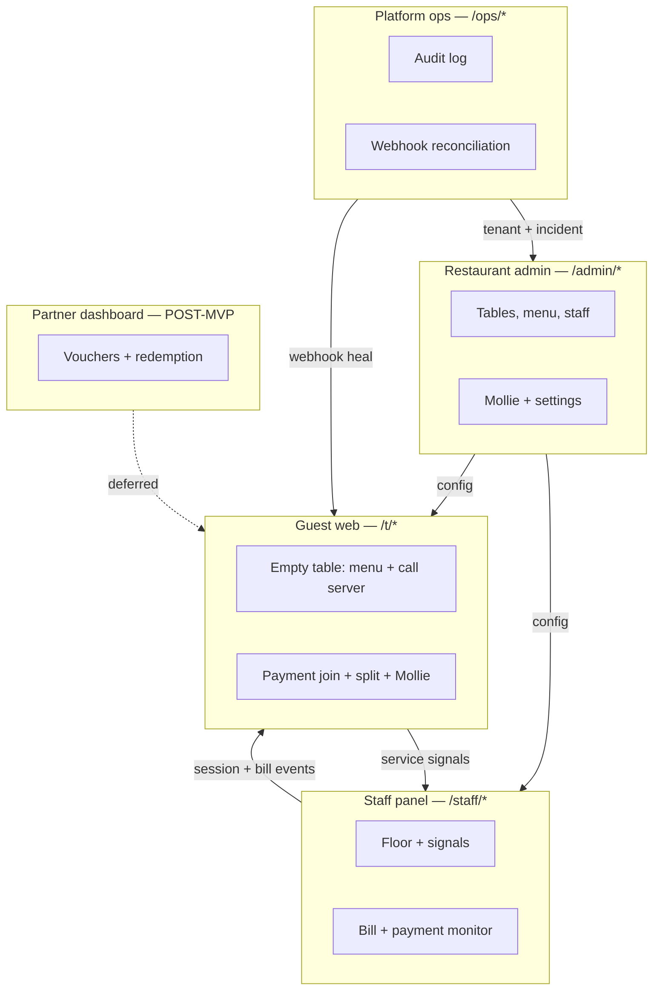
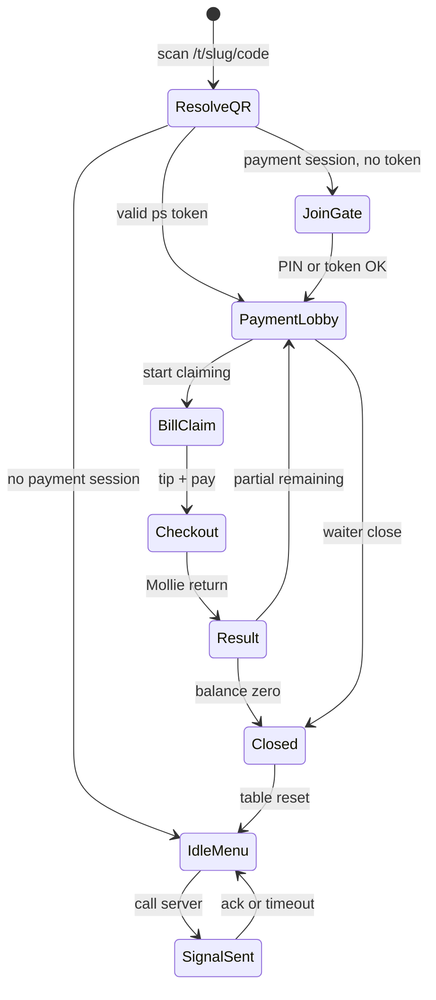
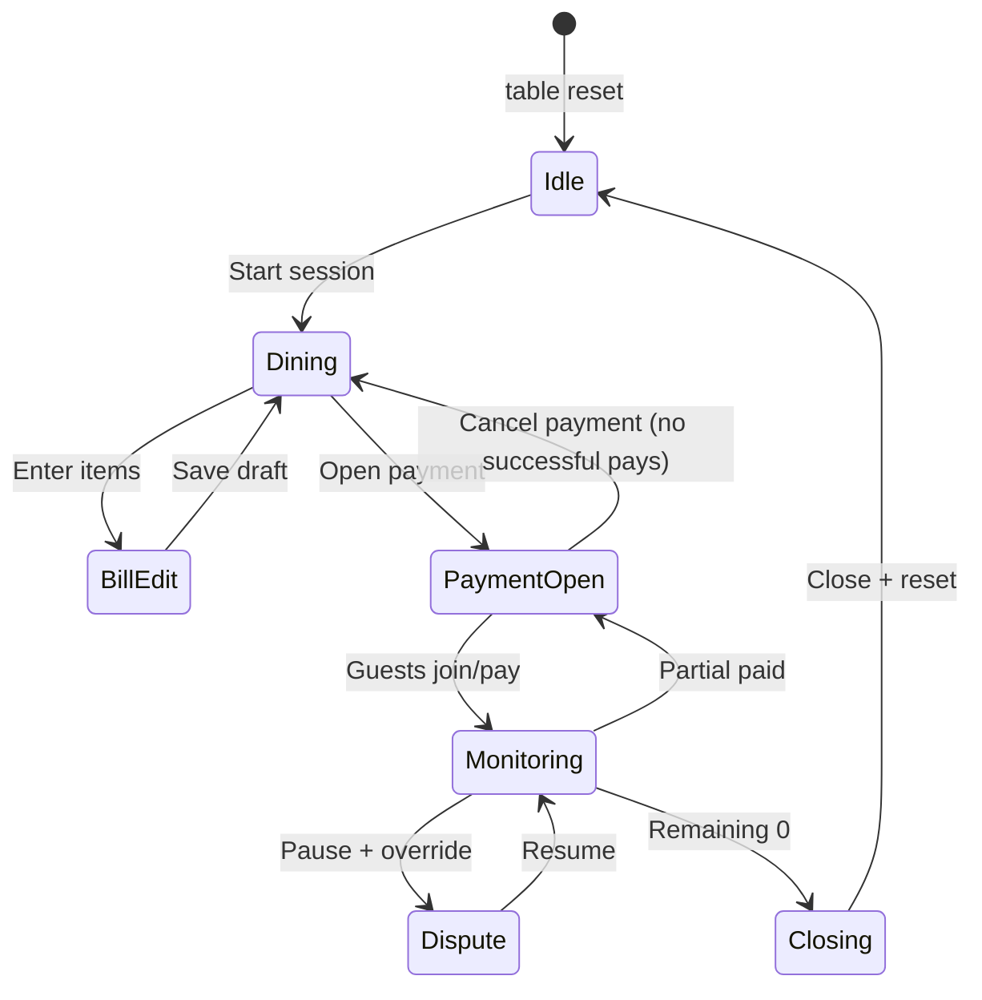
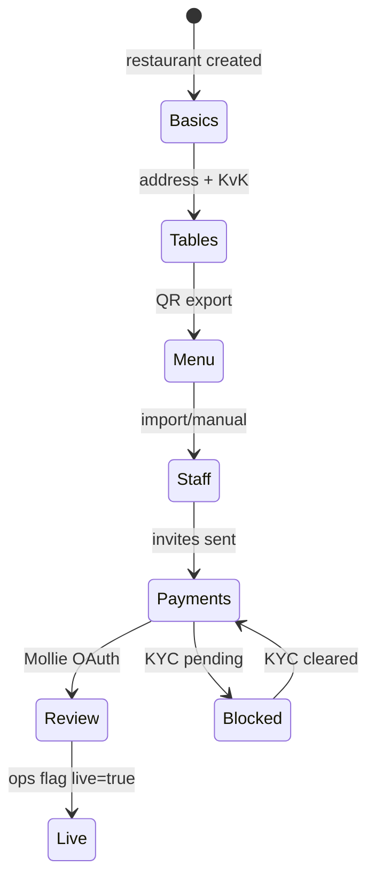

# PART 3 — Role-Based Product Surfaces

**Product (working name):** Rekentafel  
**Market:** Netherlands-first hospitality fintech  
**Slice:** Role-Based Surfaces and RBAC Matrix  
**Status:** Blueprint — execution-ready  
**Last updated:** 2026-06-26  
**Companion artifacts:** [rbac-matrix.md](./rbac-matrix.md), [screen-inventory.md](./screen-inventory.md), [../flows/flows-a-o.md](../flows/flows-a-o.md)

---

## Executive Summary

Rekentafel ships as **five distinct product surfaces** sharing one backend but **separate auth realms, route namespaces, and permission models**. MVP requires four surfaces live at pilot; the **partner rewards dashboard is post-MVP only** (placeholder design below).

| Surface | Primary users | Auth | MVP | Base path |
|---------|---------------|------|-----|-----------|
| Guest web app | Diners at table | Anonymous session + optional account | **Yes** | `/t/:slug/:tableCode` |
| Staff panel | Waiters, shift leads | Staff login (venue-scoped) | **Yes** | `/staff` |
| Restaurant admin | Owner, GM, finance | Admin login (venue-scoped) | **Yes** | `/admin` |
| Platform ops | Rekentafel internal ops | SSO + MFA | **Yes** | `/ops` |
| Partner rewards | Partner brand admins | Partner SSO | **No (post-MVP)** | `/partners` |

**Security invariant (all surfaces):** Persistent table QR never exposes live bill or payment controls without a **waiter-activated payment session token** (see Flow D).

---

## Surface Relationship Map



---

## 1. Guest Web App

### Purpose

Mobile-responsive web experience opened when a guest scans a **persistent table QR**. Before payment mode: browse menu, see table context, signal waiter — **no ordering, no bill**. After waiter opens payment: join session, claim/split items, tip, pay via Mollie.

**Why web-only MVP:** QR → browser is zero-friction; native apps deferred per [scope-boundary.md](../product/scope-boundary.md).

### Primary flows served

| Flow | MVP | Guest surface responsibility |
|------|-----|------------------------------|
| A — Empty-table QR scan | Yes | Landing, menu, table context |
| B — Call server / ready to order | Yes | Signal form + confirmation |
| D — Payment join | Yes | Join gate, PIN, lobby |
| E — Item claiming | Yes | Bill list, claim sheet |
| F — Equal split | Yes | Participant picker, preview |
| G — Custom amount | Yes | Keypad, allocation preview |
| H — Shared items | Yes | Shared badge, split panel |
| I — Tip | Yes | Tip presets, checkout summary |
| J — Payment result / partial pay | Yes | Success, failure, remaining balance |
| K — Loyalty accrual | Minimal | Post-pay account link only |
| L — Overpay-to-rewards | **Deferred** | No UI |
| M — Partner redemption | **Deferred** | No UI |

### Key screens (MVP)

| Screen | Route (see inventory) | Entry condition |
|--------|----------------------|-----------------|
| Table landing | `/t/:slug/:tableCode` | Always (QR resolve) |
| Menu browser | `.../menu`, `.../menu/:category` | `table.status ∈ {IDLE, DINING}` |
| Call server | `.../signal` | Flow B |
| Join gate | `.../pay/join` | Payment session exists, no token |
| Payment lobby | `.../pay/lobby` | Valid join token |
| Bill + claims | `.../pay/bill` | Joined participant |
| Split modes | `.../pay/split/equal`, `.../pay/split/custom` | Flow F/G |
| Tip + checkout | `.../pay/checkout` | Flow I |
| Payment return | `.../pay/result/:paymentId` | Mollie redirect |
| Session closed | `.../pay/closed` | Table reset or session ended |
| Account (optional) | `/account`, `/account/visits` | Flow K minimal |

### Permissions (guest)

Guests are **not RBAC staff**; access is **capability-based** on session state:

| Capability | Granted when | Denied when |
|------------|--------------|-------------|
| View menu | Restaurant active | Restaurant suspended |
| Send service signal | Table not closed | Rate limit exceeded (5/hr/IP) |
| View bill lines | Joined payment session + valid token | Raw QR only, expired token |
| Create/edit own claims | Payment session OPEN/PARTIALLY_PAID | Bill locked, claims frozen |
| Pay share | Checkout amount ≥ €0.50 | Session closed, Mollie unavailable |
| View other participants | Joined lobby | Not joined |
| Manager override | Never | — |

### Must-have MVP features

1. **State-aware QR resolve** — idle vs dining vs payment vs closed (no bill leak).
2. **Service signal** — "Call server" / "Ready to order" with throttle and ack polling.
3. **Join gate** — 6-digit PIN or `?ps=` token; brute-force lock after 5 failures / 15 min.
4. **Real-time bill view** — WebSocket or 3s poll; claim avatars on lines.
5. **Split modes** — claim items, equal remainder, custom amount toward balance.
6. **Shared item display** — waiter-flagged lines with equal split among N participants.
7. **VAT + service charge breakdown** — expandable footer; 9%/21% NL display note.
8. **Per-guest tip** — 0% prominent; basis = participant share only.
9. **Mollie hosted checkout** — iDEAL default; return URL handling.
10. **Partial payment UX** — remaining balance banner for all participants.
11. **i18n** — NL default, EN secondary; localStorage language persist.
12. **Accessibility** — 44px touch targets, WCAG AA contrast for payment flows.

### Future features (post-MVP)

| Feature | Phase | Notes |
|---------|-------|-------|
| Optional guest account + visit history | V1.1 | Single-venue receipts |
| Geo/proximity join gate | V1.1 | Fraud reduction; optional per venue |
| PWA install prompt | V1.1 | Still not native app |
| In-session chat | Never early | Moderation risk |
| Discovery / nearby restaurants | Never early | Out of product wedge |
| Crypto checkout toggle | V2+ | Separate regulated rail |
| Overpay-to-rewards UI | Deferred | Flow L — EMI risk |
| Partner voucher redemption | V2+ | Flow M |
| ML menu recommendations | V2+ | GDPR + cold start |

### Guest surface state machine (routing)



### Slice-specific risks (guest)

| ID | Risk | Severity | MVP mitigation |
|----|------|----------|----------------|
| GS-1 | Remote hijacker joins via leaked token | High | 15-min TTL, 6-digit PIN, waiter line-of-sight |
| GS-2 | Bill visible from QR photo at home | Med | No bill without token; menu only |
| GS-3 | Wrong claims / social pressure | Med | Waiter override on staff panel |
| GS-4 | GDPR device fingerprint | Med | Minimize; 90-day retention |
| GS-5 | Tip vs service charge confusion | Med | Explicit copy; finance-reviewed labels |
| GS-6 | Loyalty UI implies stored wallet | Med | Points non-transferable; no cash-out copy |

---

## 2. Waiter / Staff Panel

### Purpose

Floor operations console for **seating, service signals, bill entry, payment activation, claim overrides, and table close**. Optimized for phone/tablet mobile web — large touch targets, color-coded table states.

**Waiter authority invariant:** Staff panel is the **only** surface that can open payment mode, edit authoritative bill lines, and force-close tables.

### Primary flows served

| Flow | MVP | Staff responsibility |
|------|-----|---------------------|
| B — Service signals | Yes | Queue, acknowledge |
| C — Start table session | Yes | Floor plan, start dining |
| C/D — Open payment + token | Yes | Issue token, display PIN |
| O — Daily ops loop | Yes | Full shift dashboard |
| E/H — Claim override | Yes | Reassign, freeze claims |
| J — Payment monitor | Yes | Remaining balance, close table |
| N — Onboarding assist | Partial | Manager-led; staff invites in admin |

### Key screens (MVP)

| Screen | Route | Roles |
|--------|-------|-------|
| Staff login | `/staff/login` | All staff |
| Shift dashboard | `/staff` | Waiter+ |
| Floor plan | `/staff/floor` | Waiter+ |
| Table detail | `/staff/tables/:tableId` | Waiter+ |
| Service signals queue | `/staff/signals` | Waiter+ |
| Bill editor | `/staff/tables/:tableId/bill` | Waiter+ |
| Payment monitor | `/staff/tables/:tableId/payment` | Waiter+ |
| Claim overrides | `/staff/tables/:tableId/claims` | Shift lead+ |
| Table timeline (audit) | `/staff/tables/:tableId/timeline` | Shift lead+ |
| Manager PIN modal | overlay | Shift lead+ actions |

### Permissions summary

See [rbac-matrix.md](./rbac-matrix.md). **Waiter** runs floor; **shift lead** (MANAGER) adds overrides, refunds initiation, force-close; **restaurant admin** inherits all staff permissions via admin surface.

### Must-have MVP features

1. **Authenticated staff session** — venue-scoped JWT; 8-hour shift TTL.
2. **Floor overview** — tables color-coded: grey idle, blue dining, amber payment, green paid/closed.
3. **Service signal queue** — real-time list from Flow B; one-tap acknowledge.
4. **Start dining session** — party size optional; creates `dining_session`.
5. **Manual bill editor** — add/remove lines, qty, unit price, VAT rate, shared flag, service charge toggle.
6. **Bill validation** — block open payment if total mismatch or empty bill.
7. **Open payment** — confirmation modal; issues token + rotating 6-digit PIN display.
8. **Refresh token** — invalidates old guest links; audit logged.
9. **Payment progress** — per-participant paid/unpaid; remaining €X.XX.
10. **Claim admin override** — reassign, release, freeze claims (shift lead+).
11. **Lock bill for edit** — pauses guest claims during line changes.
12. **Close table** — blocked until remaining ≤ €0.01 or manager force-close with reason.
13. **External payment marker** — Mollie outage → `external_payment` audit flag.
14. **Reconnect banner** — WebSocket drop → poll fallback.

### Future features (post-MVP)

| Feature | Phase |
|---------|-------|
| POS read-only bill import | V1.1 |
| Push notifications for signals | V1.1 |
| Section assignment (waiter zones) | V1.1 |
| Shift handoff notes | V1.1 |
| Bi-directional POS sync | V2 |
| Native staff app | V2 eval |
| Automated geo-fraud alerts | V1.1 |

### Staff table action state (per table)



### Example: shift lead override (numeric)

Table T12, bill €105.60. Guest A claimed both burgers; Guest B disputes.

| Step | Actor | Action | Result |
|------|-------|--------|--------|
| 1 | Waiter | Pause payment mode | `claims_frozen=true` |
| 2 | Shift lead | Reassign 1 burger A→B | `claim.admin_override` |
| 3 | Waiter | Resume payment | Guests refresh; checkout recalc |

### Slice-specific risks (staff)

| ID | Risk | Mitigation |
|----|------|------------|
| SS-1 | Waiter forgets open payment | Training; prominent "Refresh PIN" |
| SS-2 | Fat-finger bill delete | Confirm dialog; soft delete |
| SS-3 | Two waiters edit same table | Optimistic lock + colleague message |
| SS-4 | Manager PIN shared | PIN rotation; audit by staff_id |
| SS-5 | Close table with remaining balance | Hard block unless force-close reason |

---

## 3. Restaurant Admin Dashboard

### Purpose

**Venue configuration and business operations** for restaurant owner, general manager, and finance: onboarding, tables/QRs, menu, staff roles, Mollie connection, tipping policy, reports. Does **not** replace real-time floor console — admins may use staff panel but config lives here.

### Primary flows served

| Flow | MVP | Admin responsibility |
|------|-----|---------------------|
| N — Restaurant onboarding | Yes | Wizard, Mollie OAuth, go-live |
| O — Ops configuration | Yes | Service charge, tip mode, hours |
| K — Loyalty rules (venue-only) | Post-MVP | Simple stamp rules V2 |
| J — Refund initiation | Yes | Link to Mollie + audit |

### Key screens (MVP)

| Screen | Route | Notes |
|--------|-------|-------|
| Admin login | `/admin/login` | |
| Dashboard home | `/admin` | KPIs: sessions, GMV, open tables |
| Onboarding wizard | `/admin/onboarding/*` | Flow N steps |
| Tables & QR | `/admin/tables` | CRUD, batch PDF export |
| Menu manager | `/admin/menu` | Categories, items, allergens |
| Menu import | `/admin/menu/import` | CSV upload |
| Staff & roles | `/admin/staff` | Invite, role assign |
| Payments / Mollie | `/admin/payments` | OAuth status, test mode |
| Venue settings | `/admin/settings` | Service charge, tip policy, hours |
| Reports | `/admin/reports` | Shift summaries, tip export CSV |
| Audit log (venue) | `/admin/audit` | Filtered tenant view |
| Refunds | `/admin/refunds` | Initiate + status |

### Must-have MVP features

1. **Onboarding wizard** — basics, tables, menu, staff, Mollie, review (Flow N).
2. **Table CRUD** — `table_code`, display name, QR batch PDF (A4 sticker template).
3. **Menu CRUD** — categories, items, price, VAT rate, allergen tags (display-only for guests).
4. **Staff invites** — email invite; roles: waiter, shift lead, admin.
5. **Mollie Connect handoff** — OAuth; show connected/disabled/pending KYC.
6. **Test mode toggle** — simulate bills without live charges until go-live checklist complete.
7. **Service charge config** — % optional; shown on guest bill footer.
8. **Tip policy flag** — `pass_through_pool` vs `restaurant_retained` (MVP default: pass-through).
9. **Venue audit log** — claims, payments, overrides for own `restaurant_id` only.
10. **Go-live checklist gate** — menu ≥1 item, tables ≥1, Mollie connected, ≥1 admin, ≥1 waiter.
11. **Refund initiation UI** — creates Mollie refund request; links to platform ops on failure.

### Future features (post-MVP)

| Feature | Phase |
|---------|-------|
| Multi-venue roll-up (franchise) | Never MVP/V1.1 |
| POS integration settings | V1.1 read-only |
| Loyalty campaign editor | V2 |
| Advanced analytics / cohort | V2 |
| Custom branding (logo, colors) | V1.1 |
| API keys for exports | V2 |
| Coalition partner settings | V2+ |

### Onboarding wizard state (Flow N)



### Slice-specific risks (admin)

| ID | Risk | Mitigation |
|----|------|------------|
| RA-1 | Merchant of record confusion | Contract + UI: restaurant is seller |
| RA-2 | Wrong VAT on menu import | Validation warnings; bill entry authoritative |
| RA-3 | Mollie KYC delay blocks pilot | Test mode; menu QR still works |
| RA-4 | Admin deletes table mid-service | Soft delete; block if open session |
| RA-5 | Tip policy misconfiguration | Default pass-through; finance doc |

---

## 4. Platform Operations Dashboard

### Purpose

**Internal Rekentafel operator console** for multi-tenant support: restaurant lifecycle, incident response, **global audit log**, **Mollie webhook reconciliation**, chargeback queue, feature flags. Not accessible to restaurant staff.

### Primary flows served

| Flow | MVP | Ops responsibility |
|------|-----|---------------------|
| N — Onboarding assist | Yes | White-glove tenant create, go-live |
| J — Webhook failures | Yes | Reconcile tool, manual heal |
| J — Chargebacks | Yes | Manual queue (no automation MVP) |
| O — Cross-venue incidents | Yes | Support tickets linked to tables |

### Key screens (MVP)

| Screen | Route | MVP required |
|--------|-------|--------------|
| Ops login (SSO) | `/ops/login` | Yes |
| Ops home | `/ops` | Yes |
| Restaurant directory | `/ops/restaurants` | Yes |
| Restaurant detail | `/ops/restaurants/:id` | Yes |
| Feature flags | `/ops/restaurants/:id/flags` | Yes |
| **Audit log (global)** | `/ops/audit` | **Yes — acceptance criterion** |
| **Webhook reconciliation** | `/ops/webhooks` | **Yes — acceptance criterion** |
| Webhook event detail | `/ops/webhooks/:eventId` | Yes |
| Payment intent trace | `/ops/payments/:intentId` | Yes |
| DLQ / failed webhooks | `/ops/webhooks/dlq` | Yes |
| Reconciliation jobs | `/ops/reconciliation` | Yes |
| Chargeback queue | `/ops/chargebacks` | Yes |
| Impersonation (read-only) | `/ops/impersonate` | Yes — audit every action |
| System health | `/ops/health` | Yes |

### Must-have MVP features

1. **Global audit log viewer** — filter by `restaurant_id`, `table_id`, `event_type`, `actor`, time range; export CSV.
2. **Webhook ingestion monitor** — ingress count, queue depth, processing latency, error rate.
3. **Webhook reconciliation workspace** — compare Mollie `GET /v2/payments/{id}` vs internal `payment_intents`; actions: replay, mark reconciled, escalate.
4. **DLQ management** — list failed jobs, retry, discard with reason (see [webhook-reconciliation.md](../architecture/payments/webhook-reconciliation.md)).
5. **Payment intent trace** — join participant → allocation → Mollie tr_id → webhook events → bill remaining.
6. **Daily reconcile job status** — last run, mismatches found, auto-healed count.
7. **Restaurant lifecycle** — create tenant, suspend, activate; `restaurant.live` flag.
8. **Chargeback manual queue** — snapshot claims at payment time; assign ops owner.
9. **Read-only impersonation** — view guest/staff screen state for support; **no** pay or override without break-glass.
10. **Alerting hooks** — webhook DLQ >10, reconcile mismatch >€1, Mollie API errors.

### Webhook reconciliation screen (MVP behavior)

Example row when guest paid €20.24 but webhook delayed:

| Field | Mollie API | Internal DB | Match |
|-------|------------|-------------|-------|
| `tr_id` | `tr_abc123` | `tr_abc123` | ✓ |
| `status` | `paid` | `open` | ✗ |
| `amount` | €20.24 | €20.24 | ✓ |
| `metadata.payment_intent_id` | `pi_xyz` | `pi_xyz` | ✓ |

**Ops actions:** Replay webhook worker job | Force status sync | Notify waiter SSE refresh.

### Future features (post-MVP)

| Feature | Phase |
|---------|-------|
| Automated chargeback evidence pack | Never MVP |
| Multi-region ops shards | V2 |
| Partner tenant management | V2 |
| SLA dashboards per restaurant | V1.1 |
| PagerDuty integration | V1.1 |

### Slice-specific risks (platform ops)

| ID | Risk | Mitigation |
|----|------|------------|
| PO-1 | Impersonation abuse | MFA + full audit + time-boxed sessions |
| PO-2 | Manual reconcile errors | Two-person rule for >€500 adjustments |
| PO-3 | Cross-tenant data leak | Strict `restaurant_id` scoping in queries |
| PO-4 | Webhook replay double-apply | Idempotency keys on `webhook_events` |

---

## 5. Partner Rewards Dashboard — POST-MVP

> **Status: DEFERRED beyond MVP.** No routes ship in pilot. Placeholder below defines V2+ surface for coalition partner redemption (Flow M).

### Purpose (future)

Allow **partner brands** ( cinemas, parking, retail ) to configure voucher SKUs, view redemption metrics, and settle discount liability — separate from restaurant admin to isolate **marketplace legal entity**.

### Placeholder key screens (post-MVP)

| Screen | Route | Phase |
|--------|-------|-------|
| Partner login | `/partners/login` | V2 |
| Partner home | `/partners` | V2 |
| Voucher catalog | `/partners/vouchers` | V2 |
| Redemption ledger | `/partners/redemptions` | V2 |
| Settlement reports | `/partners/settlements` | V2 |
| API credentials | `/partners/developers` | V2+ |
| Fraud review queue | `/partners/fraud` | V2+ |

### Placeholder permissions (partner admin role)

| Action | Partner admin |
|--------|---------------|
| CRUD own voucher SKUs | Yes |
| View redemptions for own SKUs | Yes |
| View other partners' data | No |
| Issue ad-hoc credits (stored value) | **No — EMI** |
| Access restaurant bills | No |

### Why deferred

1. MVP proves **single-venue split-pay** — partners won't integrate for one restaurant.
2. Voucher marketplace requires **breakage accounting, VAT on discounts, fraud controls**.
3. Flow L/M overpay mechanics create **e-money** exposure if partner credits are spendable platform-wide.

### MVP substitute

Restaurant admin may configure **venue-only stamp rules** in V2 (e.g. 100 points = free coffee) without third-party marketplace — still post-MVP.

---

## Cross-Surface Flow Alignment (A–O)

| Flow | Guest | Staff | Admin | Ops | Partner |
|------|:-----:|:-----:|:-----:|:---:|:-------:|
| A Empty QR | ● | ○ | ○ | ○ | — |
| B Call server | ● | ● | ○ | ○ | — |
| C Start session | ○ | ● | ○ | ○ | — |
| D Payment join | ● | ● | ○ | ○ | — |
| E Claims | ● | ● | ○ | ○ | — |
| F Equal split | ● | ○ | ○ | ○ | — |
| G Custom amount | ● | ○ | ○ | ○ | — |
| H Shared items | ● | ● | ○ | ○ | — |
| I Tip | ● | ○ | ● | ○ | — |
| J Payment / partial | ● | ● | ● | ● | — |
| K Loyalty | ◐ | ○ | ◐ | ○ | — |
| L Overpay | — | — | — | — | — |
| M Partner redeem | — | — | ◐ | ○ | ● |
| N Onboarding | ○ | ○ | ● | ● | — |
| O Daily ops | ○ | ● | ◐ | ● | — |

**Legend:** ● primary surface | ◐ secondary/config | ○ read-only or none | — deferred

---

## Weak Assumptions Challenged (this slice)

| Assumption | Challenge | Surface decision |
|------------|-----------|------------------|
| One admin app for staff + config | Floor UX differs from config UX | Separate `/staff` and `/admin` |
| Guest account required to pay | Kills conversion | Guest anonymous by default |
| Partner dashboard needed for loyalty narrative | EMI + cold start | Partner surface post-MVP only |
| Platform ops can use restaurant admin | Cross-tenant leak risk | Dedicated `/ops` with global audit |
| Shift lead = restaurant admin | Floor supervisors ≠ owners | Distinct RBAC: MANAGER vs ADMIN |
| Show bill on admin home | Ops don't need live floor | Admin dashboard = config; staff = floor |

---

## Technology & Deployment Notes

| Surface | Host | Auth provider | Real-time |
|---------|------|---------------|-----------|
| Guest | `app.rekentafel.nl` | Cookie session + optional magic link | WS/poll on payment views |
| Staff | `app.rekentafel.nl/staff` | Email/password or PIN | WS required for signals |
| Admin | `app.rekentafel.nl/admin` | Email/password + MFA optional V1.1 | Poll |
| Ops | `ops.rekentafel.nl` | SSO (Google Workspace) + MFA | Poll + alerts |
| Partner | `partners.rekentafel.nl` | Deferred | — |

**Repo module suggestion (parallel dev):**

```
apps/
  guest-web/       # Flows A,B,D–J,K
  staff-web/       # Flows B,C,O + overrides
  admin-web/       # Flow N config
  ops-web/         # Audit + webhooks
  partner-web/     # POST-MVP stub only
packages/
  rbac/            # Shared permission constants
  api-client/      # Generated from OpenAPI
```

---

## Related Artifacts

| Document | Relationship |
|----------|--------------|
| [flows-a-o.md](../flows/flows-a-o.md) | Flow triggers and screen names |
| [rbac-matrix.md](./rbac-matrix.md) | Permission matrix per role |
| [screen-inventory.md](./screen-inventory.md) | Full route catalog |
| [scope-boundary.md](../product/scope-boundary.md) | MVP vs deferred features |
| [entity-dictionary.md](../architecture/data-model/entity-dictionary.md) | `staff_role` enum |
| [webhook-reconciliation.md](../architecture/payments/webhook-reconciliation.md) | Ops reconciliation design |

---

*Slice ownership: Part 3 — Role-Based Product Surfaces. Files owned exclusively by this slice: `docs/surfaces/*`.*
