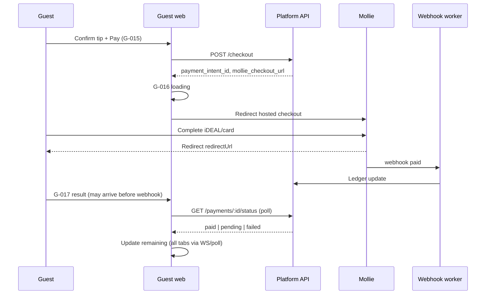
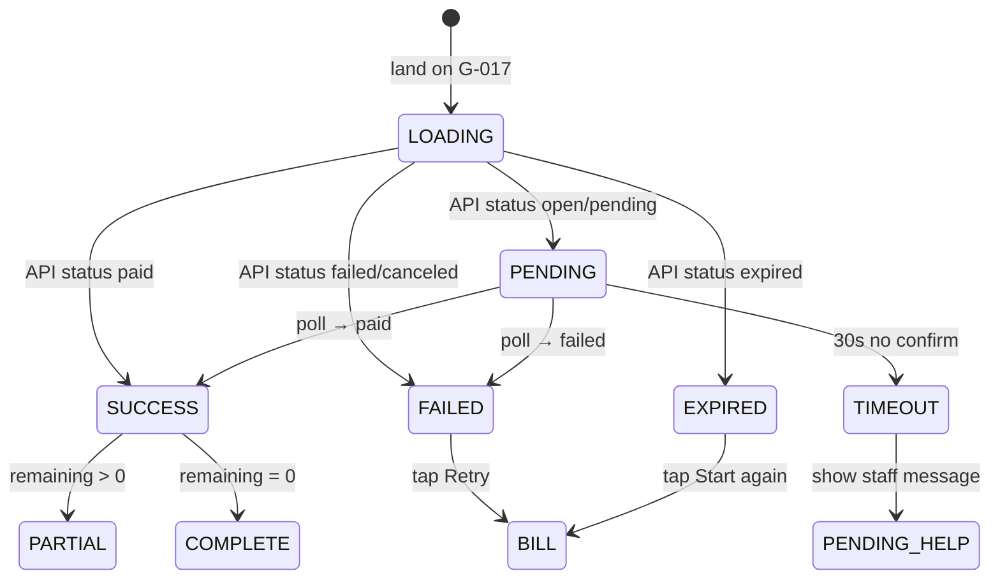
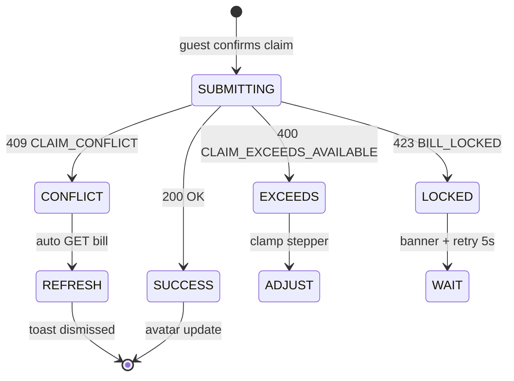

# Payment Trust Patterns — Component UX Specification

**Product (working name):** Rekentafel  
**Scope:** Mollie redirect, partial balance, claim conflicts, error recovery  
**Status:** Blueprint — execution-ready  
**Last updated:** 2026-06-26  
**Companion:** [ux-principles.md](./ux-principles.md), [../architecture/payments/payment-architecture.md](../architecture/payments/payment-architecture.md), [../flows/error-state-matrix.md](../flows/error-state-matrix.md), [../domain/split-engine/state-machines.md](../domain/split-engine/state-machines.md)

---

## Purpose

This document specifies **component-level UX** for payment-critical paths where trust failures cause chargebacks, walkouts, or staff intervention. It complements Flow J in [flows-a-o.md](../flows/flows-a-o.md) with implementable UI states, copy, and timing.

**MVP rail:** Mollie fiat only (iDEAL, cards, wallets). Crypto is **not shown** in guest UI per [scope-boundary.md](../product/scope-boundary.md).

---

## Screen Reference

| Pattern | Screen ID | Route |
|---------|-----------|-------|
| Checkout summary | G-015 | `/pay/checkout` |
| Mollie redirect shim | G-016 | `/pay/redirect` |
| Payment result | G-017 | `/pay/result/:paymentId` |
| Remaining balance | G-018 | `/pay/remaining` |
| Bill & claims | G-008 | `/pay/bill` |
| Payment lobby | G-007 | `/pay/lobby` |

---

## 1. End-to-End Payment Trust Flow



**Trust rule:** G-017 never shows final success until `status ∈ {paid}` OR poll timeout with staff fallback copy.

---

## 2. Mollie Redirect Pattern (G-015 → G-016 → Mollie → G-017)

### 2.1 Pre-redirect summary (G-015)

**Layout (mobile, top to bottom):**

```
┌─────────────────────────────────────┐
│ ← Back to bill                      │
├─────────────────────────────────────┤
│ Pay De Gouden Schaar                │  ← merchant legal name
│                                     │
│ Your share          €18,40          │
│ Tip (0%)            €0,00           │
│ ─────────────────────────           │
│ Total               €18,40          │  ← 32px bold
│                                     │
│ ℹ Payment goes to De Gouden Schaar  │
│   via Mollie · iDEAL or card        │
│                                     │
│ ┌─────────────────────────────────┐ │
│ │      Pay €18,40                 │ │  ← 48px height CTA
│ └─────────────────────────────────┘ │
└─────────────────────────────────────┘
```

| Element | Rule |
|---------|------|
| Merchant name | From restaurant legal entity — not "Rekentafel" |
| Total | Must match Mollie `amount` exactly |
| Back | Returns to bill; does not cancel intent until TTL |
| CTA label | Includes amount: `Pay €18,40` |

### 2.2 Redirect shim (G-016)

**Trigger:** Successful `POST /checkout` returns `checkout_url`.

| Property | Value |
|----------|-------|
| Duration | Until `window.location` to Mollie or 10s fail |
| Copy EN | Taking you to secure payment… |
| Copy NL | Even geduld — beveiligde betaling… |
| Spinner | Centered; `aria-busy="true"` |
| Cancel | None — user uses browser back (see 2.4) |

**Implementation note:** Do not open Mollie in iframe — full redirect only (Mollie requirement + trust).

### 2.3 Return URL handling (G-017)

**Return route:** `/t/:slug/:tableCode/pay/result/:paymentId?status=`

Mollie appends query params; platform **ignores client-side status** — always fetch server truth.

#### Result state machine (guest UI)



#### State UI specs

| UI state | Icon | Headline EN | Headline NL | Primary CTA | Secondary |
|----------|------|-------------|-------------|-------------|-----------|
| LOADING | Spinner | Checking payment… | Betaling controleren… | — | — |
| PENDING | Spinner | Processing your payment… | Betaling wordt verwerkt… | — | Auto-poll 2s |
| SUCCESS (partial) | ✓ green | Paid €20,24 | €20,24 betaald | View remaining | Done |
| SUCCESS (full) | ✓ green | All paid — thank you! | Alles betaald — bedankt! | Done | Email receipt |
| FAILED | ✗ red | Payment failed | Betaling mislukt | Try again | Back to bill |
| EXPIRED | ⏱ amber | Payment timed out | Betaling verlopen | Start again | Back to bill |
| TIMEOUT | ⏱ amber | Still processing… | Nog bezig… | Continue waiting | Ask server |

#### Numeric example — partial success

Guest A pays €20.24 of €44.63 total.

**G-017 SUCCESS (partial):**

```
✓  Paid €20,24

€24,39 still remaining for the table.
Others can continue paying.

[View bill]  [Done]
```

**Simultaneously on Guest B's device (G-007/G-008 header):**

```
Remaining: €24,39     Paid: €20,24 of €44,63
```

### 2.4 Browser back / abandoned checkout

| Scenario | System | Guest UI |
|----------|--------|----------|
| Back from Mollie before pay | Intent stays `open` until TTL (15 min) | Bill shows "Payment in progress?" if intent open |
| Back after pay, webhook pending | Poll resolves | PENDING → SUCCESS |
| Tab closed mid-checkout | Intent expires | Return to bill; allocation releasable |
| Double tap Pay | Idempotent create or reject duplicate | Single redirect |

**Allocation lock:** While `payment_intent.status = MOLLIE_OPEN`, participant's claimed amounts are frozen (ClaimantSession `CHECKOUT_LOCKED`).

### 2.5 Mollie-specific trust copy

| Moment | Copy |
|--------|------|
| Pre-redirect | Secure payment powered by Mollie |
| Return pending | Your bank may take a moment to confirm |
| iDEAL return | Do not close this page |

**Never say:** "Instant confirmation" — iDEAL may delay webhook 3–30s.

### 2.6 MVP vs post-MVP

| Feature | MVP | Post-MVP |
|---------|-----|----------|
| Mollie hosted checkout | Yes | Same |
| Apple Pay in Mollie | If profile enabled | Same |
| Embedded Mollie Components | No | Eval V1.1 |
| Crypto redirect | **No UI** | Separate V2 flow |

---

## 3. Partial Balance Pattern (G-018 + sticky header)

### 3.1 Data model (guest-visible)

| Field | Source | Update trigger |
|-------|--------|----------------|
| `bill_total` | Bill snapshot | Payment activation |
| `paid_total` | Sum confirmed Mollie webhooks | `payment.mollie.webhook.paid` |
| `remaining` | `bill_total - paid_total` | Same |
| `unclaimed` | Allocation engine | Claim changes |

**Guest mental model:** "Remaining" is what the **table still owes**, not what **I** owe (unless equal/custom path).

### 3.2 Sticky Remaining Balance Banner

Present on G-007, G-008, G-009, G-018.

```
┌─────────────────────────────────────┐
│ REMAINING                           │  ← 12px caps label
│ €12,10                              │  ← 28px tabular nums
│ ████████░░░░  €32,53 / €44,63 paid  │  ← progress
└─────────────────────────────────────┘
```

| Rule | Detail |
|------|--------|
| Zero state | `€0,00` + green "Fully paid" + waiter close pending |
| Update latency | ≤3s poll MVP; highlight flash 300ms on change |
| aria-live | Announce "Remaining updated to €12,10" |

### 3.3 Partial pay timeline (worked example)

**Bill total:** €86,40 (from payment-architecture.md example)

| Step | Guest action | Mollie | Paid total | Remaining | All devices |
|------|--------------|--------|------------|-----------|-------------|
| 0 | Waiter opens | — | €0 | €86,40 | €86,40 |
| 1 | Anna pays | tr_a1 €27,00 | €27,00 | €59,40 | €59,40 |
| 2 | Boris pays | tr_b1 €22,40 | €49,40 | €37,00 | €37,00 |
| 3 | Carla pays | tr_c1 €22,50 | €71,90 | €14,50 | €14,50 |
| 4 | Dan expires | tr_d1 expired | €71,90 | €14,50 | €14,50 |
| 5 | Dan retries | tr_d2 €14,50 | €86,40 | €0,00 | €0,00 ✓ |

### 3.4 G-018 Remaining Balance screen

**When shown:** Auto-navigate after partial SUCCESS; also linked from lobby "Who still owes?"

```
┌─────────────────────────────────────┐
│ Remaining: €14,50                   │
├─────────────────────────────────────┤
│ Anna        Paid €27,00        ✓    │
│ Boris       Paid €22,40        ✓    │
│ Carla       Paid €22,50        ✓    │
│ Dan         Owes €14,50    [Pay]    │  ← if viewing self
│ Guest 5     Not joined              │
├─────────────────────────────────────┤
│ Unclaimed items: €0,00              │  ← if allocations complete
└─────────────────────────────────────┘
     Ask your server if you need help
```

| Row state | Display |
|-----------|---------|
| Paid | Green check + amount |
| Processing | Spinner + "Processing…" |
| Owes | Amount + Pay CTA (self only) |
| Failed attempt | Amber "Failed — retry" |
| Not joined | Gray "—" |

### 3.5 Deadlock prevention UX

| Condition | Guest nudge | Waiter (S-008) |
|-----------|-------------|----------------|
| Remaining > €0 after 10 min | Banner: "€X remaining" | Push notification |
| 1 participant owes all | Show name + amount | Highlight in monitor |
| Unclaimed > €0 | "€X unassigned — claim or split" | Staff claim override |

**Close table:** Waiter button disabled until remaining ≤ €0.01 (manager override exception).

### 3.6 Partial pay risks

| Risk | UX mitigation | Ops |
|------|---------------|-----|
| Guest A leaves after partial pay | Others see remaining | Normal |
| Simultaneous pays exceed remaining | Second intent rejected at API | Error: amount exceeds remaining |
| Webhook delay | PENDING state max 30s | Manual reconcile ops |
| Overpay accidental | Not success-wallet; manager refund | S-012 audit |

---

## 4. Claim Conflict Pattern (G-008)

### 4.1 Conflict types

| Type | Code | Cause |
|------|------|-------|
| Qty race | `CLAIM_CONFLICT` | Two guests claim last unit |
| Over qty | `CLAIM_EXCEEDS_AVAILABLE` | Stepper > available |
| Bill version | `BILL_LOCKED` | Waiter editing bill |
| Shared precedence | `SHARED_SPLIT_REQUIRED` | Individual claim on shared line |

### 4.2 Conflict UX flow



### 4.3 UI components

#### Conflict toast (assertive)

| Property | Value |
|----------|-------|
| Trigger | `CLAIM_CONFLICT` |
| EN | Someone else just claimed that item. |
| NL | Iemand anders claimde dit net. |
| Action | Refresh bill (primary) |
| Auto-action | Fetch bill after 500ms |
| aria-live | assertive |

#### Exceeds available (inline)

| Property | Value |
|----------|-------|
| Location | Below qty stepper |
| EN | That quantity isn't available anymore. |
| NL | Dat aantal is niet meer beschikbaar. |
| Behavior | Clamp to max available; shake stepper 200ms |

#### Bill locked (banner)

| Property | Value |
|----------|-------|
| Scope | Full bill screen |
| EN | Server is updating the bill — try again shortly. |
| NL | Bediening werkt de rekening bij — even wachten. |
| Retry | Auto every 5s; manual refresh icon |
| Claims | Submit disabled while locked |

### 4.4 Visual diff on refresh

After conflict refresh, changed lines **flash amber 1s**:

| Before | After |
|--------|-------|
| Bitterballen ×1 — Available | Bitterballen ×1 — **Anna** (avatar) |

### 4.5 Worked example — race on last burger

Initial: Burger ×2, both available.

1. Guest A and Guest B both tap claim 1× Burger within 200ms.
2. Guest A commit wins → Burger shows A + 1 available.
3. Guest B receives `CLAIM_CONFLICT` → toast → refresh → sees 1 available (or 0 if A claimed both).
4. Guest B adjusts claim or picks different item.

**No modal blame.** No "You lost the race."

### 4.6 Staff override visibility

When waiter reassigns (S-010):

```
ℹ Server adjusted claims on Burger
  Your share was updated.
```

Guest sees audit note on affected lines; not a blocking modal.

---

## 5. Error Recovery Matrix (Guest Payment Path)

Maps [error-state-matrix.md](../flows/error-state-matrix.md) codes to component behavior.

| Code | Component | Recovery UI | Retries | Escalation |
|------|-----------|-------------|---------|------------|
| `CHECKOUT_CREATE_FAILED` | G-015 | Inline error below CTA | 3× exponential | Staff if persists |
| `PAYMENT_FAILED` | G-017 | Try again → G-015 | Unlimited | Different method via Mollie |
| `PAYMENT_EXPIRED` | G-017 | Start again → releases lock | New intent | — |
| `PAYMENT_PENDING` | G-017 | Poll 2s × 15 | Auto | TIMEOUT → ask server |
| `PAYMENT_SESSION_CLOSED` | All pay | Full-screen G-011 | None | — |
| `JOIN_TOKEN_EXPIRED` | G-006 | Staff refresh copy | PIN re-entry | Waiter new token |
| `CUSTOM_EXCEEDS_REMAINING` | G-013 | Auto-cap + message | Adjust | — |
| `API_UNAVAILABLE` | Global | G-ERR retry | Manual | — |

### 5.1 Retry preserves context

| Error | Allocations | Tip selection |
|-------|-------------|---------------|
| PAYMENT_FAILED | Preserved | Preserved |
| PAYMENT_EXPIRED | Preserved after lock release | Preserved |
| CHECKOUT_CREATE_FAILED | Preserved | Preserved |
| SESSION_CLOSED | Cleared | N/A |

### 5.2 Mollie outage (rare)

Staff path (S-014 external payment) — guest sees:

```
Payments are temporarily unavailable.
Please pay your server directly.
```

Guest UI **does not** collect cash amounts — staff records externally.

---

## 6. Concurrent Operations UI

From error-state-matrix concurrent matrix.

| Scenario | Guest A | Guest B | Waiter S-008 |
|----------|---------|---------|--------------|
| Last unit race | Success toast | Conflict toast | — |
| Two custom pays > remaining | Pays €20 | Error at create | — |
| Webhook during bill edit | BILL_LOCKED banner | Same | "Complete checkouts first" |
| Line deleted after claim | "Item removed" banner | Same | Timeline entry |

---

## 7. Trust & Legal Surface Elements

### 7.1 Required disclosures (MVP)

| Location | Content |
|----------|---------|
| G-015 footer | Payment processed by Mollie on behalf of [Restaurant] |
| G-017 success | Receipt opt-in GDPR note |
| /privacy | Processor role, 90-day session retention |
| Tip screen | Optional; not wages guarantee |

### 7.2 Prohibited patterns (MVP)

| Pattern | Reason |
|---------|--------|
| "Rekentafel wallet balance" | EMI risk |
| "Pay extra for rewards" | Flow L deferred |
| Crypto address QR | Unlicensed rail |
| Auto-stored card on platform | PCI scope — Mollie vault only post-MVP |

---

## 8. Timing & Performance Budgets

| Interaction | Target | Max |
|-------------|--------|-----|
| POST /checkout → redirect | 800ms | 2s |
| G-017 first poll | 500ms after land | 1s |
| Poll interval (pending) | 2s | 2s |
| Poll timeout | 30s | 45s |
| Bill refresh after conflict | 500ms | 2s |
| Remaining sync after webhook | 1s WS / 3s poll | 5s |
| Checkout intent TTL | 15 min | configurable |

---

## 9. Component Props Contract (Implementation Hint)

For frontend/engineering handoff — not API spec.

### `RemainingBalanceBanner`

```typescript
interface RemainingBalanceBannerProps {
  remainingCents: number;
  paidCents: number;
  totalCents: number;
  locale: 'nl-NL' | 'en-NL';
  isFullyPaid: boolean;
  lastUpdatedAt: string; // ISO
}
```

### `PaymentResultScreen`

```typescript
type PaymentResultStatus =
  | 'loading'
  | 'pending'
  | 'paid'
  | 'failed'
  | 'expired'
  | 'timeout';

interface PaymentResultProps {
  status: PaymentResultStatus;
  paidCents: number;
  remainingTableCents: number;
  paymentId: string;
  onRetry: () => void;
  onViewBill: () => void;
  onRequestReceipt: (email: string) => void;
}
```

### `ClaimConflictToast`

```typescript
interface ClaimConflictToastProps {
  lineItemName: string;
  onRefresh: () => void;
  autoRefreshMs?: number; // default 500
}
```

---

## 10. Crypto Architecture Note (Post-MVP — No Guest UI in MVP)

Per [crypto-rail-design.md](../architecture/payments/crypto-rail-design.md) and [payment-architecture.md](../architecture/payments/payment-architecture.md):

| Aspect | MVP | V2+ eval |
|--------|-----|----------|
| Guest checkout | Mollie fiat only | Optional second button "Pay with crypto" |
| Platform custody | Never | Never — licensed PSP |
| Settlement | Restaurant Mollie balance | EUR via crypto PSP preferred |
| UX placement | Hidden | Below fiat, explicit opt-in + risk disclosure |

**If crypto is added later:** separate G-015b screen, separate return handler, never default, never mixed in one Mollie payment.

---

## 11. QA Acceptance Tests (Payment Trust)

| # | Test | Pass |
|---|------|------|
| T1 | G-015 shows restaurant name, not platform | ☐ |
| T2 | Mollie amount matches G-015 total to the cent | ☐ |
| T3 | G-017 shows PENDING before webhook, SUCCESS after | ☐ |
| T4 | Partial pay updates remaining on second device ≤3s | ☐ |
| T5 | CLAIM_CONFLICT auto-refreshes bill | ☐ |
| T6 | Failed pay preserves allocations on retry | ☐ |
| T7 | Expired Mollie session releases checkout lock | ☐ |
| T8 | SESSION_CLOSED removes all pay CTAs | ☐ |
| T9 | 0% tip checkout succeeds | ☐ |
| T10 | No account prompt in path T1–T8 | ☐ |

---

## Document Ownership

| File | Exclusive slice owner |
|------|----------------------|
| `docs/ux/payment-trust-patterns.md` | Part 15 — Trust-First UX |

Cross-references only — do not duplicate payment API or split-engine rules in this file.
