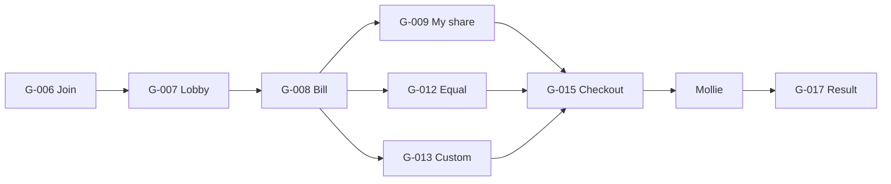

# PART 15 — UX Principles and Heuristics

**Product (working name):** Rekentafel  
**Market:** Netherlands-first hospitality fintech  
**Slice:** Trust-First UX Principles and Heuristics  
**Status:** Blueprint — execution-ready  
**Last updated:** 2026-06-26  
**Companion artifacts:** [heuristic-checklist.md](./heuristic-checklist.md), [payment-trust-patterns.md](./payment-trust-patterns.md), [../flows/flows-a-o.md](../flows/flows-a-o.md), [../surfaces/surface-map.md](../surfaces/surface-map.md)

---

## Executive Summary

Rekentafel UX optimizes for **trust at payment time**, not feature density. Guests arrive hungry, distracted, and often in groups of strangers. The product must feel like a **waiter-assisted bill**, not a fintech onboarding funnel.

| Design north star | Anti-pattern |
|-------------------|--------------|
| Scan → understand → pay share in under 90 seconds | Account wall before first euro moves |
| Bill visibility only after waiter unlock | Public live bill on naked QR |
| Remaining balance is the shared truth | Per-device totals that disagree |
| Waiter is order authority | Phone ordering cart |

**MVP surfaces in scope:** Guest web (`/t/*`), staff panel (`/staff/*`). Admin and ops UX follow the same principles but are not detailed here.

---

## Principle Index

| # | Principle | MVP | Non-negotiable |
|---|-----------|-----|----------------|
| P1 | Zero-friction scan | Yes | Yes |
| P2 | No forced account before pay | Yes | **Yes** |
| P3 | Waiter-gated bill visibility | Yes | Yes |
| P4 | Transparent bill breakdown | Yes | Yes |
| P5 | Collaborative claiming clarity | Yes | Yes |
| P6 | Remaining balance as shared truth | Yes | Yes |
| P7 | Trust-first payment handoff | Yes | Yes |
| P8 | Polite, non-coercive tip UX | Yes | Yes |
| P9 | Low cognitive load / progressive disclosure | Yes | Yes |
| P10 | Accessibility (WCAG 2.1 AA payment flows) | Yes | Yes |
| P11 | Multilingual readiness (NL/EN MVP) | Yes | Yes |
| P12 | Real-time sync honesty | Yes | Yes |
| P13 | Fraud-aware join without paranoia | Yes | Partial |
| P14 | Optional account after value delivered | MVP minimal | — |
| P15 | Crypto and wallet rails invisible in MVP | N/A | Yes |

---

## P1 — Zero-Friction Scan

**Statement:** The first meaningful screen appears in **≤2 seconds** on 4G; no app install, no login, no cookie banner blocking menu view.

### Requirements

| Requirement | MVP spec | Post-MVP |
|-------------|----------|----------|
| Entry path | QR → browser → `/t/:slug/:tableCode` (G-001) | PWA install prompt (V1.1) |
| Initial payload | HTML shell + critical CSS; menu lazy-loaded | Offline menu cache |
| Account | Never required for scan or menu | Same |
| Language | Detect `Accept-Language`; default NL; toggle in header | Additional locales |
| Deep link | `?ps=` token auto-routes to join when payment open | SMS share link |

### Screen behavior by table state

| `table.status` | First paint content | Primary CTA |
|----------------|---------------------|-------------|
| `IDLE` | Restaurant name, table #, menu preview | Browse menu / Call server |
| `DINING` (no payment) | Same + banner: "Bill not open yet" | Call server |
| `PAYMENT_OPEN` | Join gate (G-006) if no token; lobby if joined | Enter PIN / Join |
| `CLOSED` | Thank-you + idle menu | None |

### Example

Guest scans Table 12 at De Gouden Schaar. Sees:

```
De Gouden Schaar · Table 12
[Menu]  [Call server]
Orders are taken by your server.
```

No splash, no "Create account to continue."

### Risks

| Risk | UX mitigation |
|------|---------------|
| Guest expects instant bill on scan | Persistent footer + staff script at seating |
| Slow venue Wi‑Fi | Skeleton UI; menu categories from cache |
| QR photo scanned from home | Same idle experience; no bill leak (P3) |

---

## P2 — No Forced Account Before Payment (Non-Negotiable)

**Statement:** A guest must complete **join → claim → tip → Mollie pay** without creating an account, entering email, or verifying phone.

### Allowed pre-pay data collection

| Field | Required | Purpose |
|-------|----------|---------|
| Display name | Optional (default "Guest N") | Lobby avatars |
| Join PIN / token | Yes (waiter-issued) | Session gate |
| `guest_device_id` cookie | Automatic | Rate limits, claim binding |

### Forbidden before Mollie redirect

- Email / phone signup wall
- Marketing consent checkbox as payment gate
- "Verify identity" beyond session token
- Loyalty enrollment blocking checkout (Flow K post-pay only)

### Post-payment account (MVP minimal)

After successful pay (G-017 success state):

```
Save this receipt? Enter email (optional)
[Skip]  [Send receipt]
```

Account link is **opt-in after value delivered**, never before.

### Legal / product boundary

| Feature | MVP UX | Why deferred |
|---------|--------|--------------|
| Visit history | Post-pay email link only | No account wall |
| Loyalty points | Post-pay prompt | Avoid implied contract |
| Overpay-to-wallet | **No UI** | EMI / stored-value risk |

### Challenge to weak assumption

*"Accounts increase retention so require signup early."* At a restaurant table, forced signup **increases abandonment** and does not prove split-pay PMF. Retention hooks belong **after** a successful payment.

---

## P3 — Waiter-Gated Bill Visibility

**Statement:** Scanning the persistent table QR **never** shows line items, totals, or pay buttons without a valid **payment session token** (15 min TTL, refreshable).

### Security UX invariant

```
Raw QR URL alone  →  Menu + "Ask server to open bill"
QR + ?ps=token    →  Join gate → Bill (after join)
PIN entry         →  Same as token path
```

### Copy standards

| State | EN | NL (pilot) |
|-------|----|------------|
| No session | Ask your server to open the bill. | Vraag bediening om de rekening te openen. |
| Expired token | This payment link expired. | Deze betaallink is verlopen. |
| Invalid token | This payment link isn't valid. | Deze betaallink is ongeldig. |

### Waiter affordance (staff S-008)

Payment monitor must show **6-digit PIN + refresh** prominently so waiter can read aloud without leaving floor.

### MVP vs post-MVP

| Control | MVP | V1.1+ |
|---------|-----|-------|
| Waiter unlock only | Yes | Default |
| Geo-fence join | No | Optional per venue |
| BLE proximity | No | Evaluated |

### Risks

| Risk | UX response |
|------|-------------|
| Bill hijacking via leaked token | Short TTL + PIN; "Not your table?" exit link |
| Guest frustration at gate | Train staff to announce PIN when opening payment |
| Remote scanner pays wrong table | Fraud flag post-MVP; MVP relies on waiter + PIN |

---

## P4 — Transparent Bill Breakdown

**Statement:** Every guest who joins a payment session sees the **same authoritative bill** with expandable VAT and service charge detail. No hidden fees at checkout.

### Bill header (G-008, all participants)

| Element | Display rule |
|---------|--------------|
| Bill total | `€XX.XX` — matches waiter-entered grand total |
| Remaining | **Prominent** — `€YY.YY remaining` (P6) |
| Paid so far | Secondary — `€ZZ.ZZ paid` |
| Service charge | Label if venue-configured: "Service charge (5%)" |
| VAT | Expandable footer: 9% food / 21% alcohol split note |

### Numeric example (from Flow E)

| Line | Qty | Unit | Line total |
|------|-----|------|------------|
| Burger | 2 | €14.00 | €28.00 |
| House wine | 1 | €6.50 | €6.50 |
| Bitterballen | 1 | €8.00 | €8.00 |

**Subtotal:** €42.50 · **Service (5%):** €2.13 · **Total:** €44.63

Footer expand shows VAT allocation per Dutch display rules (simplified MVP: single blended note with link to full breakdown).

### Transparency rules

1. Checkout total = **participant share + their tip only** — never whole-table total without context.
2. Custom amount payments labeled: "Pays toward shared balance, not specific items."
3. Equal split shows formula: `€18.00 ÷ 4 = €4.50 each`.
4. Rounding remainder assigned deterministically; show note if ≠ equal cents.

### Risks

| Risk | Mitigation |
|------|------------|
| VAT display errors | Match admin-configured rates; block payment open on mismatch (staff error) |
| Service charge vs tip confusion | Separate lines; copy per P8 |
| Bill edit mid-session | `BILL_LOCKED` state + version bump notification |

---

## P5 — Collaborative Claiming Clarity

**Statement:** Multiple guests can allocate the same bill **without ambiguity** about who owns which line, what remains unclaimed, and what happens on conflict.

### Visual language (G-008)

| Element | Spec |
|---------|------|
| Line row | Name, qty, unit price, line total |
| Avatar chips | Up to 3 visible + "+N" for additional claimants |
| Unclaimed qty | Muted qty badge: "2 of 3 available" |
| Shared badge | 🍽 icon + "Shared" label (Flow H) |
| My claims | Highlight row background when self claimed |

### Claim interaction

1. Tap line → claim sheet with qty stepper.
2. Confirm → optimistic UI + server commit.
3. Success → avatar appears; my-share updates (G-009).
4. Conflict → inline toast + bill refresh (see [payment-trust-patterns.md](./payment-trust-patterns.md#claim-conflict-pattern)).

### Concurrency UX contract

| Event | Guest sees | Action |
|-------|------------|--------|
| Another guest claims last unit | Toast: "Someone else just claimed that." | Auto-refresh bill |
| Waiter adds line | New unclaimed row animates in | Optional banner |
| Waiter removes claimed line | Banner: "Item removed by staff" | Share recalculated |
| Undo own claim | 10s toast with Undo | Reversible locally |

### Split mode clarity

| Mode | When to use | Default visibility |
|------|-------------|-------------------|
| Claim items | Know what you ordered | Primary tab |
| Equal split | Split remainder among N | Secondary |
| Custom amount | Partial pay toward balance | Tertiary |

**Dangerous default OFF:** "Split whole bill equally" requires waiter confirm (Flow F).

### Risks

| Risk | UX mitigation |
|------|---------------|
| Social pressure / wrong claims | Waiter override visible in staff UI; guest sees "Adjusted by server" |
| Race double allocation | Server rejects; never show success without commit |
| Cognitive overload | Max 3 primary actions on bill screen: Claim / Split / Pay my share |

---

## P6 — Remaining Balance as Shared Truth

**Statement:** All joined participants and the waiter see the **same remaining balance**, updated within **3 seconds** (poll) or **1 second** (WebSocket) of any successful payment.

### Display hierarchy

```
┌─────────────────────────────────────┐
│  Remaining: €12.10                  │  ← largest type, sticky header
│  Paid: €32.53 of €44.63             │  ← progress bar
│  3 of 4 guests have paid            │  ← optional roster summary
└─────────────────────────────────────┘
```

### State sync rules

| Trigger | Update all clients |
|---------|-------------------|
| `payment.mollie.webhook.paid` | Yes — remaining decrements |
| Failed/expired payment | Yes — no balance change |
| Claim change | Updates unclaimed, not remaining until paid |
| Waiter bill edit | Version bump + `BILL_LOCKED` during edit |

### Partial pay example (Flow J)

| Time | Event | Remaining |
|------|-------|-----------|
| T0 | Bill opened | €44.63 |
| T1 | Guest A pays €20.24 | €24.39 |
| T2 | Guest B pays €12.20 | €12.19 |
| T3 | Guest C pays €12.19 | €0.00 |

After T1, **every** participant device shows €24.39 remaining — not just Guest A's.

### Waiter mirror (S-008)

Payment monitor shows identical remaining figure. Close table disabled until `remaining ≤ €0.01`.

### Risks

| Risk | Mitigation |
|------|------------|
| Stale UI after pay | Poll on `visibilitychange`; "Processing…" if webhook delayed |
| Deadlock (unpaid guest left) | Remaining banner + participant list on G-018 |
| Dispute over who owes | Audit timeline (staff S-012) |

---

## P7 — Trust-First Payment Handoff

**Statement:** The transition to Mollie must feel **expected, merchant-identified, and reversible** until payment completes.

### Pre-redirect checklist screen (G-015)

| Element | Content |
|---------|---------|
| Merchant | Restaurant legal name + KvK snippet |
| Pay amount | €20.24 (large) |
| Breakdown | Share €18.40 + tip €1.84 |
| Method hint | "You'll pay with iDEAL or card via Mollie" |
| Trust line | "Payment goes directly to [Restaurant Name]" |
| CTA | "Pay €20.24" — single primary button |

### Mollie redirect (G-016)

- Full-page loading: "Taking you to secure payment…"
- No intermediate third-party branding beyond Mollie
- Preserve `participant_id` + `payment_intent_id` in return URL

### Return handling

See [payment-trust-patterns.md](./payment-trust-patterns.md) for redirect state machine.

### MVP payment methods

| Method | Default | Notes |
|--------|---------|-------|
| iDEAL | Yes (NL) | Pre-selected in Mollie |
| Cards | Yes | Via Mollie hosted |
| Apple Pay | Yes | If Mollie profile enables |
| Crypto | **Hidden** | V2+ separate rail |

### Risks

| Risk | UX response |
|------|-------------|
| Guest thinks platform steals funds | Merchant name on every checkout screen |
| Redirect phishing concern | Consistent domain `app.rekentafel.nl` only |
| Abandoned Mollie tab | Expired intent releases allocation after TTL |

---

## P8 — Polite, Non-Coercive Tip UX

**Statement:** Tip is **optional**, visually equal at 0%, and calculated only on **the participant's share** — never the whole table unless explicitly configured (not MVP).

### Tip screen layout (G-015)

```
Optional tip for your server
Your share: €18.40

[ 0% ]  [ 5% ]  [ 10% ]  [ 15% ]  [ Custom ]

0% is default selected — same button weight as others.
```

### Service charge distinction

| Bill state | Tip label |
|------------|-----------|
| No service charge on bill | "Add a tip?" |
| Service charge present (e.g. 5%) | "Optional extra tip" + "Service charge (5%) already included" |

### Example

Share €18.40 · Tip 10% = €1.84 · **Total €20.24**

Tip 0% → Total €18.40 (no guilt copy, no countdown, no pre-selected non-zero).

### Distribution (config — admin A-021)

MVP default: pass-through to staff pool. UI does **not** promise instant staff payout — restaurant handles distribution.

### Risks

| Risk | Mitigation |
|------|------------|
| Dark patterns (pre-selected 15%) | Design review gate — see heuristic checklist |
| Tip vs service charge VAT confusion | Finance-reviewed copy; separate line items |
| Tip chargeback | Bundled in same Mollie payment; disclosed in summary |

---

## P9 — Low Cognitive Load / Progressive Disclosure

**Statement:** Show **one primary decision per screen**; defer advanced splits and settings until needed.

### Information architecture (guest payment path)



### Progressive disclosure rules

| Level | Visible by default | Behind expand / secondary |
|-------|-------------------|---------------------------|
| Lobby | Remaining, participant count, "View bill" | Individual payment statuses |
| Bill | Lines, claim buttons, my total | VAT breakdown |
| Checkout | Total, tip, pay CTA | Payment method details |
| Success | Paid amount, remaining if partial | Receipt email |

### Cognitive load budget

| Metric | Target |
|--------|--------|
| Taps from join to pay (claim path) | ≤5 |
| Concurrent choices on bill screen | ≤3 CTAs |
| Explainer carousel (first join) | 3 slides max, skippable |
| Error message length | ≤12 words EN / ≤14 NL |

### First-time explainer (G-007, dismissible)

1. "Claim what you ordered"
2. "Or split the rest equally"
3. "Pay your share — no account needed"

---

## P10 — Accessibility (WCAG 2.1 AA Minimum)

**Statement:** Payment flows meet **WCAG 2.1 Level AA** for the MVP pilot. Menu browsing targets AA where feasible.

### MVP minimum bar

| Criterion | Requirement | Test method |
|-----------|-------------|-------------|
| 1.4.3 Contrast | 4.5:1 text, 3:1 large text/UI components | Automated + manual |
| 1.4.4 Resize | 200% zoom without horizontal scroll on payment screens | Manual |
| 2.1.1 Keyboard | All payment actions keyboard-operable | Tab order audit |
| 2.4.7 Focus visible | 2px focus ring on interactive elements | Visual review |
| 2.5.5 Target size | **44×44 CSS px** minimum touch targets | Design spec |
| 3.3.1 Error ID | Errors linked to fields via `aria-describedby` | axe |
| 4.1.2 Name/role | Buttons have accessible names (not icon-only without label) | Screen reader |

### Payment-specific

| Component | A11y spec |
|-----------|-----------|
| Remaining balance | `role="status"` `aria-live="polite"` on change |
| Claim stepper | `aria-valuenow` / increment buttons labeled |
| Tip presets | Radio group with `fieldset` + `legend` |
| Mollie return spinner | `aria-busy="true"` + "Processing payment" |
| Conflict toast | `aria-live="assertive"` |

### Color independence

Never encode state by color alone:

| State | Color + icon/text |
|-------|-------------------|
| Claimed by self | Green + checkmark |
| Claimed by other | Blue + avatar initial |
| Unclaimed | Gray + "Available" |
| Shared | Amber + 🍽 + "Shared" |
| Paid | Green + "Paid" |
| Failed | Red + "Failed — retry" |

### Post-MVP

- Full menu allergen screen reader tables (V1.1)
- High-contrast theme toggle (V1.1)
- Formal VPAT documentation (V2)

---

## P11 — Multilingual Readiness (NL/EN MVP)

**Statement:** Dutch is default; English is complete for all **payment-critical** strings. Language persists in `localStorage` without account.

### Coverage tiers

| Tier | NL | EN | MVP required |
|------|----|----|--------------|
| Payment join → result | 100% | 100% | Yes |
| Error codes (`error-state-matrix`) | 100% | 100% | Yes |
| Menu browsing | 100% | 80%+ (fallback EN) | Yes |
| Staff panel | 100% | Post-MVP | NL only MVP |
| Admin | 100% | Post-MVP | NL only MVP |
| Legal (privacy/terms) | 100% | 100% | Yes |

### Locale rules

| Rule | Implementation |
|------|----------------|
| Default | `Accept-Language` → `nl-NL` if NL preferred |
| Toggle | Header 🌐 NL \| EN — instant switch, no reload required (i18n keys) |
| Numbers | `nl-NL`: `€12,10` · `en-NL`: `€12.10` |
| Dates | `26 jun 2026` / `26 Jun 2026` |
| Pluralization | ICU messages for participant counts |

### Copy tone

| Locale | Tone |
|--------|------|
| NL | Informal `je/jij` for guest; polite direct |
| EN | Neutral, short sentences |

### RTL / future locales

Architecture: i18n key files, no hard-coded strings in components. Arabic/German not MVP.

---

## P12 — Real-Time Sync Honesty

**Statement:** When data may be stale, **say so**. Never show a success state without server confirmation.

### Sync indicators

| Condition | UI |
|-----------|-----|
| WebSocket connected | No indicator (silent) |
| Polling fallback | Subtle "Updated just now" timestamp |
| Webhook pending (>3s after Mollie return) | "Processing your payment…" spinner |
| Bill locked | "Server is updating the bill" banner |
| Conflict refresh | "Bill updated" toast |

### Optimistic UI limits

| Action | Optimistic? | Rollback |
|--------|-------------|----------|
| Claim qty | Yes — 300ms | Revert + conflict toast |
| Release claim | Yes | Revert on fail |
| Payment success | **No** — wait for webhook or poll confirm | Show pending |
| Remaining balance after pay | **No** until ledger confirms | Processing state |

---

## P13 — Fraud-Aware Join Without Paranoia

**Statement:** MVP relies on **waiter unlock + short-lived token**; UX stays welcoming, not suspicious.

| MVP | Post-MVP |
|-----|----------|
| PIN after 5 failed attempts → lock | Geo variance alerts |
| "Not your table?" exit link | Optional BLE proximity |
| No accusatory copy | Ops review on chargeback patterns |

Guest never sees: "Suspicious activity detected" unless PIN locked (`JOIN_PIN_LOCKED`).

---

## P14 — Optional Account After Value Delivered

**Statement:** Accounts exist to **save receipts and visits**, not to gate payment.

| Touchpoint | MVP behavior |
|------------|--------------|
| Pre-pay | No account CTA in payment path |
| Success screen | "Email receipt?" optional |
| Account home (G-020) | Visits, points if linked |
| Marketing | Separate consent checkbox |

Flow L (overpay-to-rewards): **no UI in MVP**.

---

## P15 — Crypto and Wallet Rails Invisible in MVP

**Statement:** Guest checkout exposes **Mollie fiat only**. No crypto toggle, no wallet balance, no "platform credit."

Post-MVP crypto (V2+) uses separate regulated rail per [payment-architecture.md](../architecture/payments/payment-architecture.md). If added, it appears as **separate explicit choice** after fiat path proven — never default.

---

## MVP vs Post-MVP UX Summary

| Capability | MVP | V1.1 | V2+ |
|------------|-----|------|-----|
| Anonymous pay | Yes | Yes | Yes |
| NL/EN guest | Yes | + menu completeness | + locales |
| Geo join gate | No | Optional | Optional |
| PWA install | No | Prompt | Yes |
| Guest account | Post-pay link | Full account | Cross-venue |
| Loyalty earn UI | Minimal post-pay | Single venue | Coalition |
| Overpay wallet | **Hidden** | **Hidden** | Eval |
| Crypto checkout | **Hidden** | **Hidden** | Separate rail |
| In-session chat | No | No | Unlikely |

---

## Cross-Surface Alignment

| Doc | UX dependency |
|-----|---------------|
| [flows-a-o.md](../flows/flows-a-o.md) | Flow A–J behaviors referenced by principles |
| [screen-inventory.md](../surfaces/screen-inventory.md) | Screen IDs G-001–G-018 |
| [error-state-matrix.md](../flows/error-state-matrix.md) | Error copy and recovery types |
| [state-machines.md](../domain/split-engine/state-machines.md) | Bill/claimant states drive UI states |
| [scope-boundary.md](../product/scope-boundary.md) | Deferred features must not leak into UI |

---

## Slice Risk Register (UX-Specific)

| ID | Risk | Severity | Mitigation |
|----|------|----------|------------|
| UX-R1 | Forced account creep via "helpful" growth hacks | High | P2 non-negotiable; PR checklist item |
| UX-R2 | Bill visible on raw QR | Critical | P3; security review on every route |
| UX-R3 | Remaining balance desync | High | P6; webhook-first UI |
| UX-R4 | Tip dark patterns | Medium | P8; heuristic #16 |
| UX-R5 | WCAG failure at pilot venue | Medium | P10; axe in CI on payment routes |
| UX-R6 | NL/EN string drift | Medium | i18n key coverage test |
| UX-R7 | Claim conflict frustration | Medium | Clear toast + auto-refresh |
| UX-R8 | Mollie redirect anxiety | Medium | P7; merchant identification |
| UX-R9 | Service charge / tip confusion | Medium | Distinct labels; staff training |
| UX-R10 | Overpay UI implies e-money | High | No Flow L UI in MVP |

---

## Document Ownership

| File | Owner slice | Exclusive |
|------|-------------|-----------|
| `docs/ux/ux-principles.md` | Part 15 | Yes |
| `docs/ux/heuristic-checklist.md` | Part 15 | Yes |
| `docs/ux/payment-trust-patterns.md` | Part 15 | Yes |
